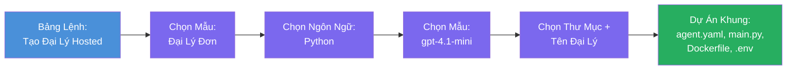

# Module 3 - Tạo một Hosted Agent Mới (Tự động tạo khung bởi tiện ích Foundry)

Trong module này, bạn sử dụng tiện ích Microsoft Foundry để **tạo khung cho một dự án [hosted agent](https://learn.microsoft.com/azure/foundry/agents/concepts/hosted-agents) mới**. Tiện ích sẽ tạo toàn bộ cấu trúc dự án cho bạn - bao gồm `agent.yaml`, `main.py`, `Dockerfile`, `requirements.txt`, một file `.env`, và cấu hình debug cho VS Code. Sau khi tạo khung, bạn tùy chỉnh các file này với chỉ dẫn, công cụ và cấu hình cho agent của bạn.

> **Khái niệm chính:** Thư mục `agent/` trong lab này là ví dụ về những gì tiện ích Foundry tạo ra khi bạn chạy lệnh scaffold này. Bạn không cần viết các file này từ đầu - tiện ích sẽ tạo rồi bạn chỉnh sửa.

### Quy trình wizard tạo khung


---

## Bước 1: Mở wizard Create Hosted Agent

1. Nhấn `Ctrl+Shift+P` để mở **Command Palette**.
2. Gõ: **Microsoft Foundry: Create a New Hosted Agent** và chọn nó.
3. Wizard tạo hosted agent sẽ mở ra.

> **Cách khác:** Bạn cũng có thể vào wizard này từ thanh bên Microsoft Foundry → nhấn biểu tượng **+** cạnh **Agents** hoặc click chuột phải và chọn **Create New Hosted Agent**.

---

## Bước 2: Chọn mẫu

Wizard yêu cầu bạn chọn một mẫu. Bạn sẽ thấy các lựa chọn như:

| Mẫu | Mô tả | Khi nào dùng |
|----------|-------------|-------------|
| **Single Agent** | Một agent với model, chỉ dẫn và công cụ tùy chọn riêng | Workshop này (Lab 01) |
| **Multi-Agent Workflow** | Nhiều agent phối hợp tuần tự | Lab 02 |

1. Chọn **Single Agent**.
2. Bấm **Next** (hoặc chọn sẽ tự động tiếp tục).

---

## Bước 3: Chọn ngôn ngữ lập trình

1. Chọn **Python** (được khuyên dùng trong workshop này).
2. Bấm **Next**.

> **C# cũng được hỗ trợ** nếu bạn thích .NET. Cấu trúc scaffold tương tự (dùng `Program.cs` thay vì `main.py`).

---

## Bước 4: Chọn model

1. Wizard sẽ hiện các model đã triển khai trong dự án Foundry của bạn (từ Module 2).
2. Chọn model bạn đã triển khai - ví dụ **gpt-4.1-mini**.
3. Bấm **Next**.

> Nếu bạn không thấy model nào, hãy quay lại [Module 2](02-create-foundry-project.md) và triển khai một model trước.

---

## Bước 5: Chọn vị trí thư mục và tên agent

1. Một hộp thoại file mở ra - chọn **thư mục đích** để tạo dự án. Trong workshop này:
   - Nếu bắt đầu mới: chọn bất kỳ thư mục nào (ví dụ `C:\Projects\my-agent`)
   - Nếu làm trong repo workshop: tạo thư mục con mới dưới `workshop/lab01-single-agent/agent/`
2. Nhập **tên** cho hosted agent (ví dụ `executive-summary-agent` hoặc `my-first-agent`).
3. Bấm **Create** (hoặc nhấn Enter).

---

## Bước 6: Đợi hoàn thành tạo khung

1. VS Code mở **cửa sổ mới** với dự án đã được scaffold.
2. Đợi vài giây để dự án tải hoàn toàn.
3. Bạn sẽ thấy các file sau trong panel Explorer (`Ctrl+Shift+E`):

```
📂 my-first-agent/
├── .env                ← Environment variables (auto-generated with placeholders)
├── .vscode/
│   └── launch.json     ← Debug configuration (F5 to run + Agent Inspector)
├── agent.yaml          ← Agent definition (kind: hosted)
├── Dockerfile          ← Container configuration for deployment
├── main.py             ← Agent entry point (your main code file)
└── requirements.txt    ← Python dependencies
```

> **Đây là cấu trúc giống thư mục `agent/`** trong lab này. Tiện ích Foundry tự động tạo các file này - bạn không cần tạo thủ công.

> **Lưu ý Workshop:** Trong repo workshop này, thư mục `.vscode/` nằm ở **gốc workspace** (không nằm trong từng dự án). Nó chứa `launch.json` và `tasks.json` chia sẻ với hai cấu hình debug - **"Lab01 - Single Agent"** và **"Lab02 - Multi-Agent"** - mỗi cấu hình trỏ đến thư mục làm việc đúng của lab đó. Khi bạn nhấn F5, hãy chọn cấu hình phù hợp với lab bạn đang làm từ dropdown.

---

## Bước 7: Hiểu từng file được tạo

Dành chút thời gian để xem qua từng file wizard tạo ra. Hiểu chúng quan trọng cho Module 4 (tùy chỉnh).

### 7.1 `agent.yaml` - Định nghĩa agent

Mở `agent.yaml`. Nó trông như sau:

```yaml
# yaml-language-server: $schema=https://raw.githubusercontent.com/microsoft/AgentSchema/refs/heads/main/schemas/v1.0/ContainerAgent.yaml

kind: hosted
name: my-first-agent
description: >
  A hosted agent deployed to Microsoft Foundry Agent Service.
metadata:
  authors:
    - Microsoft
  tags:
    - Azure AI AgentServer
    - Microsoft Agent Framework
    - Hosted Agent
protocols:
  - protocol: responses
    version: v1
environment_variables:
  - name: AZURE_AI_PROJECT_ENDPOINT
    value: ${PROJECT_ENDPOINT}
  - name: AZURE_AI_MODEL_DEPLOYMENT_NAME
    value: ${MODEL_DEPLOYMENT_NAME}
dockerfile_path: Dockerfile
resources:
  cpu: '0.25'
  memory: 0.5Gi
```

**Các trường chính:**

| Trường | Mục đích |
|-------|---------|
| `kind: hosted` | Khai báo đây là hosted agent (dựa trên container, triển khai trên [Foundry Agent Service](https://learn.microsoft.com/azure/foundry/agents/overview)) |
| `protocols: responses v1` | Agent mở endpoint HTTP `/responses` tương thích OpenAI |
| `environment_variables` | Ánh xạ giá trị trong `.env` vào biến môi trường container khi triển khai |
| `dockerfile_path` | Trỏ tới Dockerfile dùng để build ảnh container |
| `resources` | CPU và bộ nhớ phân bổ cho container (0.25 CPU, 0.5Gi bộ nhớ) |

### 7.2 `main.py` - Điểm khởi đầu agent

Mở `main.py`. Đây là file Python chính chứa logic agent. Scaffold gồm:

```python
from agent_framework.azure import AzureAIAgentClient
from azure.ai.agentserver.agentframework import from_agent_framework
from azure.identity.aio import DefaultAzureCredential
```

**Các import chính:**

| Import | Mục đích |
|--------|--------|
| `AzureAIAgentClient` | Kết nối dự án Foundry và tạo agent qua `.as_agent()` |
| [`DefaultAzureCredential`](https://learn.microsoft.com/azure/developer/python/sdk/authentication/credential-chains#defaultazurecredential-overview) | Xử lý xác thực (Azure CLI, đăng nhập VS Code, managed identity, hoặc service principal) |
| `from_agent_framework` | Đóng gói agent thành server HTTP mở endpoint `/responses` |

Luồng chính là:
1. Tạo credential → tạo client → gọi `.as_agent()` để nhận agent (async context manager) → đóng gói thành server → chạy.

### 7.3 `Dockerfile` - Ảnh container

```dockerfile
FROM python:3.14-slim

WORKDIR /app

COPY ./ .

RUN pip install --upgrade pip && \
    if [ -f requirements.txt ]; then \
        pip install -r requirements.txt; \
    else \
        echo "No requirements.txt found" >&2; exit 1; \
    fi

EXPOSE 8088

CMD ["python", "main.py"]
```

**Chi tiết chính:**
- Dùng ảnh base `python:3.14-slim`.
- Sao chép toàn bộ file dự án vào `/app`.
- Nâng cấp `pip`, cài dependencies từ `requirements.txt`, và báo lỗi nhanh nếu file này thiếu.
- **Mở cổng 8088** - đây là cổng yêu cầu cho hosted agent. Không thay đổi.
- Khởi động agent với lệnh `python main.py`.

### 7.4 `requirements.txt` - Các thư viện cần thiết

```
agent-framework-azure-ai==1.0.0rc3
agent-framework-core==1.0.0rc3
azure-ai-agentserver-agentframework==1.0.0b16
azure-ai-agentserver-core==1.0.0b16
debugpy
agent-dev-cli
```

| Gói | Mục đích |
|---------|---------|
| `agent-framework-azure-ai` | Tích hợp Azure AI cho Microsoft Agent Framework |
| `agent-framework-core` | Runtime cốt lõi để xây dựng agent (bao gồm `python-dotenv`) |
| `azure-ai-agentserver-agentframework` | Runtime server hosted agent cho Foundry Agent Service |
| `azure-ai-agentserver-core` | Các khai niệm cốt lõi của server agent |
| `debugpy` | Hỗ trợ debug Python (cho phép debug F5 trong VS Code) |
| `agent-dev-cli` | CLI phát triển cục bộ để test agent (dùng trong cấu hình debug/chạy) |

---

## Hiểu về giao thức agent

Hosted agent giao tiếp theo giao thức **OpenAI Responses API**. Khi chạy (cục bộ hoặc trên cloud), agent mở một endpoint HTTP duy nhất:

```
POST http://localhost:8088/responses
Content-Type: application/json

{
  "input": "Your prompt here",
  "stream": false
}
```

Foundry Agent Service gọi endpoint này để gửi prompt người dùng và nhận câu trả lời từ agent. Đây là giao thức giống OpenAI API, nên agent của bạn tương thích với bất kỳ client nào sử dụng định dạng OpenAI Responses.

---

### Điểm kiểm tra

- [ ] Wizard tạo scaffold hoàn tất và một **cửa sổ VS Code mới** đã mở ra
- [ ] Bạn thấy đủ 5 file: `agent.yaml`, `main.py`, `Dockerfile`, `requirements.txt`, `.env`
- [ ] File `.vscode/launch.json` tồn tại (cho phép debug F5 - trong workshop này nó ở gốc workspace với các cấu hình theo lab)
- [ ] Bạn đã đọc qua tất cả file và hiểu mục đích của từng file
- [ ] Bạn hiểu rằng cổng `8088` là bắt buộc và endpoint `/responses` là giao thức sử dụng

---

**Trước đó:** [02 - Tạo Dự án Foundry](02-create-foundry-project.md) · **Tiếp theo:** [04 - Cấu hình & Lập trình →](04-configure-and-code.md)

---

<!-- CO-OP TRANSLATOR DISCLAIMER START -->
**Tuyên bố từ chối trách nhiệm**:  
Tài liệu này đã được dịch bằng dịch vụ dịch thuật AI [Co-op Translator](https://github.com/Azure/co-op-translator). Mặc dù chúng tôi nỗ lực đảm bảo độ chính xác, vui lòng lưu ý rằng bản dịch tự động có thể chứa lỗi hoặc không chính xác. Tài liệu gốc bằng ngôn ngữ nguyên bản nên được coi là nguồn chính thức. Đối với các thông tin quan trọng, nên sử dụng dịch vụ dịch thuật chuyên nghiệp bởi con người. Chúng tôi không chịu trách nhiệm về bất kỳ sự hiểu lầm hoặc cách diễn giải sai nào phát sinh từ việc sử dụng bản dịch này.
<!-- CO-OP TRANSLATOR DISCLAIMER END -->