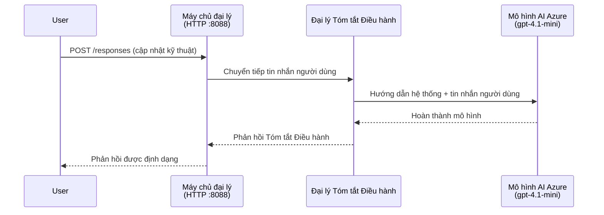
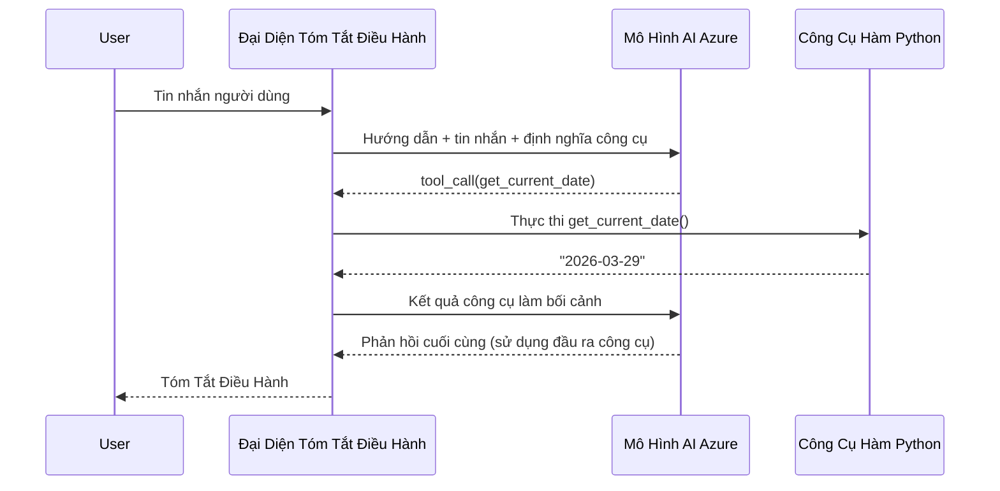

# Module 4 - Cấu Hình Hướng Dẫn, Môi Trường & Cài Đặt Phụ Thuộc

Trong module này, bạn tùy chỉnh các file đại lý được tự động tạo từ Module 3. Đây là nơi bạn biến đổi bộ khung chung thành **đại lý của bạn** - bằng cách viết hướng dẫn, đặt biến môi trường, tùy chọn thêm công cụ và cài đặt các phụ thuộc.

> **Nhắc lại:** Tiện ích mở rộng Foundry đã tự động tạo các file dự án của bạn. Giờ bạn sẽ sửa đổi chúng. Xem thư mục [`agent/`](../../../../../workshop/lab01-single-agent/agent) để có ví dụ hoàn chỉnh về một đại lý đã tùy chỉnh hoạt động.

---

## Cách các thành phần kết nối với nhau

### Vòng đời yêu cầu (đại lý đơn)


> **Với công cụ:** Nếu đại lý đã đăng ký công cụ, mô hình có thể trả về một cuộc gọi công cụ thay vì hoàn thành trực tiếp. Framework sẽ thực thi công cụ tại chỗ, gửi kết quả trở lại mô hình, và mô hình sau đó tạo phản hồi cuối cùng.


---

## Bước 1: Cấu hình biến môi trường

Bộ khung đã tạo file `.env` với các giá trị giữ chỗ. Bạn cần điền các giá trị thực từ Module 2.

1. Trong dự án được tạo sẵn, mở file **`.env`** (nằm ở thư mục gốc dự án).
2. Thay các giá trị giữ chỗ bằng thông tin dự án Foundry thực tế của bạn:

   ```env
   PROJECT_ENDPOINT=https://<your-account>.services.ai.azure.com/api/projects/<your-project>
   MODEL_DEPLOYMENT_NAME=gpt-4.1-mini
   ```

3. Lưu file lại.

### Ở đâu để tìm các giá trị này

| Giá trị | Cách tìm |
|---------|----------|
| **Project endpoint** | Mở thanh bên **Microsoft Foundry** trong VS Code → click vào dự án của bạn → URL endpoint được hiển thị trong phần chi tiết. Nó trông như `https://<account-name>.services.ai.azure.com/api/projects/<project-name>` |
| **Model deployment name** | Trong thanh bên Foundry, mở rộng dự án → xem dưới mục **Models + endpoints** → tên nằm kế bên mô hình đã triển khai (ví dụ `gpt-4.1-mini`) |

> **Bảo mật:** Tuyệt đối không commit file `.env` vào quản lý phiên bản. Nó đã được thêm vào `.gitignore` mặc định rồi. Nếu chưa, hãy thêm vào:
> ```
> .env
> ```

### Cách các biến môi trường chuyển tiếp

Chuỗi ánh xạ là: `.env` → `main.py` (đọc qua `os.getenv`) → `agent.yaml` (ánh xạ tới biến môi trường container lúc triển khai).

Trong `main.py`, bộ khung đọc các giá trị này như sau:

```python
PROJECT_ENDPOINT = os.getenv("AZURE_AI_PROJECT_ENDPOINT") or os.getenv("PROJECT_ENDPOINT")
MODEL_DEPLOYMENT_NAME = os.getenv("AZURE_AI_MODEL_DEPLOYMENT_NAME", os.getenv("MODEL_DEPLOYMENT_NAME", "gpt-4.1-mini"))
```

Cả `AZURE_AI_PROJECT_ENDPOINT` và `PROJECT_ENDPOINT` đều được chấp nhận (file `agent.yaml` dùng tiền tố `AZURE_AI_*`).

---

## Bước 2: Viết hướng dẫn cho đại lý

Đây là bước tùy chỉnh quan trọng nhất. Hướng dẫn xác định tính cách đại lý, hành vi, định dạng đầu ra và các giới hạn an toàn.

1. Mở `main.py` trong dự án của bạn.
2. Tìm chuỗi hướng dẫn (bộ khung có sẵn hướng dẫn mặc định/chung).
3. Thay thế bằng hướng dẫn chi tiết, có cấu trúc.

### Hướng dẫn tốt bao gồm gì

| Thành phần | Mục đích | Ví dụ |
|------------|----------|-------|
| **Vai trò** | Đại lý là gì và làm gì | "Bạn là đại lý tóm tắt điều hành" |
| **Đối tượng** | Phản hồi dành cho ai | "Các lãnh đạo cao cấp với kiến thức kỹ thuật hạn chế" |
| **Định nghĩa đầu vào** | Loại câu hỏi nó xử lý | "Báo cáo sự cố kỹ thuật, cập nhật vận hành" |
| **Định dạng đầu ra** | Cấu trúc chính xác của phản hồi | "Tóm tắt điều hành: - Điều gì đã xảy ra: ... - Tác động kinh doanh: ... - Bước tiếp theo: ..." |
| **Quy tắc** | Hạn chế và điều kiện từ chối | "Không thêm thông tin ngoài nội dung được cung cấp" |
| **An toàn** | Ngăn lạm dụng và tạo ảo giác | "Nếu đầu vào không rõ ràng, hãy yêu cầu làm rõ" |
| **Ví dụ** | Cặp đầu vào/ra để hướng hành vi | Bao gồm 2-3 ví dụ với các đầu vào khác nhau |

### Ví dụ: Hướng dẫn Đại lý Tóm tắt Điều hành

Dưới đây là hướng dẫn được sử dụng trong workshop [`agent/main.py`](../../../../../workshop/lab01-single-agent/agent/main.py):

```python
AGENT_INSTRUCTIONS = """You are an "Explain Like I'm an Executive" agent.

Purpose:
Your job is to translate complex technical or operational information into
clear, concise, and outcome-focused summaries that can be easily understood
by non-technical executives.

Audience:
Senior leaders with limited technical background who care about impact,
risk, and what happens next.

What you must do:
- Rephrase the input so it is understandable to a non-technical audience
- Prioritize clarity, brevity, and outcomes over technical accuracy
- Remove technical jargon, logs, metrics, stack traces, and deep root-cause details
- Translate technical causes into simple cause-and-effect statements
- Explicitly call out business impact
- Always include a clear next step or action
- Maintain a neutral, factual, and calm executive tone
- Do NOT add new facts or speculate beyond the input

Standard Output Structure (always use this wording):

Executive Summary:
- What happened: <plain-language description>
- Business impact: <clear, non-technical impact>
- Next step: <clear action or mitigation>

Rules:
- Keep responses under 100 words
- Do NOT add facts beyond the input
- If input is unclear, ask for clarification
"""
```

4. Thay thế chuỗi hướng dẫn hiện có trong `main.py` bằng hướng dẫn tùy chỉnh của bạn.
5. Lưu file lại.

---

## Bước 3: (Tùy chọn) Thêm công cụ tùy chỉnh

Đại lý được host có thể thực thi **hàm Python cục bộ** như các [công cụ](https://learn.microsoft.com/azure/foundry/agents/concepts/tool-catalog). Đây là lợi thế quan trọng của đại lý dựa trên code so với đại lý chỉ dùng prompt - đại lý của bạn có thể chạy logic phía máy chủ tùy ý.

### 3.1 Định nghĩa hàm công cụ

Thêm hàm công cụ vào `main.py`:

```python
from agent_framework import tool

@tool
def get_current_date() -> str:
    """Returns the current date in YYYY-MM-DD format."""
    from datetime import date
    return str(date.today())
```

Chú thích `@tool` biến hàm Python tiêu chuẩn thành công cụ đại lý. Docstring trở thành mô tả công cụ mà mô hình nhìn thấy.

### 3.2 Đăng ký công cụ với đại lý

Khi tạo đại lý qua context manager `.as_agent()`, truyền công cụ vào tham số `tools`:

```python
async with AzureAIAgentClient(
    project_endpoint=PROJECT_ENDPOINT,
    model_deployment_name=MODEL_DEPLOYMENT_NAME,
    credential=credential,
).as_agent(
    name="my-agent",
    instructions=AGENT_INSTRUCTIONS,
    tools=[get_current_date],
) as agent:
    server = from_agent_framework(agent)
    await server.run_async()
```

### 3.3 Cách hoạt động của cuộc gọi công cụ

1. Người dùng gửi một prompt.
2. Mô hình quyết định có cần công cụ không (dựa trên prompt, hướng dẫn và mô tả công cụ).
3. Nếu cần, framework gọi hàm Python của bạn tại chỗ (bên trong container).
4. Giá trị trả về của công cụ được gửi lại mô hình làm ngữ cảnh.
5. Mô hình tạo phản hồi cuối cùng.

> **Công cụ chạy phía máy chủ** - chúng chạy trong container của bạn, không phải trên trình duyệt người dùng hay mô hình. Điều này nghĩa là bạn có thể truy cập cơ sở dữ liệu, API, hệ thống file, hoặc bất kỳ thư viện Python nào.

---

## Bước 4: Tạo và kích hoạt môi trường ảo

Trước khi cài đặt phụ thuộc, tạo một môi trường Python cách ly.

### 4.1 Tạo môi trường ảo

Mở terminal trong VS Code (`` Ctrl+` ``) và chạy:

```powershell
python -m venv .venv
```

Điều này tạo thư mục `.venv` trong thư mục dự án của bạn.

### 4.2 Kích hoạt môi trường ảo

**PowerShell (Windows):**

```powershell
.\.venv\Scripts\Activate.ps1
```

**Command Prompt (Windows):**

```cmd
.venv\Scripts\activate.bat
```

**macOS/Linux (Bash):**

```bash
source .venv/bin/activate
```

Bạn sẽ thấy `(.venv)` xuất hiện đầu dòng lệnh terminal, báo hiệu môi trường ảo đã được kích hoạt.

### 4.3 Cài đặt phụ thuộc

Khi môi trường ảo hoạt động, cài đặt các gói cần thiết:

```powershell
pip install -r requirements.txt
```

Các gói được cài:

| Gói | Mục đích |
|-----|----------|
| `agent-framework-azure-ai==1.0.0rc3` | Tích hợp Azure AI cho [Microsoft Agent Framework](https://learn.microsoft.com/agent-framework/overview/) |
| `agent-framework-core==1.0.0rc3` | Runtime cốt lõi xây dựng đại lý (bao gồm `python-dotenv`) |
| `azure-ai-agentserver-agentframework==1.0.0b16` | Runtime máy chủ đại lý hosted cho [Foundry Agent Service](https://learn.microsoft.com/azure/foundry/agents/overview) |
| `azure-ai-agentserver-core==1.0.0b16` | Các trừu tượng máy chủ đại lý cốt lõi |
| `debugpy` | Gỡ lỗi Python (cho phép debug F5 trong VS Code) |
| `agent-dev-cli` | CLI phát triển local để thử nghiệm đại lý |

### 4.4 Kiểm tra cài đặt

```powershell
pip list | Select-String "agent-framework|agentserver"
```

Kết quả mong đợi:
```
agent-framework-azure-ai   1.0.0rc3
agent-framework-core       1.0.0rc3
azure-ai-agentserver-agentframework 1.0.0b16
azure-ai-agentserver-core  1.0.0b16
```

---

## Bước 5: Xác minh xác thực

Đại lý dùng [`DefaultAzureCredential`](https://learn.microsoft.com/azure/developer/python/sdk/authentication/credential-chains#defaultazurecredential-overview) thử nhiều phương pháp xác thực theo thứ tự:

1. **Biến môi trường** - `AZURE_CLIENT_ID`, `AZURE_TENANT_ID`, `AZURE_CLIENT_SECRET` (service principal)
2. **Azure CLI** - lấy phiên đăng nhập `az login` của bạn
3. **VS Code** - dùng tài khoản bạn đăng nhập trên VS Code
4. **Managed Identity** - dùng khi chạy trên Azure (lúc triển khai)

### 5.1 Xác minh cho phát triển local

Ít nhất một trong số các cách sau phải hoạt động:

**Lựa chọn A: Azure CLI (khuyến cáo)**

```powershell
az account show --query "{name:name, id:id}" --output table
```

Mong đợi: Hiển thị tên và ID đăng ký của bạn.

**Lựa chọn B: Đăng nhập VS Code**

1. Nhìn xuống góc trái dưới của VS Code để thấy biểu tượng **Accounts**.
2. Nếu thấy tên tài khoản, bạn đã xác thực.
3. Nếu không, click biểu tượng → **Sign in to use Microsoft Foundry**.

**Lựa chọn C: Service principal (cho CI/CD)**

```powershell
$env:AZURE_TENANT_ID = "<your-tenant-id>"
$env:AZURE_CLIENT_ID = "<your-client-id>"
$env:AZURE_CLIENT_SECRET = "<your-client-secret>"
```

### 5.2 Vấn đề xác thực phổ biến

Nếu đăng nhập nhiều tài khoản Azure, đảm bảo chọn đúng đăng ký:

```powershell
az account set --subscription "<your-subscription-id>"
```

---

### Danh sách kiểm tra

- [ ] File `.env` có `PROJECT_ENDPOINT` và `MODEL_DEPLOYMENT_NAME` hợp lệ (không còn giữ chỗ)
- [ ] Hướng dẫn đại lý được tùy chỉnh trong `main.py` - định nghĩa vai trò, đối tượng, định dạng đầu ra, quy tắc và giới hạn an toàn
- [ ] (Tùy chọn) Công cụ tùy chỉnh đã được định nghĩa và đăng ký
- [ ] Môi trường ảo đã được tạo và kích hoạt (`(.venv)` hiển thị trong terminal)
- [ ] `pip install -r requirements.txt` hoàn tất thành công không lỗi
- [ ] `pip list | Select-String "azure-ai-agentserver"` hiển thị gói đã cài
- [ ] Xác thực hợp lệ - `az account show` trả về đăng ký của bạn HOẶC bạn đã đăng nhập VS Code

---

**Trước:** [03 - Tạo Đại Lý Hosted](03-create-hosted-agent.md) · **Tiếp:** [05 - Kiểm Tra Local →](05-test-locally.md)

---

<!-- CO-OP TRANSLATOR DISCLAIMER START -->
**Tuyên bố từ chối trách nhiệm**:  
Tài liệu này đã được dịch bằng dịch vụ dịch thuật AI [Co-op Translator](https://github.com/Azure/co-op-translator). Mặc dù chúng tôi cố gắng đảm bảo độ chính xác, xin lưu ý rằng các bản dịch tự động có thể chứa lỗi hoặc không chính xác. Tài liệu gốc bằng ngôn ngữ ban đầu nên được xem là nguồn quyền uy. Đối với thông tin quan trọng, việc dịch thuật chuyên nghiệp bởi con người được khuyến nghị. Chúng tôi không chịu trách nhiệm đối với bất kỳ sự hiểu lầm hoặc diễn giải sai nào phát sinh từ việc sử dụng bản dịch này.
<!-- CO-OP TRANSLATOR DISCLAIMER END -->