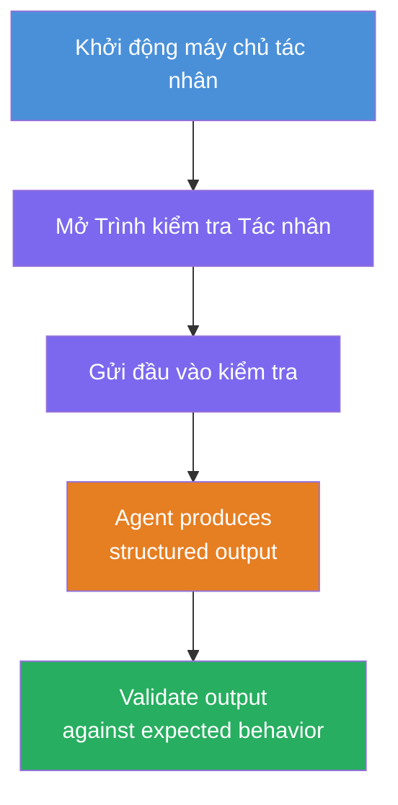
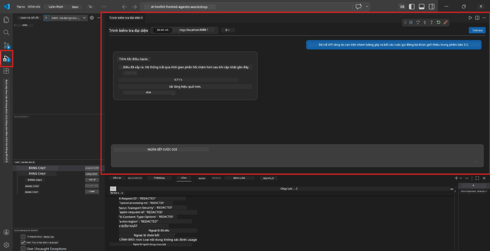
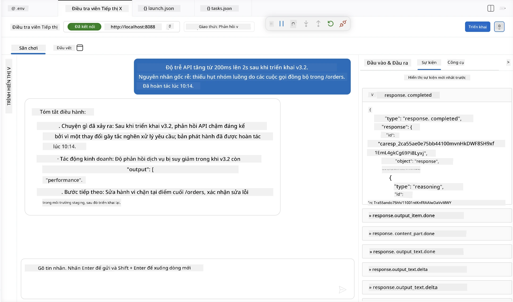

# Module 4 - Kiểm tra cục bộ

⏱️ ~10 phút

Trong module này, bạn chạy agent của mình cục bộ và xác thực rằng nó hoạt động chính xác bằng cách sử dụng **các bài kiểm tra chức năng theo đường đi thuận lợi**. Bạn sẽ sử dụng Agent Inspector (giao diện người dùng trực quan) hoặc thực hiện các cuộc gọi HTTP trực tiếp để xác nhận agent tạo ra các phản hồi có cấu trúc và chính xác.

### Luồng kiểm tra cục bộ



---

## Lựa chọn 1: Nhấn F5 - Gỡ lỗi với Agent Inspector (được khuyến nghị)

### Bắt đầu trình gỡ lỗi

1. Mở thư mục **executive-summary-agent/** trực tiếp trong VS Code (`File → Open Folder`).
2. Mở bảng **Run and Debug** (`Ctrl+Shift+D`).
3. Chọn **Debug Local Agent Server** từ menu thả xuống.
4. Nhấn **F5** (hoặc bấm ▶ Start Debugging).

> ⚠️ **Quan trọng: Chọn Trình thông dịch Python của bạn**
> Nếu bạn nhận được lỗi "ModuleNotFoundError" hoặc trình gỡ lỗi không khởi động được, bạn phải chỉ định VS Code sử dụng môi trường ảo của bạn:
  > 1. Nhấn `Ctrl+Shift+P` $\rightarrow$ gõ **Python: Select Interpreter**.
  > 2. Chọn trình thông dịch nằm trong thư mục `.venv` của dự án bạn (ví dụ, `.\.venv\Scripts\python.exe` trên Windows).
  > 3. Khởi động lại phiên gỡ lỗi.
> Nếu bạn vẫn gặp lỗi, hãy cập nhật thủ công file `tasks.json` như sau:
  > 1. Điều hướng đến file `.vscode/tasks.json`
  > 2. Tìm lệnh có nhãn: `Run Agent/Workflow HTTP Server`
  > 3. Cập nhật giá trị command thành: `"value": "${workspaceFolder}/.venv/bin/python",`

### Điều gì sẽ xảy ra

1. Máy chủ HTTP khởi động tại `http://localhost:8088/responses`.
2. Bảng **Agent Inspector** tự động mở - giao diện trò chuyện trực quan để kiểm tra.
3. Các điểm dừng (breakpoints) được kích hoạt trong `main.py`.

Quan sát Terminal để:
```
Starting executive summary hosted agent
Executive agent server running on http://localhost:8088
```

> **Nếu Agent Inspector không mở:** Nhấn `Ctrl+Shift+P` → **Foundry Toolkit: Open Agent Inspector**.



> *Ảnh chụp màn hình có thể hiển thị thương hiệu 'AI TOOLKIT' cũ từ phiên bản tiện ích mở rộng trước đó.*

---

## Lựa chọn 2: Kiểm tra qua Terminal (phương án thay thế)

Khởi động agent trong một terminal, gửi yêu cầu từ terminal khác:

```bash
# Cổng 1: Bắt đầu tác tử
cd executive-summary-agent/
source .venv/bin/activate
python main.py
```

```bash
# Terminal 2: Gửi thử nghiệm (curl)
curl -sS -X POST http://localhost:8088/responses \
  -H "Content-Type: application/json" \
  -d '{"input": "The API latency increased due to thread pool exhaustion caused by sync calls in v3.2.", "stream": false}'
```

---

## Kiểm tra kịch bản: Xác nhận chức năng theo đường đi thuận lợi

Chạy **cả ba** kịch bản dưới đây. Chúng xác thực rằng agent của bạn tạo ra đầu ra chính xác, có cấu trúc cho các đầu vào thực tế.



### Kịch bản 1: Sự cố CNTT - Đột biến độ trễ API

**Đầu vào:**
```
The API latency increased from 200ms to 2s after deploying v3.2.
Root cause: thread pool starvation from synchronous calls in /orders.
Rolled back at 10:14.
```

**Hành vi mong đợi:**
- ✅ Tuân theo cấu trúc "Tóm tắt điều hành" (Điều gì đã xảy ra / Ảnh hưởng kinh doanh / Bước tiếp theo)
- ✅ Không dùng biệt ngữ kỹ thuật (không có "thread pool", không có "/orders", không có "v3.2")
- ✅ Nêu rõ ảnh hưởng kinh doanh (ví dụ, người dùng gặp phải các độ trễ)
- ✅ Bao gồm bước tiếp theo (ví dụ, sửa lỗi đã được triển khai, giám sát đã được thực hiện)

---

### Kịch bản 2: Pipeline dữ liệu - Lỗi ETL

**Đầu vào:**
```
The nightly ETL job failed because the upstream schema changed. APAC dashboards show missing data.
```

**Hành vi mong đợi:**
- ✅ Tóm tắt lỗi làm mới dữ liệu bằng ngôn ngữ đơn giản
- ✅ Đề cập đến ảnh hưởng trên bảng điều khiển APAC
- ✅ Bao gồm bước khắc phục tiếp theo
- ✅ KHÔNG đề cập đến "ETL", "schema", hoặc các thuật ngữ kỹ thuật khác

---

### Kịch bản 3: Bảo mật - Lộ thông tin xác thực

**Đầu vào:**
```
Static analysis flagged a hardcoded secret in the repository.
The secret may have been exposed in commit history.
```

**Hành vi mong đợi:**
- ✅ Mô tả vấn đề xác thực/bảo mật bằng ngôn ngữ thân thiện với người điều hành
- ✅ Nêu rõ nguy cơ tiềm ẩn (truy cập trái phép)
- ✅ Nêu rõ hành động khắc phục (xoay vòng thông tin xác thực, kiểm toán)
- ✅ KHÔNG bao gồm các thuật ngữ như "static analysis", "commit history", hoặc "hardcoded"

---

## Tiêu chí xác thực

Với mỗi kịch bản, kiểm tra:

| # | Tiêu chí | Điều kiện đạt |
|---|----------|---------------|
| 1 | **Cấu trúc** | Phản hồi sử dụng định dạng "Tóm tắt điều hành" với đủ ba điểm |
| 2 | **Ngôn ngữ đơn giản** | Không có biệt ngữ kỹ thuật mà người điều hành không hiểu được |
| 3 | **Chính xác** | Tóm tắt phản ánh chính xác đầu vào - không thêm chi tiết bịa đặt |
| 4 | **Ngắn gọn** | Phản hồi dưới 100 từ |
| 5 | **Bước tiếp theo** | Một hành động hoặc biện pháp giảm thiểu rõ ràng được nêu ra |

---

## Mẹo gỡ lỗi

| Vấn đề | Cách khắc phục |
|-------|-----|
| Agent không khởi động | Kiểm tra giá trị `.env`, xác nhận venv đã được kích hoạt, chạy `pip install -r requirements.txt` |
| Phản hồi trống hoặc chung chung | Xem lại hướng dẫn trong `main.py` - đảm bảo định dạng đầu ra được chỉ định |
| Phản hồi có biệt ngữ | Củng cố quy tắc "loại bỏ thuật ngữ kỹ thuật" trong hướng dẫn |
| Agent Inspector không mở được | Nhấn `Ctrl+Shift+P` → **Foundry Toolkit: Open Agent Inspector** |
| Lỗi mô hình trong Terminal | Xác nhận `AZURE_AI_MODEL_DEPLOYMENT_NAME` chính xác hoàn toàn (phân biệt chữ hoa/thường) |

---

### ✅ Điểm kiểm tra

- [ ] Agent khởi động cục bộ không lỗi
- [ ] Agent Inspector mở và hiển thị giao diện chat (nếu dùng F5)
- [ ] **Kịch bản 1** (sự cố CNTT) - tóm tắt điều hành có cấu trúc, không dùng thuật ngữ
- [ ] **Kịch bản 2** (pipeline dữ liệu) - tóm tắt phù hợp với ảnh hưởng kinh doanh
- [ ] **Kịch bản 3** (cảnh báo bảo mật) - truyền thông rủi ro phù hợp
- [ ] Tất cả các phản hồi tuân theo cấu trúc đầu ra đã định nghĩa

> **Lưu lại các phản hồi của bạn** (sao chép hoặc chụp màn hình) - bạn sẽ so sánh chúng với kết quả trên đám mây trong Module 06.

---

**Trước:** [03 - Cấu hình & Code](03-configure-and-code.md) · **Tiếp:** [05 - Triển khai lên Foundry →](05-deploy-to-foundry.md)

---

<!-- CO-OP TRANSLATOR DISCLAIMER START -->
**Tuyên bố miễn trừ trách nhiệm**:
Tài liệu này đã được dịch bằng dịch vụ dịch thuật AI [Co-op Translator](https://github.com/Azure/co-op-translator). Mặc dù chúng tôi cố gắng đảm bảo độ chính xác, xin lưu ý rằng bản dịch tự động có thể chứa lỗi hoặc sai sót. Tài liệu gốc bằng ngôn ngữ gốc nên được coi là nguồn tin chính thức. Đối với thông tin quan trọng, nên sử dụng dịch vụ dịch thuật chuyên nghiệp bởi con người. Chúng tôi không chịu trách nhiệm về bất kỳ hiểu lầm hoặc giải thích sai nào phát sinh từ việc sử dụng bản dịch này.
<!-- CO-OP TRANSLATOR DISCLAIMER END -->