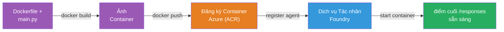
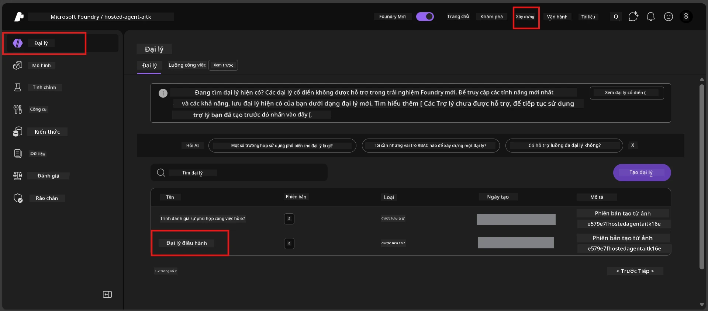

# Module 6 - Triển khai đến Dịch vụ Foundry Agent

Trong module này, bạn sẽ triển khai đại lý đã thử nghiệm cục bộ lên Microsoft Foundry như một [**Đại lý được lưu trữ**](https://learn.microsoft.com/azure/foundry/agents/concepts/hosted-agents). Quá trình triển khai xây dựng một ảnh Docker container từ dự án của bạn, đẩy nó lên [Azure Container Registry (ACR)](https://learn.microsoft.com/azure/container-registry/container-registry-intro), và tạo một phiên bản đại lý được lưu trữ trong [Dịch vụ Foundry Agent](https://learn.microsoft.com/azure/foundry/agents/overview).

### Quy trình triển khai


---

## Kiểm tra điều kiện tiên quyết

Trước khi triển khai, hãy xác minh từng mục dưới đây. Bỏ qua các bước này là nguyên nhân phổ biến nhất gây thất bại khi triển khai.

1. **Đại lý vượt qua các bài kiểm tra khói cục bộ:**  
   - Bạn đã hoàn thành cả 4 bài kiểm tra trong [Module 5](05-test-locally.md) và đại lý phản hồi đúng.

2. **Bạn có vai trò [Azure AI User](https://learn.microsoft.com/azure/foundry/concepts/rbac-foundry#built-in-roles):**  
   - Vai trò này đã được gán trong [Module 2, Bước 3](02-create-foundry-project.md). Nếu không chắc chắn, hãy xác minh ngay bây giờ:  
   - Azure Portal → tài nguyên **dự án** Foundry của bạn → **Access control (IAM)** → tab **Role assignments** → tìm kiếm tên bạn → xác nhận **Azure AI User** có trong danh sách.

3. **Bạn đã đăng nhập Azure trong VS Code:**  
   - Kiểm tra biểu tượng Tài khoản ở góc dưới bên trái của VS Code. Tên tài khoản của bạn phải hiển thị.

4. **(Tùy chọn) Docker Desktop đang chạy:**  
   - Docker chỉ cần thiết nếu tiện ích mở rộng Foundry yêu cầu bạn xây dựng cục bộ. Trong hầu hết trường hợp, tiện ích mở rộng tự động xử lý việc xây dựng container trong quá trình triển khai.  
   - Nếu bạn đã cài Docker, xác minh Docker đang chạy: `docker info`

---

## Bước 1: Bắt đầu triển khai

Bạn có hai cách để triển khai - cả hai đều dẫn đến cùng kết quả.

### Lựa chọn A: Triển khai từ Agent Inspector (khuyến nghị)

Nếu bạn đang chạy đại lý với trình gỡ lỗi (F5) và Agent Inspector đang mở:

1. Nhìn vào **góc trên cùng bên phải** của bảng Agent Inspector.  
2. Nhấn nút **Deploy** (biểu tượng đám mây với mũi tên lên ↑).  
3. Trình hướng dẫn triển khai sẽ mở ra.

### Lựa chọn B: Triển khai từ Command Palette

1. Nhấn `Ctrl+Shift+P` để mở **Command Palette**.  
2. Gõ: **Microsoft Foundry: Deploy Hosted Agent** và chọn nó.  
3. Trình hướng dẫn triển khai sẽ mở ra.

---

## Bước 2: Cấu hình triển khai

Trình hướng dẫn triển khai sẽ hướng dẫn bạn cấu hình. Điền vào từng yêu cầu:

### 2.1 Chọn dự án đích

1. Một danh sách thả xuống sẽ hiển thị các dự án Foundry của bạn.  
2. Chọn dự án bạn đã tạo trong Module 2 (ví dụ: `workshop-agents`).

### 2.2 Chọn tập tin đại lý container

1. Bạn sẽ được yêu cầu chọn điểm đầu vào của đại lý.  
2. Chọn **`main.py`** (Python) - đây là tập tin trình hướng dẫn sử dụng để xác định dự án đại lý của bạn.

### 2.3 Cấu hình tài nguyên

| Cài đặt | Giá trị khuyến nghị | Ghi chú |
|---------|---------------------|---------|
| **CPU** | `0.25` | Mặc định, đủ cho workshop. Tăng lên cho khối lượng công việc sản xuất |
| **Memory** | `0.5Gi` | Mặc định, đủ cho workshop |

Chúng khớp với các giá trị trong `agent.yaml`. Bạn có thể chấp nhận giá trị mặc định.

---

## Bước 3: Xác nhận và triển khai

1. Trình hướng dẫn hiển thị tóm tắt triển khai với:  
   - Tên dự án đích  
   - Tên đại lý (từ `agent.yaml`)  
   - Tệp container và tài nguyên  
2. Xem lại tóm tắt và nhấn **Confirm and Deploy** (hoặc **Deploy**).  
3. Theo dõi tiến trình trong VS Code.

### Điều gì xảy ra trong quá trình triển khai (từng bước)

Triển khai là một quá trình nhiều bước. Theo dõi bảng **Output** trong VS Code (chọn "Microsoft Foundry" từ danh sách thả xuống) để theo dõi:

1. **Docker build** - VS Code xây dựng một ảnh Docker container từ `Dockerfile` của bạn. Bạn sẽ thấy các thông báo lớp Docker:  
   ```
   Step 1/6 : FROM python:<version>-slim
   Step 2/6 : WORKDIR /app
   ...
   Successfully built abc123def456
   ```
  
2. **Docker push** - Ảnh được đẩy lên **Azure Container Registry (ACR)** liên kết với dự án Foundry của bạn. Việc này có thể mất 1-3 phút trong lần triển khai đầu tiên (ảnh cơ sở >100MB).

3. **Đăng ký đại lý** - Dịch vụ Foundry Agent tạo một đại lý được lưu trữ mới (hoặc phiên bản mới nếu đại lý đã tồn tại). Metadata đại lý từ `agent.yaml` được sử dụng.

4. **Khởi động container** - Container được khởi chạy trong cơ sở hạ tầng được quản lý của Foundry. Nền tảng gán một [định danh hệ thống quản lý](https://learn.microsoft.com/azure/foundry/agents/concepts/agent-identity) và mở endpoint `/responses`.

> **Lần triển khai đầu tiên chậm hơn** (Docker cần đẩy tất cả các lớp). Các lần triển khai tiếp theo nhanh hơn vì Docker lưu cache các lớp không thay đổi.

---

## Bước 4: Xác minh trạng thái triển khai

Sau khi lệnh triển khai hoàn tất:

1. Mở thanh bên **Microsoft Foundry** bằng cách nhấp vào biểu tượng Foundry trong Thanh hoạt động.  
2. Mở rộng phần **Hosted Agents (Preview)** dưới dự án của bạn.  
3. Bạn sẽ thấy tên đại lý của bạn (ví dụ: `ExecutiveAgent` hoặc tên từ `agent.yaml`).  
4. **Nhấn vào tên đại lý** để mở rộng.  
5. Bạn sẽ thấy một hoặc nhiều **phiên bản** (ví dụ: `v1`).  
6. Nhấn vào phiên bản để xem **Thông tin Container**.  
7. Kiểm tra trường **Status**:

   | Trạng thái | Ý nghĩa |
   |------------|----------|
   | **Started** hoặc **Running** | Container đang chạy và đại lý đã sẵn sàng |
   | **Pending** | Container đang khởi động (chờ 30-60 giây) |
   | **Failed** | Container khởi động thất bại (kiểm tra nhật ký - xem phần khắc phục bên dưới) |



> **Nếu bạn thấy "Pending" quá 2 phút:** Container có thể đang kéo ảnh cơ sở. Hãy đợi thêm một chút. Nếu vẫn ở trạng thái pending, kiểm tra nhật ký container.

---

## Lỗi triển khai thường gặp và cách khắc phục

### Lỗi 1: Permission denied - `agents/write`

```
Error: lacks the required data action 
Microsoft.CognitiveServices/accounts/AIServices/agents/write 
to perform POST /api/projects/{projectName}/assistants operation.
```
  
**Nguyên nhân:** Bạn không có vai trò `Azure AI User` ở cấp **dự án**.

**Khắc phục từng bước:**

1. Mở [https://portal.azure.com](https://portal.azure.com).  
2. Trong thanh tìm kiếm, gõ tên **dự án** Foundry của bạn và nhấp vào nó.  
   - **Quan trọng:** Hãy chắc chắn bạn vào tài nguyên **dự án** (kiểu: "Microsoft Foundry project"), KHÔNG phải tài nguyên tài khoản/ hub cha mẹ.  
3. Ở menu bên trái, nhấn **Access control (IAM)**.  
4. Nhấn **+ Add** → **Add role assignment**.  
5. Ở tab **Role**, tìm [**Azure AI User**](https://learn.microsoft.com/azure/foundry/concepts/rbac-foundry#built-in-roles) và chọn nó. Nhấn **Next**.  
6. Ở tab **Members**, chọn **User, group, or service principal**.  
7. Nhấn **+ Select members**, tìm tên/email của bạn, chọn bạn, nhấn **Select**.  
8. Nhấn **Review + assign** → **Review + assign** một lần nữa.  
9. Đợi 1-2 phút để vai trò được áp dụng.  
10. **Thử lại triển khai** từ Bước 1.

> Vai trò phải được cấp ở phạm vi **dự án**, không chỉ phạm vi tài khoản. Đây là nguyên nhân phổ biến hàng đầu gây thất bại triển khai.

### Lỗi 2: Docker không chạy

```
Error: Docker build failed / Cannot connect to Docker daemon
```
  
**Khắc phục:**  
1. Bật Docker Desktop (tìm trong menu Start hoặc khay hệ thống).  
2. Đợi cho đến khi hiện "Docker Desktop is running" (30-60 giây).  
3. Xác minh bằng lệnh: `docker info` trong terminal.  
4. **Riêng Windows:** Đảm bảo WSL 2 backend được bật trong cài đặt Docker Desktop → **General** → **Use the WSL 2 based engine**.  
5. Thử lại triển khai.

### Lỗi 3: Ủy quyền ACR - `AcrPullUnauthorized`

```
Error: AcrPullUnauthorized
```
  
**Nguyên nhân:** Định danh quản lý của dự án Foundry không có quyền kéo ảnh từ registry container.

**Khắc phục:**  
1. Trong Azure Portal, điều hướng đến **[Container Registry](https://learn.microsoft.com/azure/container-registry/container-registry-intro)** (ở cùng nhóm tài nguyên với dự án Foundry).  
2. Vào **Access control (IAM)** → **Add** → **Add role assignment**.  
3. Chọn vai trò **[AcrPull](https://learn.microsoft.com/azure/container-registry/container-registry-roles)**.  
4. Ở mục Members, chọn **Managed identity** → tìm định danh quản lý của dự án Foundry.  
5. Nhấn **Review + assign**.

> Thông thường vai trò này được tiện ích mở rộng Foundry thiết lập tự động. Nếu bạn gặp lỗi này, có thể do quá trình tự động không thành công.

### Lỗi 4: Không tương thích nền tảng container (Apple Silicon)

Nếu triển khai từ Mac Apple Silicon (M1/M2/M3), container phải được xây dựng cho `linux/amd64`:

```bash
docker build --platform linux/amd64 -t myagent:v1 .
```
  
> Tiện ích mở rộng Foundry tự động xử lý việc này cho hầu hết người dùng.

---

### Điểm kiểm tra

- [ ] Lệnh triển khai đã hoàn thành không lỗi trong VS Code  
- [ ] Đại lý xuất hiện dưới **Hosted Agents (Preview)** trong thanh bên Foundry  
- [ ] Bạn đã nhấp vào đại lý → chọn phiên bản → xem **Thông tin Container**  
- [ ] Trạng thái container hiển thị **Started** hoặc **Running**  
- [ ] (Nếu có lỗi xảy ra) Bạn đã xác định lỗi, áp dụng cách khắc phục và triển khai lại thành công

---

**Trước:** [05 - Test Locally](05-test-locally.md) · **Sau:** [07 - Verify in Playground →](07-verify-in-playground.md)

---

<!-- CO-OP TRANSLATOR DISCLAIMER START -->
**Tuyên bố miễn trừ trách nhiệm**:  
Tài liệu này đã được dịch bằng dịch vụ dịch thuật AI [Co-op Translator](https://github.com/Azure/co-op-translator). Mặc dù chúng tôi nỗ lực đảm bảo tính chính xác, xin lưu ý rằng các bản dịch tự động có thể chứa lỗi hoặc không chính xác. Tài liệu gốc bằng ngôn ngữ gốc nên được coi là nguồn chính thống. Đối với thông tin quan trọng, khuyến nghị sử dụng dịch vụ dịch thuật chuyên nghiệp do con người thực hiện. Chúng tôi không chịu trách nhiệm về bất kỳ sự hiểu lầm hoặc giải thích sai nào phát sinh từ việc sử dụng bản dịch này.
<!-- CO-OP TRANSLATOR DISCLAIMER END -->