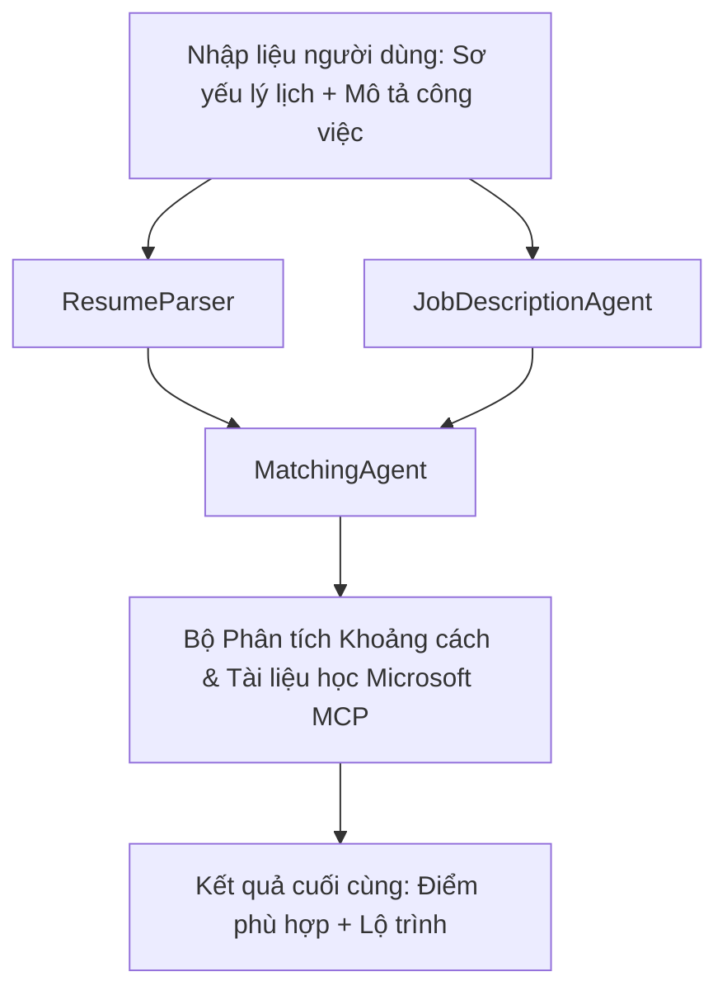

# PersonalCareerCopilot - Đánh giá sự phù hợp CV → Công việc

Một quy trình đa tác nhân đánh giá mức độ phù hợp của CV với mô tả công việc, sau đó tạo lộ trình học tập cá nhân để bù đắp những thiếu sót.

---

## Các tác nhân

| Agent | Vai trò | Công cụ |
|-------|---------|---------|
| **ResumeParser** | Trích xuất kỹ năng, kinh nghiệm, chứng chỉ có cấu trúc từ văn bản CV | - |
| **JobDescriptionAgent** | Trích xuất kỹ năng, kinh nghiệm, chứng chỉ yêu cầu/ưu tiên từ mô tả công việc | - |
| **MatchingAgent** | So sánh hồ sơ với yêu cầu → điểm phù hợp (0-100) + kỹ năng phù hợp/thừa thiếu | - |
| **GapAnalyzer** | Xây dựng lộ trình học tập cá nhân với các tài nguyên Microsoft Learn | `search_microsoft_learn_for_plan` (MCP) |

## Quy trình


---

## Bắt đầu nhanh

### 1. Thiết lập môi trường

```powershell
cd workshop\lab02-multi-agent\PersonalCareerCopilot
python -m venv .venv
.\.venv\Scripts\Activate.ps1          # Windows PowerShell
# source .venv/bin/activate            # macOS / Linux
pip install -r requirements.txt
```

### 2. Cấu hình thông tin đăng nhập

Sao chép file env mẫu và điền thông tin dự án Foundry của bạn:

```powershell
cp .env.example .env
```

Chỉnh sửa `.env`:

```env
PROJECT_ENDPOINT=https://<your-account>.services.ai.azure.com/api/projects/<your-project>
MODEL_DEPLOYMENT_NAME=gpt-4.1-mini
```

| Giá trị | Địa điểm tìm |
|---------|--------------|
| `PROJECT_ENDPOINT` | Thanh bên Microsoft Foundry trong VS Code → nhấp chuột phải lên dự án của bạn → **Copy Project Endpoint** |
| `MODEL_DEPLOYMENT_NAME` | Thanh bên Foundry → mở rộng dự án → **Models + endpoints** → tên triển khai |

### 3. Chạy tại máy

```powershell
python -m debugpy --listen 127.0.0.1:5679 -m agentdev run main.py --verbose --port 8088
```

Hoặc dùng tác vụ VS Code: `Ctrl+Shift+P` → **Tasks: Run Task** → **Run Lab02 HTTP Server**.

### 4. Kiểm thử với Agent Inspector

Mở Agent Inspector: `Ctrl+Shift+P` → **Foundry Toolkit: Open Agent Inspector**.

Dán prompt kiểm thử này:

```
Resume:
Jane Doe
Senior Software Engineer with 5 years of experience in Python, Django, and AWS.
Built microservices handling 10K+ requests/second. Led a team of 4 developers.
Certifications: AWS Solutions Architect Associate.
Education: B.S. Computer Science, State University.

Job Description:
Senior Cloud Engineer at Contoso Ltd.
Required: Python, Azure, Kubernetes, Terraform, CI/CD pipelines.
Preferred: Go, monitoring (Prometheus/Grafana), cost optimization.
Experience: 5+ years in cloud infrastructure.
Certifications: Azure Solutions Architect Expert preferred.
```

**Kỳ vọng:** Điểm phù hợp (0-100), kỹ năng phù hợp/thừa thiếu, và lộ trình học cá nhân với các URL Microsoft Learn.

### 5. Triển khai lên Foundry

`Ctrl+Shift+P` → **Microsoft Foundry: Deploy Hosted Agent** → chọn dự án của bạn → xác nhận.

---

## Cấu trúc dự án

```
PersonalCareerCopilot/
├── .env.example        ← Template for environment variables
├── .env                ← Your credentials (git-ignored)
├── agent.yaml          ← Hosted agent definition (name, resources, env vars)
├── Dockerfile          ← Container image for Foundry deployment
├── main.py             ← 4-agent workflow (instructions, MCP tool, WorkflowBuilder)
└── requirements.txt    ← Python dependencies
```

## Các file chính

### `agent.yaml`

Định nghĩa tác nhân được host cho Foundry Agent Service:
- `kind: hosted` - chạy dưới dạng container được quản lý
- `protocols: [responses v1]` - phơi bày endpoint HTTP `/responses`
- `environment_variables` - `PROJECT_ENDPOINT` và `MODEL_DEPLOYMENT_NAME` được chèn lúc triển khai

### `main.py`

Chứa:
- **Hướng dẫn tác nhân** - bốn hằng số `*_INSTRUCTIONS`, mỗi cái dành cho một tác nhân
- **Công cụ MCP** - `search_microsoft_learn_for_plan()` gọi `https://learn.microsoft.com/api/mcp` qua HTTP Streamable
- **Tạo tác nhân** - `create_agents()` context manager dùng `AzureAIAgentClient.as_agent()`
- **Đồ thị quy trình** - `create_workflow()` dùng `WorkflowBuilder` kết nối các tác nhân theo mẫu fan-out/fan-in/tuần tự
- **Khởi động server** - `from_agent_framework(agent).run_async()` trên cổng 8088

### `requirements.txt`

| Gói | Phiên bản | Mục đích |
|-----|-----------|----------|
| `agent-framework-azure-ai` | `1.0.0rc3` | Tích hợp Azure AI cho Microsoft Agent Framework |
| `agent-framework-core` | `1.0.0rc3` | Runtime lõi (bao gồm WorkflowBuilder) |
| `azure-ai-agentserver-agentframework` | `1.0.0b16` | Runtime server tác nhân được host |
| `azure-ai-agentserver-core` | `1.0.0b16` | Trừu tượng server lõi cho tác nhân |
| `debugpy` | phiên bản mới nhất | Gỡ lỗi Python (F5 trong VS Code) |
| `agent-dev-cli` | `--pre` | CLI phát triển cục bộ + backend Agent Inspector |

---

## Khắc phục sự cố

| Lỗi | Cách khắc phục |
|------|---------------|
| `RuntimeError: Missing required environment variable(s)` | Tạo `.env` với `PROJECT_ENDPOINT` và `MODEL_DEPLOYMENT_NAME` |
| `ModuleNotFoundError: No module named 'agent_framework'` | Kích hoạt venv và chạy `pip install -r requirements.txt` |
| Không có URL Microsoft Learn trong kết quả | Kiểm tra kết nối internet tới `https://learn.microsoft.com/api/mcp` |
| Chỉ có 1 thẻ gap (bị cắt) | Kiểm tra xem `GAP_ANALYZER_INSTRUCTIONS` có bao gồm khối `CRITICAL:` không |
| Cổng 8088 đã dùng | Dừng các server khác: `netstat -ano \| findstr :8088` |

Để xem chi tiết khắc phục lỗi, xem [Module 8 - Troubleshooting](../docs/08-troubleshooting.md).

---

**Hướng dẫn đầy đủ:** [Lab 02 Docs](../docs/README.md) · **Quay lại:** [Lab 02 README](../README.md) · [Trang chủ Hội thảo](../../../README.md)

---

<!-- CO-OP TRANSLATOR DISCLAIMER START -->
**Tuyên bố từ chối trách nhiệm**:  
Tài liệu này đã được dịch bằng dịch vụ dịch thuật AI [Co-op Translator](https://github.com/Azure/co-op-translator). Mặc dù chúng tôi nỗ lực để đảm bảo độ chính xác, xin lưu ý rằng các bản dịch tự động có thể chứa lỗi hoặc không chính xác. Tài liệu gốc bằng ngôn ngữ nguyên bản nên được xem là nguồn chính thức. Đối với thông tin quan trọng, nên sử dụng dịch vụ dịch thuật chuyên nghiệp do con người thực hiện. Chúng tôi không chịu trách nhiệm đối với bất kỳ sự hiểu lầm hoặc giải thích sai nào phát sinh từ việc sử dụng bản dịch này.
<!-- CO-OP TRANSLATOR DISCLAIMER END -->