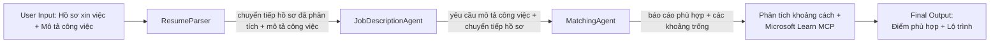

# PersonalCareerCopilot - Đánh giá sự phù hợp Resume → Công việc

Ứng dụng đa tác nhân lấy quy trình làm trung tâm, đánh giá mức độ phù hợp giữa resume và mô tả công việc, sau đó tạo lộ trình học cá nhân hóa nhằm lấp đầy các điểm còn thiếu.

---

## Các tác nhân

| Tác nhân | Vai trò | Công cụ |
|-------|------|-------|
| **ResumeParser** | Trích xuất kỹ năng, kinh nghiệm, chứng chỉ có cấu trúc từ văn bản resume | - |
| **JobDescriptionAgent** | Trích xuất kỹ năng yêu cầu/ưu tiên, kinh nghiệm, chứng chỉ từ mô tả công việc | - |
| **MatchingAgent** | So sánh hồ sơ với yêu cầu → điểm phù hợp (0-100) + kỹ năng khớp/thiếu | - |
| **GapAnalyzer** | Xây dựng lộ trình học cá nhân hóa với nguồn Microsoft Learn | `search_microsoft_learn_for_plan` (MCP) |

## Quy trình làm việc


```mermaid
flowchart LR
    UserInput["User Input: Hồ sơ xin việc + Mô tả công việc"] --> ResumeParser
    ResumeParser -- "chuyển tiếp hồ sơ đã phân tích + mô tả công việc" --> JobDescriptionAgent
    JobDescriptionAgent -- "yêu cầu mô tả công việc + chuyển tiếp hồ sơ" --> MatchingAgent
    MatchingAgent -- "báo cáo phù hợp + các khoảng trống" --> GapAnalyzerMCP["Phân tích khoảng cách +\nMicrosoft Learn MCP"]
    GapAnalyzerMCP --> FinalOutput["Final Output:\nĐiểm phù hợp + Lộ trình"]
```

---

## Bắt đầu nhanh

### 1. Thiết lập môi trường

Thư mục này là triển khai tham khảo cho khung Lab 02 dựa trên quy trình làm việc. Tệp `main.py` sử dụng các khối prompt hiện có cùng với `WorkflowBuilder` để kết nối bốn tác nhân với nhau.

```powershell
cd workshop\lab02-multi-agent\PersonalCareerCopilot
python -m venv .venv
.\.venv\Scripts\Activate.ps1          # Windows PowerShell
# source .venv/bin/activate            # macOS / Linux
pip install -r requirements.txt
```

### 2. Cấu hình thông tin xác thực

Tạo tệp `.env` trong thư mục này:

```powershell
copy .env .env.bak 2>$null; echo $null > .env
```

Chỉnh sửa `.env`:

```env
FOUNDRY_PROJECT_ENDPOINT=https://<your-account>.services.ai.azure.com/api/projects/<your-project>
AZURE_AI_MODEL_DEPLOYMENT_NAME=gpt-4.1-mini
```

| Giá trị | Nơi tìm thấy |
|-------|------------------|
| `FOUNDRY_PROJECT_ENDPOINT` | Thanh bên Foundry Toolkit → nhấp phải vào dự án của bạn → **Sao chép Đầu mối Dự án** |
| `AZURE_AI_MODEL_DEPLOYMENT_NAME` | Thanh bên Foundry → mở rộng dự án → **Models + endpoints** → tên triển khai |

### 3. Chạy cục bộ

```powershell
python -m debugpy --listen 127.0.0.1:5679 main.py --port 8088
```

Hoặc sử dụng tác vụ VS Code: `Ctrl+Shift+P` → **Tasks: Run Task** → **Run Agent HTTP Server**.

Để gỡ lỗi F5, sử dụng **Debug Local Agent HTTP Server**.

### 4. Kiểm tra với Agent Inspector

Mở Agent Inspector: `Ctrl+Shift+P` → **Foundry Toolkit: Open Agent Inspector**.

Dán prompt kiểm tra này:

```
Resume:
Jane Doe
Senior Software Engineer with 5 years of experience in Python, Django, and AWS.
Built microservices handling 10K+ requests/second. Led a team of 4 developers.
Certifications: AWS Solutions Architect Associate.
Education: B.S. Computer Science, State University.

Job Description:
Senior Cloud Engineer at Contoso Ltd.
Required: Python, Azure, Kubernetes, Terraform, CI/CD pipelines.
Preferred: Go, monitoring (Prometheus/Grafana), cost optimization.
Experience: 5+ years in cloud infrastructure.
Certifications: Azure Solutions Architect Expert preferred.
```

**Kỳ vọng:** Điểm phù hợp (0-100), kỹ năng khớp/thiếu, và lộ trình học cá nhân với URL Microsoft Learn.

### 5. Triển khai lên Foundry

`Ctrl+Shift+P` → **Foundry Toolkit: Deploy Hosted Agent** → chọn dự án của bạn → xác nhận.

---

## Cấu trúc dự án

```
PersonalCareerCopilot/
├── .env                ← Your credentials (git-ignored)
├── agent.yaml          ← Hosted agent definition (name, resources, env vars)
├── Dockerfile          ← Container image for Foundry deployment
├── main.py             ← 4-agent workflow (instructions, MCP tool, WorkflowBuilder)
└── requirements.txt    ← Python dependencies
```

## Các tệp chính

### `agent.yaml`

Định nghĩa tác nhân được lưu trữ cho Foundry Agent Service:
- `kind: hosted` - chạy dưới dạng container quản lý
- `protocols` - giao thức `responses` với `version: 1.0.0`, cung cấp endpoint HTTP `/responses`
- `environment_variables` - `AZURE_AI_MODEL_DEPLOYMENT_NAME` được khai báo ở đây; `FOUNDRY_PROJECT_ENDPOINT` được tự động chèn khi triển khai

### `main.py`

Bao gồm:
- **Hướng dẫn tác nhân** - bốn hằng số `*_INSTRUCTIONS`, mỗi tác nhân một cái
- **Công cụ MCP** - `search_microsoft_learn_for_plan()` gọi `https://learn.microsoft.com/api/mcp` qua HTTP Streamable
- **Tạo tác nhân** - bốn thể hiện `Agent()` + `AgentExecutor()` dùng chung một `FoundryChatClient`
- **Đồ thị quy trình** - `WorkflowBuilder` liên kết các tác nhân theo đường ống tuần tự: ResumeParser → JD Agent → MatchingAgent → GapAnalyzer
- **Khởi động máy chủ** - `ResponsesHostServer` chạy trên cổng 8088

### `requirements.txt`

| Gói | Mục đích |
|---------|----------|
| `agent-framework-foundry` | Runtime cốt lõi: `Agent`, `AgentExecutor`, `WorkflowBuilder`, `@tool`, `FoundryChatClient` |
| `agent-framework-foundry-hosting` | `ResponsesHostServer` + tích hợp lưu trữ Foundry |
| `mcp<2,>=1.24.0` | Khách hàng MCP cho GapAnalyzer (`streamable_http_client`) |
| `debugpy` | Gỡ lỗi Python (F5 trong VS Code) |

---

## Khắc phục sự cố

| Vấn đề | Cách sửa |
|-------|-----|
| `KeyError: 'FOUNDRY_PROJECT_ENDPOINT'` hoặc `KeyError: 'AZURE_AI_MODEL_DEPLOYMENT_NAME'` | Tạo `.env` với cả hai biến `FOUNDRY_PROJECT_ENDPOINT` và `AZURE_AI_MODEL_DEPLOYMENT_NAME` được đặt |
| `ModuleNotFoundError: No module named 'agent_framework'` | Kích hoạt venv và chạy `pip install -r requirements.txt` |
| Không có URL Microsoft Learn trong đầu ra | Kiểm tra kết nối internet đến `https://learn.microsoft.com/api/mcp` |
| Chỉ có 1 thẻ gap (bị cắt ngắn) | Xác nhận `GAP_ANALYZER_INSTRUCTIONS` bao gồm khối `CRITICAL:` |
| Cổng 8088 đang bị sử dụng | Dừng các máy chủ khác: `netstat -ano \| findstr :8088` |

Để khắc phục sự cố chi tiết, xem [Module 8 - Troubleshooting](../docs/08-troubleshooting.md).

---

**Hướng dẫn đầy đủ:** [Lab 02 Docs](../docs/README.md) · **Quay lại:** [Lab 02 README](../README.md) · [Trang Chủ Workshop](../../../README.md)

---

<!-- CO-OP TRANSLATOR DISCLAIMER START -->
**Tuyên bố miễn trừ trách nhiệm**:
Tài liệu này đã được dịch bằng dịch vụ dịch thuật AI [Co-op Translator](https://github.com/Azure/co-op-translator). Mặc dù chúng tôi cố gắng đảm bảo độ chính xác, xin lưu ý rằng bản dịch tự động có thể chứa lỗi hoặc sai sót. Tài liệu gốc bằng ngôn ngữ gốc nên được coi là nguồn tin chính thức. Đối với thông tin quan trọng, nên sử dụng dịch vụ dịch thuật chuyên nghiệp bởi con người. Chúng tôi không chịu trách nhiệm về bất kỳ hiểu lầm hoặc giải thích sai nào phát sinh từ việc sử dụng bản dịch này.
<!-- CO-OP TRANSLATOR DISCLAIMER END -->