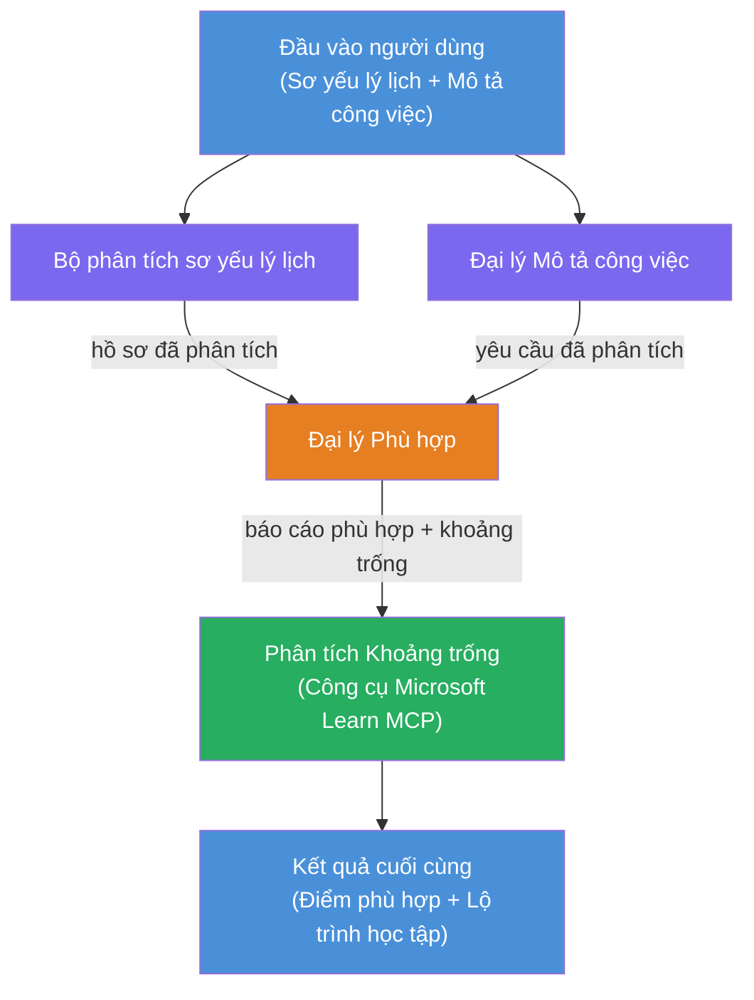

# Lab 02 - Quy trình làm việc đa tác nhân: Đánh giá Resume → Phù hợp công việc

---

## Những gì bạn sẽ xây dựng

Một **Đánh giá Resume → Phù hợp công việc** - một quy trình làm việc đa tác nhân nơi bốn tác nhân chuyên môn hợp tác để đánh giá mức độ phù hợp của resume ứng viên với mô tả công việc, sau đó tạo ra một lộ trình học tập cá nhân hóa để lấp đầy các khoảng cách.

### Các tác nhân

| Tác nhân | Vai trò |
|----------|---------|
| **Resume Parser** | Trích xuất kỹ năng, kinh nghiệm, chứng chỉ có cấu trúc từ văn bản resume |
| **Job Description Agent** | Trích xuất kỹ năng, kinh nghiệm, chứng chỉ bắt buộc/ưu tiên từ mô tả công việc |
| **Matching Agent** | So sánh hồ sơ vs yêu cầu → điểm phù hợp (0-100) + kỹ năng phù hợp/thiếu |
| **Gap Analyzer** | Xây dựng lộ trình học tập cá nhân hóa với tài nguyên, thời hạn, và dự án nhanh |

### Luồng trình diễn

Tải lên **resume + mô tả công việc** → nhận **điểm phù hợp + kỹ năng thiếu** → nhận **lộ trình học tập cá nhân hóa**.

### Kiến trúc quy trình làm việc

> Tím = các tác nhân song song | Cam = điểm tổng hợp | Xanh lá = tác nhân cuối cùng với công cụ. Xem [Module 1 - Hiểu Kiến trúc](docs/01-understand-multi-agent.md) và [Module 4 - Mẫu Điều phối](docs/04-orchestration-patterns.md) để xem sơ đồ chi tiết và luồng dữ liệu.

### Chủ đề bao gồm

- Tạo quy trình làm việc đa tác nhân sử dụng **WorkflowBuilder**
- Định nghĩa vai trò tác nhân và luồng điều phối (song song + tuần tự)
- Mẫu giao tiếp giữa các tác nhân
- Kiểm thử cục bộ với Agent Inspector
- Triển khai quy trình làm việc đa tác nhân lên Foundry Agent Service

---

## Yêu cầu trước

Hoàn thành Lab 01 trước:

- [Lab 01 - Tác nhân đơn](../lab01-single-agent/README.md)

---

## Bắt đầu

Xem hướng dẫn thiết lập đầy đủ, giải thích mã và lệnh kiểm thử tại:

- [Tài liệu Lab 2 - Yêu cầu trước](docs/00-prerequisites.md)
- [Tài liệu Lab 2 - Lộ trình học tập đầy đủ](docs/README.md)
- [Hướng dẫn chạy PersonalCareerCopilot](PersonalCareerCopilot/README.md)

## Mẫu điều phối (các lựa chọn đa tác nhân)

Lab 2 bao gồm luồng mặc định **song song → tổng hợp → lập kế hoạch**, và tài liệu cũng mô tả các mẫu thay thế để chứng minh hành vi đa tác nhân mạnh mẽ hơn:

- **Fan-out/Fan-in với đồng thuận có trọng số**
- **Qua lượt đánh giá/nhận xét trước lộ trình cuối cùng**
- **Bộ định tuyến điều kiện** (lựa chọn tuyến dựa trên điểm phù hợp và kỹ năng thiếu)

Xem [docs/04-orchestration-patterns.md](docs/04-orchestration-patterns.md).

---

**Trước:** [Lab 01 - Tác nhân đơn](../lab01-single-agent/README.md) · **Quay lại:** [Trang chủ Workshop](../../README.md)

---

<!-- CO-OP TRANSLATOR DISCLAIMER START -->
**Tuyên bố từ chối trách nhiệm**:  
Tài liệu này đã được dịch bằng dịch vụ dịch thuật AI [Co-op Translator](https://github.com/Azure/co-op-translator). Mặc dù chúng tôi cố gắng đảm bảo độ chính xác, xin lưu ý rằng bản dịch tự động có thể chứa lỗi hoặc sai sót. Tài liệu gốc bằng ngôn ngữ nguyên bản nên được coi là nguồn chính thức. Đối với thông tin quan trọng, nên sử dụng dịch vụ dịch thuật chuyên nghiệp của con người. Chúng tôi không chịu trách nhiệm về bất kỳ sự hiểu lầm hay giải thích sai nào phát sinh từ việc sử dụng bản dịch này.
<!-- CO-OP TRANSLATOR DISCLAIMER END -->