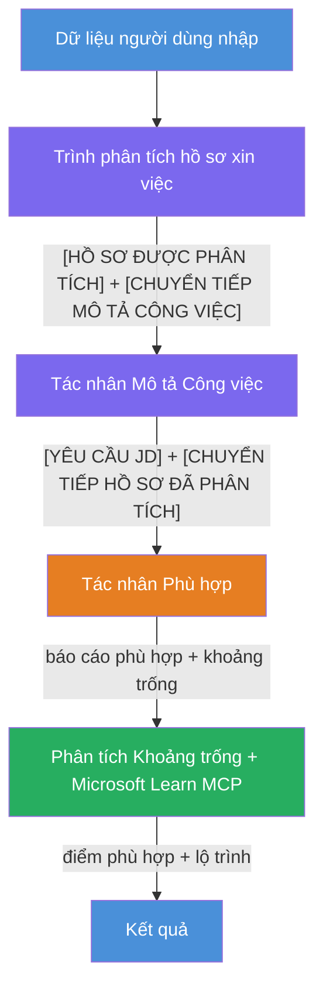

# Lab 02 - Quy trình đa đại lý: Đánh giá sự phù hợp hồ sơ → công việc

## Tổng quan

Trong bài thực hành này, bạn sẽ xây dựng một **ứng dụng đa đại lý ưu tiên quy trình công việc** sử dụng Foundry Toolkit trong VS Code và triển khai nó lên Microsoft Foundry Agent Service.

**Những gì bạn sẽ xây dựng:** một Trình Đánh Giá Sự Phù Hợp Hồ Sơ → Công Việc phân tích hồ sơ và mô tả công việc, đánh giá điểm phù hợp và tạo bản đồ học tập cá nhân hóa sử dụng tài nguyên Microsoft Learn.

---

## Kiến trúc

```mermaid
flowchart TD
    A["Dữ liệu người dùng nhập"] --> B["Trình phân tích hồ sơ xin việc"]
    B -->|"[HỒ SƠ ĐƯỢC PHÂN TÍCH] + [CHUYỂN TIẾP MÔ TẢ CÔNG VIỆC]"| C["Tác nhân Mô tả Công việc"]
    C -->|"[YÊU CẦU JD] + [CHUYỂN TIẾP HỒ SƠ ĐÃ PHÂN TÍCH]"| D["Tác nhân Phù hợp"]
    D -->|báo cáo phù hợp + khoảng trống| E["Phân tích Khoảng trống + Microsoft Learn MCP"]
    E -->|điểm phù hợp + lộ trình| F["Kết quả"]

    style A fill:#4A90D9,color:#fff
    style B fill:#7B68EE,color:#fff
    style C fill:#7B68EE,color:#fff
    style D fill:#E67E22,color:#fff
    style E fill:#27AE60,color:#fff
    style F fill:#4A90D9,color:#fff
```

**Cách hoạt động:**
1. Người dùng dán hồ sơ và mô tả công việc.
2. **ResumeParser** phân tích hồ sơ và sao chép nguyên văn mô tả công việc vào mục `[JOB DESCRIPTION PASS-THROUGH]`.
3. **JD Agent** trích xuất yêu cầu có cấu trúc từ phần pass-through, rồi chuyển tiếp `[PARSED RESUME]` thành `[PARSED RESUME PASS-THROUGH]`.
4. **MatchingAgent** so sánh `[PARSED RESUME PASS-THROUGH]` với `[JD REQUIREMENTS]` và tạo điểm phù hợp.
5. **GapAnalyzer** biến các khoảng trống thành bản đồ thực tiễn và lấy liên kết Microsoft Learn thực qua MCP.

---

## Yêu cầu tiên quyết

Hoàn thành Lab 01 trước:

- [Lab 01 - Đại lý đơn](../lab01-single-agent/README.md)

---

## Phần 1: Đọc các mô-đun theo thứ tự

Xem toàn bộ lộ trình học tại:

- [Tài liệu Lab 2 - Yêu cầu tiên quyết](docs/00-prerequisites.md)
- [Tài liệu Lab 2 - Toàn bộ lộ trình học](docs/README.md)
- [Hướng dẫn chạy PersonalCareerCopilot](PersonalCareerCopilot/README.md)

---

## Phần 2: Xây dựng và kiểm thử quy trình công việc

1. Sử dụng trình hướng dẫn Foundry Toolkit để tạo cấu trúc dự án dựa trên quy trình công việc.
2. Sao chép các khối lệnh và đồ thị quy trình công việc từ `PersonalCareerCopilot/main.py` vào môi trường làm việc của bạn.
3. Chạy cục bộ với Agent Inspector và xác nhận tất cả bốn đại lý cùng công cụ MCP hoạt động.
4. Triển khai đại lý được lưu trữ lên Foundry khi kiểm thử cục bộ thành công.

---

## Mẫu phối hợp

Lab 02 bao gồm luồng mặc định **fan-out → fan-in → tuần tự**, và tài liệu cũng mô tả các mẫu phối hợp thay thế để thử nghiệm.

- **Fan-out/Fan-in với đồng thuận có trọng số**
- **Giai đoạn đánh giá/nhận xét trước khi bản đồ cuối cùng**
- **Bộ định tuyến có điều kiện** dựa trên điểm phù hợp và kỹ năng còn thiếu

Xem [docs/04-orchestration-patterns.md](docs/04-orchestration-patterns.md).

---

**Trước:** [Lab 01 - Đại lý đơn](../lab01-single-agent/README.md) · **Quay về:** [Trang chủ Workshop](../../README.md)

---

<!-- CO-OP TRANSLATOR DISCLAIMER START -->
**Tuyên bố miễn trừ trách nhiệm**:
Tài liệu này đã được dịch bằng dịch vụ dịch thuật AI [Co-op Translator](https://github.com/Azure/co-op-translator). Mặc dù chúng tôi cố gắng đảm bảo độ chính xác, xin lưu ý rằng bản dịch tự động có thể chứa lỗi hoặc sai sót. Tài liệu gốc bằng ngôn ngữ gốc nên được coi là nguồn tin chính thức. Đối với thông tin quan trọng, nên sử dụng dịch vụ dịch thuật chuyên nghiệp bởi con người. Chúng tôi không chịu trách nhiệm về bất kỳ hiểu lầm hoặc giải thích sai nào phát sinh từ việc sử dụng bản dịch này.
<!-- CO-OP TRANSLATOR DISCLAIMER END -->