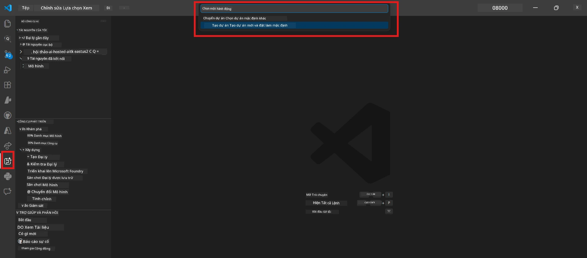

# Module 0 - Yêu cầu tiên quyết

Trước khi bắt đầu Lab 02, hãy xác nhận bạn đã hoàn thành những điều sau. Lab này xây dựng trực tiếp dựa trên Lab 01 - không được bỏ qua nó.

---

## 1. Hoàn thành Lab 01

Lab 02 giả định bạn đã:

- [x] Hoàn thành tất cả 8 module của [Lab 01 - Đại lý đơn](../../lab01-single-agent/README.md)
- [x] Triển khai thành công một đại lý đơn lên Dịch vụ Đại lý Foundry
- [x] Xác nhận đại lý hoạt động tốt trong cả Agent Inspector cục bộ và Foundry Playground

Nếu bạn chưa hoàn thành Lab 01, hãy quay lại và hoàn tất ngay: [Tài liệu Lab 01](../../lab01-single-agent/docs/00-prerequisites.md)

---

## 2. Kiểm tra thiết lập hiện có

Tất cả các công cụ từ Lab 01 vẫn phải được cài đặt và hoạt động. Thực hiện các kiểm tra nhanh sau:

### 2.1 Azure CLI

```powershell
az account show --query "{name:name, id:id}" --output table
```

Kỳ vọng: Hiển thị tên và ID đăng ký của bạn. Nếu không thành công, chạy [`az login`](https://learn.microsoft.com/cli/azure/authenticate-azure-cli-interactively).

### 2.2 Tiện ích mở rộng VS Code

1. Nhấn `Ctrl+Shift+P` → gõ **"Microsoft Foundry"** → xác nhận bạn thấy các lệnh (vd: `Microsoft Foundry: Create a New Hosted Agent`).
2. Nhấn `Ctrl+Shift+P` → gõ **"Foundry Toolkit"** → xác nhận bạn thấy các lệnh (vd: `Foundry Toolkit: Open Agent Inspector`).

### 2.3 Dự án & mô hình Foundry

1. Nhấp vào biểu tượng **Microsoft Foundry** trên Thanh tác vụ của VS Code.
2. Xác nhận dự án của bạn được liệt kê (vd: `workshop-agents`).
3. Mở rộng dự án → xác nhận có mô hình đã triển khai tồn tại (vd: `gpt-4.1-mini`) với trạng thái **Succeeded**.

> **Nếu việc triển khai mô hình của bạn đã hết hạn:** Một số triển khai miễn phí tự động hết hạn. Triển khai lại từ [Model Catalog](https://learn.microsoft.com/azure/foundry/foundry-models/concepts/models-sold-directly-by-azure) (`Ctrl+Shift+P` → **Microsoft Foundry: Open Model Catalog**).



### 2.4 Vai trò RBAC

Xác nhận bạn có vai trò **Azure AI User** trên dự án Foundry của bạn:

1. [Azure Portal](https://portal.azure.com) → tài nguyên **dự án** Foundry của bạn → **Access control (IAM)** → tab **[Role assignments](https://learn.microsoft.com/azure/foundry/concepts/rbac-foundry)**.
2. Tìm kiếm tên bạn → xác nhận **[Azure AI User](https://aka.ms/foundry-ext-project-role)** có trong danh sách.

---

## 3. Hiểu các khái niệm đa đại lý (mới cho Lab 02)

Lab 02 giới thiệu các khái niệm chưa đề cập trong Lab 01. Đọc kỹ trước khi tiếp tục:

### 3.1 Quy trình làm việc đa đại lý là gì?

Thay vì một đại lý xử lý tất cả, **quy trình làm việc đa đại lý** phân chia công việc cho nhiều đại lý chuyên biệt. Mỗi đại lý có:

- Các **hướng dẫn** riêng (prompt hệ thống)
- Vai trò riêng **(nhiệm vụ được giao)**
- Công cụ tùy chọn **(chức năng có thể gọi)**

Các đại lý giao tiếp qua **đồ thị điều phối** định nghĩa cách dữ liệu chảy giữa chúng.

### 3.2 WorkflowBuilder

Lớp [`WorkflowBuilder`](https://learn.microsoft.com/agent-framework/workflows/agents-in-workflows) từ `agent_framework` là thành phần SDK kết nối các đại lý với nhau:

```python
from agent_framework import WorkflowBuilder

workflow = (
    WorkflowBuilder(
        name="MyWorkflow",
        start_executor=agent_a,
        output_executors=[agent_d],
    )
    .add_edge(agent_a, agent_b)
    .add_edge(agent_a, agent_c)
    .add_edge(agent_b, agent_d)
    .add_edge(agent_c, agent_d)
    .build()
)
```

- **`start_executor`** - Đại lý đầu tiên nhận đầu vào người dùng
- **`output_executors`** - Đại lý(đại lý) mà đầu ra trở thành phản hồi cuối cùng
- **`add_edge(source, target)`** - Định nghĩa `target` nhận đầu ra từ `source`

### 3.3 Công cụ MCP (Model Context Protocol)

Lab 02 sử dụng một **công cụ MCP** gọi API Microsoft Learn để lấy tài nguyên học tập. [MCP (Model Context Protocol)](https://modelcontextprotocol.io/introduction) là giao thức chuẩn để kết nối các mô hình AI với nguồn dữ liệu và công cụ bên ngoài.

| Thuật ngữ | Định nghĩa |
|------|-----------|
| **Máy chủ MCP** | Dịch vụ cung cấp công cụ/tài nguyên qua [giao thức MCP](https://learn.microsoft.com/azure/foundry/agents/how-to/tools/model-context-protocol) |
| **Khách hàng MCP** | Mã đại lý của bạn kết nối tới máy chủ MCP và gọi công cụ của nó |
| **[Streamable HTTP](https://learn.microsoft.com/agent-framework/agents/tools/hosted-mcp-tools)** | Phương thức truyền tải dùng để giao tiếp với máy chủ MCP |

### 3.4 Lab 02 khác gì Lab 01

| Khía cạnh | Lab 01 (Đại lý đơn) | Lab 02 (Đa đại lý) |
|--------|----------------------|---------------------|
| Đại lý | 1 | 4 (vai trò chuyên biệt) |
| Điều phối | Không có | WorkflowBuilder (song song + tuần tự) |
| Công cụ | Tùy chọn hàm `@tool` | Công cụ MCP (gọi API bên ngoài) |
| Độ phức tạp | Prompt đơn giản → phản hồi | Sơ yếu lý lịch + JD → điểm phù hợp → lộ trình |
| Luồng ngữ cảnh | Trực tiếp | Chuyển giao đại lý-đại lý |

---

## 4. Cấu trúc kho lưu trữ workshop cho Lab 02

Hãy chắc chắn bạn biết vị trí các tập tin Lab 02:

```
workshop/
└── lab02-multi-agent/
    ├── README.md                       ← Lab overview
    ├── docs/                           ← You are here
    │   ├── README.md                   ← Learning path index
    │   ├── 00-prerequisites.md         ← This file
    │   ├── 01-understand-multi-agent.md
    │   ├── ...
    │   └── 08-troubleshooting.md
    └── PersonalCareerCopilot/          ← The agent project
        ├── agent.yaml                  ← Agent definition
        ├── main.py                     ← 4-agent workflow code
        ├── Dockerfile                  ← Container configuration
        └── requirements.txt            ← Python dependencies
```

---

### Điểm kiểm tra

- [ ] Lab 01 đã hoàn thành đầy đủ (tất cả 8 modules, đại lý được triển khai và xác nhận)
- [ ] `az account show` trả về đăng ký của bạn
- [ ] Mở rộng Microsoft Foundry và Foundry Toolkit đã được cài và phản hồi
- [ ] Dự án Foundry có mô hình được triển khai (vd: `gpt-4.1-mini`)
- [ ] Bạn có vai trò **Azure AI User** trên dự án
- [ ] Bạn đã đọc phần khái niệm đa đại lý phía trên và hiểu WorkflowBuilder, MCP, và điều phối đại lý

---

**Tiếp theo:** [01 - Hiểu Kiến trúc Đa Đại lý →](01-understand-multi-agent.md)

---

<!-- CO-OP TRANSLATOR DISCLAIMER START -->
**Tuyên bố miễn trừ trách nhiệm**:  
Tài liệu này đã được dịch bằng dịch vụ dịch thuật AI [Co-op Translator](https://github.com/Azure/co-op-translator). Mặc dù chúng tôi cố gắng đảm bảo độ chính xác, xin lưu ý rằng các bản dịch tự động có thể chứa lỗi hoặc sự không chính xác. Tài liệu gốc bằng ngôn ngữ nguyên bản nên được coi là nguồn chính xác và đáng tin cậy. Đối với thông tin quan trọng, khuyến nghị sử dụng dịch thuật chuyên nghiệp bởi con người. Chúng tôi không chịu trách nhiệm cho bất kỳ sự hiểu nhầm hoặc giải thích sai nào phát sinh từ việc sử dụng bản dịch này.
<!-- CO-OP TRANSLATOR DISCLAIMER END -->