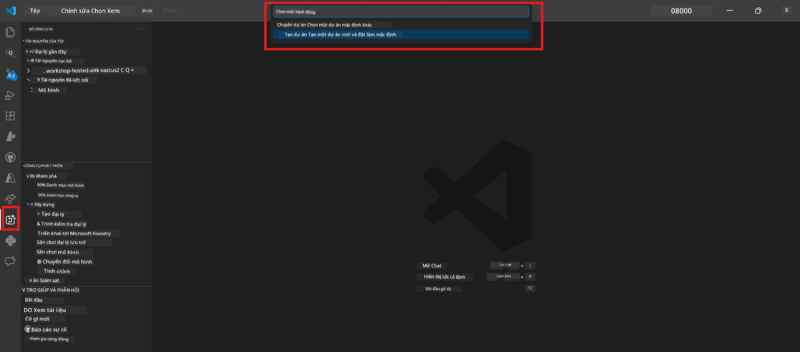

# Mô-đun 0 - Giới thiệu

⏱️ ~10 phút

> [!WARNING]
> **Xem trước & Hạn chế:** [Các đại lý được lưu trữ](https://learn.microsoft.com/azure/foundry/agents/concepts/hosted-agents) hiện đang ở **giai đoạn xem trước công khai** - không khuyến nghị cho các khối lượng công việc sản xuất. Một số tính năng được trình bày trong hội thảo này có thể thay đổi khi dịch vụ tiến đến GA.

## Những gì bạn sẽ xây dựng

Trong phòng thí nghiệm này, bạn mở rộng kỹ năng đại lý đơn từ Lab 01 để xây dựng một **quy trình làm việc đa đại lý** - Trình đánh giá phù hợp việc làm từ hồ sơ xin việc.

Bạn dán vào một **hồ sơ xin việc** và một **mô tả công việc**. Bốn đại lý chuyên môn xử lý đầu vào theo thứ tự, sau đó trả về:
- Điểm phù hợp (0–100 kèm phân tích điểm)
- Danh sách khoảng cách kỹ năng và chứng chỉ
- Lộ trình học tập cá nhân hóa với các liên kết học tập thực từ Microsoft Learn cho mỗi khoảng cách

**Quy trình làm việc sử dụng:**
- **Microsoft Agent Framework** - `WorkflowBuilder` để điều phối chuỗi xử lý theo thứ tự
- **Bộ công cụ Foundry cho VS Code** - dựng khung, kiểm thử cục bộ, triển khai
- **Mô hình AI** (ví dụ, `gpt-4.1-mini`) - được sử dụng bởi cả bốn đại lý
- **Máy chủ Microsoft Learn MCP** - cung cấp các liên kết tài nguyên học tập thực cho mỗi khoảng cách kỹ năng

---

## Chọn con đường của bạn

> ⚠️ **Tiếp tục với con đường bạn đã dùng trong Lab 01.**

<details open>
<summary><strong>🅰️ Con đường A - Đám mây Azure (yêu cầu đăng ký Azure)</strong></summary>

| | Chi tiết |
|---|---|
| **Ai nên dùng?** | Bạn đã hoàn thành Lab 01 sử dụng đăng ký Azure |
| **Mô hình** | Azure OpenAI qua Foundry (ví dụ, `gpt-4.1-mini`) |
| **Các mô-đun đã làm** | Tất cả các mô-đun (00–09) |
| **Triển khai lên đám mây?** | ✅ Có - triển khai đầy đủ đầu-cuối |

</details>

<details open>
<summary><strong>🅱️ Con đường B - Foundry Local (không cần đăng ký Azure)</strong></summary>

| | Chi tiết |
|---|---|
| **Ai nên dùng?** | Bạn đã hoàn thành Lab 01 sử dụng Foundry Local |
| **Mô hình** | Foundry Local (miễn phí, chạy trên máy bạn) |
| **Các mô-đun đã làm** | Mô-đun 00–05 (bỏ qua 06–07 - triển khai & xác minh đám mây) |
| **Triển khai lên đám mây?** | ❌ Không - chỉ kiểm thử cục bộ qua Agent Inspector |

</details>

---

## Kiểm tra Lab 01

Lab 02 xây dựng trực tiếp dựa trên Lab 01. Hãy hoàn thành Lab 01 trước khi bắt đầu ở đây.

Chưa làm Lab 01? Bắt đầu tại đây: [Lab 01 - Giới thiệu](../../lab01-single-agent/docs/00-prerequisites.md)

<details open>
<summary><strong>🅰️ Con đường A - Đám mây Azure</strong></summary>

```powershell
az account show --query "{name:name, id:id}" --output table
```

Nếu không thành công, chạy `az login`. Sau đó xác nhận trong VS Code:

1. `Ctrl+Shift+P` → gõ **Foundry Toolkit** → xác nhận lệnh có xuất hiện.
2. Nhấp vào biểu tượng **Foundry Toolkit** → dự án và mô hình triển khai của bạn hiển thị **Thành công**.



> **RBAC:** Bạn đã được gán **Người dùng Foundry** trong Lab 01. Nếu cần gán lại, xem [Lab 01, Mô-đun 1](../../lab01-single-agent/docs/01-setup.md#deploy-a-model--assign-rbac). Vai trò trước đây được gọi là **Người dùng Azure AI** - có quyền tương tự.

</details>

<details open>
<summary><strong>🅱️ Con đường B - Foundry Local</strong></summary>

```powershell
Invoke-WebRequest -Uri "http://localhost:5273/v1/health" -UseBasicParsing | Select-Object StatusCode
```

Kết quả mong đợi: `StatusCode: 200`. Nếu không, khởi động lại Foundry Local từ thanh bên Foundry Toolkit.

> Tất cả việc suy luận chạy trên máy bạn. Lệnh gọi ra ngoài duy nhất là công cụ MCP đến `https://learn.microsoft.com/api/mcp`.

</details>

---

## Cập nhật mới trong Lab 02

| | Lab 01 | Lab 02 |
|--|--------|--------|
| Đại lý | 1 | 4 (xâu chuỗi với WorkflowBuilder) |
| Mẫu dựng khung | Cơ bản - Agent Framework | Quy trình làm việc - Agent Framework |
| Gói mới | - | `mcp` |
| Điều phối | Đại lý trò chuyện đơn | Chuỗi xử lý theo thứ tự (WorkflowBuilder) |
| Công cụ mới | - | `search_microsoft_learn_for_plan` (MCP) |

---

**Tiếp theo:** [01 - Hiểu kiến trúc →](01-understand-multi-agent.md)

---

<!-- CO-OP TRANSLATOR DISCLAIMER START -->
**Tuyên bố miễn trừ trách nhiệm**:
Tài liệu này đã được dịch bằng dịch vụ dịch thuật AI [Co-op Translator](https://github.com/Azure/co-op-translator). Mặc dù chúng tôi cố gắng đảm bảo độ chính xác, xin lưu ý rằng bản dịch tự động có thể chứa lỗi hoặc sai sót. Tài liệu gốc bằng ngôn ngữ gốc nên được coi là nguồn tin chính thức. Đối với thông tin quan trọng, nên sử dụng dịch vụ dịch thuật chuyên nghiệp bởi con người. Chúng tôi không chịu trách nhiệm về bất kỳ hiểu lầm hoặc giải thích sai nào phát sinh từ việc sử dụng bản dịch này.
<!-- CO-OP TRANSLATOR DISCLAIMER END -->