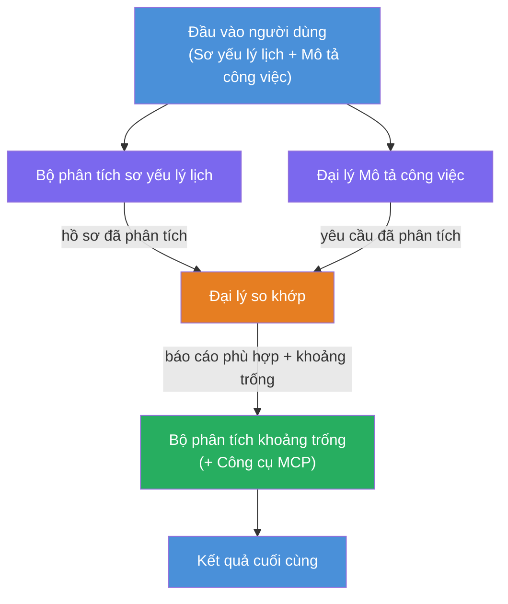
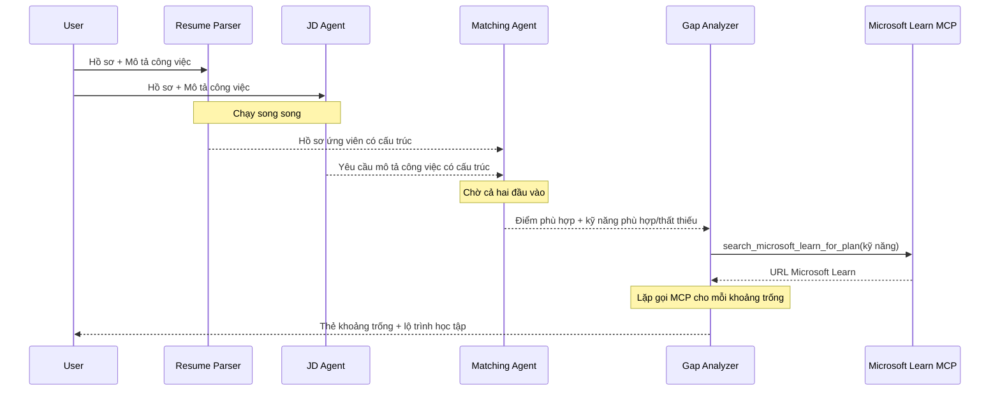
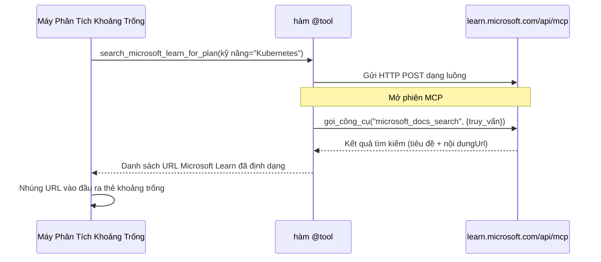

# Module 1 - Hiểu kiến trúc Đa tác nhân

Trong module này, bạn sẽ học kiến trúc của bộ Đánh giá Phù hợp CV → Công việc trước khi viết bất kỳ mã nào. Hiểu biểu đồ phối hợp, vai trò của các tác nhân, và dòng chảy dữ liệu là rất quan trọng để gỡ lỗi và mở rộng [luồng công việc đa tác nhân](https://learn.microsoft.com/azure/architecture/ai-ml/idea/multiple-agent-workflow-automation).

---

## Vấn đề mà điều này giải quyết

So khớp một CV với mô tả công việc bao gồm nhiều kỹ năng riêng biệt:

1. **Phân tích cú pháp** - Trích xuất dữ liệu có cấu trúc từ văn bản không cấu trúc (CV)
2. **Phân tích** - Trích xuất yêu cầu từ mô tả công việc
3. **So sánh** - Đánh giá điểm phù hợp giữa hai bên
4. **Lập kế hoạch** - Xây dựng lộ trình học tập để khắc phục các khoảng trống

Một tác nhân đơn lẻ thực hiện cả bốn nhiệm vụ trong một lời nhắc thường tạo ra:
- Trích xuất không đầy đủ (nó làm nhanh phần phân tích cú pháp để đến phần đánh giá)
- Đánh giá nông (không có phân tích dựa trên bằng chứng chi tiết)
- Lộ trình học tập chung chung (không phù hợp với các khoảng trống cụ thể)

Bằng cách chia thành **bốn tác nhân chuyên biệt**, mỗi tác nhân tập trung vào nhiệm vụ của mình với hướng dẫn riêng biệt, tạo ra kết quả chất lượng cao hơn ở mọi giai đoạn.

---

## Bốn tác nhân

Mỗi tác nhân là một tác nhân [Microsoft Foundry](https://learn.microsoft.com/azure/foundry/agents/concepts/hosted-agents) đầy đủ được tạo qua `AzureAIAgentClient.as_agent()`. Chúng dùng chung triển khai mô hình nhưng có hướng dẫn khác nhau và (tùy chọn) công cụ khác nhau.

| # | Tên tác nhân | Vai trò | Đầu vào | Đầu ra |
|---|--------------|---------|---------|---------|
| 1 | **ResumeParser** | Trích xuất hồ sơ có cấu trúc từ văn bản CV | Văn bản CV thô (từ người dùng) | Hồ sơ ứng viên, Kỹ năng kỹ thuật, Kỹ năng mềm, Chứng nhận, Kinh nghiệm lĩnh vực, Thành tích |
| 2 | **JobDescriptionAgent** | Trích xuất yêu cầu có cấu trúc từ mô tả công việc | Văn bản JD thô (từ người dùng, được chuyển qua ResumeParser) | Tổng quan vai trò, Kỹ năng yêu cầu, Kỹ năng ưu tiên, Kinh nghiệm, Chứng nhận, Giáo dục, Trách nhiệm |
| 3 | **MatchingAgent** | Tính điểm phù hợp dựa trên bằng chứng | Đầu ra từ ResumeParser + JobDescriptionAgent | Điểm phù hợp (0-100 kèm phân tích chi tiết), Kỹ năng phù hợp, Kỹ năng thiếu, Khoảng trống |
| 4 | **GapAnalyzer** | Xây dựng lộ trình học tập cá nhân hóa | Đầu ra từ MatchingAgent | Thẻ khoảng trống (theo kỹ năng), Thứ tự học, Thời gian, Tài nguyên từ Microsoft Learn |

---

## Biểu đồ phối hợp

Luồng công việc sử dụng **phân tách song song** rồi đến **tổng hợp tuần tự**:


> **Chú giải:** Màu tím = tác nhân chạy song song, Màu cam = điểm tổng hợp, Màu xanh = tác nhân cuối cùng với công cụ

### Dòng chảy dữ liệu


1. **Người dùng gửi** một tin nhắn chứa CV và mô tả công việc.
2. **ResumeParser** nhận toàn bộ đầu vào và trích xuất hồ sơ ứng viên có cấu trúc.
3. **JobDescriptionAgent** nhận đầu vào người dùng song song và trích xuất yêu cầu có cấu trúc.
4. **MatchingAgent** nhận đầu ra từ **cả hai** ResumeParser và JobDescriptionAgent (khung làm việc đợi cả hai hoàn thành trước khi chạy MatchingAgent).
5. **GapAnalyzer** nhận đầu ra của MatchingAgent và gọi **công cụ Microsoft Learn MCP** để lấy tài nguyên học tập thực tế cho từng khoảng trống.
6. **Đầu ra cuối cùng** là phản hồi của GapAnalyzer, bao gồm điểm phù hợp, thẻ khoảng trống, và lộ trình học tập hoàn chỉnh.

### Tại sao phân tách song song quan trọng

ResumeParser và JobDescriptionAgent chạy **song song** vì không bên nào phụ thuộc bên kia. Điều này:
- Giảm tổng độ trễ (cả hai chạy cùng lúc thay vì tuần tự)
- Là sự phân chia tự nhiên (phân tích CV và phân tích JD là những nhiệm vụ độc lập)
- Thể hiện mẫu phổ biến trong đa tác nhân: **phân tách → tổng hợp → hành động**

---

## WorkflowBuilder trong mã nguồn

Đây là cách biểu đồ trên ánh xạ đến các cuộc gọi API [`WorkflowBuilder`](https://learn.microsoft.com/agent-framework/workflows/agents-in-workflows) trong `main.py`:

```python
from agent_framework import WorkflowBuilder

workflow = (
    WorkflowBuilder(
        name="ResumeJobFitEvaluator",
        start_executor=resume_parser,       # Đại lý đầu tiên nhận đầu vào từ người dùng
        output_executors=[gap_analyzer],     # Đại lý cuối cùng mà đầu ra được trả về
    )
    .add_edge(resume_parser, jd_agent)      # ResumeParser → Đại lý Mô tả Công việc
    .add_edge(resume_parser, matching_agent) # ResumeParser → Đại lý Phù hợp
    .add_edge(jd_agent, matching_agent)      # Đại lý Mô tả Công việc → Đại lý Phù hợp
    .add_edge(matching_agent, gap_analyzer)  # Đại lý Phù hợp → Phân tích Khoảng cách
    .build()
)
```

**Hiểu các cạnh:**

| Cạnh | Ý nghĩa |
|-------|---------|
| `resume_parser → jd_agent` | JD Agent nhận đầu ra của ResumeParser |
| `resume_parser → matching_agent` | MatchingAgent nhận đầu ra của ResumeParser |
| `jd_agent → matching_agent` | MatchingAgent cũng nhận đầu ra của JD Agent (chờ cả hai) |
| `matching_agent → gap_analyzer` | GapAnalyzer nhận đầu ra của MatchingAgent |

Vì `matching_agent` có **hai cạnh vào** (`resume_parser` và `jd_agent`), khung làm việc tự động đợi cả hai hoàn thành trước khi chạy MatchingAgent.

---

## Công cụ MCP

Tác nhân GapAnalyzer có một công cụ là `search_microsoft_learn_for_plan`. Đây là một **[công cụ MCP](https://learn.microsoft.com/agent-framework/agents/tools/hosted-mcp-tools)** gọi API Microsoft Learn để lấy tài nguyên học tập được chọn lọc.

### Cách hoạt động

```python
@tool
async def search_microsoft_learn_for_plan(
    skill: str, role: str = "", max_results: int = 5
) -> str:
    """Search Microsoft Learn MCP and return curated official links."""
    # Kết nối đến https://learn.microsoft.com/api/mcp qua HTTP có thể truyền dòng
    # Gọi công cụ 'microsoft_docs_search' trên máy chủ MCP
    # Trả về danh sách được định dạng các URL của Microsoft Learn
```

### Luồng gọi MCP


1. GapAnalyzer quyết định cần tài nguyên học tập cho một kỹ năng (ví dụ: "Kubernetes")
2. Khung làm việc gọi `search_microsoft_learn_for_plan(skill="Kubernetes")`
3. Hàm mở kết nối [Streamable HTTP](https://learn.microsoft.com/agent-framework/agents/tools/hosted-mcp-tools) đến `https://learn.microsoft.com/api/mcp`
4. Nó gọi công cụ `microsoft_docs_search` trên [máy chủ MCP](https://learn.microsoft.com/azure/foundry/agents/how-to/tools/model-context-protocol)
5. Máy chủ MCP trả về kết quả tìm kiếm (tiêu đề + URL)
6. Hàm định dạng kết quả và trả về dưới dạng chuỗi
7. GapAnalyzer sử dụng các URL trả về trong đầu ra thẻ khoảng trống

### Nhật ký MCP mong đợi

Khi công cụ chạy, bạn sẽ thấy các mục nhật ký như:

```
GET https://learn.microsoft.com/api/mcp → 405 (Method Not Allowed)
POST https://learn.microsoft.com/api/mcp → 200
DELETE https://learn.microsoft.com/api/mcp → 405 (Method Not Allowed)
```

**Đây là bình thường.** Máy khách MCP khám phá với GET và DELETE trong lúc khởi tạo - các trả về 405 là hành vi mong đợi. Cuộc gọi công cụ thực sự dùng POST và trả về 200. Chỉ lo nếu các cuộc gọi POST thất bại.

---

## Mẫu tạo tác nhân

Mỗi tác nhân được tạo bằng **trình quản lý ngữ cảnh bất đồng bộ [`AzureAIAgentClient.as_agent()`](https://learn.microsoft.com/python/api/overview/azure/ai-agents-readme)**. Đây là mẫu SDK Foundry để tạo tác nhân được tự động dọn dẹp:

```python
async with (
    get_credential() as credential,
    AzureAIAgentClient(
        project_endpoint=PROJECT_ENDPOINT,
        model_deployment_name=MODEL_DEPLOYMENT_NAME,
        credential=credential,
    ).as_agent(
        name="ResumeParser",
        instructions=RESUME_PARSER_INSTRUCTIONS,
    ) as resume_parser,
    # ... lặp lại cho mỗi đại lý ...
):
    # Tất cả 4 đại lý đều tồn tại ở đây
    workflow = create_workflow(resume_parser, jd_agent, matching_agent, gap_analyzer)
```

**Điểm chính:**
- Mỗi tác nhân có một đối tượng `AzureAIAgentClient` riêng biệt (SDK yêu cầu tên tác nhân phải gắn với client)
- Tất cả các tác nhân chia sẻ cùng `credential`, `PROJECT_ENDPOINT`, và `MODEL_DEPLOYMENT_NAME`
- Khối `async with` đảm bảo tất cả tác nhân được dọn dẹp khi server tắt
- GapAnalyzer ngoài ra nhận `tools=[search_microsoft_learn_for_plan]`

---

## Khởi động server

Sau khi tạo tác nhân và xây dựng luồng công việc, server bắt đầu:

```python
from azure.ai.agentserver.agentframework import from_agent_framework

agent = create_workflow(resume_parser, jd_agent, matching_agent, gap_analyzer)
await from_agent_framework(agent).run_async()
```

`from_agent_framework()` đóng gói luồng công việc như một server HTTP mở endpoint `/responses` trên cổng 8088. Đây là mẫu tương tự Lab 01, nhưng "tác nhân" giờ là toàn bộ [biểu đồ luồng công việc](https://learn.microsoft.com/agent-framework/workflows/as-agents).

---

### Kiểm tra

- [ ] Bạn hiểu kiến trúc 4 tác nhân và vai trò của từng tác nhân
- [ ] Bạn có thể theo dõi dòng chảy dữ liệu: Người dùng → ResumeParser → (song song) JD Agent + MatchingAgent → GapAnalyzer → Đầu ra
- [ ] Bạn hiểu vì sao MatchingAgent chờ cả ResumeParser và JD Agent (hai cạnh vào)
- [ ] Bạn hiểu công cụ MCP: nó làm gì, cách gọi, và rằng nhật ký GET 405 là bình thường
- [ ] Bạn hiểu mẫu `AzureAIAgentClient.as_agent()` và lý do mỗi tác nhân có một đối tượng client riêng
- [ ] Bạn có thể đọc mã `WorkflowBuilder` và ánh xạ nó với biểu đồ trực quan

---

**Trước đó:** [00 - Yêu cầu trước](00-prerequisites.md) · **Tiếp:** [02 - Khung dự án đa tác nhân →](02-scaffold-multi-agent.md)

---

<!-- CO-OP TRANSLATOR DISCLAIMER START -->
**Tuyên bố miễn trừ trách nhiệm**:  
Tài liệu này đã được dịch bằng dịch vụ dịch thuật AI [Co-op Translator](https://github.com/Azure/co-op-translator). Mặc dù chúng tôi cố gắng đảm bảo độ chính xác, xin lưu ý rằng các bản dịch tự động có thể chứa lỗi hoặc không chính xác. Tài liệu gốc bằng ngôn ngữ bản địa nên được coi là nguồn chính xác nhất. Đối với các thông tin quan trọng, nên sử dụng dịch thuật bởi con người chuyên nghiệp. Chúng tôi không chịu trách nhiệm đối với bất kỳ sự hiểu lầm hoặc diễn giải sai nào phát sinh từ việc sử dụng bản dịch này.
<!-- CO-OP TRANSLATOR DISCLAIMER END -->