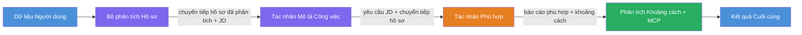

# Module 1 - Hiểu về Kiến trúc

⏱️ ~5 phút

Trước khi viết bất kỳ mã nào, đây là tóm tắt nhanh về những gì bạn sẽ xây dựng và cách nó hoạt động.

---

## Những gì bạn sẽ xây dựng

Bạn dán vào một **sơ yếu lý lịch** và một **mô tả công việc**. Quy trình sẽ trả về:

- Điểm phù hợp (0–100 kèm phân tích chi tiết)
- Danh sách các kỹ năng và chứng chỉ còn thiếu
- Lộ trình học tập cá nhân hóa kèm liên kết Microsoft Learn cho mỗi thiếu sót

---

## Bốn tác nhân

Một tác nhân duy nhất cố gắng phân tích, đánh giá và lên kế hoạch cùng một lúc thường làm nhanh và cho kết quả nông. Việc chia công việc cho bốn tác nhân chuyên biệt sẽ cho kết quả tốt hơn:

| Tác nhân | Công việc thực hiện |
|-------|-------------|
| **ResumeParser** | Phân tích sơ yếu lý lịch; sao chép nguyên văn JD vào `[JOB DESCRIPTION PASS-THROUGH]` cho các tác nhân phía sau |
| **JobDescriptionAgent** | Trích xuất yêu cầu JD từ pass-through; chuyển tiếp `[PARSED RESUME]` thành `[PARSED RESUME PASS-THROUGH]` |
| **MatchingAgent** | So sánh hai phần đã gán nhãn; tạo điểm phù hợp 0–100 và danh sách thiếu sót |
| **GapAnalyzer** | Xây dựng lộ trình học tập; tìm kiếm Microsoft Learn cho mỗi thiếu sót |

---

## Sơ đồ phối hợp

Quy trình là một **dòng truyền tuần tự** - mỗi tác nhân chuyển kết quả đầu ra cho tác nhân tiếp theo:


```mermaid
flowchart LR
    A["Dữ liệu Người dùng"] --> B["Bộ phân tích Hồ sơ"]
    B -- "chuyển tiếp hồ sơ đã phân tích + JD" --> C["Tác nhân Mô tả Công việc"]
    C -- "yêu cầu JD + chuyển tiếp hồ sơ" --> D["Tác nhân Phù hợp"]
    D -- "báo cáo phù hợp + khoảng cách" --> E["Phân tích Khoảng cách + MCP"]
    E --> F["Kết quả Cuối cùng"]

    style A fill:#4A90D9,color:#fff
    style B fill:#7B68EE,color:#fff
    style C fill:#7B68EE,color:#fff
    style D fill:#E67E22,color:#fff
    style E fill:#27AE60,color:#fff
    style F fill:#4A90D9,color:#fff
```

1. **ResumeParser** nhận dữ liệu người dùng, phân tích sơ yếu lý lịch, và sao chép JD vào `[JOB DESCRIPTION PASS-THROUGH]`.
2. **JD Agent** trích xuất các yêu cầu có cấu trúc và chuyển tiếp `[PARSED RESUME PASS-THROUGH]` về phía trước.
3. **MatchingAgent** so sánh hai phần và tạo điểm phù hợp cùng danh sách thiếu sót.
4. **GapAnalyzer** xây dựng lộ trình và gọi công cụ Microsoft Learn MCP cho mỗi thiếu sót.

---

## Cách điều này được ánh xạ tới mã nguồn

Trong `main.py`, bạn mô tả sơ đồ này bằng `WorkflowBuilder`:

```python
workflow_agent = (
    WorkflowBuilder(
        start_executor=resume_executor,       # đại lý đầu tiên nhận đầu vào của người dùng
        output_executors=[gap_executor],      # đại lý cuối cùng - đầu ra của nó là phản hồi
    )
    .add_edge(resume_executor, jd_executor)       # ResumeParser → Đại lý JD
    .add_edge(jd_executor, matching_executor)     # Đại lý JD → MatchingAgent
    .add_edge(matching_executor, gap_executor)    # MatchingAgent → GapAnalyzer
    .build()
    .as_agent()
)
```

Mỗi `Agent` được bao bọc trong `AgentExecutor`. Các lệnh gọi `add_edge()` định nghĩa dòng truyền dữ liệu tuần tự nghiêm ngặt - mỗi tác nhân chỉ nhận đầu ra của tác nhân trực tiếp trước nó.

> `context_mode="last_agent"` nghĩa là mỗi executor chỉ thấy đầu ra của tác nhân kế trước trực tiếp. ResumeParser và JD Agent chuyển tiếp dữ liệu trong các phần được đánh nhãn để mỗi tác nhân phía sau có đúng những gì nó cần.

---

## Công cụ MCP

GapAnalyzer có một công cụ: `search_microsoft_learn_for_plan`. Nó kết nối tới `https://learn.microsoft.com/api/mcp` và trả về các liên kết Microsoft Learn thực tế cho từng thiếu sót kỹ năng.

Khi công cụ chạy, bạn sẽ thấy các nhật ký này - tất cả đều như mong đợi:

```
GET  https://learn.microsoft.com/api/mcp → 405   ← connection probe, normal
POST https://learn.microsoft.com/api/mcp → 200   ← actual tool call
DELETE https://learn.microsoft.com/api/mcp → 405 ← cleanup probe, normal
```

Chỉ cần quan tâm nếu lệnh `POST` trả về lỗi.

---

**Trước đó:** [00 - Prerequisites](00-prerequisites.md) · **Tiếp theo:** [02 - Scaffold the Project →](02-scaffold-multi-agent.md)

---

<!-- CO-OP TRANSLATOR DISCLAIMER START -->
**Tuyên bố miễn trừ trách nhiệm**:
Tài liệu này đã được dịch bằng dịch vụ dịch thuật AI [Co-op Translator](https://github.com/Azure/co-op-translator). Mặc dù chúng tôi cố gắng đảm bảo độ chính xác, xin lưu ý rằng bản dịch tự động có thể chứa lỗi hoặc sai sót. Tài liệu gốc bằng ngôn ngữ gốc nên được coi là nguồn tin chính thức. Đối với thông tin quan trọng, nên sử dụng dịch vụ dịch thuật chuyên nghiệp bởi con người. Chúng tôi không chịu trách nhiệm về bất kỳ hiểu lầm hoặc giải thích sai nào phát sinh từ việc sử dụng bản dịch này.
<!-- CO-OP TRANSLATOR DISCLAIMER END -->