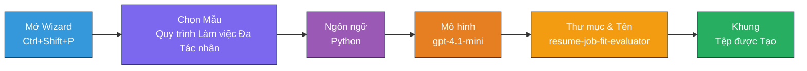
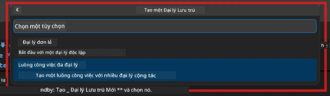

# Module 2 - Dựng khung Dự án Multi-Agent

Trong module này, bạn sử dụng [tiện ích mở rộng Microsoft Foundry](https://marketplace.visualstudio.com/items?itemName=TeamsDevApp.vscode-ai-foundry) để **dựng khung một dự án quy trình làm việc đa đại lý**. Tiện ích tạo ra toàn bộ cấu trúc dự án - `agent.yaml`, `main.py`, `Dockerfile`, `requirements.txt`, `.env` và cấu hình gỡ lỗi. Sau đó bạn sẽ tùy chỉnh các tập tin này trong Module 3 và 4.

> **Lưu ý:** Thư mục `PersonalCareerCopilot/` trong bài lab này là ví dụ hoàn chỉnh, hoạt động của một dự án đa đại lý được tùy chỉnh. Bạn có thể dựng khung một dự án mới (khuyến khích để học) hoặc nghiên cứu mã nguồn hiện có trực tiếp.

---

## Bước 1: Mở trình tạo tác nhân được lưu trữ


1. Nhấn `Ctrl+Shift+P` để mở **Command Palette**.
2. Nhập: **Microsoft Foundry: Create a New Hosted Agent** và chọn nó.
3. Trình tạo tác nhân được lưu trữ sẽ mở ra.

> **Phương án khác:** Nhấn vào biểu tượng **Microsoft Foundry** trên thanh Activity Bar → nhấn biểu tượng **+** bên cạnh **Agents** → **Create New Hosted Agent**.

---

## Bước 2: Chọn mẫu quy trình làm việc Multi-Agent

Trình tạo sẽ yêu cầu bạn chọn một mẫu:

| Mẫu | Mô tả | Khi nào dùng |
|----------|-------------|-------------|
| Single Agent | Một tác nhân với hướng dẫn và công cụ tùy chọn | Lab 01 |
| **Multi-Agent Workflow** | Nhiều tác nhân hợp tác qua WorkflowBuilder | **Bài lab này (Lab 02)** |

1. Chọn **Multi-Agent Workflow**.
2. Nhấn **Next**.



---

## Bước 3: Chọn ngôn ngữ lập trình

1. Chọn **Python**.
2. Nhấn **Next**.

---

## Bước 4: Chọn mô hình của bạn

1. Trình tạo sẽ hiển thị các mô hình đã triển khai trong dự án Foundry của bạn.
2. Chọn cùng mô hình bạn đã dùng ở Lab 01 (ví dụ: **gpt-4.1-mini**).
3. Nhấn **Next**.

> **Mẹo:** [`gpt-4.1-mini`](https://learn.microsoft.com/azure/foundry/foundry-models/concepts/models-sold-directly-by-azure#gpt-41-series) được khuyến nghị để phát triển – nhanh, giá rẻ và xử lý quy trình đa đại lý tốt. Chuyển sang `gpt-4.1` để triển khai sản xuất cuối cùng nếu bạn muốn đầu ra chất lượng cao hơn.

---

## Bước 5: Chọn vị trí thư mục và tên tác nhân

1. Hộp thoại tập tin sẽ mở. Chọn thư mục đích:
   - Nếu bạn đi theo repo workshop: điều hướng tới `workshop/lab02-multi-agent/` và tạo thư mục con mới
   - Nếu bắt đầu mới: chọn bất kỳ thư mục nào
2. Nhập **tên** cho tác nhân được lưu trữ (ví dụ: `resume-job-fit-evaluator`).
3. Nhấn **Create**.

---

## Bước 6: Chờ quá trình dựng khung hoàn thành

1. VS Code mở cửa sổ mới (hoặc cập nhật cửa sổ hiện tại) với dự án được dựng khung.
2. Bạn sẽ thấy cấu trúc tập tin như sau:

```
resume-job-fit-evaluator/
├── .env                ← Environment variables (placeholders)
├── .vscode/
│   └── launch.json     ← Debug configuration
├── agent.yaml          ← Agent definition (kind: hosted)
├── Dockerfile          ← Container configuration
├── main.py             ← Multi-agent workflow code (scaffold)
└── requirements.txt    ← Python dependencies
```

> **Ghi chú workshop:** Trong repo workshop, thư mục `.vscode/` nằm tại **gốc workspace** với các tập tin `launch.json` và `tasks.json` chung. Cấu hình gỡ lỗi cho Lab 01 và Lab 02 đều được bao gồm. Khi bạn nhấn F5, chọn **"Lab02 - Multi-Agent"** từ danh sách.

---

## Bước 7: Hiểu các tập tin được dựng khung (đặc thù multi-agent)

Dựng khung đa tác nhân khác với dựng khung một tác nhân ở một số điểm chính:

### 7.1 `agent.yaml` - Định nghĩa tác nhân

```yaml
kind: hosted
name: resume-job-fit-evaluator
description: >
  A multi-agent workflow that evaluates resume-to-job fit.
metadata:
  authors:
    - Microsoft
  tags:
    - Multi-Agent Workflow
    - Resume Evaluator
protocols:
  - protocol: responses
    version: v1
environment_variables:
  - name: PROJECT_ENDPOINT
    value: ${PROJECT_ENDPOINT}
  - name: MODEL_DEPLOYMENT_NAME
    value: ${MODEL_DEPLOYMENT_NAME}
```

**Khác biệt chính với Lab 01:** Phần `environment_variables` có thể bao gồm các biến bổ sung cho điểm cuối MCP hoặc cấu hình công cụ khác. `name` và `description` phản ánh trường hợp sử dụng đa tác nhân.

### 7.2 `main.py` - Mã quy trình đa tác nhân

Dựng khung bao gồm:
- **Nhiều chuỗi chỉ dẫn cho các tác nhân** (mỗi tác nhân một hằng số)
- **Nhiều context manager [`AzureAIAgentClient.as_agent()`](https://learn.microsoft.com/python/api/overview/azure/ai-agents-readme)** (mỗi tác nhân một cái)
- **[`WorkflowBuilder`](https://learn.microsoft.com/agent-framework/workflows/agents-in-workflows)** để kết nối các tác nhân với nhau
- **`from_agent_framework()`** để phục vụ quy trình làm việc như một điểm cuối HTTP

```python
from agent_framework import WorkflowBuilder, tool
from agent_framework.azure import AzureAIAgentClient
from azure.ai.agentserver.agentframework import from_agent_framework
```

Phần import thêm [`WorkflowBuilder`](https://learn.microsoft.com/agent-framework/workflows/agents-in-workflows) là mới so với Lab 01.

### 7.3 `requirements.txt` - Các phụ thuộc bổ sung

Dự án đa tác nhân sử dụng các gói cơ bản giống Lab 01, cộng thêm các gói liên quan MCP:

```
agent-framework-azure-ai==1.0.0rc3
agent-framework-core==1.0.0rc3
azure-ai-agentserver-agentframework==1.0.0b16
azure-ai-agentserver-core==1.0.0b16
debugpy
agent-dev-cli --pre
```

> **Lưu ý phiên bản quan trọng:** Gói `agent-dev-cli` yêu cầu flag `--pre` trong `requirements.txt` để cài đặt phiên bản xem trước mới nhất. Điều này cần thiết cho tương thích Agent Inspector với `agent-framework-core==1.0.0rc3`. Xem [Module 8 - Khắc phục sự cố](08-troubleshooting.md) để biết chi tiết phiên bản.

| Gói | Phiên bản | Mục đích |
|---------|---------|---------|
| [`agent-framework-azure-ai`](https://learn.microsoft.com/agent-framework/overview/) | `1.0.0rc3` | Tích hợp Azure AI cho [Microsoft Agent Framework](https://github.com/microsoft/agent-framework) |
| [`agent-framework-core`](https://learn.microsoft.com/agent-framework/overview/) | `1.0.0rc3` | Runtime lõi (bao gồm WorkflowBuilder) |
| `azure-ai-agentserver-agentframework` | `1.0.0b16` | Runtime máy chủ tác nhân được lưu trữ |
| `azure-ai-agentserver-core` | `1.0.0b16` | Trừu tượng máy chủ tác nhân lõi |
| `debugpy` | phiên bản mới nhất | Gỡ lỗi Python (F5 trong VS Code) |
| `agent-dev-cli` | `--pre` | CLI phát triển cục bộ + backend Agent Inspector |

### 7.4 `Dockerfile` - Giống Lab 01

Dockerfile giống hệt với Lab 01 - sao chép tập tin, cài đặt phụ thuộc từ `requirements.txt`, mở cổng 8088 và chạy `python main.py`.

```dockerfile
FROM python:3.14-slim
WORKDIR /app
COPY ./ .
RUN pip install --upgrade pip && \
    if [ -f requirements.txt ]; then \
        pip install -r requirements.txt; \
    else \
      echo "No requirements.txt found" >&2; exit 1; \
    fi
EXPOSE 8088
CMD ["python", "main.py"]
```

---

### Điểm kiểm tra

- [ ] Trình tạo dựng khung hoàn thành → cấu trúc dự án mới hiển thị
- [ ] Bạn có thể thấy tất cả các tập tin: `agent.yaml`, `main.py`, `Dockerfile`, `requirements.txt`, `.env`
- [ ] `main.py` có dòng import `WorkflowBuilder` (xác nhận mẫu multi-agent đã được chọn)
- [ ] `requirements.txt` có cả `agent-framework-core` và `agent-framework-azure-ai`
- [ ] Bạn hiểu cách dựng khung đa tác nhân khác với dựng khung đơn tác nhân (nhiều tác nhân, WorkflowBuilder, công cụ MCP)

---

**Trước:** [01 - Hiểu Kiến trúc Multi-Agent](01-understand-multi-agent.md) · **Tiếp:** [03 - Cấu hình Tác nhân & Môi trường →](03-configure-agents.md)

---

<!-- CO-OP TRANSLATOR DISCLAIMER START -->
**Tuyên bố từ chối trách nhiệm**:  
Tài liệu này đã được dịch bằng dịch vụ dịch thuật AI [Co-op Translator](https://github.com/Azure/co-op-translator). Trong khi chúng tôi cố gắng đảm bảo độ chính xác, xin lưu ý rằng bản dịch tự động có thể chứa lỗi hoặc không chính xác. Tài liệu gốc bằng ngôn ngữ bản địa nên được xem là nguồn thông tin chính thống. Đối với thông tin quan trọng, nên sử dụng dịch vụ dịch thuật chuyên nghiệp do con người thực hiện. Chúng tôi không chịu trách nhiệm về bất kỳ sự hiểu lầm hoặc giải thích sai nào phát sinh từ việc sử dụng bản dịch này.
<!-- CO-OP TRANSLATOR DISCLAIMER END -->