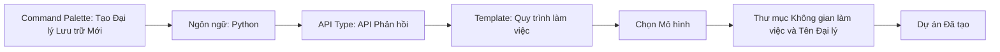
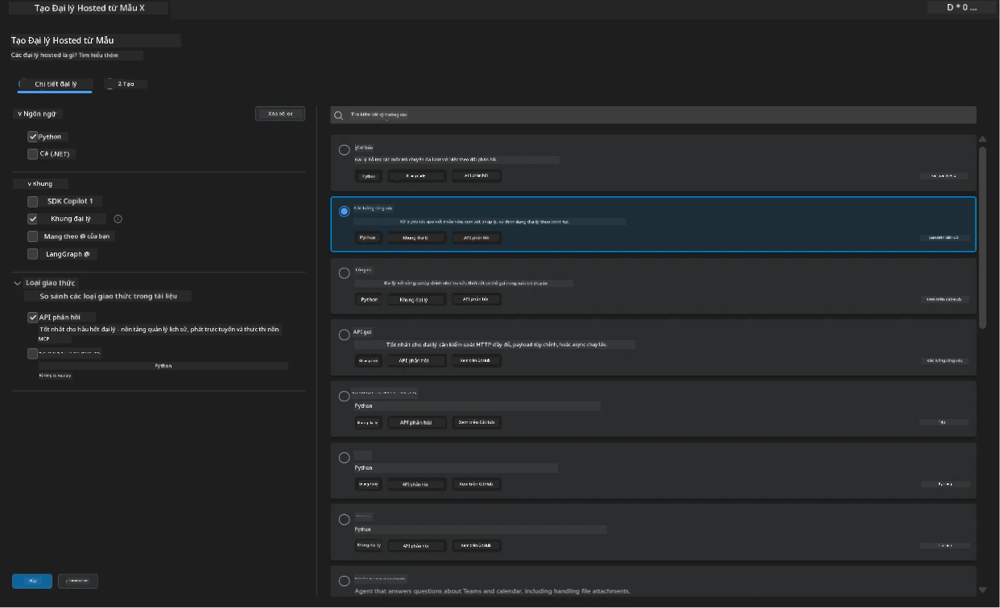
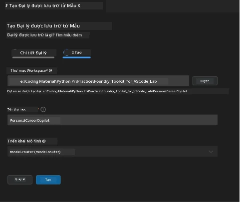

# Mô-đun 2 - Tạo khung dự án đa tác nhân

⏱️ ~5 phút

Trong mô-đun này, bạn sẽ sử dụng [Foundry Toolkit cho VS Code](https://aka.ms/foundrytk) để **tạo khung cho một dự án đa tác nhân**. Trình hướng dẫn sẽ tạo các file `agent.yaml`, `main.py`, `Dockerfile`, `requirements.txt`, `.env`, và cấu hình gỡ lỗi VS Code - để bạn có thể tập trung vào việc kết nối workflow 4 tác nhân trong Mô-đun 3.

> **Khái niệm chính:** Khung dự án là một bản stub hoạt động với một tác nhân. Bạn sẽ thay thế logic giữ chỗ này bằng đồ thị `WorkflowBuilder` trong Mô-đun 3. Bạn không phải viết mã nền từ đầu.

> **Triển khai tham khảo:** [`PersonalCareerCopilot/`](../../../../../workshop/lab02-multi-agent/PersonalCareerCopilot) là ví dụ hoàn chỉnh hoạt động. Sử dụng nó để so sánh công việc của bạn khi làm.

### Quy trình trình hướng dẫn tạo khung


```mermaid
flowchart LR
    A[Command Palette: Tạo Đại lý Lưu trữ Mới] --> B[Ngôn ngữ: Python]
    B --> C[API Type: API Phản hồi]
    C --> D[Template: Quy trình làm việc]
    D --> E[Chọn Mô hình]
    E --> F[Thư mục Không gian làm việc và Tên Đại lý]
    F --> G[Dự án Đã tạo]
```

---

## Bước 1: Mở trình hướng dẫn Tạo Tác nhân Hosted

1. Nhấn `Ctrl+Shift+P` để mở **Bảng lệnh**.
2. Gõ: **Foundry Toolkit: Create a New Hosted Agent** và chọn mục đó.
3. Trình hướng dẫn sẽ mở tab **Chi tiết Tác nhân**.

> **Phương án thay thế:** Nhấn vào biểu tượng **Foundry Toolkit** trên Thanh Hoạt động → nhấn biểu tượng **+** bên cạnh **Hosted Agents** → **Create New Hosted Agent**.

---

## Bước 2: Chọn cài đặt



1. Ở phần điều hướng/lựa chọn bên trái, chọn các mục sau:

| Menu | Lựa chọn | Ghi chú |
|--------|-----------|-------|
| **Ngôn ngữ** | Python | C# (.NET) cũng được hỗ trợ |
| **Framework** | Agent Framework | Cung cấp `Agent`, `AgentExecutor`, `WorkflowBuilder` |
| **Loại API** | Response API | `POST /responses` - lịch sử do nền tảng quản lý, hỗ trợ streaming |
| **Mẫu** | **Workflows** | Xử lý các yêu cầu qua nhiều tác nhân theo tuần tự |

2. Khi đã chọn xong, nhấn **Tiếp theo**



3. Ở cửa sổ tiếp theo, chọn các mục sau:

| Menu | Lựa chọn | Ghi chú |
|--------|-----------|-------|
| **Thư mục làm việc** | Duyệt đến thư mục mục tiêu | ví dụ, `workshop/lab02-multi-agent/` trong repo này |
| **Tên tác nhân** | `PersonalCareerCopilot` | Đây sẽ là tên thư mục dự án |
| **Triển khai Mô hình** | Chọn mô hình đã triển khai | ví dụ, `gpt-4.1-mini` từ Lab 01 |

4. Nhấn **Tạo** để tạo khung dự án. VS Code sẽ tạo các file và mở thư mục đó.

> **Mẹo:** [`gpt-4.1-mini`](https://learn.microsoft.com/azure/foundry/foundry-models/concepts/models-sold-directly-by-azure#gpt-41-series) cân bằng tốt giữa tốc độ và chất lượng cho phát triển đa tác nhân.

---

## Bước 3: Kiểm tra dự án sau khi tạo khung

Sau khi tạo khung xong, xác nhận bạn thấy các file sau trong Explorer (`Ctrl+Shift+E`):

```
📂 <your-agent-name>/
├── .azdignore          ← Files excluded from Azure Developer CLI deployments
├── .dockerignore       ← Files excluded from Docker builds
├── .env                ← Environment variables (placeholders - fill in Module 3)
├── .vscode/
│   ├── launch.json     ← Debug config (F5 → run + Agent Inspector)
│   └── tasks.json      ← VS Code task definitions
├── agent.yaml          ← Agent definition (kind: hosted, protocol: responses)
├── Dockerfile          ← Container config for deployment
├── main.py             ← Stub agent entry point (replace with WorkflowBuilder in Module 3)
└── requirements.txt    ← Python dependencies
```

> **Quan trọng:** Mở trực tiếp thư mục tạo khung này trong VS Code để `.vscode/launch.json` và `tasks.json` được áp dụng chính xác khi gỡ lỗi F5.

### Giải thích các file chính

| File | Mục đích |
|------|---------|
| `agent.yaml` | Khai báo `kind: hosted`, ánh xạ biến môi trường, định nghĩa giao thức `/responses` |
| `main.py` | Stub: một `FoundryChatClient` → `Agent` → `ResponsesHostServer`. Bạn sẽ thay bằng 4 tác nhân + `WorkflowBuilder` trong Mô-đun 3 |
| `Dockerfile` | `python:3.12-slim`, cài đặt `requirements.txt`, mở cổng 8088, chạy `python main.py` |
| `requirements.txt` | `agent-framework-foundry`, `agent-framework-foundry-hosting`, `mcp<2,>=1.24.0`, `debugpy` |

> **Tham khảo:** Xem [`PersonalCareerCopilot/agent.yaml`](../../../../../workshop/lab02-multi-agent/PersonalCareerCopilot/agent.yaml) và [`PersonalCareerCopilot/requirements.txt`](../../../../../workshop/lab02-multi-agent/PersonalCareerCopilot/requirements.txt) để biết nội dung đầy đủ.

---

### ✅ Điểm kiểm tra

- [ ] Hoàn thành trình hướng dẫn tạo khung - thư mục dự án mới hiển thị trong Explorer
- [ ] Tất cả file cần thiết có mặt: `agent.yaml`, `main.py`, `Dockerfile`, `requirements.txt`, `.env`
- [ ] `agent.yaml` có `kind: hosted` và `protocol: responses`
- [ ] `main.py` import `Agent`, `FoundryChatClient`, `ResponsesHostServer`
- [ ] Thư mục tạo khung được mở làm root workspace VS Code
- [ ] Bạn hiểu `main.py` chỉ là stub - `WorkflowBuilder` sẽ được thêm trong Mô-đun 3

---

**Trước:** [01 - Hiểu Kiến trúc Đa tác nhân](01-understand-multi-agent.md) · **Tiếp:** [03 - Cấu hình Tác nhân & Môi trường →](03-configure-agents.md)

---

<!-- CO-OP TRANSLATOR DISCLAIMER START -->
**Tuyên bố miễn trừ trách nhiệm**:
Tài liệu này đã được dịch bằng dịch vụ dịch thuật AI [Co-op Translator](https://github.com/Azure/co-op-translator). Mặc dù chúng tôi cố gắng đảm bảo độ chính xác, xin lưu ý rằng bản dịch tự động có thể chứa lỗi hoặc sai sót. Tài liệu gốc bằng ngôn ngữ gốc nên được coi là nguồn tin chính thức. Đối với thông tin quan trọng, nên sử dụng dịch vụ dịch thuật chuyên nghiệp bởi con người. Chúng tôi không chịu trách nhiệm về bất kỳ hiểu lầm hoặc giải thích sai nào phát sinh từ việc sử dụng bản dịch này.
<!-- CO-OP TRANSLATOR DISCLAIMER END -->