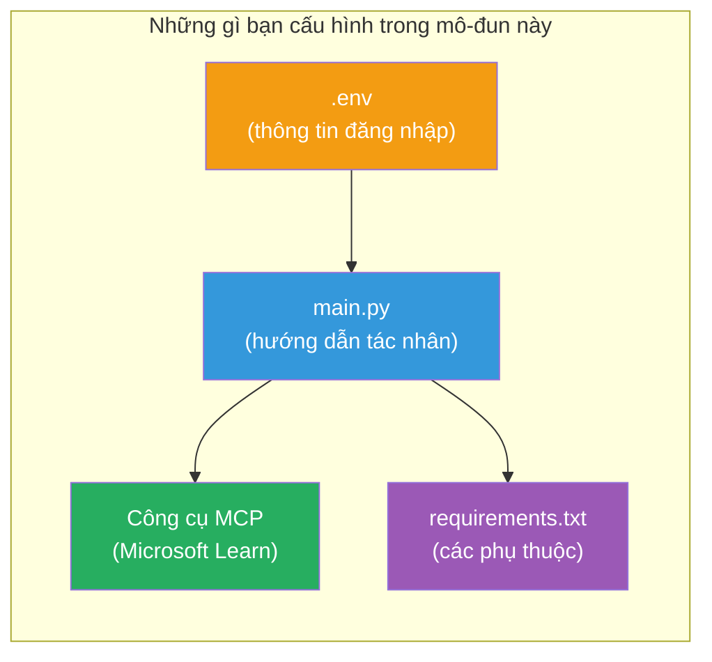

# Module 3 - Cấu hình Agents, Công cụ MCP & Môi trường

Trong module này, bạn sẽ tùy chỉnh dự án đa agent được tạo sẵn. Bạn sẽ viết hướng dẫn cho cả bốn agent, thiết lập công cụ MCP cho Microsoft Learn, cấu hình biến môi trường và cài đặt các phụ thuộc.


> **Tham khảo:** Mã nguồn hoàn chỉnh có trong [`PersonalCareerCopilot/main.py`](../../../../../workshop/lab02-multi-agent/PersonalCareerCopilot/main.py). Hãy dùng nó làm tham khảo khi xây dựng của riêng bạn.

---

## Bước 1: Cấu hình biến môi trường

1. Mở file **`.env`** trong thư mục gốc dự án của bạn.
2. Điền thông tin chi tiết dự án Foundry của bạn:

   ```env
   PROJECT_ENDPOINT=https://<your-account>.services.ai.azure.com/api/projects/<your-project>
   MODEL_DEPLOYMENT_NAME=gpt-4.1-mini
   ```

3. Lưu file.

### Nơi tìm các giá trị này

| Giá trị | Cách tìm |
|---------|----------|
| **Project endpoint** | Thanh bên Microsoft Foundry → nhấp vào dự án của bạn → URL endpoint trong phần chi tiết |
| **Model deployment name** | Thanh bên Foundry → mở rộng dự án → **Models + endpoints** → tên bên cạnh mô hình đã triển khai |

> **Bảo mật:** Không bao giờ commit `.env` lên hệ thống quản lý mã nguồn. Thêm nó vào `.gitignore` nếu chưa có.

### Bản đồ biến môi trường

`main.py` của đa agent đọc cả tên biến môi trường chuẩn và tên biến đặc thù cho workshop:

```python
PROJECT_ENDPOINT = os.getenv("AZURE_AI_PROJECT_ENDPOINT") or os.getenv("PROJECT_ENDPOINT")
MODEL_DEPLOYMENT_NAME = os.getenv(
    "AZURE_AI_MODEL_DEPLOYMENT_NAME",
    os.getenv("MODEL_DEPLOYMENT_NAME", "gpt-4.1-mini"),
)
MICROSOFT_LEARN_MCP_ENDPOINT = os.getenv(
    "MICROSOFT_LEARN_MCP_ENDPOINT", "https://learn.microsoft.com/api/mcp"
)
```

Endpoint MCP có giá trị mặc định hợp lý - bạn không cần thiết lập trong `.env` trừ khi muốn ghi đè.

---

## Bước 2: Viết hướng dẫn cho agent

Đây là bước quan trọng nhất. Mỗi agent cần những hướng dẫn được soạn kỹ càng định nghĩa vai trò, định dạng đầu ra và quy tắc. Mở `main.py` và tạo (hoặc chỉnh sửa) các hằng số hướng dẫn.

### 2.1 Resume Parser Agent

```python
RESUME_PARSER_INSTRUCTIONS = """\
You are the Resume Parser.
Extract resume text into a compact, structured profile for downstream matching.

Output exactly these sections:
1) Candidate Profile
2) Technical Skills (grouped categories)
3) Soft Skills
4) Certifications & Awards
5) Domain Experience
6) Notable Achievements

Rules:
- Use only explicit or strongly implied evidence.
- Do not invent skills, titles, or experience.
- Keep concise bullets; no long paragraphs.
- If input is not a resume, return a short warning and request resume text.
"""
```

**Tại sao là các phần này?** MatchingAgent cần dữ liệu có cấu trúc để đánh giá. Các phần nhất quán giúp chuyển giao giữa các agent đáng tin cậy.

### 2.2 Job Description Agent

```python
JOB_DESCRIPTION_INSTRUCTIONS = """\
You are the Job Description Analyst.
Extract a structured requirement profile from a JD.

Output exactly these sections:
1) Role Overview
2) Required Skills
3) Preferred Skills
4) Experience Required
5) Certifications Required
6) Education
7) Domain / Industry
8) Key Responsibilities

Rules:
- Keep required vs preferred clearly separated.
- Only use what the JD states; do not invent hidden requirements.
- Flag vague requirements briefly.
- If input is not a JD, return a short warning and request JD text.
"""
```

**Tại sao tách kỹ năng bắt buộc và ưu tiên?** MatchingAgent dùng trọng số khác nhau cho mỗi loại (Kỹ năng bắt buộc = 40 điểm, Kỹ năng ưu tiên = 10 điểm).

### 2.3 Matching Agent

```python
MATCHING_AGENT_INSTRUCTIONS = """\
You are the Matching Agent.
Compare parsed resume output vs JD output and produce an evidence-based fit report.

Scoring (100 total):
- Required Skills 40
- Experience 25
- Certifications 15
- Preferred Skills 10
- Domain Alignment 10

Output exactly these sections:
1) Fit Score (with breakdown math)
2) Matched Skills
3) Missing Skills
4) Partially Matched
5) Experience Alignment
6) Certification Gaps
7) Overall Assessment

Rules:
- Be objective and evidence-only.
- Keep partial vs missing separate.
- Keep Missing Skills precise; it feeds roadmap planning.
"""
```

**Tại sao điểm số rõ ràng?** Điểm số có thể tái tạo giúp so sánh kết quả và gỡ lỗi dễ dàng. Thang điểm 100 rất dễ hiểu với người dùng cuối.

### 2.4 Gap Analyzer Agent

```python
GAP_ANALYZER_INSTRUCTIONS = """\
You are the Gap Analyzer and Roadmap Planner.
Create a practical upskilling plan from the matching report.

Microsoft Learn MCP usage (required):
- For EVERY High and Medium priority gap, call tool `search_microsoft_learn_for_plan`.
- Use returned Learn links in Suggested Resources.
- Prefer Microsoft Learn for free resources.

CRITICAL: You MUST produce a SEPARATE detailed gap card for EVERY skill listed in
the Missing Skills and Certification Gaps sections of the matching report. Do NOT
skip or combine gaps. Do NOT summarize multiple gaps into one card.

Output format:
1) Personalized Learning Roadmap for [Role Title]
2) One DETAILED card per gap (produce ALL cards, not just the first):
   - Skill
   - Priority (High/Medium/Low)
   - Current Level
   - Target Level
   - Suggested Resources (include Learn URL from tool results)
   - Estimated Time
   - Quick Win Project
3) Recommended Learning Order (numbered list)
4) Timeline Summary (week-by-week)
5) Motivational Note

Rules:
- Produce every gap card before writing the summary sections.
- Keep it specific, realistic, and actionable.
- Tailor to candidate's existing stack.
- If fit >= 80, focus on polish/interview readiness.
- If fit < 40, be honest and provide a staged path.
"""
```

**Tại sao nhấn mạnh "CRITICAL"?** Nếu không có hướng dẫn rõ ràng để tạo TẤT CẢ thẻ khoảng trống, mô hình thường chỉ tạo 1-2 thẻ rồi tóm tắt phần còn lại. Khối "CRITICAL" ngăn chặn việc cắt bớt này.

---

## Bước 3: Định nghĩa công cụ MCP

GapAnalyzer sử dụng một công cụ gọi tới máy chủ [Microsoft Learn MCP](https://learn.microsoft.com/azure/foundry/agents/how-to/tools/model-context-protocol). Thêm vào `main.py`:

```python
import json
from agent_framework import tool
from mcp.client.session import ClientSession
from mcp.client.streamable_http import streamable_http_client

@tool
async def search_microsoft_learn_for_plan(
    skill: str, role: str = "", max_results: int = 5
) -> str:
    """Search Microsoft Learn MCP and return curated official links for roadmap planning."""
    query = " ".join(part for part in [skill, role, "learning path module"] if part).strip()
    query = query or "job skills learning path"

    try:
        async with streamable_http_client(MICROSOFT_LEARN_MCP_ENDPOINT) as (
            read_stream, write_stream, _,
        ):
            async with ClientSession(read_stream, write_stream) as session:
                await session.initialize()
                result = await session.call_tool(
                    "microsoft_docs_search", {"query": query}
                )

        if not result.content:
            return (
                "No results returned from Microsoft Learn MCP. "
                "Fallback: https://learn.microsoft.com/training/support/catalog-api"
            )

        payload_text = getattr(result.content[0], "text", "")
        data = json.loads(payload_text) if payload_text else {}
        items = data.get("results", [])[:max(1, min(max_results, 10))]

        if not items:
            return f"No direct Microsoft Learn results found for '{skill}'."

        lines = [f"Microsoft Learn resources for '{skill}':"]
        for i, item in enumerate(items, start=1):
            title = item.get("title") or item.get("url") or "Microsoft Learn Resource"
            url = item.get("url") or item.get("link") or ""
            lines.append(f"{i}. {title} - {url}".rstrip(" -"))
        return "\n".join(lines)
    except Exception as ex:
        return (
            f"Microsoft Learn MCP lookup unavailable. Reason: {ex}. "
            "Fallbacks: https://learn.microsoft.com/api/mcp"
        )
```

### Cách công cụ hoạt động

| Bước | Điều gì xảy ra |
|------|----------------|
| 1 | GapAnalyzer quyết định cần tài nguyên cho một kỹ năng (ví dụ "Kubernetes") |
| 2 | Framework gọi `search_microsoft_learn_for_plan(skill="Kubernetes")` |
| 3 | Hàm mở kết nối [Streamable HTTP](https://learn.microsoft.com/agent-framework/agents/tools/hosted-mcp-tools) tới `https://learn.microsoft.com/api/mcp` |
| 4 | Gọi `microsoft_docs_search` trên máy chủ [MCP server](https://learn.microsoft.com/azure/foundry/agents/how-to/tools/model-context-protocol) |
| 5 | Máy chủ MCP trả về kết quả tìm kiếm (tiêu đề + URL) |
| 6 | Hàm định dạng kết quả thành danh sách đánh số |
| 7 | GapAnalyzer tích hợp các URL vào thẻ khoảng trống |

### Phụ thuộc MCP

Các thư viện client MCP được bao gồm gián tiếp qua [`agent-framework-core`](https://learn.microsoft.com/agent-framework/overview/). Bạn **không** cần thêm riêng trong `requirements.txt`. Nếu gặp lỗi import, kiểm tra:

```powershell
pip list | Select-String "mcp"
```

Yêu cầu: gói `mcp` đã được cài (phiên bản 1.x hoặc mới hơn).

---

## Bước 4: Liên kết agents và workflow

### 4.1 Tạo agents với trình quản lý ngữ cảnh

```python
from contextlib import asynccontextmanager

@asynccontextmanager
async def create_agents():
    async with (
        get_credential() as credential,
        AzureAIAgentClient(
            project_endpoint=PROJECT_ENDPOINT,
            model_deployment_name=MODEL_DEPLOYMENT_NAME,
            credential=credential,
        ).as_agent(
            name="ResumeParser",
            instructions=RESUME_PARSER_INSTRUCTIONS,
        ) as resume_parser,
        AzureAIAgentClient(
            project_endpoint=PROJECT_ENDPOINT,
            model_deployment_name=MODEL_DEPLOYMENT_NAME,
            credential=credential,
        ).as_agent(
            name="JobDescriptionAgent",
            instructions=JOB_DESCRIPTION_INSTRUCTIONS,
        ) as jd_agent,
        AzureAIAgentClient(
            project_endpoint=PROJECT_ENDPOINT,
            model_deployment_name=MODEL_DEPLOYMENT_NAME,
            credential=credential,
        ).as_agent(
            name="MatchingAgent",
            instructions=MATCHING_AGENT_INSTRUCTIONS,
        ) as matching_agent,
        AzureAIAgentClient(
            project_endpoint=PROJECT_ENDPOINT,
            model_deployment_name=MODEL_DEPLOYMENT_NAME,
            credential=credential,
        ).as_agent(
            name="GapAnalyzer",
            instructions=GAP_ANALYZER_INSTRUCTIONS,
            tools=[search_microsoft_learn_for_plan],
        ) as gap_analyzer,
    ):
        yield resume_parser, jd_agent, matching_agent, gap_analyzer
```

**Điểm chính:**
- Mỗi agent có thể hiện `AzureAIAgentClient` **riêng biệt**
- Chỉ GapAnalyzer được truyền `tools=[search_microsoft_learn_for_plan]`
- `get_credential()` trả về [`ManagedIdentityCredential`](https://learn.microsoft.com/python/api/overview/azure/identity-readme#managed-identity-support) khi trên Azure, [`DefaultAzureCredential`](https://learn.microsoft.com/azure/developer/python/sdk/authentication/credential-chains#defaultazurecredential-overview) khi chạy cục bộ

### 4.2 Xây dựng đồ thị workflow

```python
def create_workflow(resume_parser, jd_agent, matching_agent, gap_analyzer):
    workflow = (
        WorkflowBuilder(
            name="ResumeJobFitEvaluator",
            start_executor=resume_parser,
            output_executors=[gap_analyzer],
        )
        .add_edge(resume_parser, jd_agent)
        .add_edge(resume_parser, matching_agent)
        .add_edge(jd_agent, matching_agent)
        .add_edge(matching_agent, gap_analyzer)
        .build()
    )
    return workflow.as_agent()
```

> Xem [Workflow as Agents](https://learn.microsoft.com/agent-framework/workflows/as-agents) để hiểu mẫu `.as_agent()`.

### 4.3 Khởi động server

```python
async def main() -> None:
    validate_configuration()
    async with create_agents() as (resume_parser, jd_agent, matching_agent, gap_analyzer):
        agent = create_workflow(resume_parser, jd_agent, matching_agent, gap_analyzer)
        from azure.ai.agentserver.agentframework import from_agent_framework
        await from_agent_framework(agent).run_async()

if __name__ == "__main__":
    asyncio.run(main())
```

---

## Bước 5: Tạo và kích hoạt môi trường ảo

### 5.1 Tạo môi trường

```powershell
cd workshop\lab02-multi-agent\PersonalCareerCopilot
python -m venv .venv
```

### 5.2 Kích hoạt

**PowerShell (Windows):**
```powershell
.\.venv\Scripts\Activate.ps1
```

**macOS/Linux:**
```bash
source .venv/bin/activate
```

### 5.3 Cài đặt phụ thuộc

```powershell
pip install -r requirements.txt
```

> **Lưu ý:** Dòng `agent-dev-cli --pre` trong `requirements.txt` đảm bảo cài bản preview mới nhất. Điều này cần thiết để tương thích với `agent-framework-core==1.0.0rc3`.

### 5.4 Kiểm tra cài đặt

```powershell
pip list | Select-String "agent-framework|agentserver|agent-dev"
```

Kết quả dự kiến:
```
agent-dev-cli                  0.0.1b260316
agent-framework-azure-ai       1.0.0rc3
agent-framework-core            1.0.0rc3
azure-ai-agentserver-agentframework 1.0.0b16
azure-ai-agentserver-core      1.0.0b16
```

> **Nếu `agent-dev-cli` hiển thị phiên bản cũ hơn** (ví dụ `0.0.1b260119`), Agent Inspector sẽ lỗi 403/404. Nâng cấp bằng lệnh: `pip install agent-dev-cli --pre --upgrade`

---

## Bước 6: Xác minh xác thực

Chạy lại kiểm tra xác thực như Lab 01:

```powershell
az account show --query "{name:name, id:id}" --output table
```

Nếu không thành công, chạy [`az login`](https://learn.microsoft.com/cli/azure/authenticate-azure-cli-interactively).

Với workflow đa agent, cả 4 agent sử dụng cùng một chứng thực. Nếu agent nào xác thực được thì tất cả đều được.

---

### Điểm kiểm tra

- [ ] `.env` có giá trị hợp lệ cho `PROJECT_ENDPOINT` và `MODEL_DEPLOYMENT_NAME`
- [ ] Đã định nghĩa đủ 4 hằng số hướng dẫn agent trong `main.py` (ResumeParser, JD Agent, MatchingAgent, GapAnalyzer)
- [ ] Công cụ MCP `search_microsoft_learn_for_plan` được định nghĩa và đăng ký với GapAnalyzer
- [ ] `create_agents()` tạo 4 agent mỗi cái với instance `AzureAIAgentClient` riêng
- [ ] `create_workflow()` xây dựng đồ thị đúng với `WorkflowBuilder`
- [ ] Môi trường ảo được tạo và kích hoạt (hiển thị `(.venv)`)
- [ ] `pip install -r requirements.txt` chạy không lỗi
- [ ] `pip list` hiển thị các package mong đợi với phiên bản đúng (rc3 / b16)
- [ ] `az account show` trả về thông tin subscription của bạn

---

**Trước:** [02 - Scaffold Multi-Agent Project](02-scaffold-multi-agent.md) · **Tiếp:** [04 - Orchestration Patterns →](04-orchestration-patterns.md)

---

<!-- CO-OP TRANSLATOR DISCLAIMER START -->
**Tuyên bố từ chối trách nhiệm**:  
Tài liệu này đã được dịch bằng dịch vụ dịch thuật AI [Co-op Translator](https://github.com/Azure/co-op-translator). Mặc dù chúng tôi cố gắng đảm bảo độ chính xác, xin lưu ý rằng bản dịch tự động có thể chứa lỗi hoặc không chính xác. Tài liệu gốc bằng ngôn ngữ nguyên bản nên được coi là nguồn thông tin chính thống. Đối với thông tin quan trọng, nên sử dụng bản dịch do chuyên gia con người thực hiện. Chúng tôi không chịu trách nhiệm về bất kỳ sự hiểu nhầm hay giải thích sai lệch nào phát sinh từ việc sử dụng bản dịch này.
<!-- CO-OP TRANSLATOR DISCLAIMER END -->