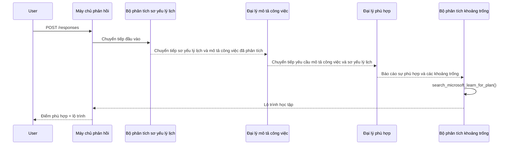

# Module 3 - Cấu hình Hướng dẫn, Môi trường & Cài đặt Phụ thuộc

⏱️ ~15 phút

Trong module này, bạn sẽ biến phần khung mẫu đã tạo thành **quy trình đa tác nhân của bạn** - bằng cách đặt các biến môi trường, viết hướng dẫn cho các tác nhân, thêm công cụ MCP, kết nối biểu đồ quy trình công việc, và cài đặt các phụ thuộc.

> **Tham khảo:** Mã làm việc đầy đủ có trong [`PersonalCareerCopilot/main.py`](../../../../../workshop/lab02-multi-agent/PersonalCareerCopilot/main.py). Sử dụng nó như tài liệu tham khảo khi xây dựng biểu đồ quy trình công việc và các khối gợi ý của bạn.

---

## Cách bốn tác nhân hoạt động cùng nhau


```mermaid
sequenceDiagram
    participant User
    participant Server as Máy chủ phản hồi
    participant RP as Bộ phân tích sơ yếu lý lịch
    participant JD as Đại lý mô tả công việc
    participant MA as Đại lý phù hợp
    participant GA as Bộ phân tích khoảng trống

    User->>Server: POST /responses
    Server->>RP: Chuyển tiếp đầu vào
    RP-->>JD: Chuyển tiếp sơ yếu lý lịch và mô tả công việc đã phân tích
    JD-->>MA: Chuyển tiếp yêu cầu mô tả công việc và sơ yếu lý lịch
    MA-->>GA: Báo cáo sự phù hợp và các khoảng trống
    GA->>GA: search_microsoft_learn_for_plan()
    GA-->>Server: Lộ trình học tập
    Server-->>User: Điểm phù hợp + lộ trình
```

---

## Bước 1: Cấu hình biến môi trường

1. Mở file **`.env`** ở thư mục gốc dự án của bạn (được tạo bởi trình hướng dẫn scaffold).
2. Thay thế các mẫu chỗ giữ chỗ bằng các giá trị thực tế của bạn từ Lab 01.

<details open>
<summary><strong>🅰️ Lộ trình A - Đăng ký Foundry</strong></summary>

```env
FOUNDRY_PROJECT_ENDPOINT=https://<your-account>.services.ai.azure.com/api/projects/<your-project>
AZURE_AI_MODEL_DEPLOYMENT_NAME=gpt-4.1-mini
```

> **Nơi tìm giá trị:** Xem [Lab 01, Module 1](../../lab01-single-agent/docs/01-setup.md#deploy-a-model--assign-rbac).

</details>

<details open>
<summary><strong>🅱️ Lộ trình B - Foundry Local</strong></summary>

```env
FOUNDRY_PROJECT_ENDPOINT=http://localhost:5273/v1
AZURE_AI_MODEL_DEPLOYMENT_NAME=phi-4-mini
```

> Tất cả việc suy luận được chạy trên máy của bạn - không có dữ liệu nào rời thiết bị. Chạy `foundry model list` để xác nhận tên bí danh mô hình chính xác. Yêu cầu ra ngoài duy nhất là gọi công cụ MCP tới `https://learn.microsoft.com/api/mcp`.

> **Nơi tìm giá trị:** Xem [Lab 01, Module 1 - local path](../../lab01-single-agent/docs/01-setup.md#step-2-set-up-based-on-your-access).

</details>

> **Bảo mật:** Không bao giờ commit `.env` vào version control. Nó nên đã được liệt kê trong `.gitignore`.

---

## Bước 2: Viết hướng dẫn cho tác nhân

Hướng dẫn định nghĩa vai trò của mỗi tác nhân, định dạng đầu ra, và quy tắc. Mở `main.py` và định nghĩa (hoặc thay thế) bốn hằng hướng dẫn - các chuỗi đầy đủ có trong [`PersonalCareerCopilot/main.py`](../../../../../workshop/lab02-multi-agent/PersonalCareerCopilot/main.py).

### 2.1 `RESUME_PARSER_INSTRUCTIONS`
Phân tích sơ yếu lý lịch thành hồ sơ ứng viên có cấu trúc **và** sao chép mô tả công việc y nguyên vào `[JOB DESCRIPTION PASS-THROUGH]`. Cả hai phần được dán nhãn phải xuất hiện trong đầu ra.

> **Tại sao cần pass-through?** Với `context_mode="last_agent"`, ResumeParser là tác nhân **duy nhất** thấy tin nhắn gốc của người dùng. Nếu nó không sao chép JD tiếp, các tác nhân phía sau sẽ không bao giờ thấy nó.

### 2.2 `JOB_DESCRIPTION_INSTRUCTIONS`
Đọc `[PARSED RESUME]` và `[JOB DESCRIPTION PASS-THROUGH]` từ đầu ra của ResumeParser. Xuất ra `[JD REQUIREMENTS]` (yêu cầu có cấu trúc) và `[PARSED RESUME PASS-THROUGH]` (bản sao y nguyên sơ yếu lý lịch cho MatchingAgent).

### 2.3 `MATCHING_AGENT_INSTRUCTIONS`
Đọc `[JD REQUIREMENTS]` và `[PARSED RESUME PASS-THROUGH]`. Tạo báo cáo đánh giá độ phù hợp có điểm số (0–100) với toán học chi tiết, kỹ năng phù hợp, kỹ năng còn thiếu, và sự phù hợp kinh nghiệm.

### 2.4 `GAP_ANALYZER_INSTRUCTIONS`
Đọc báo cáo độ phù hợp. Với **mỗi** kỹ năng thiếu, gọi `search_microsoft_learn_for_plan` để lấy tài nguyên Microsoft Learn. Tạo một thẻ khoảng cách chi tiết cho mỗi kỹ năng cộng lộ trình học theo tuần.

---

## Bước 3: Thêm công cụ MCP

GapAnalyzer gọi [Microsoft Learn MCP server](https://learn.microsoft.com/azure/foundry/agents/how-to/tools/model-context-protocol) để lấy tài nguyên học tập thực tế cho từng khoảng cách kỹ năng. Hàm đầy đủ `search_microsoft_learn_for_plan` có trong [`PersonalCareerCopilot/main.py`](../../../../../workshop/lab02-multi-agent/PersonalCareerCopilot/main.py).

Đăng ký công cụ trên GapAnalyzer khi tạo tác nhân:

```python
gap_analyzer = Agent(
    client=client,
    instructions=GAP_ANALYZER_INSTRUCTIONS,
    name="GapAnalyzer",
    tools=[search_microsoft_learn_for_plan],
)
```

> Xem [`PersonalCareerCopilot/main.py`](../../../../../workshop/lab02-multi-agent/PersonalCareerCopilot/main.py) để xem biểu đồ `WorkflowBuilder` đầy đủ với `FoundryChatClient`, `AgentExecutor`, và tất cả các lệnh `add_edge()`.

---

## Bước 4: Tạo môi trường ảo & cài đặt phụ thuộc

> ⚠️ **Không bỏ qua bước này.** Nếu không cài đặt phụ thuộc, việc gỡ lỗi F5 sẽ thất bại.

### 4.1 Tạo môi trường ảo

```powershell
python -m venv .venv
```

### 4.2 Kích hoạt nó

| Hệ điều hành | Lệnh |
|----|---------|
| **Windows (PowerShell)** | `.\.venv\Scripts\Activate.ps1` |
| **Windows (CMD)** | `.venv\Scripts\activate.bat` |
| **macOS / Linux** | `source .venv/bin/activate` |

Bạn sẽ thấy `(.venv)` trong dấu nhắc lệnh terminal của bạn.

### 4.3 Cài đặt phụ thuộc

```powershell
pip install -r requirements.txt
```

### 4.4 Xác minh

```powershell
pip list | Select-String "agent-framework|mcp|debugpy"
```

Mong đợi: `agent-framework-foundry`, `agent-framework-foundry-hosting`, `mcp`, và `debugpy` được liệt kê.

---

## Bước 5: Xác minh xác thực

<details open>
<summary><strong>🅰️ Lộ trình A - Thông tin đăng nhập Azure</strong></summary>

```powershell
az account show --query "{name:name, id:id}" --output table
```

Nếu điều này thất bại, chạy [`az login`](https://learn.microsoft.com/cli/azure/authenticate-azure-cli-interactively).

Cả bốn tác nhân sử dụng chung một `FoundryChatClient` và một `DefaultAzureCredential`. Nếu xác thực thành công với một tác nhân, tất cả đều sẽ thành công.

</details>

<details open>
<summary><strong>🅱️ Lộ trình B - Foundry Local</strong></summary>

Không cần xác thực khi thử nghiệm cục bộ.

</details>

---

### ✅ Điểm kiểm tra

> Đừng **tiếp tục** sang Module 04 cho đến khi: **(1)** `(.venv)` xuất hiện trong dấu nhắc lệnh của bạn VÀ **(2)** lệnh `pip install -r requirements.txt` đã hoàn thành thành công.

- [ ] `.env` có tên điểm cuối và tên triển khai mô hình hợp lệ (không phải chỗ giữ chỗ)
- [ ] Tất cả 4 hằng hướng dẫn tác nhân được định nghĩa trong `main.py` (ResumeParser, JD Agent, MatchingAgent, GapAnalyzer)
- [ ] Công cụ MCP `search_microsoft_learn_for_plan` được định nghĩa và đăng ký trên GapAnalyzer
- [ ] Tạo các đối tượng `FoundryChatClient` + 4 `Agent` + 4 `AgentExecutor` trong `main()`
- [ ] `WorkflowBuilder` xây dựng biểu đồ tuần tự đúng với tất cả 3 lệnh gọi `add_edge()`
- [ ] Môi trường ảo được tạo và kích hoạt (`(.venv)` xuất hiện trong dấu nhắc lệnh)
- [ ] Lệnh `pip install -r requirements.txt` hoàn thành không lỗi
- [ ] **Lộ trình A:** `az account show` thành công HOẶC biểu tượng Tài khoản VS Code hiển thị tài khoản đã đăng nhập

---

**Trước đó:** [02 - Scaffold Multi-Agent Project](02-scaffold-multi-agent.md) · **Tiếp theo:** [04 - Mẫu Phối hợp →](04-orchestration-patterns.md)

---

<!-- CO-OP TRANSLATOR DISCLAIMER START -->
**Tuyên bố miễn trừ trách nhiệm**:
Tài liệu này đã được dịch bằng dịch vụ dịch thuật AI [Co-op Translator](https://github.com/Azure/co-op-translator). Mặc dù chúng tôi cố gắng đảm bảo độ chính xác, xin lưu ý rằng bản dịch tự động có thể chứa lỗi hoặc sai sót. Tài liệu gốc bằng ngôn ngữ gốc nên được coi là nguồn tin chính thức. Đối với thông tin quan trọng, nên sử dụng dịch vụ dịch thuật chuyên nghiệp bởi con người. Chúng tôi không chịu trách nhiệm về bất kỳ hiểu lầm hoặc giải thích sai nào phát sinh từ việc sử dụng bản dịch này.
<!-- CO-OP TRANSLATOR DISCLAIMER END -->