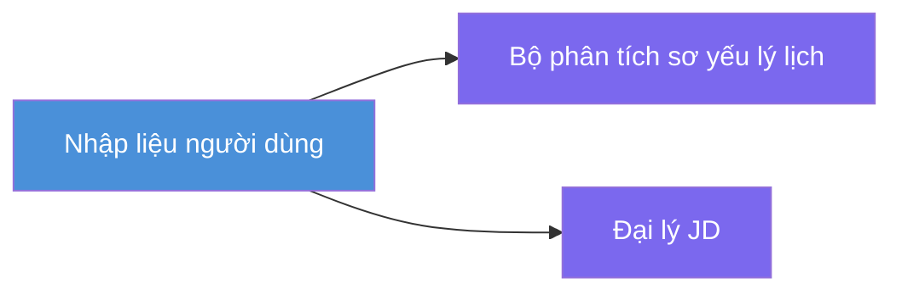
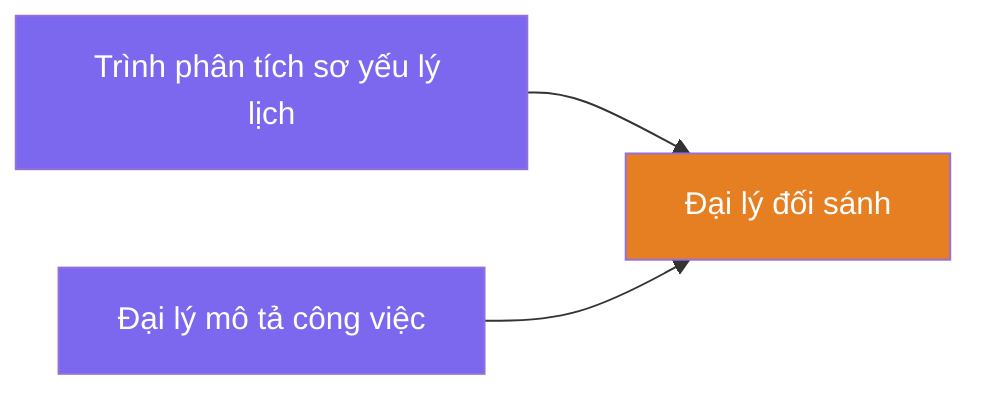
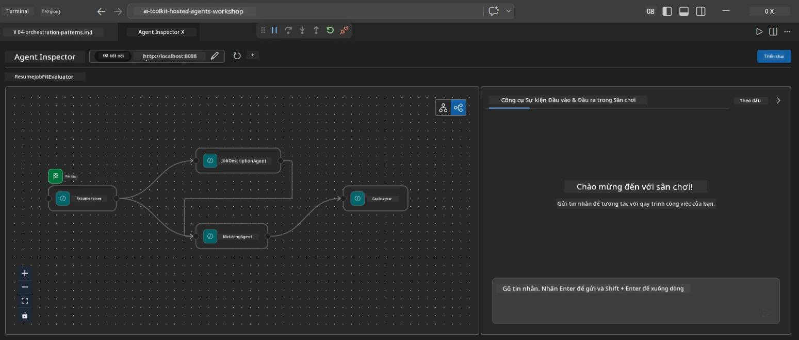
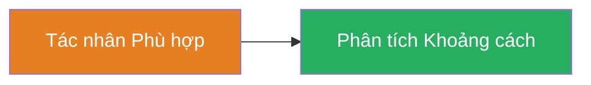
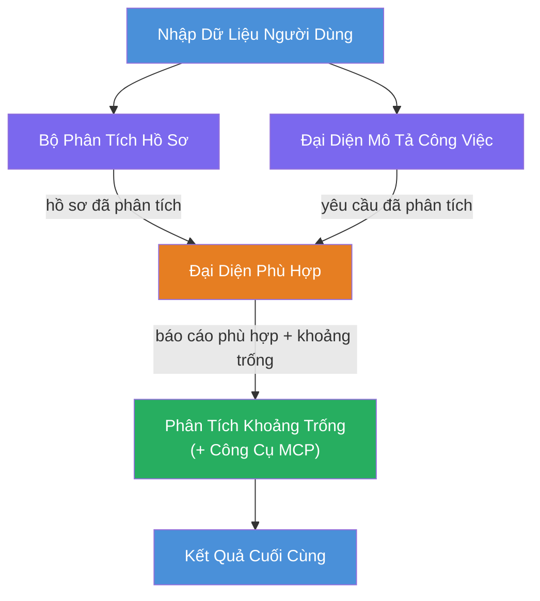
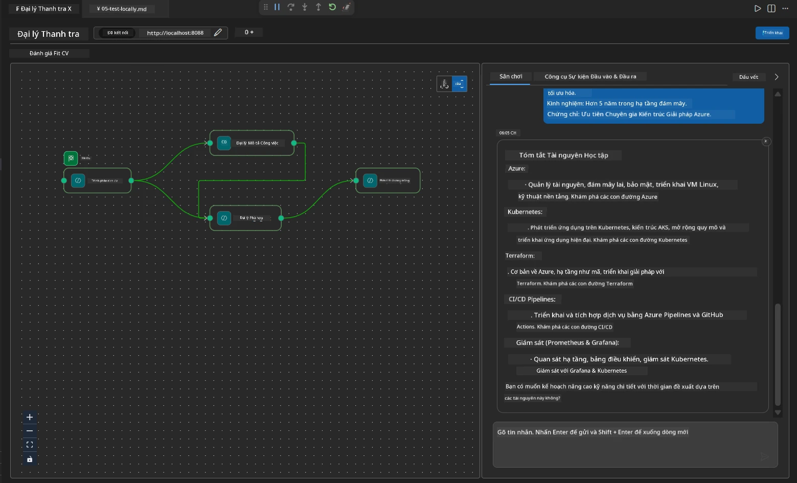

# Module 4 - Mẫu điều phối

Trong module này, bạn sẽ khám phá các mẫu điều phối được sử dụng trong Resume Job Fit Evaluator và học cách đọc, sửa đổi và mở rộng đồ thị workflow. Hiểu các mẫu này là điều cần thiết để gỡ lỗi các vấn đề luồng dữ liệu và xây dựng [workflow đa tác nhân](https://learn.microsoft.com/agent-framework/workflows/) riêng của bạn.

---

## Mẫu 1: Fan-out (chia song song)

Mẫu đầu tiên trong workflow là **fan-out** - một đầu vào đơn được gửi cho nhiều tác nhân đồng thời.


Trong mã, điều này xảy ra vì `resume_parser` là `start_executor` - nó nhận tin nhắn người dùng đầu tiên. Sau đó, vì cả `jd_agent` và `matching_agent` đều có các cạnh từ `resume_parser`, khung làm việc định tuyến đầu ra của `resume_parser` tới cả hai tác nhân:

```python
.add_edge(resume_parser, jd_agent)         # Đầu ra của ResumeParser → JD Agent
.add_edge(resume_parser, matching_agent)   # Đầu ra của ResumeParser → MatchingAgent
```

**Tại sao điều này hoạt động:** ResumeParser và JD Agent xử lý các khía cạnh khác nhau của cùng một đầu vào. Chạy chúng song song giúp giảm tổng độ trễ so với chạy tuần tự.

### Khi nào sử dụng fan-out

| Trường hợp sử dụng | Ví dụ |
|--------------------|-------|
| Nhiệm vụ con độc lập | Phân tích sơ yếu lý lịch vs. phân tích mô tả công việc |
| Dự phòng / bỏ phiếu | Hai tác nhân phân tích cùng dữ liệu, tác nhân thứ ba chọn câu trả lời tốt nhất |
| Đầu ra đa định dạng | Một tác nhân tạo ra văn bản, tác nhân khác tạo ra JSON có cấu trúc |

---

## Mẫu 2: Fan-in (tổng hợp)

Mẫu thứ hai là **fan-in** - nhiều đầu ra của các tác nhân được thu thập và gửi tới một tác nhân hạ nguồn duy nhất.


Trong mã:

```python
.add_edge(resume_parser, matching_agent)   # Đầu ra ResumeParser → MatchingAgent
.add_edge(jd_agent, matching_agent)        # Đầu ra JD Agent → MatchingAgent
```

**Hành vi chính:** Khi một tác nhân có **hai hoặc nhiều cạnh đến**, khung làm việc tự động chờ **tất cả** các tác nhân thượng nguồn hoàn thành trước khi chạy tác nhân hạ nguồn. MatchingAgent không bắt đầu cho tới khi cả ResumeParser và JD Agent đều xong.

### Những gì MatchingAgent nhận được

Khung làm việc nối đầu ra từ tất cả các tác nhân thượng nguồn. Đầu vào của MatchingAgent trông như sau:

```
[ResumeParser output]
---
Candidate Profile:
  Name: Jane Doe
  Technical Skills: Python, Azure, Kubernetes, ...
  ...

[JobDescriptionAgent output]
---
Role Overview: Senior Cloud Engineer
Required Skills: Python, Azure, Terraform, ...
...
```

> **Lưu ý:** Định dạng nối chính xác phụ thuộc vào phiên bản khung làm việc. Chỉ dẫn cho tác nhân nên được viết để xử lý cả đầu ra có cấu trúc và không có cấu trúc từ thượng nguồn.



---

## Mẫu 3: Chuỗi tuần tự

Mẫu thứ ba là **chuỗi tuần tự** - đầu ra của một tác nhân được đưa trực tiếp vào tác nhân tiếp theo.


Trong mã:

```python
.add_edge(matching_agent, gap_analyzer)    # Đầu ra MatchingAgent → GapAnalyzer
```

Đây là mẫu đơn giản nhất. GapAnalyzer nhận điểm phù hợp, kỹ năng phù hợp/thừa thiếu và các khoảng trống từ MatchingAgent. Sau đó nó gọi [công cụ MCP](https://learn.microsoft.com/azure/foundry/agents/how-to/tools/model-context-protocol) cho mỗi khoảng trống để lấy tài nguyên Microsoft Learn.

---

## Đồ thị hoàn chỉnh

Kết hợp cả ba mẫu tạo thành workflow đầy đủ:


### Dòng thời gian thực thi

```mermaid
gantt
    title Dòng thời gian thực thi đại lý
    dateFormat X
    axisFormat %s

    section Song song
    Resume Parser       :rp, 0, 3
    JD Agent            :jd, 0, 2

    section Tuần tự
    Matching Agent      :ma, 3, 5
    Gap Analyzer        :ga, 5, 9
```


> Tổng thời gian đồng hồ là khoảng `max(ResumeParser, JD Agent) + MatchingAgent + GapAnalyzer`. GapAnalyzer thường là chậm nhất vì nó thực hiện nhiều cuộc gọi công cụ MCP (một cho mỗi khoảng trống).

---

## Đọc mã WorkflowBuilder

Dưới đây là hàm `create_workflow()` hoàn chỉnh từ `main.py`, có chú thích:

```python
def create_workflow(resume_parser, jd_agent, matching_agent, gap_analyzer):
    workflow = (
        WorkflowBuilder(
            name="ResumeJobFitEvaluator",

            # Đại lý đầu tiên nhận dữ liệu đầu vào từ người dùng
            start_executor=resume_parser,

            # Đại lý (các đại lý) mà đầu ra của họ trở thành phản hồi cuối cùng
            output_executors=[gap_analyzer],
        )
        # Phân nhánh: Đầu ra của ResumeParser đi đến cả JD Agent và MatchingAgent
        .add_edge(resume_parser, jd_agent)
        .add_edge(resume_parser, matching_agent)

        # Hợp nhất: MatchingAgent chờ cả ResumeParser và JD Agent
        .add_edge(jd_agent, matching_agent)

        # Tuần tự: Đầu ra của MatchingAgent cung cấp cho GapAnalyzer
        .add_edge(matching_agent, gap_analyzer)

        .build()
    )
    return workflow.as_agent()
```

### Bảng tóm tắt các cạnh

| # | Cạnh | Mẫu | Hiệu ứng |
|---|-------|-----|----------|
| 1 | `resume_parser → jd_agent` | Fan-out | JD Agent nhận đầu ra của ResumeParser (cộng với đầu vào gốc từ người dùng) |
| 2 | `resume_parser → matching_agent` | Fan-out | MatchingAgent nhận đầu ra của ResumeParser |
| 3 | `jd_agent → matching_agent` | Fan-in | MatchingAgent cũng nhận đầu ra của JD Agent (chờ cả hai) |
| 4 | `matching_agent → gap_analyzer` | Tuần tự | GapAnalyzer nhận báo cáo phù hợp + danh sách khoảng trống |

---

## Sửa đổi đồ thị

### Thêm một tác nhân mới

Để thêm tác nhân thứ năm (ví dụ, một **InterviewPrepAgent** tạo câu hỏi phỏng vấn dựa trên phân tích khoảng trống):

```python
# 1. Định nghĩa các hướng dẫn
INTERVIEW_PREP_INSTRUCTIONS = """\
You are the Interview Prep Agent.
Given a gap analysis and fit report, generate 10 targeted interview questions
the candidate should prepare for.
"""

# 2. Tạo đại lý (bên trong khối async with)
AzureAIAgentClient(
    project_endpoint=PROJECT_ENDPOINT,
    model_deployment_name=MODEL_DEPLOYMENT_NAME,
    credential=credential,
).as_agent(
    name="InterviewPrepAgent",
    instructions=INTERVIEW_PREP_INSTRUCTIONS,
) as interview_prep,

# 3. Thêm các cạnh trong create_workflow()
.add_edge(matching_agent, interview_prep)   # nhận báo cáo phù hợp
.add_edge(gap_analyzer, interview_prep)     # cũng nhận các thẻ khoảng cách

# 4. Cập nhật output_executors
output_executors=[interview_prep],  # bây giờ là đại lý cuối cùng
```

### Thay đổi thứ tự thực thi

Để làm cho JD Agent chạy **sau** ResumeParser (tuần tự thay vì song song):

```python
# Xóa: .add_edge(resume_parser, jd_agent)  ← đã tồn tại, giữ lại
# Loại bỏ song song ngầm bằng cách KHÔNG để jd_agent nhận trực tiếp đầu vào từ người dùng
# start_executor gửi đến resume_parser trước, và jd_agent chỉ nhận
# đầu ra của resume_parser thông qua cạnh. Điều này khiến chúng tuần tự.
```

> **Quan trọng:** `start_executor` là tác nhân duy nhất nhận đầu vào thô từ người dùng. Tất cả các tác nhân khác nhận đầu ra từ các cạnh thượng nguồn của chúng. Nếu bạn muốn một tác nhân cũng nhận đầu vào thô từ người dùng, nó phải có một cạnh từ `start_executor`.

---

## Các lỗi thường gặp trong đồ thị

| Lỗi | Triệu chứng | Cách sửa |
|------|------------|----------|
| Thiếu cạnh tới `output_executors` | Tác nhân chạy nhưng đầu ra trống | Đảm bảo có đường dẫn từ `start_executor` tới mọi tác nhân trong `output_executors` |
| Phụ thuộc vòng | Vòng lặp vô hạn hoặc hết giờ chờ | Kiểm tra không có tác nhân nào phản hồi lại tác nhân thượng nguồn |
| Tác nhân trong `output_executors` không có cạnh vào | Đầu ra trống | Thêm ít nhất một `add_edge(source, that_agent)` |
| Nhiều `output_executors` không có fan-in | Đầu ra chỉ chứa phản hồi của một tác nhân | Dùng một tác nhân đầu ra duy nhất tổng hợp, hoặc chấp nhận nhiều đầu ra |
| Thiếu `start_executor` | Lỗi `ValueError` khi xây dựng | Luôn chỉ định `start_executor` trong `WorkflowBuilder()` |

---

## Gỡ lỗi đồ thị

### Sử dụng Agent Inspector

1. Khởi động tác nhân cục bộ (F5 hoặc terminal - xem [Module 5](05-test-locally.md)).
2. Mở Agent Inspector (`Ctrl+Shift+P` → **Foundry Toolkit: Open Agent Inspector**).
3. Gửi tin nhắn thử nghiệm.
4. Ở bảng phản hồi của Inspector, tìm **đầu ra streaming** - nó hiển thị đóng góp của mỗi tác nhân theo thứ tự.



### Sử dụng logging

Thêm logging vào `main.py` để theo dõi luồng dữ liệu:

```python
import logging
logger = logging.getLogger("resume-job-fit")

# Trong create_workflow(), sau khi xây dựng:
logger.info("Workflow graph built with edges: RP→JD, RP→MA, JD→MA, MA→GA")
```

Nhật ký server hiển thị thứ tự thực thi tác nhân và các cuộc gọi công cụ MCP:

```
INFO:resume-job-fit:Starting Resume -> Job Fit Evaluator HTTP server...
INFO:resume-job-fit:Server running on http://localhost:8088
INFO:agent_framework:Executing agent: ResumeParser
INFO:agent_framework:Executing agent: JobDescriptionAgent
INFO:agent_framework:Waiting for upstream agents: ResumeParser, JobDescriptionAgent
INFO:agent_framework:Executing agent: MatchingAgent
INFO:agent_framework:Executing agent: GapAnalyzer
INFO:agent_framework:Tool call: search_microsoft_learn_for_plan(skill="Kubernetes")
POST https://learn.microsoft.com/api/mcp → 200
INFO:agent_framework:Tool call: search_microsoft_learn_for_plan(skill="Terraform")
POST https://learn.microsoft.com/api/mcp → 200
```

---

### Kiểm tra

- [ ] Bạn có thể nhận diện ba mẫu điều phối trong workflow: fan-out, fan-in, và chuỗi tuần tự
- [ ] Bạn hiểu rằng các tác nhân có nhiều cạnh vào sẽ chờ tất cả tác nhân thượng nguồn hoàn thành
- [ ] Bạn có thể đọc mã `WorkflowBuilder` và ánh xạ mỗi gọi `add_edge()` tới đồ thị trực quan
- [ ] Bạn hiểu dòng thời gian thực thi: tác nhân chạy song song trước, sau đó tổng hợp, rồi chạy tuần tự
- [ ] Bạn biết cách thêm một tác nhân mới vào đồ thị (định nghĩa chỉ dẫn, tạo tác nhân, thêm các cạnh, cập nhật đầu ra)
- [ ] Bạn có thể nhận diện các lỗi đồ thị thường gặp và triệu chứng của chúng

---

**Trước:** [03 - Cấu hình Tác nhân & Môi trường](03-configure-agents.md) · **Tiếp theo:** [05 - Thử nghiệm cục bộ →](05-test-locally.md)

---

<!-- CO-OP TRANSLATOR DISCLAIMER START -->
**Tuyên bố từ chối trách nhiệm**:  
Tài liệu này đã được dịch bằng dịch vụ dịch thuật AI [Co-op Translator](https://github.com/Azure/co-op-translator). Trong khi chúng tôi cố gắng đảm bảo độ chính xác, xin lưu ý rằng các bản dịch tự động có thể chứa lỗi hoặc không chính xác. Tài liệu gốc bằng ngôn ngữ gốc của nó nên được xem là nguồn tham khảo chính thức. Đối với các thông tin quan trọng, khuyến nghị sử dụng dịch thuật chuyên nghiệp do con người thực hiện. Chúng tôi không chịu trách nhiệm về bất kỳ sự hiểu lầm hoặc giải thích sai nào phát sinh từ việc sử dụng bản dịch này.
<!-- CO-OP TRANSLATOR DISCLAIMER END -->