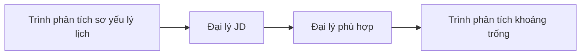
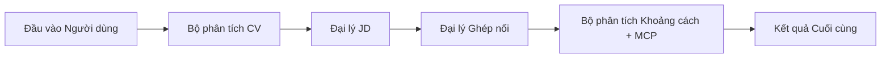

# Module 4 - Mẫu Điều phối

⏱️ ~10 phút

Trong module này, bạn khám phá các mẫu điều phối được sử dụng trong Trình đánh giá Phù hợp Công việc của Resume và học cách đọc, chỉnh sửa và mở rộng đồ thị luồng công việc. Hiểu các mẫu này rất quan trọng để gỡ lỗi các sự cố luồng dữ liệu và xây dựng [luồng công việc đa tác nhân](https://learn.microsoft.com/agent-framework/workflows/) của riêng bạn.

---

## Mẫu 1: Chuỗi tuần tự

Mẫu cơ bản trong luồng công việc là **chuỗi tuần tự** - đầu ra của mỗi tác nhân trực tiếp cung cấp cho tác nhân tiếp theo.


```mermaid
flowchart LR
    RP[Trình phân tích sơ yếu lý lịch] --> JD[Đại lý JD]
    JD --> MA[Đại lý phù hợp]
    MA --> GA[Trình phân tích khoảng trống]
```

Trong mã, mỗi lần gọi `add_edge()` tạo ra một bước trong chuỗi:

```python
.add_edge(resume_executor, jd_executor)       # Đầu ra ResumeParser → JD Agent
.add_edge(jd_executor, matching_executor)     # Đầu ra JD Agent → MatchingAgent
.add_edge(matching_executor, gap_executor)    # Đầu ra MatchingAgent → GapAnalyzer
```

> **Tại sao là chuỗi tuần tự, không phải fan-out/fan-in?** `WorkflowBuilder` sử dụng **ngữ nghĩa OR** cho các cạnh đầu vào: một tác nhân bên dưới được kích hoạt ngay khi **bất kỳ** tác nhân tiền nhiệm nào hoàn thành. Nếu `matching_executor` có hai cạnh đầu vào (từ cả `resume_executor` và `jd_executor`), nó sẽ được kích hoạt hai lần - một lần khi ResumeParser kết thúc và một lần nữa khi JD Agent kết thúc - khiến GapAnalyzer cũng chạy hai lần và đầu ra xuất hiện hai lần. Đường ống tuần tự hoàn toàn tránh được điều này.

## Mẫu 2: Chuyển tiếp nội dung

Vì `context_mode="last_agent"` có nghĩa là mỗi tác nhân chỉ thấy **đầu ra của tác nhân tiền nhiệm trực tiếp**, các tác nhân trong chuỗi tuần tự phải truyền rõ ràng bất kỳ dữ liệu nào mà các tác nhân phía dưới cần.

Trong luồng công việc này:
- **ResumeParser** sao chép JD nguyên văn vào `[JOB DESCRIPTION PASS-THROUGH]` (để JD Agent có thể tìm thấy nó).
- **JD Agent** sao chép `[PARSED RESUME]` nguyên văn vào `[PARSED RESUME PASS-THROUGH]` (để MatchingAgent có thể so sánh cả hai hồ sơ).

```
ResumeParser output
└─ [PARSED RESUME]               ← extracted by JD Agent
└─ [JOB DESCRIPTION PASS-THROUGH] ← extracted by JD Agent

JD Agent output
└─ [JD REQUIREMENTS]             ← extracted by MatchingAgent
└─ [PARSED RESUME PASS-THROUGH]  ← extracted by MatchingAgent
```

Mỗi phần chuyển tiếp phải được sao chép **nguyên văn** - tóm tắt hoặc diễn giải lại sẽ làm hỏng tác nhân phía dưới phụ thuộc vào nó.

---

## Đồ thị hoàn chỉnh

Kết hợp các mẫu chuỗi tuần tự và chuyển tiếp nội dung tạo ra luồng công việc đầy đủ:


```mermaid
flowchart LR
    U[Đầu vào Người dùng] --> RP[Bộ phân tích CV]
    RP --> JD[Đại lý JD]
    JD --> MA[Đại lý Ghép nối]
    MA --> GA[Bộ phân tích Khoảng cách + MCP]
    GA --> O[Kết quả Cuối cùng]
```

Agent Inspector hiển thị cấu trúc đồ thị tương tự khi tác nhân đang chạy cục bộ. Tham khảo [Module 5 - Test Locally](05-test-locally.md) để xem ảnh chụp màn hình.

---

## Đọc mã WorkflowBuilder

Hàm đầy đủ `create_workflow()` nằm trong [`PersonalCareerCopilot/main.py`](../../../../../workshop/lab02-multi-agent/PersonalCareerCopilot/main.py). Ba lần gọi `add_edge()` xây dựng đường ống tuần tự:

| # | Cạnh | Hiệu ứng |
|---|------|--------|
| 1 | `resume_executor → jd_executor` | JD Agent nhận `[PARSED RESUME]` + `[JOB DESCRIPTION PASS-THROUGH]` |
| 2 | `jd_executor → matching_executor` | MatchingAgent nhận `[JD REQUIREMENTS]` + `[PARSED RESUME PASS-THROUGH]` |
| 3 | `matching_executor → gap_executor` | GapAnalyzer nhận báo cáo phù hợp + danh sách khoảng trống |

---

## Chỉnh sửa đồ thị

### Thêm tác nhân mới

Để thêm tác nhân thứ năm (ví dụ, một **InterviewPrepAgent** sau GapAnalyzer):

1. Định nghĩa một hằng số `INTERVIEW_PREP_INSTRUCTIONS`.
2. Tạo các đối tượng `Agent` + `AgentExecutor` (theo mẫu tương tự bốn tác nhân hiện có).
3. Thêm `.add_edge(gap_executor, interview_exec)` trong `WorkflowBuilder`.
4. Cập nhật `output_executors=[interview_exec]`.

> **Quan trọng:** `start_executor` là tác nhân duy nhất nhận đầu vào thô từ người dùng. Các tác nhân khác đều nhận đầu ra từ cạnh phía trên.

---

## Sai lầm phổ biến với đồ thị

| Sai lầm | Triệu chứng | Cách sửa |
|---------|---------|-----|
| Thiếu cạnh đến `output_executors` | Tác nhân chạy nhưng đầu ra trống | Đảm bảo có đường dẫn từ `start_executor` đến mọi tác nhân trong `output_executors` |
| Phụ thuộc vòng lặp | Vòng lặp vô hạn hoặc quá thời gian | Kiểm tra không có tác nhân nào cấp dữ liệu trở lại tác nhân phía trên |
| Tác nhân trong `output_executors` không có cạnh đầu vào | Đầu ra trống | Thêm ít nhất một `add_edge(source, that_agent)` |
| Nhiều `output_executors` không có fan-in | Đầu ra chỉ chứa phản hồi của một tác nhân | Dùng một tác nhân đầu ra duy nhất tổng hợp, hoặc chấp nhận nhiều đầu ra |
| Thiếu `start_executor` | `ValueError` khi xây dựng | Luôn chỉ định `start_executor` trong `WorkflowBuilder()` |

---

## Gỡ lỗi đồ thị

### Sử dụng Agent Inspector

1. Khởi động tác nhân cục bộ với F5.
2. Mở Agent Inspector (`Ctrl+Shift+P` → **Foundry Toolkit: Open Agent Inspector**).
3. Gửi một tin nhắn thử nghiệm.
4. Trong bảng phản hồi của Inspector, tìm **đầu ra phát trực tuyến** - nó hiển thị đóng góp của từng tác nhân theo trình tự.


### Sử dụng ghi nhật ký

Thêm ghi nhật ký vào `main.py` để theo dõi luồng dữ liệu:

```python
import logging
logger = logging.getLogger("resume-job-fit")

# Trong main(), sau khi xây dựng quy trình làm việc:
logger.info("Workflow graph built with edges: RP→JD, JD→MA, MA→GA")
```

Nhật ký máy chủ hiển thị thứ tự thực thi tác nhân và các cuộc gọi công cụ MCP:

```
INFO:agent_framework:Executing agent: ResumeParser
INFO:agent_framework:Executing agent: JobDescriptionAgent
INFO:agent_framework:Executing agent: MatchingAgent
INFO:agent_framework:Executing agent: GapAnalyzer
INFO:agent_framework:Tool call: search_microsoft_learn_for_plan(skill="Kubernetes")
POST https://learn.microsoft.com/api/mcp → 200
INFO:agent_framework:Tool call: search_microsoft_learn_for_plan(skill="Terraform")
POST https://learn.microsoft.com/api/mcp → 200
```

---

### Điểm kiểm tra

- [ ] Bạn có thể xác định hai mẫu điều phối trong luồng công việc: chuỗi tuần tự và chuyển tiếp nội dung
- [ ] Bạn hiểu tại sao `context_mode="last_agent"` lại yêu cầu chuyển tiếp dữ liệu rõ ràng giữa các tác nhân
- [ ] Bạn có thể đọc mã `WorkflowBuilder` và ánh xạ mỗi lần gọi `add_edge()` với đồ thị trực quan
- [ ] Bạn biết cách thêm tác nhân mới vào cuối đường ống
- [ ] Bạn có thể nhận biết các sai lầm phổ biến trong đồ thị và các triệu chứng của chúng

---

**Trước:** [03 - Cấu hình Tác nhân & Môi trường](03-configure-agents.md) · **Tiếp:** [05 - Kiểm tra cục bộ →](05-test-locally.md)

---

<!-- CO-OP TRANSLATOR DISCLAIMER START -->
**Tuyên bố miễn trừ trách nhiệm**:
Tài liệu này đã được dịch bằng dịch vụ dịch thuật AI [Co-op Translator](https://github.com/Azure/co-op-translator). Mặc dù chúng tôi cố gắng đảm bảo độ chính xác, xin lưu ý rằng bản dịch tự động có thể chứa lỗi hoặc sai sót. Tài liệu gốc bằng ngôn ngữ gốc nên được coi là nguồn tin chính thức. Đối với thông tin quan trọng, nên sử dụng dịch vụ dịch thuật chuyên nghiệp bởi con người. Chúng tôi không chịu trách nhiệm về bất kỳ hiểu lầm hoặc giải thích sai nào phát sinh từ việc sử dụng bản dịch này.
<!-- CO-OP TRANSLATOR DISCLAIMER END -->