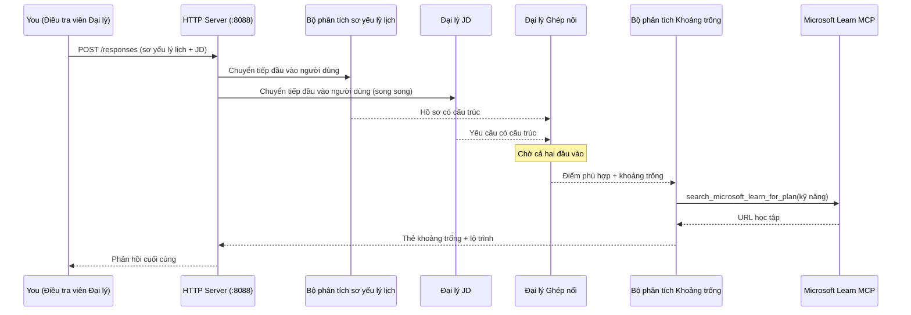
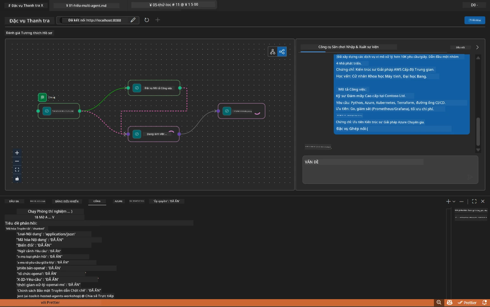

# Module 5 - Kiểm tra cục bộ (Đa tác tử)

Trong module này, bạn sẽ chạy luồng công việc đa tác tử cục bộ, kiểm tra nó bằng Agent Inspector, và xác minh rằng cả bốn tác tử và công cụ MCP đều hoạt động chính xác trước khi triển khai lên Foundry.

### Điều gì xảy ra trong quá trình chạy kiểm tra cục bộ


---

## Bước 1: Khởi động máy chủ tác tử

### Lựa chọn A: Sử dụng task VS Code (khuyến khích)

1. Nhấn `Ctrl+Shift+P` → gõ **Tasks: Run Task** → chọn **Run Lab02 HTTP Server**.
2. Task sẽ khởi động máy chủ với debugpy đính kèm trên cổng `5679` và tác tử trên cổng `8088`.
3. Đợi đầu ra hiển thị:

```
INFO:resume-job-fit:Starting Resume -> Job Fit Evaluator HTTP server...
INFO:resume-job-fit:Server running on http://localhost:8088
```

### Lựa chọn B: Dùng terminal thủ công

```powershell
cd workshop\lab02-multi-agent\PersonalCareerCopilot
```

Kích hoạt môi trường ảo:

**PowerShell (Windows):**
```powershell
.\.venv\Scripts\Activate.ps1
```

**macOS/Linux:**
```bash
source .venv/bin/activate
```

Khởi động máy chủ:

```powershell
python -m debugpy --listen 127.0.0.1:5679 -m agentdev run main.py --verbose --port 8088
```

### Lựa chọn C: Dùng F5 (chế độ gỡ lỗi)

1. Nhấn `F5` hoặc vào **Run and Debug** (`Ctrl+Shift+D`).
2. Chọn cấu hình khởi chạy **Lab02 - Multi-Agent** từ menu chọn.
3. Máy chủ sẽ chạy với hỗ trợ breakpoint đầy đủ.

> **Mẹo:** Chế độ gỡ lỗi cho phép bạn đặt breakpoint bên trong hàm `search_microsoft_learn_for_plan()` để kiểm tra phản hồi MCP, hoặc bên trong các chuỗi hướng dẫn tác tử để xem mỗi tác tử nhận được gì.

---

## Bước 2: Mở Agent Inspector

1. Nhấn `Ctrl+Shift+P` → gõ **Foundry Toolkit: Open Agent Inspector**.
2. Agent Inspector sẽ mở trong tab trình duyệt tại `http://localhost:5679`.
3. Bạn sẽ thấy giao diện tác tử sẵn sàng nhận tin nhắn.

> **Nếu Agent Inspector không mở được:** Hãy chắc chắn máy chủ đã khởi động hoàn toàn (bạn đã thấy log "Server running"). Nếu cổng 5679 đang bận, xem [Module 8 - Xử lý sự cố](08-troubleshooting.md).

---

## Bước 3: Chạy các bài kiểm tra cơ bản

Chạy ba bài kiểm tra này theo thứ tự. Mỗi bài kiểm tra sẽ tiến hành kiểm tra nhiều phần của luồng công việc hơn.

### Kiểm tra 1: Sơ yếu lý lịch cơ bản + mô tả công việc

Dán nội dung sau vào Agent Inspector:

```
Resume:
Jane Doe
Senior Software Engineer with 5 years of experience in Python, Django, and AWS.
Built microservices handling 10K+ requests/second. Led a team of 4 developers.
Certifications: AWS Solutions Architect Associate.
Education: B.S. Computer Science, State University.

Job Description:
Senior Cloud Engineer at Contoso Ltd.
Required: Python, Azure, Kubernetes, Terraform, CI/CD pipelines.
Preferred: Go, monitoring (Prometheus/Grafana), cost optimization.
Experience: 5+ years in cloud infrastructure.
Certifications: Azure Solutions Architect Expert preferred.
```

**Cấu trúc đầu ra mong đợi:**

Phản hồi sẽ bao gồm đầu ra từ tất cả bốn tác tử theo trình tự:

1. **Đầu ra từ Resume Parser** - Hồ sơ ứng viên có cấu trúc với các kỹ năng được nhóm theo danh mục
2. **Đầu ra từ JD Agent** - Yêu cầu có cấu trúc với kỹ năng bắt buộc và ưu tiên được tách biệt
3. **Đầu ra từ Matching Agent** - Điểm phù hợp (0-100) kèm phân tích chi tiết, kỹ năng khớp, kỹ năng thiếu, khoảng trống
4. **Đầu ra từ Gap Analyzer** - Thẻ khoảng trống riêng cho mỗi kỹ năng thiếu, mỗi thẻ có URL Microsoft Learn



### Những gì cần xác minh ở Kiểm tra 1

| Kiểm tra | Mong đợi | Đạt? |
|----------|----------|-------|
| Phản hồi có điểm phù hợp | Số từ 0-100 có phân tích chi tiết | |
| Kỹ năng khớp được liệt kê | Python, CI/CD (một phần), v.v. | |
| Kỹ năng thiếu được liệt kê | Azure, Kubernetes, Terraform, v.v. | |
| Thẻ khoảng trống tồn tại cho mỗi kỹ năng thiếu | Mỗi kỹ năng 1 thẻ | |
| URL Microsoft Learn hiện diện | Các liên kết thực `learn.microsoft.com` | |
| Không có lỗi trong phản hồi | Đầu ra có cấu trúc sạch | |

### Kiểm tra 2: Xác minh thực thi công cụ MCP

Trong khi Kiểm tra 1 chạy, kiểm tra **terminal máy chủ** để xem các bản ghi MCP:

```
GET https://learn.microsoft.com/api/mcp → 405 (Method Not Allowed)
POST https://learn.microsoft.com/api/mcp → 200
DELETE https://learn.microsoft.com/api/mcp → 405 (Method Not Allowed)
```

| Bản ghi | Ý nghĩa | Mong đợi? |
|---------|---------|-----------|
| `GET ... → 405` | MCP client thăm dò bằng GET trong quá trình khởi tạo | Có - bình thường |
| `POST ... → 200` | Gọi công cụ thực tế tới máy chủ MCP của Microsoft Learn | Có - đây là cuộc gọi thật |
| `DELETE ... → 405` | MCP client thăm dò bằng DELETE trong quá trình dọn dẹp | Có - bình thường |
| `POST ... → 4xx/5xx` | Cuộc gọi công cụ thất bại | Không - xem [Xử lý sự cố](08-troubleshooting.md) |

> **Điểm chính:** Các dòng `GET 405` và `DELETE 405` là **hành vi mong đợi**. Chỉ lo nếu các cuộc gọi `POST` trả về mã trạng thái khác 200.

### Kiểm tra 3: Trường hợp góc - ứng viên điểm phù hợp cao

Dán một sơ yếu lý lịch gần như khớp với JD để xác minh GapAnalyzer xử lý các trường hợp điểm phù hợp cao:

```
Resume:
Alex Chen
Senior Cloud Engineer with 7 years of experience.
Skills: Python, Azure (AKS, Functions, DevOps), Kubernetes, Terraform, CI/CD (GitHub Actions, Azure Pipelines), Go, Prometheus, Grafana, cost optimization.
Certifications: Azure Solutions Architect Expert, Azure DevOps Engineer Expert.
Led infrastructure migration to Azure for 3 enterprise clients.
Education: M.S. Computer Science, Tech University.

Job Description:
Senior Cloud Engineer at Contoso Ltd.
Required: Python, Azure, Kubernetes, Terraform, CI/CD pipelines.
Preferred: Go, monitoring (Prometheus/Grafana), cost optimization.
Experience: 5+ years in cloud infrastructure.
Certifications: Azure Solutions Architect Expert preferred.
```

**Hành vi mong đợi:**
- Điểm phù hợp nên là **80+** (hầu hết kỹ năng khớp)
- Thẻ khoảng trống nên tập trung vào đánh bóng/sẵn sàng phỏng vấn hơn là học nền tảng
- Hướng dẫn GapAnalyzer nói: "Nếu điểm phù hợp >= 80, tập trung vào đánh bóng/sẵn sàng phỏng vấn"

---

## Bước 4: Xác minh tính đầy đủ của đầu ra

Sau khi chạy các bài kiểm tra, xác minh đầu ra đáp ứng các tiêu chí sau:

### Danh sách kiểm tra cấu trúc đầu ra

| Phần | Tác tử | Có mặt? |
|-------|--------|---------|
| Hồ sơ ứng viên | Resume Parser | |
| Kỹ năng kỹ thuật (nhóm theo loại) | Resume Parser | |
| Tổng quan vai trò | JD Agent | |
| Kỹ năng bắt buộc và ưu tiên | JD Agent | |
| Điểm phù hợp với phân tích chi tiết | Matching Agent | |
| Kỹ năng khớp / thiếu / một phần | Matching Agent | |
| Thẻ khoảng trống cho mỗi kỹ năng thiếu | Gap Analyzer | |
| URL Microsoft Learn trong thẻ khoảng trống | Gap Analyzer (MCP) | |
| Thứ tự học (đánh số) | Gap Analyzer | |
| Tóm tắt dòng thời gian | Gap Analyzer | |

### Các vấn đề phổ biến ở giai đoạn này

| Vấn đề | Nguyên nhân | Cách khắc phục |
|---------|------------|-------------|
| Chỉ có 1 thẻ khoảng trống (các thẻ còn lại bị cắt) | Hướng dẫn GapAnalyzer thiếu đoạn CRITICAL | Thêm đoạn `CRITICAL:` vào `GAP_ANALYZER_INSTRUCTIONS` - xem [Module 3](03-configure-agents.md) |
| Không có URL Microsoft Learn | Điểm cuối MCP không thể truy cập | Kiểm tra kết nối Internet. Xác minh `MICROSOFT_LEARN_MCP_ENDPOINT` trong `.env` là `https://learn.microsoft.com/api/mcp` |
| Phản hồi trống | `PROJECT_ENDPOINT` hoặc `MODEL_DEPLOYMENT_NAME` chưa được thiết lập | Kiểm tra giá trị trong file `.env`. Chạy `echo $env:PROJECT_ENDPOINT` trong terminal |
| Điểm phù hợp là 0 hoặc thiếu | MatchingAgent không nhận được dữ liệu đầu vào | Kiểm tra rằng `add_edge(resume_parser, matching_agent)` và `add_edge(jd_agent, matching_agent)` tồn tại trong `create_workflow()` |
| Tác tử khởi động nhưng ngay lập tức thoát | Lỗi import hoặc thiếu phụ thuộc | Chạy lại `pip install -r requirements.txt`. Kiểm tra terminal xem có lỗi không |
| Lỗi `validate_configuration` | Thiếu biến môi trường | Tạo `.env` với `PROJECT_ENDPOINT=<your-endpoint>` và `MODEL_DEPLOYMENT_NAME=<your-model>` |

---

## Bước 5: Thử với dữ liệu riêng của bạn (tuỳ chọn)

Thử dán sơ yếu lý lịch của riêng bạn và một mô tả công việc thật. Điều này giúp xác minh:

- Các tác tử xử lý các định dạng sơ yếu lý lịch khác nhau (theo thứ tự thời gian, theo chức năng, hỗn hợp)
- JD Agent xử lý các kiểu JD khác nhau (dạng gạch đầu dòng, đoạn văn, có cấu trúc)
- Công cụ MCP trả về tài nguyên liên quan cho kỹ năng thật
- Các thẻ khoảng trống được cá nhân hóa phù hợp với nền tảng riêng của bạn

> **Lưu ý về quyền riêng tư:** Khi kiểm tra cục bộ, dữ liệu của bạn chỉ lưu trên máy của bạn và chỉ gửi tới triển khai Azure OpenAI của bạn. Nó không được ghi lại hoặc lưu trữ bởi hạ tầng workshop. Bạn có thể dùng tên giả nếu muốn (ví dụ, "Jane Doe" thay cho tên thật).

---

### Điểm kiểm tra

- [ ] Máy chủ khởi động thành công trên cổng `8088` (log hiển thị "Server running")
- [ ] Agent Inspector mở và kết nối với tác tử
- [ ] Kiểm tra 1: Phản hồi hoàn chỉnh với điểm phù hợp, kỹ năng khớp/thiếu, thẻ khoảng trống, và URL Microsoft Learn
- [ ] Kiểm tra 2: Log MCP hiển thị `POST ... → 200` (gọi công cụ thành công)
- [ ] Kiểm tra 3: Ứng viên điểm phù hợp cao nhận điểm 80+ với khuyến nghị tập trung đánh bóng
- [ ] Tất cả thẻ khoảng trống có mặt (mỗi kỹ năng thiếu một thẻ, không bị cắt)
- [ ] Không có lỗi hoặc stack trace trong terminal máy chủ

---

**Trước:** [04 - Mô hình điều phối](04-orchestration-patterns.md) · **Tiếp:** [06 - Triển khai lên Foundry →](06-deploy-to-foundry.md)

---

<!-- CO-OP TRANSLATOR DISCLAIMER START -->
**Tuyên bố miễn trừ trách nhiệm**:  
Tài liệu này đã được dịch bằng dịch vụ dịch thuật AI [Co-op Translator](https://github.com/Azure/co-op-translator). Mặc dù chúng tôi cố gắng đảm bảo độ chính xác, xin lưu ý rằng bản dịch tự động có thể chứa lỗi hoặc không chính xác. Tài liệu gốc bằng ngôn ngữ gốc vẫn nên được coi là nguồn chính xác nhất. Đối với thông tin quan trọng, nên sử dụng dịch thuật chuyên nghiệp bởi con người. Chúng tôi không chịu trách nhiệm về bất kỳ sự hiểu sai hoặc hiểu nhầm nào phát sinh từ việc sử dụng bản dịch này.
<!-- CO-OP TRANSLATOR DISCLAIMER END -->