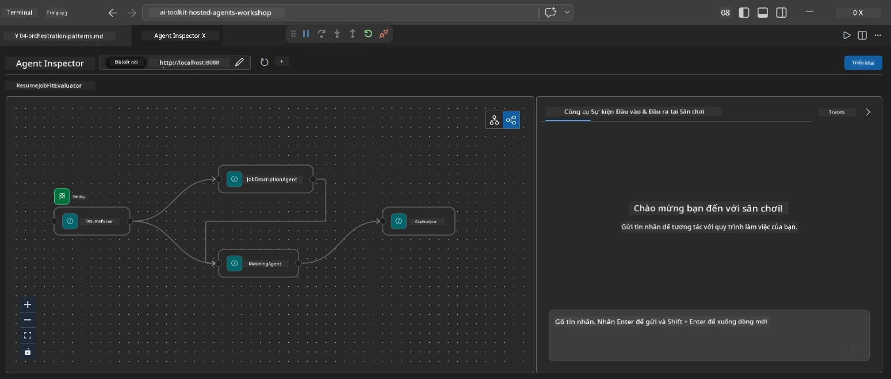
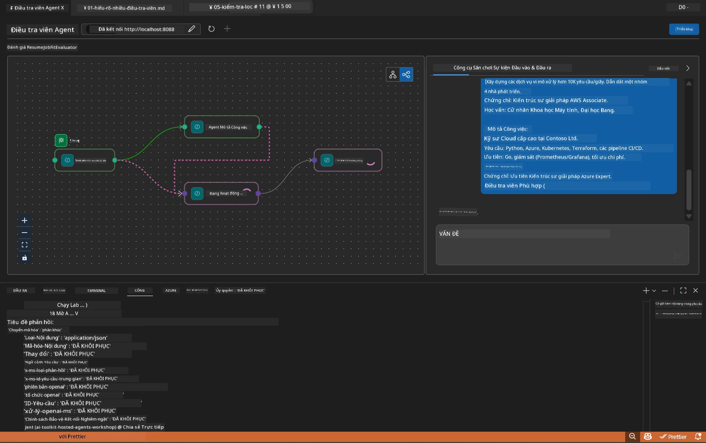
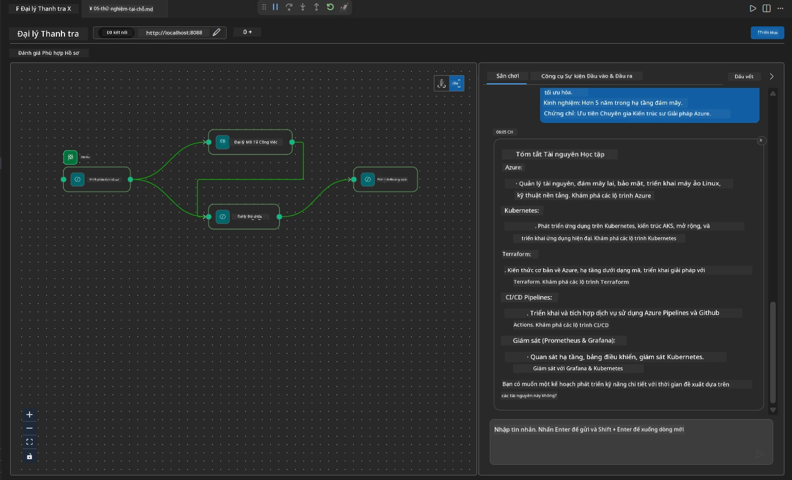

# Module 5 - Kiểm tra cục bộ

⏱️ ~15 phút

Trong module này, bạn sẽ chạy quy trình đa tác nhân cục bộ, kiểm tra nó bằng Agent Inspector, và xác minh tất cả bốn tác nhân cùng công cụ MCP hoạt động chính xác trước khi triển khai.

---

## Bước 1: Khởi động máy chủ tác nhân

### Lựa chọn A: Sử dụng tác vụ VS Code (khuyến nghị)

1. Mở thư mục `workshop/lab02-multi-agent/PersonalCareerCopilot/` trong VS Code.
2. Nhấn `Ctrl+Shift+P` → gõ **Tasks: Run Task** → chọn **Run Agent HTTP Server**.
3. Tác vụ sẽ khởi động máy chủ kèm debugpy trên cổng `5679` và tác nhân trên cổng `8088`.
4. Đợi đầu ra hiển thị:

```
INFO:resume-job-fit:Starting Resume -> Job Fit Evaluator HTTP server...
INFO:resume-job-fit:Server running on http://localhost:8088
```

### Lựa chọn B: Sử dụng F5 (chế độ gỡ lỗi)

1. Nhấn `F5` → chọn **Debug Local Agent HTTP Server**.
2. Máy chủ khởi động với hỗ trợ điểm dừng đầy đủ - hữu ích để kiểm tra phản hồi MCP hoặc đầu ra của tác nhân.

---

## Bước 2: Mở Agent Inspector

1. Nhấn `Ctrl+Shift+P` → gõ **Foundry Toolkit: Open Agent Inspector**.
2. Agent Inspector mở ra dưới dạng bảng điều khiển VS Code kết nối tới `http://localhost:8088`.
3. Bạn sẽ thấy giao diện tác nhân sẵn sàng nhận tin nhắn.



> **Nếu Agent Inspector không mở được:** Đảm bảo máy chủ đã khởi động đầy đủ (bạn thấy log "Server running"). Nếu cổng 5679 đang bị chiếm, xem [Module 8 - Troubleshooting](08-troubleshooting.md).

---

## Bước 2b: (Tùy chọn) Mở Workflow Visualizer

Foundry Toolkit bao gồm **Workflow Visualizer** thời gian thực hiển thị cách các tác nhân tương tác khi đồ thị chạy. Điều này đặc biệt hữu ích cho việc gỡ lỗi đa tác nhân.

1. Nhấn `Ctrl+Shift+P` → gõ **Foundry Toolkit: Open Visualizer for Hosted Agents**.
2. Một tab mới trong VS Code mở ra hiển thị đồ thị thực thi trực tiếp.
3. Khi bạn gửi tin nhắn trong Agent Inspector, visualizer sẽ tự động cập nhật - các nút màu xanh lá cây biểu thị tác nhân đã hoàn thành, các cạnh hoạt hình cho thấy dữ liệu đang chảy giữa chúng.

> **Xung đột cổng:** Nếu cổng visualizer đã bị dùng, thay đổi nó trong Cài đặt VS Code → **Extensions** → **Microsoft Foundry Configuration** → **Hosted Agents: Visualizer Port**.

---

## Bước 3: Chạy các bài kiểm tra cơ bản

Chạy ba bài kiểm tra này theo thứ tự. Mỗi bài kiểm tra kiểm tra dần dần nhiều phần của quy trình.

### Kiểm tra 1: Sơ yếu lý lịch cơ bản + mô tả công việc

Dán đoạn sau vào Agent Inspector:

```
Resume:
Jane Doe
Senior Software Engineer with 5 years of experience in Python, Django, and AWS.
Built microservices handling 10K+ requests/second. Led a team of 4 developers.
Certifications: AWS Solutions Architect Associate.
Education: B.S. Computer Science, State University.

Job Description:
Senior Cloud Engineer at Contoso Ltd.
Required: Python, Azure, Kubernetes, Terraform, CI/CD pipelines.
Preferred: Go, monitoring (Prometheus/Grafana), cost optimization.
Experience: 5+ years in cloud infrastructure.
Certifications: Azure Solutions Architect Expert preferred.
```

**Cấu trúc đầu ra mong đợi:**

Phản hồi phải bao gồm đầu ra của cả bốn tác nhân theo thứ tự:

1. **Đầu ra Bộ phân tích sơ yếu lý lịch** - Hai phần có nhãn: `[PARSED RESUME]` (hồ sơ ứng viên với kỹ năng được nhóm lại) và `[JOB DESCRIPTION PASS-THROUGH]` (văn bản JD nguyên gốc để đưa vào JD Agent)
2. **Đầu ra JD Agent** - Yêu cầu có cấu trúc với kỹ năng bắt buộc và ưu tiên được tách ra
3. **Đầu ra Matching Agent** - Điểm phù hợp (0-100) kèm phân tích, kỹ năng phù hợp, kỹ năng thiếu, khoảng trống
4. **Đầu ra Gap Analyzer** - Thẻ khoảng trống riêng cho mỗi kỹ năng thiếu, mỗi thẻ có URL Microsoft Learn





### Những điều cần xác minh trong Kiểm tra 1

| Kiểm tra | Mong đợi | Đạt không? |
|---------|----------|-----------|
| Phản hồi chứa điểm phù hợp | Số từ 0-100 kèm phân tích | |
| Kỹ năng phù hợp được liệt kê | Python, CI/CD (một phần), v.v. | |
| Kỹ năng thiếu được liệt kê | Azure, Kubernetes, Terraform, v.v. | |
| Có thẻ khoảng trống cho mỗi kỹ năng thiếu | Một thẻ cho mỗi kỹ năng | |
| Có URL Microsoft Learn | Các liên kết thực `learn.microsoft.com` | |
| Không có lỗi trong phản hồi | Đầu ra có cấu trúc sạch sẽ | |

### Kiểm tra 2: Trường hợp biên - ứng viên phù hợp cao

Dán một sơ yếu lý lịch gần như khớp hoàn toàn với JD để kiểm tra xem GapAnalyzer xử lý các kịch bản phù hợp cao thế nào:

```
Resume:
Alex Chen
Senior Cloud Engineer with 7 years of experience.
Skills: Python, Azure (AKS, Functions, DevOps), Kubernetes, Terraform, CI/CD (GitHub Actions, Azure Pipelines), Go, Prometheus, Grafana, cost optimization.
Certifications: Azure Solutions Architect Expert, Azure DevOps Engineer Expert.
Led infrastructure migration to Azure for 3 enterprise clients.
Education: M.S. Computer Science, Tech University.

Job Description:
Senior Cloud Engineer at Contoso Ltd.
Required: Python, Azure, Kubernetes, Terraform, CI/CD pipelines.
Preferred: Go, monitoring (Prometheus/Grafana), cost optimization.
Experience: 5+ years in cloud infrastructure.
Certifications: Azure Solutions Architect Expert preferred.
```

**Hành vi mong đợi:**
- Điểm phù hợp nên là **80+** (hầu hết kỹ năng trùng)
- Các thẻ khoảng trống nên tập trung vào việc trau chuốt/sẵn sàng phỏng vấn thay vì học cơ bản
- Hướng dẫn GapAnalyzer ghi: "Nếu phù hợp >= 80, tập trung vào trau chuốt/sẵn sàng phỏng vấn"

---

## Bước 4: Kiểm tra với dữ liệu của bạn (tùy chọn)

Thử dán sơ yếu lý lịch và mô tả công việc thực tế của bạn. Điều này giúp xác minh:

- Các tác nhân xử lý các định dạng sơ yếu lý lịch khác nhau (theo thời gian, theo chức năng, kết hợp)
- JD Agent xử lý các kiểu mô tả công việc khác nhau (điểm đầu dòng, đoạn văn, có cấu trúc)
- Công cụ MCP trả về tài nguyên liên quan cho các kỹ năng thực tế
- Các thẻ khoảng trống được cá nhân hóa phù hợp với nền tảng của bạn

> **Quyền riêng tư - Lộ trình A (Đám mây Foundry):** Văn bản sơ yếu lý lịch và JD được gửi đến triển khai Azure OpenAI của bạn để suy luận. Nó không được ghi log hoặc lưu trữ bởi hạ tầng workshop. Sử dụng tên giả (ví dụ, "Jane Doe") nếu bạn muốn.
>
> **Quyền riêng tư - Lộ trình B (Foundry Local):** Cả bốn suy luận tác nhân chạy hoàn toàn trên thiết bị của bạn. Văn bản sơ yếu lý lịch và mô tả công việc **không bao giờ rời máy của bạn**. Cuộc gọi ra ngoài duy nhất là công cụ MCP lấy tài nguyên từ `https://learn.microsoft.com/api/mcp`; truy vấn đó chỉ chứa tên kỹ năng, không có dữ liệu cá nhân.

---

### Điểm kiểm tra

- [ ] Máy chủ khởi động thành công trên cổng `8088` (log hiển thị "Server running")
- [ ] Agent Inspector mở và kết nối với tác nhân
- [ ] Kiểm tra 1: Phản hồi đầy đủ với điểm phù hợp, kỹ năng đã/phải phù hợp, thẻ khoảng trống và URL Microsoft Learn
- [ ] Kiểm tra 2: Ứng viên phù hợp cao nhận điểm 80+ với các đề xuất tập trung trau chuốt
- [ ] Tất cả các thẻ khoảng trống có mặt (một thẻ cho mỗi kỹ năng thiếu, không bị cắt ngắn)
- [ ] Không có lỗi hoặc traceback trong terminal máy chủ

---

**Trước đó:** [04 - Orchestration Patterns](04-orchestration-patterns.md) · **Tiếp theo:** [06 - Triển khai tới Foundry →](06-deploy-to-foundry.md)

---

<!-- CO-OP TRANSLATOR DISCLAIMER START -->
**Tuyên bố miễn trừ trách nhiệm**:
Tài liệu này đã được dịch bằng dịch vụ dịch thuật AI [Co-op Translator](https://github.com/Azure/co-op-translator). Mặc dù chúng tôi cố gắng đảm bảo độ chính xác, xin lưu ý rằng bản dịch tự động có thể chứa lỗi hoặc sai sót. Tài liệu gốc bằng ngôn ngữ gốc nên được coi là nguồn tin chính thức. Đối với thông tin quan trọng, nên sử dụng dịch vụ dịch thuật chuyên nghiệp bởi con người. Chúng tôi không chịu trách nhiệm về bất kỳ hiểu lầm hoặc giải thích sai nào phát sinh từ việc sử dụng bản dịch này.
<!-- CO-OP TRANSLATOR DISCLAIMER END -->