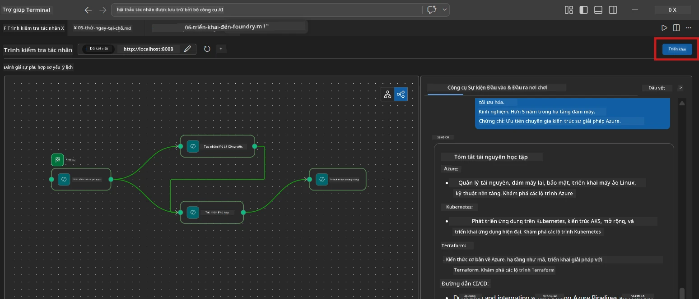
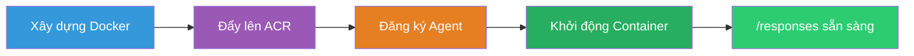
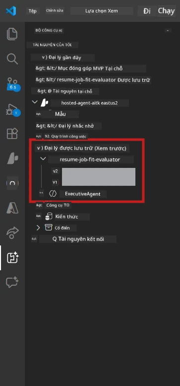

# Module 6 - Triển khai đến Dịch vụ Agent Foundry

Trong module này, bạn sẽ triển khai luồng công việc đa đại lý đã kiểm tra cục bộ lên [Microsoft Foundry](https://learn.microsoft.com/azure/foundry/agents/concepts/hosted-agents) dưới dạng **Hosted Agent**. Quá trình triển khai xây dựng một ảnh container Docker, đẩy nó lên [Azure Container Registry (ACR)](https://learn.microsoft.com/azure/container-registry/container-registry-intro), và tạo phiên bản agent được lưu trữ trong [Foundry Agent Service](https://learn.microsoft.com/azure/foundry/agents/how-to/publish-agent).

> **Khác biệt chính so với Lab 01:** Quá trình triển khai giống hệt. Foundry xử lý luồng công việc đa đại lý của bạn như một agent được lưu trữ duy nhất - sự phức tạp nằm bên trong container, nhưng bề mặt triển khai vẫn là điểm cuối `/responses` giống nhau.

---

## Kiểm tra yêu cầu trước

Trước khi triển khai, xác nhận từng mục dưới đây:

1. **Agent đã vượt qua các bài kiểm tra tại chỗ:**
   - Bạn hoàn thành tất cả 3 bài kiểm tra trong [Module 5](05-test-locally.md) và luồng công việc đã tạo ra kết quả hoàn chỉnh với thẻ cách trống và URL Microsoft Learn.

2. **Bạn có vai trò [Azure AI User](https://learn.microsoft.com/azure/foundry/concepts/rbac-foundry):**
   - Đã được gán trong [Lab 01, Module 2](../../lab01-single-agent/docs/02-create-foundry-project.md). Kiểm tra:
   - [Azure Portal](https://portal.azure.com) → tài nguyên **project** Foundry của bạn → **Access control (IAM)** → **Role assignments** → xác nhận **[Azure AI User](https://aka.ms/foundry-ext-project-role)** được liệt kê cho tài khoản của bạn.

3. **Bạn đã đăng nhập Azure trong VS Code:**
   - Kiểm tra biểu tượng Accounts ở góc dưới bên trái của VS Code. Tên tài khoản của bạn nên hiển thị.

4. **`agent.yaml` có giá trị đúng:**
   - Mở `PersonalCareerCopilot/agent.yaml` và xác nhận:
     ```yaml
     environment_variables:
       - name: PROJECT_ENDPOINT
         value: ${PROJECT_ENDPOINT}
       - name: MODEL_DEPLOYMENT_NAME
         value: ${MODEL_DEPLOYMENT_NAME}
     ```
   - Những giá trị này phải phù hợp với biến môi trường mà `main.py` của bạn đọc.

5. **`requirements.txt` có các phiên bản đúng:**
   ```
   agent-framework-azure-ai==1.0.0rc3
   agent-framework-core==1.0.0rc3
   azure-ai-agentserver-agentframework==1.0.0b16
   azure-ai-agentserver-core==1.0.0b16
   debugpy
   agent-dev-cli --pre
   ```

---

## Bước 1: Bắt đầu triển khai

### Lựa chọn A: Triển khai từ Agent Inspector (khuyến nghị)

Nếu agent đang chạy qua F5 với cửa sổ Agent Inspector mở:

1. Nhìn góc **phía trên bên phải** của bảng Agent Inspector.
2. Nhấp vào nút **Deploy** (biểu tượng đám mây với mũi tên lên ↑).
3. Trình hướng dẫn triển khai sẽ mở ra.



### Lựa chọn B: Triển khai từ Command Palette

1. Nhấn `Ctrl+Shift+P` để mở **Command Palette**.
2. Gõ: **Microsoft Foundry: Deploy Hosted Agent** và chọn nó.
3. Trình hướng dẫn triển khai sẽ mở ra.

---

## Bước 2: Cấu hình triển khai

### 2.1 Chọn dự án mục tiêu

1. Một danh sách thả xuống hiển thị các dự án Foundry của bạn.
2. Chọn dự án bạn đã sử dụng xuyên suốt buổi workshop (ví dụ, `workshop-agents`).

### 2.2 Chọn tập tin container agent

1. Bạn sẽ được yêu cầu chọn điểm vào agent.
2. Điều hướng đến `workshop/lab02-multi-agent/PersonalCareerCopilot/` và chọn **`main.py`**.

### 2.3 Cấu hình tài nguyên

| Cài đặt | Giá trị khuyến nghị | Ghi chú |
|---------|---------------------|---------|
| **CPU** | `0.25` | Mặc định. Luồng công việc đa đại lý không cần nhiều CPU vì các cuộc gọi tới mô hình bị ràng buộc I/O |
| **Bộ nhớ** | `0.5Gi` | Mặc định. Tăng lên `1Gi` nếu bạn thêm các công cụ xử lý dữ liệu lớn |

---

## Bước 3: Xác nhận và triển khai

1. Trình hướng dẫn hiển thị bản tóm tắt triển khai.
2. Xem lại và nhấp **Confirm and Deploy**.
3. Theo dõi tiến trình trên VS Code.

### Điều gì xảy ra trong quá trình triển khai

Theo dõi bảng **Output** của VS Code (chọn danh mục thả xuống "Microsoft Foundry"):


1. **Docker build** - Xây dựng container từ `Dockerfile` của bạn:
   ```
   Step 1/6 : FROM python:3.14-slim
   Step 2/6 : WORKDIR /app
   ...
   Successfully built abc123def456
   ```

2. **Docker push** - Đẩy ảnh lên ACR (1-3 phút vào lần triển khai đầu tiên).

3. **Đăng ký agent** - Foundry tạo một hosted agent sử dụng metadata từ `agent.yaml`. Tên agent là `resume-job-fit-evaluator`.

4. **Khởi động container** - Container được khởi chạy trong hạ tầng được quản lý của Foundry với một danh tính được quản lý hệ thống.

> **Lần triển khai đầu tiên chậm hơn** (Docker đẩy tất cả các lớp). Những lần triển khai sau sử dụng lại các lớp đã được lưu cache nên nhanh hơn.

### Ghi chú dành riêng cho multi-agent

- **Cả bốn agent đều nằm trong một container.** Foundry coi đó là một hosted agent duy nhất. Đồ thị WorkflowBuilder chạy nội bộ bên trong.
- **Các cuộc gọi MCP đi ra ngoài.** Container cần có truy cập internet để đến `https://learn.microsoft.com/api/mcp`. Hạ tầng được quản lý của Foundry cung cấp điều này mặc định.
- **[Managed Identity](https://learn.microsoft.com/python/api/overview/azure/identity-readme#managed-identity-support).** Trong môi trường hosted, `get_credential()` trong `main.py` trả về `ManagedIdentityCredential()` (vì `MSI_ENDPOINT` được thiết lập). Đây là tự động.

---

## Bước 4: Kiểm tra trạng thái triển khai

1. Mở thanh sidebar **Microsoft Foundry** (nhấp biểu tượng Foundry trên thanh hoạt động).
2. Mở rộng **Hosted Agents (Preview)** trong dự án của bạn.
3. Tìm **resume-job-fit-evaluator** (hoặc tên agent của bạn).
4. Nhấp tên agent → mở rộng các phiên bản (ví dụ `v1`).
5. Nhấp chọn phiên bản → kiểm tra **Container Details** → **Status**:



| Trạng thái | Ý nghĩa |
|------------|----------|
| **Started** / **Running** | Container đang chạy, agent đã sẵn sàng |
| **Pending** | Container đang khởi động (chờ 30-60 giây) |
| **Failed** | Container khởi động thất bại (kiểm tra nhật ký - xem bên dưới) |

> **Khởi động multi-agent mất nhiều thời gian hơn** single-agent vì container khởi tạo 4 thể hiện agent khi bắt đầu. "Pending" lên đến 2 phút là bình thường.

---

## Các lỗi triển khai thường gặp và cách sửa

### Lỗi 1: Permission denied - `agents/write`

```
Error: lacks the required data action 
Microsoft.CognitiveServices/accounts/AIServices/agents/write
```

**Sửa:** Gán vai trò **[Azure AI User](https://learn.microsoft.com/azure/foundry/concepts/rbac-foundry)** trên cấp **dự án**. Xem [Module 8 - Xử lý sự cố](08-troubleshooting.md) để có hướng dẫn từng bước.

### Lỗi 2: Docker không chạy

```
Error: Docker build failed / Cannot connect to Docker daemon
```

**Sửa:**
1. Khởi động Docker Desktop.
2. Chờ thông báo "Docker Desktop is running".
3. Kiểm tra: `docker info`
4. **Windows:** Đảm bảo backend WSL 2 được bật trong cài đặt Docker Desktop.
5. Thử lại.

### Lỗi 3: pip install lỗi trong quá trình Docker build

```
Error: Could not find a version that satisfies the requirement agent-dev-cli
```

**Sửa:** Tham số `--pre` trong `requirements.txt` được xử lý khác trong Docker. Đảm bảo `requirements.txt` của bạn có:
```
agent-dev-cli --pre
```

Nếu Docker vẫn lỗi, tạo file `pip.conf` hoặc truyền `--pre` qua tham số build. Xem [Module 8](08-troubleshooting.md).

### Lỗi 4: Công cụ MCP không hoạt động trong hosted agent

Nếu Gap Analyzer ngừng tạo URL Microsoft Learn sau khi triển khai:

**Nguyên nhân:** Chính sách mạng có thể chặn HTTPS outbound từ container.

**Sửa:**
1. Thường không phải vấn đề khi dùng cấu hình mặc định của Foundry.
2. Nếu xảy ra, kiểm tra xem mạng ảo dự án Foundry có NSG chặn HTTPS outbound không.
3. Công cụ MCP có URL dự phòng tích hợp sẵn, vì vậy agent vẫn tạo đầu ra (nhưng không có URL trực tiếp).

---

### Kiểm tra điểm chốt

- [ ] Lệnh triển khai hoàn tất không lỗi trên VS Code
- [ ] Agent hiển thị dưới **Hosted Agents (Preview)** trong thanh sidebar Foundry
- [ ] Tên agent là `resume-job-fit-evaluator` (hoặc tên bạn chọn)
- [ ] Trạng thái container hiển thị **Started** hoặc **Running**
- [ ] (Nếu lỗi) Bạn đã xác định lỗi, áp dụng sửa và triển khai lại thành công

---

**Trước:** [05 - Test Locally](05-test-locally.md) · **Tiếp:** [07 - Verify in Playground →](07-verify-in-playground.md)

---

<!-- CO-OP TRANSLATOR DISCLAIMER START -->
**Từ chối trách nhiệm**:  
Tài liệu này đã được dịch bằng dịch vụ dịch thuật AI [Co-op Translator](https://github.com/Azure/co-op-translator). Mặc dù chúng tôi cố gắng đảm bảo tính chính xác, xin lưu ý rằng các bản dịch tự động có thể chứa lỗi hoặc sự không chính xác. Tài liệu gốc bằng ngôn ngữ gốc của nó nên được xem là nguồn đáng tin cậy nhất. Đối với các thông tin quan trọng, nên sử dụng dịch vụ dịch thuật chuyên nghiệp do con người thực hiện. Chúng tôi không chịu trách nhiệm về bất kỳ sự hiểu lầm hay giải thích sai nào phát sinh từ việc sử dụng bản dịch này.
<!-- CO-OP TRANSLATOR DISCLAIMER END -->