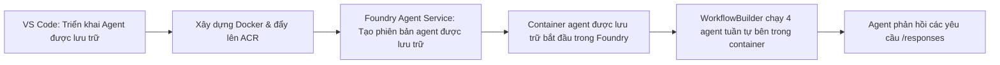
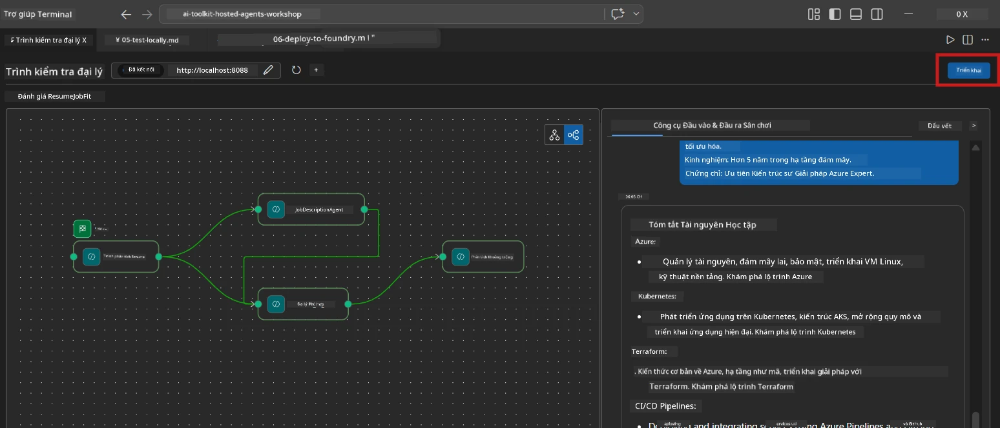

# Module 6 - Triển khai tới Dịch vụ Foundry Agent

⏱️ ~10 phút

Trong module này, bạn triển khai workflow đa tác nhân đã được thử nghiệm cục bộ của mình lên [Microsoft Foundry](https://learn.microsoft.com/azure/foundry/agents/concepts/hosted-agents) như một **Tác nhân được lưu trữ**. Quá trình triển khai xây dựng một hình ảnh container Docker, đẩy nó lên [Azure Container Registry (ACR)](https://learn.microsoft.com/azure/container-registry/container-registry-intro) và tạo phiên bản tác nhân được lưu trữ trong [Foundry Agent Service](https://learn.microsoft.com/azure/foundry/agents/how-to/publish-agent).

> **Khác biệt chính so với Lab 01:** Quá trình triển khai là giống nhau. Foundry coi workflow đa tác nhân của bạn như một tác nhân được lưu trữ duy nhất - sự phức tạp nằm bên trong container, nhưng bề mặt triển khai vẫn là điểm cuối `/responses` giống nhau.

### Chuỗi triển khai


```mermaid
flowchart LR
    A[VS Code: Triển khai Agent được lưu trữ] --> B[Xây dựng Docker & đẩy lên ACR]
    B --> C[Foundry Agent Service: Tạo phiên bản agent được lưu trữ]
    C --> D[Container agent được lưu trữ bắt đầu trong Foundry]
    D --> E[WorkflowBuilder chạy 4 agent tuần tự bên trong container]
    E --> F[Agent phản hồi các yêu cầu /responses]
```

---

## Kiểm tra điều kiện tiên quyết

Trước khi triển khai, hãy kiểm tra từng mục bên dưới:

1. **Tác nhân vượt qua các kiểm tra thử cục bộ:**
   - Bạn đã hoàn thành cả 3 bài kiểm tra trong [Module 5](05-test-locally.md) và workflow đã tạo ra đầu ra đầy đủ với các thẻ gap và URL Microsoft Learn.

2. **Bạn có vai trò [Foundry User](https://learn.microsoft.com/azure/foundry/concepts/rbac-foundry)** (để triển khai, bạn cần tối thiểu là **Foundry Project Manager** ở phạm vi dự án):

   > **Lưu ý:** Các vai trò RBAC của Foundry gần đây được đổi tên - **Foundry User**, **Foundry Owner**, và **Foundry Project Manager** trước đây là Azure AI User, Azure AI Owner, và Azure AI Project Manager. ID vai trò và quyền hạn không đổi.

   - Xác nhận trong [Azure Portal](https://portal.azure.com) → tài nguyên **dự án** Foundry của bạn → **Truy cập kiểm soát (IAM)** → **Phân công vai trò** → xác nhận **Foundry User** (hoặc cao hơn) có trong tài khoản của bạn.

3. **Bạn đã đăng nhập vào Azure trong VS Code:**
   - Kiểm tra biểu tượng Tài khoản ở góc dưới bên trái của VS Code. Tên tài khoản của bạn nên hiển thị.

4. **`agent.yaml` có giá trị đúng:**
   - Mở `PersonalCareerCopilot/agent.yaml` và kiểm tra:
     ```yaml
     environment_variables:
       - name: AZURE_AI_MODEL_DEPLOYMENT_NAME
         value: ${AZURE_AI_MODEL_DEPLOYMENT_NAME}
     ```
   - `FOUNDRY_PROJECT_ENDPOINT` **không** được liệt kê ở đây - Foundry sẽ tiêm nó khi chạy. Chỉ `AZURE_AI_MODEL_DEPLOYMENT_NAME` cần được khai báo.

5. **`requirements.txt` có phiên bản đúng:**
   ```
   agent-framework-foundry
   agent-framework-foundry-hosting
   mcp<2,>=1.24.0
   debugpy
   ```

---

## Bước 1: Bắt đầu triển khai

### Lựa chọn A: Triển khai từ Agent Inspector (khuyên dùng)

Nếu tác nhân đang chạy qua F5 với Agent Inspector mở:

1. Nhìn vào **góc trên bên phải** của bảng Agent Inspector.
2. Nhấn nút **Deploy** (biểu tượng đám mây có mũi tên lên ↑).
3. Hộp thoại triển khai mở ra.



### Lựa chọn B: Triển khai từ Command Palette

1. Nhấn `Ctrl+Shift+P` để mở **Command Palette**.
2. Gõ: **Foundry Toolkit: Deploy Hosted Agent** và chọn.
3. Hộp thoại triển khai mở ra.

---

## Bước 2: Cấu hình triển khai

### 2.1 Chọn dự án mục tiêu

1. Một hộp thả xuống hiển thị các dự án Foundry của bạn.
2. Chọn dự án bạn đã sử dụng trong suốt hội thảo (ví dụ: `workshop-agents`).

### 2.2 Chọn tệp tác nhân container

1. Bạn sẽ được yêu cầu chọn điểm nhập của tác nhân.
2. Điều hướng tới `workshop/lab02-multi-agent/PersonalCareerCopilot/` và chọn **`main.py`**.

### 2.3 Cấu hình tài nguyên

| Cài đặt | Giá trị đề xuất | Ghi chú |
|---------|------------------|---------|
| **Phương pháp Triển khai** | **Container** (khuyên dùng) hoặc **Code** | Container xây dựng hình ảnh Docker; Code tải mã nguồn lên dưới dạng ZIP (xem trước) |
| **Container Registry** | **ACR Mặc định** | Foundry tạo và quản lý registry cho bạn |
| **CPU** | `0.25` | Mặc định. Workflow đa tác nhân không cần thêm CPU vì các cuộc gọi mô hình bị giới hạn I/O |
| **Bộ nhớ** | `0.5Gi` | Mặc định. Tăng lên `1Gi` nếu bạn thêm các công cụ xử lý dữ liệu lớn |

---

## Bước 3: Xác nhận và triển khai

1. Hộp thoại hiển thị tóm tắt triển khai.
2. Xem lại và nhấn **Confirm and Deploy**.
3. Theo dõi tiến trình trong VS Code.

### Những gì xảy ra trong lúc triển khai

Theo dõi bảng **Output** của VS Code (chọn dropdown "Microsoft Foundry"):

1. **Xây dựng Docker** - Xây dựng container từ `Dockerfile` của bạn
   ```
   Step 1/6 : FROM python:3.12-slim
   Step 2/6 : WORKDIR /app
   ...
   Successfully built abc123def456
   ```

2. **Đẩy Docker** - Đẩy hình ảnh lên ACR (1-3 phút lần đầu triển khai).

3. **Đăng ký tác nhân** - Foundry tạo tác nhân được lưu trữ sử dụng metadata trong `agent.yaml`. Tên tác nhân là `resume-job-fit-evaluator`.

4. **Khởi động container** - Container bắt đầu trong hạ tầng được quản lý của Foundry với danh tính được quản lý hệ thống.

> **Lần triển khai đầu tiên chậm hơn** (Docker đẩy tất cả các lớp). Các lần sau dùng lại các lớp cache nên nhanh hơn.

### Ghi chú riêng cho đa tác nhân

- **Tất cả bốn tác nhân nằm trong một container.** Foundry nhìn thấy một tác nhân được lưu trữ duy nhất. Đồ thị WorkflowBuilder chạy bên trong.
- **Cuộc gọi MCP đi ra ngoài.** Container cần quyền truy cập internet để đến `https://learn.microsoft.com/api/mcp`. Hạ tầng quản lý của Foundry cung cấp quyền này mặc định.
- **[Danh tính được quản lý](https://learn.microsoft.com/azure/foundry/agents/concepts/agent-identity).** Foundry tự động tạo **danh tính Entra riêng cho từng tác nhân** cho mỗi tác nhân được lưu trữ khi triển khai. Trong môi trường lưu trữ, `DefaultAzureCredential` tự động giải quyết thành danh tính tác nhân này - không cần cấu hình danh tính được quản lý thủ công.

---

## Bước 4: Kiểm tra trạng thái triển khai

1. Mở thanh bên **Microsoft Foundry** (nhấn biểu tượng Foundry trên Thanh Hoạt động).
2. Mở rộng **Hosted Agents (Preview)** trong dự án của bạn.
3. Tìm **resume-job-fit-evaluator** (hoặc tên tác nhân của bạn).
4. Nhấp vào tên tác nhân → mở rộng các phiên bản (ví dụ: `v1`).
5. Nhấp vào phiên bản → kiểm tra **Chi tiết Container** → **Trạng thái**:


| Trạng thái | Ý nghĩa |
|-----------|---------|
| **active** | Tác nhân đang chạy và sẵn sàng nhận yêu cầu |
| **creating** | Container đang khởi động (chờ 30–60 giây) |
| **failed** | Container không khởi động được (xem nhật ký - phía dưới) |

> **Lưu ý:** Thanh bên VS Code có thể hiện nhãn như "Running" hoặc "Started" trong khi trạng thái API thấp hơn dùng `active`/`creating`. Cả hai cách hiển thị đều chỉ trạng thái giống nhau.

> **Khởi động đa tác nhân mất thời gian hơn** so với tác nhân đơn vì container tạo 4 thể hiện tác nhân lúc khởi động. Trạng thái `creating` trong tới 2 phút là bình thường.

---

## Các lỗi triển khai phổ biến và cách khắc phục

### Lỗi 1: Permission denied - `agents/write`

```
Error: lacks the required data action 
Microsoft.CognitiveServices/accounts/AIServices/agents/write
```

**Khắc phục:** Gán vai trò **[Foundry User](https://learn.microsoft.com/azure/foundry/concepts/rbac-foundry)** (trước đây là **Azure AI User**) ở cấp **dự án**. Xem [Module 8 - Khắc phục sự cố](08-troubleshooting.md) để xem hướng dẫn từng bước.

### Lỗi 2: Docker không chạy

```
Error: Docker build failed / Cannot connect to Docker daemon
```

**Khắc phục:**
1. Khởi động Docker Desktop.
2. Chờ đến khi hiện "Docker Desktop is running".
3. Xác nhận: `docker info`
4. **Windows:** Đảm bảo backend WSL 2 được bật trong cài đặt Docker Desktop.
5. Thử lại.

### Lỗi 3: pip install thất bại trong quá trình xây dựng Docker

```
Error: Could not find a version that satisfies the requirement agent-framework-foundry
```

**Khắc phục:** Kiểm tra `requirements.txt` khớp như sau:
```
agent-framework-foundry
agent-framework-foundry-hosting
mcp<2,>=1.24.0
debugpy
```

Nếu xây dựng vẫn thất bại, mạng Docker của bạn có thể đang chặn PyPI. Kiểm tra cài đặt proxy bằng `docker info`.

### Lỗi 4: Công cụ MCP thất bại trong tác nhân lưu trữ

Nếu Gap Analyzer dừng việc tạo URL Microsoft Learn sau khi triển khai:

**Nguyên nhân:** Chính sách mạng có thể chặn HTTPS đi ra từ container.

**Khắc phục:**
1. Thường thì không có vấn đề gì với cấu hình mặc định của Foundry.
2. Nếu xảy ra, kiểm tra xem mạng ảo dự án Foundry có NSG chặn HTTPS đi ra không.
3. Công cụ MCP có URL dự phòng tích hợp sẵn, nên tác nhân vẫn tạo đầu ra (không có URL trực tiếp).

---

### Điểm kiểm tra

- [ ] Lệnh triển khai hoàn tất không lỗi trong VS Code
- [ ] Tác nhân xuất hiện trong **Hosted Agents (Preview)** ở thanh bên Foundry
- [ ] Tên tác nhân là `resume-job-fit-evaluator` (hoặc tên bạn chọn)
- [ ] Trạng thái container hiển thị **Started** hoặc **Running**
- [ ] (Nếu lỗi) Bạn đã xác định lỗi, áp dụng sửa lỗi và triển khai lại thành công

---

**Trước:** [05 - Test Locally](05-test-locally.md) · **Tiếp:** [07 - Verify in Playground →](07-verify-in-playground.md)

---

<!-- CO-OP TRANSLATOR DISCLAIMER START -->
**Tuyên bố miễn trừ trách nhiệm**:
Tài liệu này đã được dịch bằng dịch vụ dịch thuật AI [Co-op Translator](https://github.com/Azure/co-op-translator). Mặc dù chúng tôi cố gắng đảm bảo độ chính xác, xin lưu ý rằng bản dịch tự động có thể chứa lỗi hoặc sai sót. Tài liệu gốc bằng ngôn ngữ gốc nên được coi là nguồn tin chính thức. Đối với thông tin quan trọng, nên sử dụng dịch vụ dịch thuật chuyên nghiệp bởi con người. Chúng tôi không chịu trách nhiệm về bất kỳ hiểu lầm hoặc giải thích sai nào phát sinh từ việc sử dụng bản dịch này.
<!-- CO-OP TRANSLATOR DISCLAIMER END -->