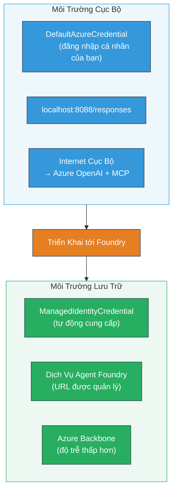

# Module 7 - Xác minh trong Playground

Trong module này, bạn sẽ kiểm tra workflow đa tác nhân đã triển khai của mình trong cả **VS Code** và **[Foundry Portal](https://ai.azure.com)**, xác nhận rằng tác nhân hoạt động giống hệt với khi thử nghiệm cục bộ.

---

## Tại sao phải xác minh sau khi triển khai?

Workflow đa tác nhân của bạn đã chạy hoàn hảo ở cục bộ, vậy tại sao phải thử lại? Môi trường đặt máy chủ có sự khác biệt ở một số điểm:


| Điểm khác biệt | Cục bộ | Đặt máy chủ |
|-----------|-------|--------|
| **Định danh** | [`DefaultAzureCredential`](https://learn.microsoft.com/azure/developer/python/sdk/authentication/credential-chains#defaultazurecredential-overview) (đăng nhập cá nhân của bạn) | [`ManagedIdentityCredential`](https://learn.microsoft.com/python/api/overview/azure/identity-readme#managed-identity-support) (tự động cấp phát) |
| **Điểm cuối** | `http://localhost:8088/responses` | điểm cuối [Foundry Agent Service](https://learn.microsoft.com/azure/foundry/agents/concepts/hosted-agents) (URL được quản lý) |
| **Mạng** | Máy cục bộ → Azure OpenAI + MCP outbound | Hệ thống xương sống Azure (độ trễ thấp giữa các dịch vụ) |
| **Kết nối MCP** | Internet cục bộ → `learn.microsoft.com/api/mcp` | Container outbound → `learn.microsoft.com/api/mcp` |

Nếu có biến môi trường cấu hình sai, RBAC khác biệt, hoặc MCP outbound bị chặn, bạn sẽ phát hiện ở đây.

---

## Lựa chọn A: Thử nghiệm trong VS Code Playground (được khuyến nghị trước)

[Tiện ích mở rộng Foundry](https://marketplace.visualstudio.com/items?itemName=TeamsDevApp.vscode-ai-foundry) bao gồm Playground tích hợp cho phép bạn trò chuyện với tác nhân đã triển khai mà không cần rời VS Code.

### Bước 1: Điều hướng đến tác nhân được đặt máy chủ của bạn

1. Nhấp vào biểu tượng **Microsoft Foundry** trong **Thanh hoạt động** của VS Code (thanh bên trái) để mở bảng Foundry.
2. Mở rộng dự án đã kết nối của bạn (ví dụ `workshop-agents`).
3. Mở rộng **Hosted Agents (Preview)**.
4. Bạn sẽ thấy tên tác nhân của mình (ví dụ `resume-job-fit-evaluator`).

### Bước 2: Chọn phiên bản

1. Nhấp vào tên tác nhân để mở rộng các phiên bản của nó.
2. Nhấp vào phiên bản bạn đã triển khai (ví dụ `v1`).
3. Một **bảng chi tiết** sẽ mở ra hiển thị Chi tiết Container.
4. Xác nhận trạng thái là **Started** hoặc **Running**.

### Bước 3: Mở Playground

1. Trong bảng chi tiết, nhấp vào nút **Playground** (hoặc nhấp chuột phải vào phiên bản → **Open in Playground**).
2. Giao diện trò chuyện sẽ mở ra trong một tab VS Code.

### Bước 4: Chạy các bài kiểm tra nhanh

Sử dụng 3 bài kiểm tra từ [Module 5](05-test-locally.md). Gõ từng tin nhắn vào hộp nhập trong Playground và nhấn **Send** (hoặc **Enter**).

#### Kiểm tra 1 - Hồ sơ đầy đủ + JD (luồng chuẩn)

Dán prompt hồ sơ đầy đủ + JD từ Module 5, Kiểm tra 1 (Jane Doe + Senior Cloud Engineer tại Contoso Ltd).

**Kỳ vọng:**
- Điểm phù hợp với tính toán chi tiết (thang điểm 100)
- Mục Kỹ năng phù hợp
- Mục Kỹ năng thiếu
- **Mỗi thẻ khoảng trống cho một kỹ năng thiếu** có URL Microsoft Learn
- Lộ trình học tập với mốc thời gian

#### Kiểm tra 2 - Kiểm tra nhanh ngắn (đầu vào tối thiểu)

```
RESUME: 3 years Python developer, knows Django and PostgreSQL, no cloud experience.

JOB: Cloud DevOps Engineer requiring AWS, Kubernetes, Terraform, CI/CD. 5 years needed.
```

**Kỳ vọng:**
- Điểm phù hợp thấp hơn (< 40)
- Đánh giá trung thực với lộ trình học tập từng giai đoạn
- Nhiều thẻ khoảng trống (AWS, Kubernetes, Terraform, CI/CD, thiếu kinh nghiệm)

#### Kiểm tra 3 - Ứng viên phù hợp cao

```
RESUME:
10 years Azure Cloud Architect. AZ-305 certified. Expert in AKS, Terraform, Azure DevOps, 
Azure Functions, Helm, Prometheus, Grafana, Python, Go. Led platform team of 8.

JOB:
Senior Cloud Engineer. Required: AKS, Terraform, Azure DevOps, Python. Preferred: Helm, Go.
5+ years experience. AZ-305 preferred.
```

**Kỳ vọng:**
- Điểm phù hợp cao (≥ 80)
- Tập trung vào chuẩn bị phỏng vấn và mài giũa
- Ít hoặc không có thẻ khoảng trống
- Mốc thời gian ngắn tập trung chuẩn bị

### Bước 5: So sánh với kết quả cục bộ

Mở ghi chú hoặc tab trình duyệt từ Module 5 nơi bạn lưu phản hồi cục bộ. Với mỗi kiểm tra:

- Phản hồi có **cấu trúc giống nhau** không (điểm phù hợp, thẻ khoảng trống, lộ trình)?
- Có theo **bảng điểm giống nhau** (phân tích thang điểm 100)?
- URL **Microsoft Learn** vẫn xuất hiện trong thẻ khoảng trống?
- Có **một thẻ khoảng trống cho mỗi kỹ năng thiếu** (không bị cắt ngắn)?

> **Sự khác biệt nhỏ về câu chữ là bình thường** - mô hình không xác định. Tập trung vào cấu trúc, sự nhất quán chấm điểm và sử dụng công cụ MCP.

---

## Lựa chọn B: Thử nghiệm trong Foundry Portal

[Foundry Portal](https://ai.azure.com) cung cấp playground dựa trên web hữu ích để chia sẻ với đồng đội hoặc các bên liên quan.

### Bước 1: Mở Foundry Portal

1. Mở trình duyệt và truy cập [https://ai.azure.com](https://ai.azure.com).
2. Đăng nhập bằng tài khoản Azure bạn đã sử dụng trong suốt workshop.

### Bước 2: Điều hướng đến dự án của bạn

1. Trên trang chủ, tìm **Recent projects** ở thanh bên trái.
2. Nhấp vào tên dự án của bạn (ví dụ `workshop-agents`).
3. Nếu không thấy, nhấp **All projects** và tìm kiếm.

### Bước 3: Tìm tác nhân đã triển khai

1. Trong điều hướng trái của dự án, nhấp **Build** → **Agents** (hoặc tìm phần **Agents**).
2. Bạn sẽ thấy danh sách tác nhân. Tìm tác nhân đã triển khai của bạn (ví dụ `resume-job-fit-evaluator`).
3. Nhấp vào tên tác nhân để mở trang chi tiết.

### Bước 4: Mở Playground

1. Trên trang chi tiết tác nhân, nhìn vào thanh công cụ trên cùng.
2. Nhấp **Open in playground** (hoặc **Try in playground**).
3. Giao diện trò chuyện mở ra.

### Bước 5: Chạy các bài kiểm tra nhanh cùng

Lặp lại cả 3 bài kiểm tra từ phần VS Code Playground ở trên. So sánh từng phản hồi với kết quả cục bộ (Module 5) và kết quả trong VS Code Playground (Lựa chọn A).

---

## Xác minh đặc thù cho đa tác nhân

Ngoài tính đúng đắn cơ bản, hãy xác minh những hành vi đặc thù cho đa tác nhân sau:

### Thực thi công cụ MCP

| Kiểm tra | Cách xác minh | Điều kiện đạt |
|-------|---------------|----------------|
| Các cuộc gọi MCP thành công | Thẻ khoảng trống chứa URL `learn.microsoft.com` | URL thật, không phải tin nhắn dự phòng |
| Nhiều cuộc gọi MCP | Mỗi khoảng trống ưu tiên Cao/Trung bình có tài nguyên | Không chỉ thẻ khoảng trống đầu tiên |
| Dự phòng MCP hoạt động | Nếu thiếu URL, kiểm tra có văn bản dự phòng | Tác nhân vẫn tạo thẻ khoảng trống (có hoặc không URL) |

### Điều phối tác nhân

| Kiểm tra | Cách xác minh | Điều kiện đạt |
|-------|---------------|----------------|
| Tất cả 4 tác nhân đã chạy | Kết quả có điểm phù hợp VÀ thẻ khoảng trống | Điểm từ MatchingAgent, thẻ từ GapAnalyzer |
| Song song phân tán | Thời gian phản hồi hợp lý (< 2 phút) | Nếu > 3 phút, có thể không chạy song song |
| Tính toàn vẹn luồng dữ liệu | Thẻ khoảng trống tham chiếu kỹ năng từ báo cáo matching | Không có kỹ năng giả tưởng không có trong JD |

---

## Bảng đánh giá xác thực

Dùng bảng này để đánh giá hành vi tác nhân đa tác nhân khi đặt máy chủ:

| # | Tiêu chí | Điều kiện đạt | Đạt? |
|---|----------|---------------|-------|
| 1 | **Đúng chức năng** | Tác nhân phản hồi hồ sơ + JD với điểm phù hợp và phân tích khoảng trống | |
| 2 | **Nhất quán chấm điểm** | Điểm phù hợp dùng thang điểm 100 với phân tích chi tiết | |
| 3 | **Đầy đủ thẻ khoảng trống** | Một thẻ cho mỗi kỹ năng thiếu (không bị cắt hay gộp) | |
| 4 | **Tích hợp công cụ MCP** | Thẻ khoảng trống có URL Microsoft Learn thực | |
| 5 | **Nhất quán cấu trúc** | Cấu trúc đầu ra giống nhau giữa cục bộ và đặt máy chủ | |
| 6 | **Thời gian phản hồi** | Tác nhân đặt máy chủ phản hồi trong 2 phút cho đánh giá đầy đủ | |
| 7 | **Không lỗi** | Không lỗi HTTP 500, không timeout hay phản hồi trống | |

> "Đạt" nghĩa là cả 7 tiêu chí đều đúng cho cả 3 bài kiểm tra nhanh trong ít nhất một playground (VS Code hoặc Portal).

---

## Khắc phục sự cố playground

| Triệu chứng | Nguyên nhân có thể | Khắc phục |
|---------|-------------|-----|
| Playground không tải được | Trạng thái container không phải "Started" | Quay lại [Module 6](06-deploy-to-foundry.md), xác minh trạng thái triển khai. Chờ nếu "Pending" |
| Tác nhân trả về phản hồi rỗng | Tên triển khai mô hình không khớp | Kiểm tra `agent.yaml` → `environment_variables` → `MODEL_DEPLOYMENT_NAME` trùng với mô hình đã triển khai |
| Tác nhân trả lỗi | Thiếu quyền [RBAC](https://learn.microsoft.com/azure/foundry/concepts/rbac-foundry) | Gán **[Azure AI User](https://aka.ms/foundry-ext-project-role)** ở phạm vi dự án |
| Không có URL Microsoft Learn trong thẻ | MCP outbound bị chặn hoặc máy chủ MCP không khả dụng | Kiểm tra container có thể truy cập `learn.microsoft.com`. Xem [Module 8](08-troubleshooting.md) |
| Chỉ một thẻ khoảng trống (bị cắt) | Hướng dẫn GapAnalyzer thiếu block "CRITICAL" | Xem lại [Module 3, Bước 2.4](03-configure-agents.md) |
| Điểm phù hợp khác biệt lớn so với cục bộ | Mô hình hoặc hướng dẫn khác đã triển khai | So sánh biến môi trường `agent.yaml` với `.env` cục bộ. Triển khai lại nếu cần |
| "Agent not found" trong Portal | Triển khai đang lan truyền hoặc thất bại | Chờ 2 phút, làm mới trang. Nếu vẫn thiếu, triển khai lại từ [Module 6](06-deploy-to-foundry.md) |

---

### Điểm kiểm tra

- [ ] Đã thử tác nhân trong VS Code Playground - cả 3 bài kiểm tra nhanh đều đạt
- [ ] Đã thử tác nhân trong Playground của [Foundry Portal](https://ai.azure.com) - cả 3 bài kiểm tra nhanh đều đạt
- [ ] Phản hồi có cấu trúc nhất quán với thử nghiệm cục bộ (điểm phù hợp, thẻ khoảng trống, lộ trình)
- [ ] URL Microsoft Learn có trong thẻ khoảng trống (công cụ MCP hoạt động trong môi trường đặt máy chủ)
- [ ] Một thẻ khoảng trống cho mỗi kỹ năng thiếu (không bị cắt)
- [ ] Không có lỗi hay timeout trong quá trình thử nghiệm
- [ ] Hoàn thành bảng đánh giá xác thực (đạt tất cả 7 tiêu chí)

---

**Trước:** [06 - Deploy to Foundry](06-deploy-to-foundry.md) · **Tiếp theo:** [08 - Troubleshooting →](08-troubleshooting.md)

---

<!-- CO-OP TRANSLATOR DISCLAIMER START -->
**Tuyên bố từ chối trách nhiệm**:  
Tài liệu này đã được dịch bằng dịch vụ dịch thuật AI [Co-op Translator](https://github.com/Azure/co-op-translator). Mặc dù chúng tôi cố gắng đảm bảo độ chính xác, nhưng xin lưu ý rằng bản dịch tự động có thể chứa lỗi hoặc không chính xác. Văn bản gốc bằng ngôn ngữ gốc của nó vẫn được coi là nguồn đáng tin cậy nhất. Đối với các thông tin quan trọng, nên sử dụng dịch thuật chuyên nghiệp bởi con người. Chúng tôi không chịu trách nhiệm về bất kỳ hiểu lầm hoặc giải thích sai nào phát sinh từ việc sử dụng bản dịch này.
<!-- CO-OP TRANSLATOR DISCLAIMER END -->