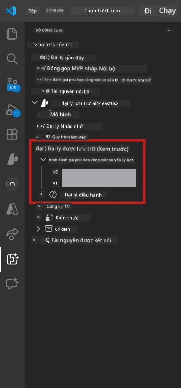

# Mô-đun 7 - Kiểm tra trong Playground

⏱️ ~10 phút

Trong mô-đun này, bạn sẽ kiểm tra quy trình làm việc đa tác nhân đã triển khai trong VS Code và Cổng Foundry, xác nhận rằng tác nhân hoạt động giống như khi thử nghiệm cục bộ.

---

## Tại sao phải kiểm tra lại sau khi triển khai?

Môi trường được lưu trữ khác với môi trường cục bộ ở một số điểm quan trọng:

| | Cục bộ | Được lưu trữ |
|--|-------|--------|
| **Danh tính** | Đăng nhập cá nhân của bạn (`DefaultAzureCredential`) | Danh tính Entra dành riêng cho từng tác nhân (tự động cấp phép khi triển khai) |
| **Điểm cuối** | `http://localhost:8088/responses` | URL được quản lý bởi Dịch vụ Tác nhân Foundry |
| **Mạng** | Máy của bạn → Azure OpenAI + MCP | Hệ thống mạng lưới Azure (độ trễ thấp hơn) |

Một biến môi trường cấu hình sai, sự cố RBAC, hoặc cuộc gọi MCP bị chặn sẽ hiển thị ở đây đầu tiên.

---

## Lựa chọn A: Kiểm tra trong VS Code Playground (được đề xuất trước tiên)

### Bước 1: Điều hướng đến tác nhân được lưu trữ của bạn

1. Nhấp vào biểu tượng **Foundry Toolkit** trên Thanh Hoạt Động.
2. Mở rộng dự án của bạn → **Hosted Agents (Preview)** → tìm tác nhân của bạn.



### Bước 2: Chọn một phiên bản

1. Nhấp vào tác nhân để mở rộng các phiên bản của nó.
2. Nhấp vào `v1` → xác nhận trạng thái là **active** (thanh bên có thể hiển thị "Running" hoặc "Started" - cả hai đều chỉ trạng thái đã sẵn sàng).

### Bước 3: Mở Playground

1. Nhấp vào **Playground** (hoặc nhấp chuột phải vào phiên bản → **Open in Playground**).
2. Một cửa sổ trò chuyện mở trong tab VS Code.

### Bước 4: Chạy các bài kiểm tra cơ bản của bạn

Sử dụng cùng 3 bài kiểm tra từ [Mô-đun 5](05-test-locally.md). Gõ từng tin nhắn trong hộp nhập của Playground và nhấn **Gửi** (hoặc **Enter**).

#### Bài kiểm tra 1 - Toàn bộ hồ sơ + JD (quy trình chuẩn)

Dán đoạn nhắc toàn bộ hồ sơ + JD từ Mô-đun 5, Bài kiểm tra 1 (Jane Doe + Kỹ sư Cloud cấp cao tại Contoso Ltd).

**Kết quả mong đợi:**
- Điểm phù hợp với phân tích chi tiết (thang điểm 100)
- Mục Kỹ năng phù hợp
- Mục Kỹ năng còn thiếu
- **Một thẻ khoảng trống cho mỗi kỹ năng còn thiếu** với URL Microsoft Learn
- Lộ trình học tập với dòng thời gian

#### Bài kiểm tra 2 - Kiểm tra ngắn nhanh (đầu vào tối thiểu)

```
RESUME: 3 years Python developer, knows Django and PostgreSQL, no cloud experience.

JOB: Cloud DevOps Engineer requiring AWS, Kubernetes, Terraform, CI/CD. 5 years needed.
```

**Kết quả mong đợi:**
- Điểm phù hợp thấp hơn (< 40)
- Đánh giá trung thực với lộ trình học từng giai đoạn
- Nhiều thẻ khoảng trống (AWS, Kubernetes, Terraform, CI/CD, khoảng cách kinh nghiệm)

#### Bài kiểm tra 3 - Ứng viên phù hợp cao

```
RESUME:
10 years Azure Cloud Architect. AZ-305 certified. Expert in AKS, Terraform, Azure DevOps, 
Azure Functions, Helm, Prometheus, Grafana, Python, Go. Led platform team of 8.

JOB:
Senior Cloud Engineer. Required: AKS, Terraform, Azure DevOps, Python. Preferred: Helm, Go.
5+ years experience. AZ-305 preferred.
```

**Kết quả mong đợi:**
- Điểm phù hợp cao (≥ 80)
- Tập trung vào chuẩn bị phỏng vấn và làm đẹp hồ sơ
- Ít hoặc không có thẻ khoảng trống
- Dòng thời gian ngắn tập trung vào chuẩn bị

### Bước 5: So sánh với kết quả cục bộ

Mở ghi chép hoặc tab trình duyệt từ Mô-đun 5 nơi bạn đã lưu các phản hồi cục bộ. Với mỗi bài kiểm tra:

- Phản hồi có **cấu trúc giống nhau** không (điểm phù hợp, thẻ khoảng trống, lộ trình)?
- Có tuân theo **bảng chấm điểm giống nhau** (phân tích thang điểm 100) không?
- Có **URL Microsoft Learn** vẫn xuất hiện trong các thẻ khoảng trống không?
- Có **một thẻ khoảng trống cho mỗi kỹ năng còn thiếu** (không bị cắt ngắn)?

> **Khác biệt nhỏ về cách diễn đạt là bình thường** - mô hình có tính không xác định. Tập trung vào cấu trúc, sự nhất quán trong chấm điểm và việc sử dụng công cụ MCP.

---

## Lựa chọn B: Kiểm tra trong Cổng Foundry

[Cổng Foundry](https://ai.azure.com) cung cấp một Playground dựa trên web hữu ích để chia sẻ với đồng đội hoặc các bên liên quan.

### Bước 1: Mở Cổng Foundry

1. Mở trình duyệt và điều hướng đến [https://ai.azure.com](https://ai.azure.com).
2. Đăng nhập bằng tài khoản Azure bạn đã sử dụng trong toàn bộ workshop.

### Bước 2: Điều hướng đến dự án của bạn

1. Trên trang chủ, tìm **Recent projects** ở thanh bên trái.
2. Nhấp vào tên dự án của bạn (ví dụ: `workshop-agents`).
3. Nếu không thấy, nhấp **All projects** và tìm kiếm.

### Bước 3: Tìm tác nhân đã triển khai của bạn

1. Trong điều hướng bên trái của dự án, nhấp **Build** → **Agents** (hoặc tìm phần **Agents**).
2. Bạn sẽ thấy danh sách các tác nhân. Tìm tác nhân đã triển khai (ví dụ: `resume-job-fit-evaluator`).
3. Nhấp vào tên tác nhân để mở trang chi tiết.

### Bước 4: Mở Playground

1. Trên trang chi tiết tác nhân, nhìn vào thanh công cụ trên cùng.
2. Nhấp **Open in playground** (hoặc **Try in playground**).
3. Giao diện trò chuyện mở ra.

### Bước 5: Chạy cùng các bài kiểm tra cơ bản

Lặp lại tất cả 3 bài kiểm tra từ phần VS Code Playground ở trên. So sánh từng phản hồi với cả kết quả cục bộ (Mô-đun 5) và kết quả trong VS Code Playground (Lựa chọn A ở trên).

---

## Xác nhận đặc thù đa tác nhân

Ngoài tính đúng cơ bản, hãy xác nhận các hành vi đặc thù đa tác nhân sau:

### Thực thi công cụ MCP

| Kiểm tra | Cách xác minh | Điều kiện vượt qua |
|-------|---------------|----------------|
| Cuộc gọi MCP thành công | Thẻ khoảng trống chứa URL `learn.microsoft.com` | URL thực, không phải thông báo dự phòng |
| Nhiều cuộc gọi MCP | Mỗi khoảng trống ưu tiên Cao/Trung bình có tài nguyên | Không chỉ thẻ khoảng trống đầu tiên |
| MCP dự phòng hoạt động | Nếu thiếu URL, kiểm tra văn bản dự phòng | Tác nhân vẫn tạo thẻ khoảng trống (có hoặc không có URL) |

### Điều phối tác nhân

| Kiểm tra | Cách xác minh | Điều kiện vượt qua |
|-------|---------------|----------------|
| Tất cả 4 tác nhân đã chạy | Kết quả chứa điểm phù hợp VÀ thẻ khoảng trống | Điểm từ MatchingAgent, thẻ từ GapAnalyzer |
| Thực thi tuần tự | Thời gian phản hồi hợp lý (< 2 phút) | Nếu > 3 phút, kiểm tra lỗi trong nhật ký terminal |
| Toàn vẹn luồng dữ liệu | Thẻ khoảng trống tham chiếu kỹ năng từ báo cáo so khớp | Không có kỹ năng ảo không nằm trong JD |

---

## Bảng đánh giá xác nhận

Dùng bảng này để đánh giá hành vi lưu trữ của quy trình đa tác nhân của bạn:

| # | Tiêu chí | Điều kiện vượt qua | Đạt? |
|---|----------|---------------|-------|
| 1 | **Đúng chức năng** | Tác nhân phản hồi hồ sơ + JD với điểm phù hợp và phân tích khoảng trống | |
| 2 | **Nhất quán trong chấm điểm** | Điểm phù hợp sử dụng thang điểm 100 với phân tích chi tiết | |
| 3 | **Đầy đủ thẻ khoảng trống** | Một thẻ cho mỗi kỹ năng thiếu (không bị cắt hoặc gom chung) | |
| 4 | **Tích hợp công cụ MCP** | Thẻ khoảng trống bao gồm URL Microsoft Learn thực | |
| 5 | **Nhất quán cấu trúc** | Cấu trúc đầu ra khớp giữa chạy cục bộ và lưu trữ | |
| 6 | **Thời gian phản hồi** | Tác nhân lưu trữ phản hồi trong 2 phút cho đánh giá đầy đủ | |
| 7 | **Không có lỗi** | Không có lỗi HTTP 500, hết thời gian chờ, hoặc phản hồi rỗng | |

> Một "đạt" nghĩa là tất cả 7 tiêu chí được đáp ứng cho cả 3 bài kiểm tra cơ bản ở ít nhất một playground (VS Code hoặc Cổng).

---

## Khắc phục sự cố playground

| Triệu chứng | Nguyên nhân có thể | Cách sửa |
|---------|-------------|-----|
| Playground không tải được | Container không ở trạng thái `active` | Quay lại [Mô-đun 6](06-deploy-to-foundry.md), xác minh trạng thái triển khai. Đợi nếu đang `creating` |
| Tác nhân trả về phản hồi rỗng | Tên triển khai mô hình không khớp | Kiểm tra `agent.yaml` → `environment_variables` → `AZURE_AI_MODEL_DEPLOYMENT_NAME` khớp với mô hình đã triển khai |
| Tác nhân trả về lỗi | Thiếu quyền [RBAC](https://learn.microsoft.com/azure/foundry/concepts/rbac-foundry) | Gán **[Foundry User](https://aka.ms/foundry-ext-project-role)** (trước đây là Azure AI User) ở phạm vi dự án |
| Không có URL Microsoft Learn trong thẻ khoảng trống | MCP outbound bị chặn hoặc máy chủ MCP không khả dụng | Kiểm tra xem container có thể truy cập `learn.microsoft.com` không. Xem [Mô-đun 8](08-troubleshooting.md) |
| Chỉ có 1 thẻ khoảng trống (bị cắt ngắn) | Hướng dẫn GapAnalyzer thiếu khối "CRITICAL" | Xem lại [Mô-đun 3, Bước 2.4](03-configure-agents.md) |
| Điểm phù hợp chênh lệch lớn so với cục bộ | Mô hình hoặc hướng dẫn khác được triển khai | So sánh biến môi trường trong `agent.yaml` với `.env` cục bộ. Triển khai lại nếu cần |
| "Không tìm thấy tác nhân" trong Cổng | Triển khai đang lan truyền hoặc bị lỗi | Đợi 2 phút, làm mới. Nếu vẫn mất, triển khai lại từ [Mô-đun 6](06-deploy-to-foundry.md) |

---

### Điểm kiểm tra

- [ ] Đã kiểm tra tác nhân trong VS Code Playground - tất cả 3 bài kiểm tra cơ bản đều đạt
- [ ] Đã kiểm tra tác nhân trong Playground của [Cổng Foundry](https://ai.azure.com) - tất cả 3 bài kiểm tra cơ bản đều đạt
- [ ] Phản hồi có cấu trúc nhất quán với thử nghiệm cục bộ (điểm phù hợp, thẻ khoảng trống, lộ trình)
- [ ] URL Microsoft Learn có trong thẻ khoảng trống (công cụ MCP hoạt động trong môi trường lưu trữ)
- [ ] Một thẻ khoảng trống cho mỗi kỹ năng còn thiếu (không cắt ngắn)
- [ ] Không có lỗi hoặc hết thời gian chờ trong quá trình thử nghiệm
- [ ] Hoàn thành bảng đánh giá xác nhận (tất cả 7 tiêu chí đạt)

---

**Trước đó:** [06 - Triển khai lên Foundry](06-deploy-to-foundry.md) · **Tiếp theo:** [08 - Khắc phục sự cố →](08-troubleshooting.md)

---

<!-- CO-OP TRANSLATOR DISCLAIMER START -->
**Tuyên bố miễn trừ trách nhiệm**:
Tài liệu này đã được dịch bằng dịch vụ dịch thuật AI [Co-op Translator](https://github.com/Azure/co-op-translator). Mặc dù chúng tôi cố gắng đảm bảo độ chính xác, xin lưu ý rằng bản dịch tự động có thể chứa lỗi hoặc sai sót. Tài liệu gốc bằng ngôn ngữ gốc nên được coi là nguồn tin chính thức. Đối với thông tin quan trọng, nên sử dụng dịch vụ dịch thuật chuyên nghiệp bởi con người. Chúng tôi không chịu trách nhiệm về bất kỳ hiểu lầm hoặc giải thích sai nào phát sinh từ việc sử dụng bản dịch này.
<!-- CO-OP TRANSLATOR DISCLAIMER END -->