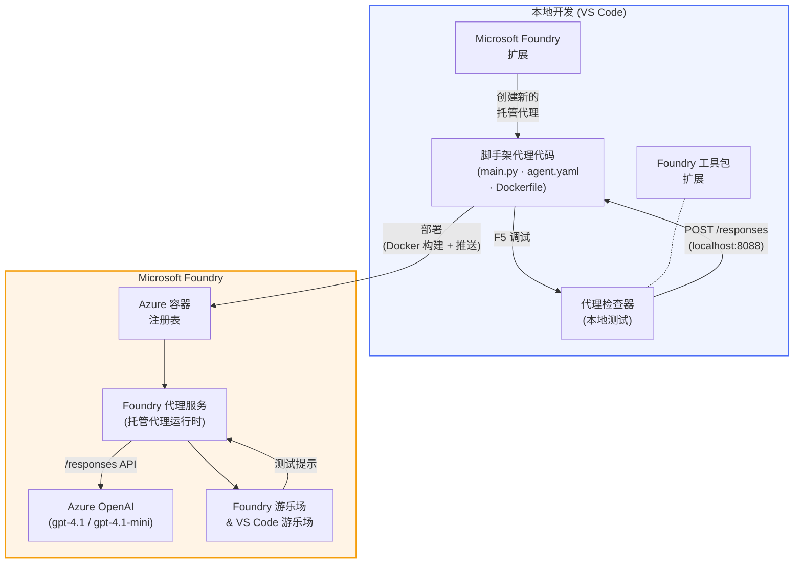

# Foundry 工具包 + Foundry 托管代理工作坊

[](https://www.python.org/)
[](https://github.com/microsoft/agents)
[](https://learn.microsoft.com/azure/ai-foundry/agents/concepts/hosted-agents/)
[](https://ai.azure.com/)
[](https://learn.microsoft.com/azure/ai-services/openai/)
[](https://learn.microsoft.com/cli/azure/install-azure-cli)
[](https://learn.microsoft.com/azure/developer/azure-developer-cli/install-azd)
[](https://www.docker.com/)
[](https://marketplace.visualstudio.com/items?itemName=ms-windows-ai-studio.windows-ai-studio)
[](LICENSE)

完全通过 VS Code 使用 **Microsoft Foundry 扩展** 和 **Foundry 工具包**，构建、测试并部署 AI 代理到 **Microsoft Foundry 代理服务** 作为 <strong>托管代理</strong>。

> **托管代理当前处于预览阶段。** 支持的区域有限 - 请参见[区域可用性](https://learn.microsoft.com/azure/foundry/agents/concepts/hosted-agents#region-availability)。

> 每个实验中的 `agent/` 文件夹是由 Foundry 扩展<strong>自动生成</strong>的 - 然后你可以自定义代码，本地测试并进行部署。

<!-- CO-OP TRANSLATOR LANGUAGES TABLE START -->
[Arabic](../ar/README.md) | [Bengali](../bn/README.md) | [Bulgarian](../bg/README.md) | [Burmese (Myanmar)](../my/README.md) | [Chinese (Simplified)](./README.md) | [Chinese (Traditional, Hong Kong)](../zh-HK/README.md) | [Chinese (Traditional, Macau)](../zh-MO/README.md) | [Chinese (Traditional, Taiwan)](../zh-TW/README.md) | [Croatian](../hr/README.md) | [Czech](../cs/README.md) | [Danish](../da/README.md) | [Dutch](../nl/README.md) | [Estonian](../et/README.md) | [Finnish](../fi/README.md) | [French](../fr/README.md) | [German](../de/README.md) | [Greek](../el/README.md) | [Hebrew](../he/README.md) | [Hindi](../hi/README.md) | [Hungarian](../hu/README.md) | [Indonesian](../id/README.md) | [Italian](../it/README.md) | [Japanese](../ja/README.md) | [Kannada](../kn/README.md) | [Khmer](../km/README.md) | [Korean](../ko/README.md) | [Lithuanian](../lt/README.md) | [Malay](../ms/README.md) | [Malayalam](../ml/README.md) | [Marathi](../mr/README.md) | [Nepali](../ne/README.md) | [Nigerian Pidgin](../pcm/README.md) | [Norwegian](../no/README.md) | [Persian (Farsi)](../fa/README.md) | [Polish](../pl/README.md) | [Portuguese (Brazil)](../pt-BR/README.md) | [Portuguese (Portugal)](../pt-PT/README.md) | [Punjabi (Gurmukhi)](../pa/README.md) | [Romanian](../ro/README.md) | [Russian](../ru/README.md) | [Serbian (Cyrillic)](../sr/README.md) | [Slovak](../sk/README.md) | [Slovenian](../sl/README.md) | [Spanish](../es/README.md) | [Swahili](../sw/README.md) | [Swedish](../sv/README.md) | [Tagalog (Filipino)](../tl/README.md) | [Tamil](../ta/README.md) | [Telugu](../te/README.md) | [Thai](../th/README.md) | [Turkish](../tr/README.md) | [Ukrainian](../uk/README.md) | [Urdu](../ur/README.md) | [Vietnamese](../vi/README.md)

> **更喜欢本地克隆？**
>
> 该仓库包含50多种语言的翻译，显著增加了下载体积。要克隆时不包含翻译，请使用稀疏检出：
>
> **Bash / macOS / Linux:**
> ```bash
> git clone --filter=blob:none --sparse https://github.com/microsoft-foundry/Foundry_Toolkit_for_VSCode_Lab.git
> cd Foundry_Toolkit_for_VSCode_Lab
> git sparse-checkout set --no-cone '/*' '!translations' '!translated_images'
> ```
>
> **CMD (Windows):**
> ```cmd
> git clone --filter=blob:none --sparse https://github.com/microsoft-foundry/Foundry_Toolkit_for_VSCode_Lab.git
> cd Foundry_Toolkit_for_VSCode_Lab
> git sparse-checkout set --no-cone "/*" "!translations" "!translated_images"
> ```
>
> 这能帮你以更快的速度下载完成课程所需的所有资源。
<!-- CO-OP TRANSLATOR LANGUAGES TABLE END -->

---

## 架构


**流程：** Foundry 扩展生成代理脚手架 → 你自定义代码与指令 → 用 Agent Inspector 本地测试 → 部署到 Foundry（Docker 镜像推送到 ACR）→ 在 Playground 验证。

---

## 你将构建的内容

| 实验 | 描述 | 状态 |
|-----|-------------|--------|
| **实验 01 - 单代理** | 构建 **“像给高管解释一样”代理**，本地测试，并部署到 Foundry | ✅ 可用 |
| **实验 02 - 多代理工作流** | 构建 **“简历 → 职位匹配评估器”** - 4 个代理协作进行简历匹配评分并生成学习路线图 | ✅ 可用 |

---

## 认识高管代理

在本工作坊中，你将构建 **“像给高管解释一样”代理** —— 一个 AI 代理，可以把复杂难懂的技术术语转换成平静、适合董事会解读的总结。坦白说，C 级高管谁想听“v3.2 引入的同步调用导致线程序列池耗尽”这些话呢？

我是在经历了太多次我的完善事故回顾报告换来一句：“那网站到底挂了没？” 后，设计了这个代理。

### 工作原理

你输入一条技术更新，它会返回一份高管总结——三个要点，没有行话，没有堆栈跟踪，没有令人绝望的细节。只告诉你：<strong>发生了什么</strong>，<strong>业务影响</strong>，和<strong>下一步</strong>。

### 看它的效果

**你说：**
> “API 延迟增加，是因为 v3.2 引入的同步调用导致线程池耗尽。”

**代理回复：**

> **高管总结：**
> - **发生了什么：** 最新发布后，系统变慢了。
> - **业务影响：** 部分用户使用服务时遇到了延迟。
> - **下一步：** 变更已回滚，正在准备修复方案后重新部署。

### 为什么这个代理？

它是一个非常简单、单一用途的代理——适合学习完整托管代理工作流，而不被复杂工具链干扰。坦白说？每个工程团队都需要这样一个。

---

## 工作坊结构

```
📂 Foundry_Toolkit_for_VSCode_Lab/
├── 📄 README.md                      ← You are here
├── 📂 ExecutiveAgent/                ← Standalone hosted agent project
│   ├── agent.yaml
│   ├── Dockerfile
│   ├── main.py
│   └── requirements.txt
└── 📂 workshop/
    ├── 📂 lab01-single-agent/        ← Full lab: docs + agent code
    │   ├── README.md                 ← Hands-on lab instructions
    │   ├── 📂 docs/                  ← Step-by-step tutorial modules
    │   │   ├── 00-prerequisites.md
    │   │   ├── 01-install-foundry-toolkit.md
    │   │   ├── 02-create-foundry-project.md
    │   │   ├── 03-create-hosted-agent.md
    │   │   ├── 04-configure-and-code.md
    │   │   ├── 05-test-locally.md
    │   │   ├── 06-deploy-to-foundry.md
    │   │   ├── 07-verify-in-playground.md
    │   │   └── 08-troubleshooting.md
    │   └── 📂 agent/                 ← Reference solution (auto-scaffolded by Foundry extension)
    │       ├── agent.yaml
    │       ├── Dockerfile
    │       ├── main.py
    │       └── requirements.txt
    └── 📂 lab02-multi-agent/         ← Resume → Job Fit Evaluator
        ├── README.md                 ← Hands-on lab instructions (end-to-end)
        ├── 📂 docs/                  ← Step-by-step tutorial modules
        │   ├── 00-prerequisites.md
        │   ├── 01-understand-multi-agent.md
        │   ├── 02-scaffold-multi-agent.md
        │   ├── 03-configure-agents.md
        │   ├── 04-orchestration-patterns.md
        │   ├── 05-test-locally.md
        │   ├── 06-deploy-to-foundry.md
        │   ├── 07-verify-in-playground.md
        │   └── 08-troubleshooting.md
        └── 📂 PersonalCareerCopilot/ ← Reference solution (multi-agent workflow)
            ├── agent.yaml
            ├── Dockerfile
            ├── main.py
            └── requirements.txt
```

> **注意：** 每个实验中的 `agent/` 文件夹是你从命令面板运行 `Microsoft Foundry: Create a New Hosted Agent` 时，**Microsoft Foundry 扩展** 生成的文件夹。然后你用代理的指令、工具和配置自定义这些文件。实验01会带你从零开始重现这一过程。

---

## 入门

### 1. 克隆仓库

```bash
git clone https://github.com/microsoft-foundry/Foundry_Toolkit_for_VSCode_Lab.git
cd Foundry_Toolkit_for_VSCode_Lab
```

### 2. 设置 Python 虚拟环境

```bash
python -m venv venv
```

激活它：

- **Windows (PowerShell)：**
  ```powershell
  .\venv\Scripts\Activate.ps1
  ```
- **macOS / Linux：**
  ```bash
  source venv/bin/activate
  ```

### 3. 安装依赖

```bash
pip install -r workshop/lab01-single-agent/agent/requirements.txt
```

### 4. 配置环境变量

复制代理文件夹中的示例 `.env` 文件，并填写你的值：

```bash
cp workshop/lab01-single-agent/agent/.env.example workshop/lab01-single-agent/agent/.env
```

编辑 `workshop/lab01-single-agent/agent/.env`：

```env
AZURE_AI_PROJECT_ENDPOINT=https://<your-account>.services.ai.azure.com/api/projects/<your-project>
MODEL_DEPLOYMENT_NAME=<your-model-deployment-name>
```

### 5. 按工作坊实验进行

每个实验都是独立模块。先从 **实验 01** 学基础，再进行 **实验 02** 了解多代理工作流。

#### 实验 01 - 单代理 ([完整指南](workshop/lab01-single-agent/README.md))

| # | 模块 | 链接 |
|---|--------|------|
| 1 | 阅读前置条件 | [00-prerequisites.md](workshop/lab01-single-agent/docs/00-prerequisites.md) |
| 2 | 安装 Foundry 工具包和 Foundry 扩展 | [01-install-foundry-toolkit.md](workshop/lab01-single-agent/docs/01-install-foundry-toolkit.md) |
| 3 | 创建 Foundry 项目 | [02-create-foundry-project.md](workshop/lab01-single-agent/docs/02-create-foundry-project.md) |
| 4 | 创建托管代理 | [03-create-hosted-agent.md](workshop/lab01-single-agent/docs/03-create-hosted-agent.md) |
| 5 | 配置指令和环境 | [04-configure-and-code.md](workshop/lab01-single-agent/docs/04-configure-and-code.md) |
| 6 | 本地测试 | [05-test-locally.md](workshop/lab01-single-agent/docs/05-test-locally.md) |
| 7 | 部署到 Foundry | [06-deploy-to-foundry.md](workshop/lab01-single-agent/docs/06-deploy-to-foundry.md) |
| 8 | 在 playground 验证 | [07-verify-in-playground.md](workshop/lab01-single-agent/docs/07-verify-in-playground.md) |
| 9 | 故障排除 | [08-troubleshooting.md](workshop/lab01-single-agent/docs/08-troubleshooting.md) |

#### 实验 02 - 多代理工作流 ([完整指南](workshop/lab02-multi-agent/README.md))

| # | 模块 | 链接 |
|---|--------|------|
| 1 | 前置条件（实验 02） | [00-prerequisites.md](workshop/lab02-multi-agent/docs/00-prerequisites.md) |
| 2 | 了解多代理架构 | [01-understand-multi-agent.md](workshop/lab02-multi-agent/docs/01-understand-multi-agent.md) |
| 3 | 脚手架多代理项目 | [02-scaffold-multi-agent.md](workshop/lab02-multi-agent/docs/02-scaffold-multi-agent.md) |
| 4 | 配置代理和环境 | [03-configure-agents.md](workshop/lab02-multi-agent/docs/03-configure-agents.md) |
| 5 | 编排模式 | [04-orchestration-patterns.md](workshop/lab02-multi-agent/docs/04-orchestration-patterns.md) |
| 6 | 本地测试（多代理） | [05-test-locally.md](workshop/lab02-multi-agent/docs/05-test-locally.md) |
| 7 | 部署到 Foundry | [06-deploy-to-foundry.md](workshop/lab02-multi-agent/docs/06-deploy-to-foundry.md) |
| 8 | 在 playground 中验证 | [07-verify-in-playground.md](workshop/lab02-multi-agent/docs/07-verify-in-playground.md) |
| 9 | 故障排除（多代理） | [08-troubleshooting.md](workshop/lab02-multi-agent/docs/08-troubleshooting.md) |

---

## 维护者

<table>
<tr>
    <td align="center"><a href="https://github.com/ShivamGoyal03">
        <br />
        <sub><b>Shivam Goyal</b></sub>
    </a><br />
    </td>
</tr>
</table>

---

## 所需权限（快速参考）

| 场景 | 所需角色 |
|----------|---------------|
| 创建新的 Foundry 项目 | Foundry 资源上的 **Azure AI 所有者** |
| 部署到现有项目（新资源） | 订阅上的 **Azure AI 所有者** + <strong>贡献者</strong> |
| 部署到完全配置的项目 | 账户上的 <strong>读取者</strong> + 项目上的 **Azure AI 用户** |

> **重要：** Azure `Owner` 和 `Contributor` 角色仅包括<em>管理</em>权限，不包括<em>开发</em>（数据操作）权限。构建和部署代理需要 **Azure AI 用户** 或 **Azure AI 所有者**。

---

## 参考资料

- [快速入门：部署你的第一个托管代理（VS Code）](https://learn.microsoft.com/azure/foundry/agents/quickstarts/quickstart-hosted-agent)
- [什么是托管代理？](https://learn.microsoft.com/azure/foundry/agents/concepts/hosted-agents)
- [在 VS Code 中创建托管代理工作流](https://learn.microsoft.com/azure/foundry/agents/how-to/vs-code-agents-workflow-pro-code)
- [部署托管代理](https://learn.microsoft.com/azure/foundry/agents/how-to/deploy-hosted-agent)
- [Microsoft Foundry 的 RBAC](https://learn.microsoft.com/azure/foundry/concepts/rbac-foundry)
- [架构审查代理示例](https://github.com/Azure-Samples/agent-architecture-review-sample) - 使用 MCP 工具、Excalidraw 图表和双重部署的真实托管代理

---

## 许可协议

[MIT](../../LICENSE)

---

<!-- CO-OP TRANSLATOR DISCLAIMER START -->
**免责声明**：
本文档使用 AI 翻译服务 [Co-op Translator](https://github.com/Azure/co-op-translator) 进行翻译。虽然我们努力确保准确性，但请注意，自动翻译可能包含错误或不准确之处。原始语言的文件应被视为权威来源。对于关键信息，建议采用专业人工翻译。对于因使用本翻译而产生的任何误解或误释，我们概不负责。
<!-- CO-OP TRANSLATOR DISCLAIMER END -->