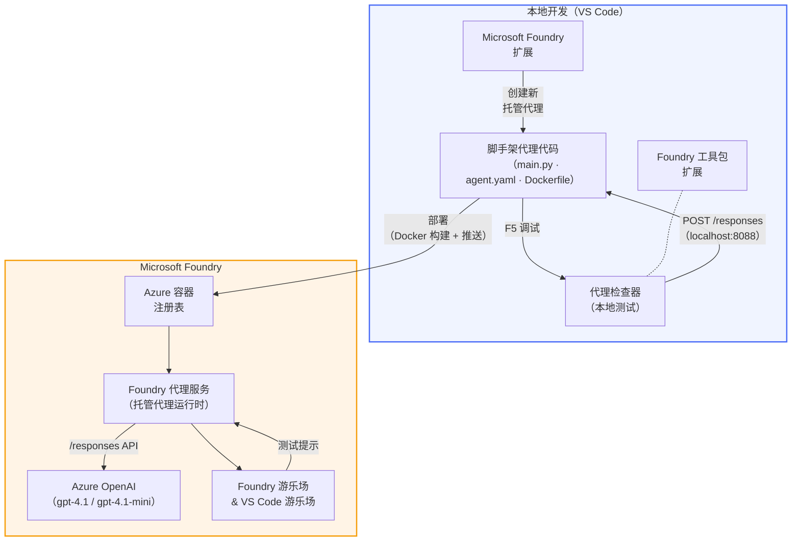

# Foundry 工具包 + Foundry 托管代理工作坊

[](https://www.python.org/)
[](https://github.com/microsoft/agents)
[](https://learn.microsoft.com/azure/ai-foundry/agents/concepts/hosted-agents/)
[](https://ai.azure.com/)
[](https://learn.microsoft.com/azure/ai-services/openai/)
[](https://learn.microsoft.com/cli/azure/install-azure-cli)
[](https://learn.microsoft.com/azure/developer/azure-developer-cli/install-azd)
[](https://www.docker.com/)
[](https://marketplace.visualstudio.com/items?itemName=ms-windows-ai-studio.windows-ai-studio)
[](LICENSE)

构建、测试并部署 AI 代理到 **Microsoft Foundry 代理服务** 作为 <strong>托管代理</strong> —— 完全通过 VS Code 使用 **Microsoft Foundry 扩展** 和 **Foundry 工具包** 进行。

> **托管代理当前处于预览阶段。** 支持的区域有限——请参阅 [区域可用性](https://learn.microsoft.com/azure/foundry/agents/concepts/hosted-agents#region-availability)。

> 每个实验中的 `agent/` 文件夹由 Foundry 扩展 <strong>自动生成脚手架</strong> —— 然后你自定义代码，本地测试并部署。

### 🌐 多语言支持

#### 通过 GitHub Actions 支持（自动且始终保持最新）

<!-- CO-OP TRANSLATOR LANGUAGES TABLE START -->
[阿拉伯语](../ar/README.md) | [孟加拉语](../bn/README.md) | [保加利亚语](../bg/README.md) | [缅甸语（缅甸）](../my/README.md) | [中文（简体）](./README.md) | [中文（繁体，香港）](../zh-HK/README.md) | [中文（繁体，澳门）](../zh-MO/README.md) | [中文（繁体，台湾）](../zh-TW/README.md) | [克罗地亚语](../hr/README.md) | [捷克语](../cs/README.md) | [丹麦语](../da/README.md) | [荷兰语](../nl/README.md) | [爱沙尼亚语](../et/README.md) | [芬兰语](../fi/README.md) | [法语](../fr/README.md) | [德语](../de/README.md) | [希腊语](../el/README.md) | [希伯来语](../he/README.md) | [印地语](../hi/README.md) | [匈牙利语](../hu/README.md) | [印度尼西亚语](../id/README.md) | [意大利语](../it/README.md) | [日语](../ja/README.md) | [卡纳达语](../kn/README.md) | [高棉语](../km/README.md) | [韩语](../ko/README.md) | [立陶宛语](../lt/README.md) | [马来语](../ms/README.md) | [马拉雅拉姆语](../ml/README.md) | [马拉地语](../mr/README.md) | [尼泊尔语](../ne/README.md) | [尼日利亚皮钦语](../pcm/README.md) | [挪威语](../no/README.md) | [波斯语（法尔西语）](../fa/README.md) | [波兰语](../pl/README.md) | [葡萄牙语（巴西）](../pt-BR/README.md) | [葡萄牙语（葡萄牙）](../pt-PT/README.md) | [旁遮普语（古鲁姆克希文）](../pa/README.md) | [罗马尼亚语](../ro/README.md) | [俄语](../ru/README.md) | [塞尔维亚语（西里尔字母）](../sr/README.md) | [斯洛伐克语](../sk/README.md) | [斯洛文尼亚语](../sl/README.md) | [西班牙语](../es/README.md) | [斯瓦希里语](../sw/README.md) | [瑞典语](../sv/README.md) | [他加禄语（菲律宾语）](../tl/README.md) | [泰米尔语](../ta/README.md) | [泰卢固语](../te/README.md) | [泰语](../th/README.md) | [土耳其语](../tr/README.md) | [乌克兰语](../uk/README.md) | [乌尔都语](../ur/README.md) | [越南语](../vi/README.md)

> **更喜欢本地克隆吗？**
>
> 本仓库包括50多种语言的翻译，会显著增加下载大小。若不包含翻译克隆，请使用稀疏检出：
>
> **Bash / macOS / Linux:**
> ```bash
> git clone --filter=blob:none --sparse https://github.com/microsoft-foundry/Foundry_Toolkit_for_VSCode_Lab.git
> cd Foundry_Toolkit_for_VSCode_Lab
> git sparse-checkout set --no-cone '/*' '!translations' '!translated_images'
> ```
>
> **CMD（Windows）:**
> ```cmd
> git clone --filter=blob:none --sparse https://github.com/microsoft-foundry/Foundry_Toolkit_for_VSCode_Lab.git
> cd Foundry_Toolkit_for_VSCode_Lab
> git sparse-checkout set --no-cone "/*" "!translations" "!translated_images"
> ```
>
> 这样你可以更快下载到完成课程所需的全部内容。
<!-- CO-OP TRANSLATOR LANGUAGES TABLE END -->

---

## 架构


**流程：** Foundry 扩展生成代理 → 你自定义代码和指令 → 使用 Agent Inspector 本地测试 → 部署到 Foundry（Docker 镜像推送至 ACR）→ 在 Playground 验证。

---

## 你将构建的内容

| 实验 | 描述 | 状态 |
|-----|-------|--------|
| **实验 01 - 单代理** | 构建 **“像向高管解释一样” 代理**，本地测试，然后部署到 Foundry | ✅ 可用 |
| **实验 02 - 多代理工作流** | 构建 **“简历 → 工作匹配评估器”** - 4 个代理协作评分简历匹配度并生成学习路线图 | ✅ 可用 |

---

## 认识“高管代理”

在本工作坊中，你将构建 **“像向高管解释一样” 代理** —— 一个将复杂技术术语翻译成平稳、适合董事会会议摘要的 AI 代理。说实话，没有高管想听“v3.2 中引入的同步调用导致线程池耗尽”这种术语。

我创建这个代理是因为经历过太多次我的完美事后分析报告，被回复：“那……网站到底是挂了还是没挂？”

### 工作原理

你给它一段技术更新。它吐回一份高管摘要——三点要点，无术语，无堆栈错误，无生存焦虑。只有<strong>发生了什么</strong>、<strong>业务影响</strong>和<strong>下一步</strong>。

### 实际演示

**你说：**
> “API 延迟增加，原因是 v3.2 版本引入的同步调用导致线程池耗尽。”

**代理回复：**

> **高管摘要：**
> - **发生了什么：** 最新发布后系统变慢。
> - **业务影响：** 部分用户使用服务时体验到了延迟。
> - **下一步：** 变更已回滚，正在准备修复后重新部署。

### 为什么选择这个代理？

它非常简单、单一用途——适合从头到尾学习托管代理工作流，不被复杂的工具链拖累。坦白讲？每个工程团队都能用得上这样一个代理。

---

## 工作坊结构

```
📂 Foundry_Toolkit_for_VSCode_Lab/
├── 📄 README.md                      ← You are here
├── 📂 ExecutiveAgent/                ← Standalone hosted agent project
│   ├── agent.yaml
│   ├── Dockerfile
│   ├── main.py
│   └── requirements.txt
└── 📂 workshop/
    ├── 📂 lab01-single-agent/        ← Full lab: docs + agent code
    │   ├── README.md                 ← Hands-on lab instructions
    │   ├── 📂 docs/                  ← Step-by-step tutorial modules
    │   │   ├── 00-prerequisites.md
    │   │   ├── 01-install-foundry-toolkit.md
    │   │   ├── 02-create-foundry-project.md
    │   │   ├── 03-create-hosted-agent.md
    │   │   ├── 04-configure-and-code.md
    │   │   ├── 05-test-locally.md
    │   │   ├── 06-deploy-to-foundry.md
    │   │   ├── 07-verify-in-playground.md
    │   │   └── 08-troubleshooting.md
    │   └── 📂 agent/                 ← Reference solution (auto-scaffolded by Foundry extension)
    │       ├── agent.yaml
    │       ├── Dockerfile
    │       ├── main.py
    │       └── requirements.txt
    └── 📂 lab02-multi-agent/         ← Resume → Job Fit Evaluator
        ├── README.md                 ← Hands-on lab instructions (end-to-end)
        ├── 📂 docs/                  ← Step-by-step tutorial modules
        │   ├── 00-prerequisites.md
        │   ├── 01-understand-multi-agent.md
        │   ├── 02-scaffold-multi-agent.md
        │   ├── 03-configure-agents.md
        │   ├── 04-orchestration-patterns.md
        │   ├── 05-test-locally.md
        │   ├── 06-deploy-to-foundry.md
        │   ├── 07-verify-in-playground.md
        │   └── 08-troubleshooting.md
        └── 📂 PersonalCareerCopilot/ ← Reference solution (multi-agent workflow)
            ├── agent.yaml
            ├── Dockerfile
            ├── main.py
            └── requirements.txt
```

> **注意：** 每个实验中的 `agent/` 文件夹由你在命令面板运行 `Microsoft Foundry: Create a New Hosted Agent` 时由 **Microsoft Foundry 扩展** 自动生成。然后你用自己的指令、工具和配置自定义文件。实验 01 会带你逐步从零创建。

---

## 快速开始

### 1. 克隆仓库

```bash
git clone https://github.com/microsoft-foundry/Foundry_Toolkit_for_VSCode_Lab.git
cd Foundry_Toolkit_for_VSCode_Lab
```

### 2. 设置 Python 虚拟环境

```bash
python -m venv venv
```

激活它：

- **Windows（PowerShell）：**
  ```powershell
  .\venv\Scripts\Activate.ps1
  ```
- **macOS / Linux：**
  ```bash
  source venv/bin/activate
  ```

### 3. 安装依赖

```bash
pip install -r workshop/lab01-single-agent/agent/requirements.txt
```

### 4. 配置环境变量

复制代理文件夹中的示例 `.env` 文件并填写你的值：

```bash
cp workshop/lab01-single-agent/agent/.env.example workshop/lab01-single-agent/agent/.env
```

编辑 `workshop/lab01-single-agent/agent/.env`：

```env
AZURE_AI_PROJECT_ENDPOINT=https://<your-account>.services.ai.azure.com/api/projects/<your-project>
MODEL_DEPLOYMENT_NAME=<your-model-deployment-name>
```

### 5. 跟随工作坊实验

每个实验独立自包含自己的模块。从 **实验 01** 开始学习基础，然后进入 **实验 02** 探索多代理工作流。

#### 实验 01 - 单代理 ([完整说明](workshop/lab01-single-agent/README.md))

| # | 模块 | 链接 |
|---|--------|------|
| 1 | 阅读先决条件 | [00-prerequisites.md](workshop/lab01-single-agent/docs/00-prerequisites.md) |
| 2 | 安装 Foundry 工具包和 Foundry 扩展 | [01-install-foundry-toolkit.md](workshop/lab01-single-agent/docs/01-install-foundry-toolkit.md) |
| 3 | 创建 Foundry 项目 | [02-create-foundry-project.md](workshop/lab01-single-agent/docs/02-create-foundry-project.md) |
| 4 | 创建托管代理 | [03-create-hosted-agent.md](workshop/lab01-single-agent/docs/03-create-hosted-agent.md) |
| 5 | 配置指令和环境 | [04-configure-and-code.md](workshop/lab01-single-agent/docs/04-configure-and-code.md) |
| 6 | 本地测试 | [05-test-locally.md](workshop/lab01-single-agent/docs/05-test-locally.md) |
| 7 | 部署到 Foundry | [06-deploy-to-foundry.md](workshop/lab01-single-agent/docs/06-deploy-to-foundry.md) |
| 8 | 在 Playground 验证 | [07-verify-in-playground.md](workshop/lab01-single-agent/docs/07-verify-in-playground.md) |
| 9 | 故障排除 | [08-troubleshooting.md](workshop/lab01-single-agent/docs/08-troubleshooting.md) |

#### 实验 02 - 多代理工作流 ([完整说明](workshop/lab02-multi-agent/README.md))

| # | 模块 | 链接 |
|---|--------|------|
| 1 | 先决条件（实验 02） | [00-prerequisites.md](workshop/lab02-multi-agent/docs/00-prerequisites.md) |
| 2 | 理解多代理架构 | [01-understand-multi-agent.md](workshop/lab02-multi-agent/docs/01-understand-multi-agent.md) |
| 3 | 搭建多代理项目脚手架 | [02-scaffold-multi-agent.md](workshop/lab02-multi-agent/docs/02-scaffold-multi-agent.md) |
| 4 | 配置代理和环境 | [03-configure-agents.md](workshop/lab02-multi-agent/docs/03-configure-agents.md) |
| 5 | 编排模式 | [04-orchestration-patterns.md](workshop/lab02-multi-agent/docs/04-orchestration-patterns.md) |
| 6 | 本地测试（多代理） | [05-test-locally.md](workshop/lab02-multi-agent/docs/05-test-locally.md) |
| 7 | 部署到 Foundry | [06-deploy-to-foundry.md](workshop/lab02-multi-agent/docs/06-deploy-to-foundry.md) |
| 8 | 在 playground 中验证 | [07-verify-in-playground.md](workshop/lab02-multi-agent/docs/07-verify-in-playground.md) |
| 9 | 故障排除（多代理） | [08-troubleshooting.md](workshop/lab02-multi-agent/docs/08-troubleshooting.md) |

---

## 维护者

<table>
<tr>
    <td align="center"><a href="https://github.com/ShivamGoyal03">
        <br />
        <sub><b>Shivam Goyal</b></sub>
    </a><br />
    </td>
</tr>
</table>

---

## 所需权限（快速参考）

| 场景 | 所需角色 |
|----------|---------------|
| 创建新的 Foundry 项目 | Foundry 资源上的 **Azure AI 所有者** |
| 部署到现有项目（新资源） | 订阅上的 **Azure AI 所有者** + <strong>参与者</strong> |
| 部署到完全配置的项目 | 账户上的 <strong>读者</strong> + 项目上的 **Azure AI 用户** |

> **重要提示：** Azure `所有者` 和 `参与者` 角色仅包含<em>管理</em>权限，不包含<em>开发</em>（数据操作）权限。您需要 **Azure AI 用户** 或 **Azure AI 所有者** 来构建和部署代理。

---

## 参考资料

- [快速入门：部署您的第一个托管代理（VS Code）](https://learn.microsoft.com/azure/foundry/agents/quickstarts/quickstart-hosted-agent)
- [什么是托管代理？](https://learn.microsoft.com/azure/foundry/agents/concepts/hosted-agents)
- [在 VS Code 中创建托管代理工作流](https://learn.microsoft.com/azure/foundry/agents/how-to/vs-code-agents-workflow-pro-code)
- [部署托管代理](https://learn.microsoft.com/azure/foundry/agents/how-to/deploy-hosted-agent)
- [Microsoft Foundry 的 RBAC](https://learn.microsoft.com/azure/foundry/concepts/rbac-foundry)
- [架构评审代理示例](https://github.com/Azure-Samples/agent-architecture-review-sample) - 带有 MCP 工具、Excalidraw 图表和双重部署的真实托管代理

---

## 许可协议

[MIT](../../LICENSE)

---

<!-- CO-OP TRANSLATOR DISCLAIMER START -->
**免责声明**：  
本文档使用 AI 翻译服务 [Co-op Translator](https://github.com/Azure/co-op-translator) 进行翻译。虽然我们力求准确，但请注意自动翻译可能包含错误或不准确之处。原始语言的文档应被视为权威来源。对于关键信息，建议使用专业人工翻译。我们不对因使用本翻译而产生的任何误解或误释承担责任。
<!-- CO-OP TRANSLATOR DISCLAIMER END -->