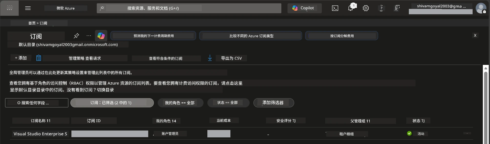

# 模块 0 - 先决条件

在开始工作坊之前，请确认您已经准备好以下工具、访问权限和环境。请按照下面的每一步操作，不要跳过。

---

## 1. Azure 账户和订阅

### 1.1 创建或验证您的 Azure 订阅

1. 打开浏览器，访问 [https://azure.microsoft.com/free/](https://azure.microsoft.com/free/)。
2. 如果您还没有 Azure 账户，点击 <strong>免费开始</strong> 并按照注册流程操作。您需要一个 Microsoft 账户（或创建一个）和一张用于身份验证的信用卡。
3. 如果您已经有账户，访问 [https://portal.azure.com](https://portal.azure.com) 并登录。
4. 在门户左侧导航栏点击 <strong>订阅</strong>（或在顶部搜索栏搜索“订阅”）。
5. 确认您至少看到一个 <strong>活动</strong> 的订阅。记下 **订阅 ID** — 稍后会用到。



### 1.2 了解所需的 RBAC 角色

[托管代理](https://learn.microsoft.com/azure/foundry/agents/concepts/hosted-agents) 部署需要包含 <strong>数据操作</strong> 权限，而标准的 Azure `所有者` 和 `参与者` 角色 <strong>不包括</strong> 这些权限。您将需要以下这些 [角色组合](https://learn.microsoft.com/azure/foundry/concepts/rbac-foundry#built-in-roles)之一：

| 场景 | 所需角色 | 分配位置 |
|----------|---------------|----------------------|
| 创建新的 Foundry 项目 | Foundry 资源上的 **Azure AI 所有者** | Azure 门户中的 Foundry 资源 |
| 部署到现有项目（新资源） | 订阅上的 **Azure AI 所有者** + <strong>参与者</strong> | 订阅 + Foundry 资源 |
| 部署到已完全配置项目 | 账户上的 <strong>阅读者</strong> + 项目上的 **Azure AI 用户** | Azure 门户中的账户 + 项目 |

> **关键点：** Azure `所有者` 和 `参与者` 角色仅涵盖 <em>管理</em> 权限（ARM 操作）。您需要具有 [**Azure AI 用户**](https://learn.microsoft.com/azure/foundry/concepts/rbac-foundry#built-in-roles)（或更高级别）权限来执行 <em>数据操作</em>，比如创建和部署代理所需的 `agents/write` 权限。这些角色将在 [模块 2](02-create-foundry-project.md) 中分配。

---

## 2. 安装本地工具

安装下面列出的每个工具。安装完成后，通过运行检查命令验证其功能。

### 2.1 Visual Studio Code

1. 访问 [https://code.visualstudio.com/](https://code.visualstudio.com/)。
2. 下载适用于您的操作系统的安装程序（Windows/macOS/Linux）。
3. 使用默认设置运行安装程序。
4. 打开 VS Code 确认可以启动。

### 2.2 Python 3.10+

1. 访问 [https://www.python.org/downloads/](https://www.python.org/downloads/)。
2. 下载 Python 3.10 或更高版本（推荐 3.12+）。
3. **Windows：** 安装时，在第一个界面勾选 **“将 Python 添加到 PATH”**。
4. 打开终端并验证：

   ```powershell
   python --version
   ```

   预期输出：`Python 3.10.x` 或更高版本。

### 2.3 Azure CLI

1. 访问 [https://learn.microsoft.com/cli/azure/install-azure-cli](https://learn.microsoft.com/cli/azure/install-azure-cli)。
2. 按照操作系统的安装说明操作。
3. 验证：

   ```powershell
   az --version
   ```

   预期：`azure-cli 2.80.0` 或更高版本。

4. 登录：

   ```powershell
   az login
   ```

### 2.4 Azure Developer CLI (azd)

1. 访问 [https://learn.microsoft.com/azure/developer/azure-developer-cli/install-azd](https://learn.microsoft.com/azure/developer/azure-developer-cli/install-azd)。
2. 按照操作系统的安装说明操作。在 Windows 上：

   ```powershell
   winget install microsoft.azd
   ```

3. 验证：

   ```powershell
   azd version
   ```

   预期：`azd version 1.x.x` 或更高版本。

4. 登录：

   ```powershell
   azd auth login
   ```

### 2.5 Docker Desktop（可选）

只有当您想在部署前本地构建和测试容器镜像时才需要 Docker。Foundry 扩展会在部署时自动处理容器构建。

1. 访问 [https://docs.docker.com/get-docker/](https://docs.docker.com/get-docker/)。
2. 下载并安装适合您操作系统的 Docker Desktop。
3. **Windows：** 安装时确保选择了 WSL 2 后端。
4. 启动 Docker Desktop，等待系统托盘图标显示 **“Docker Desktop 正在运行”**。
5. 打开终端并验证：

   ```powershell
   docker info
   ```

   这应打印出 Docker 系统信息且无错误。如果看到 `Cannot connect to the Docker daemon`，请等待几秒钟直到 Docker 完全启动。

---

## 3. 安装 VS Code 扩展

您需要安装三个扩展。请在工作坊开始之前完成安装。

### 3.1 Microsoft Foundry for VS Code

1. 打开 VS Code。
2. 按 `Ctrl+Shift+X` 打开扩展面板。
3. 在搜索框输入 **"Microsoft Foundry"**。
4. 找到 **Microsoft Foundry for Visual Studio Code**（发布者：Microsoft，ID：`TeamsDevApp.vscode-ai-foundry`）。
5. 点击 <strong>安装</strong>。
6. 安装完成后，您应该能在左侧活动栏看到 **Microsoft Foundry** 图标。

### 3.2 Foundry Toolkit

1. 在扩展面板（`Ctrl+Shift+X`）搜索 **"Foundry Toolkit"**。
2. 找到 **Foundry Toolkit**（发布者：Microsoft，ID：`ms-windows-ai-studio.windows-ai-studio`）。
3. 点击 <strong>安装</strong>。
4. 在活动栏应出现 **Foundry Toolkit** 图标。

### 3.3 Python

1. 在扩展面板搜索 **"Python"**。
2. 找到 **Python**（发布者：Microsoft，ID：`ms-python.python`）。
3. 点击 <strong>安装</strong>。

---

## 4. 从 VS Code 登录 Azure

[Microsoft Agent Framework](https://learn.microsoft.com/agent-framework/overview/) 使用 [`DefaultAzureCredential`](https://learn.microsoft.com/azure/developer/python/sdk/authentication/credential-chains#defaultazurecredential-overview) 进行身份验证。您需要在 VS Code 中登录 Azure。

### 4.1 通过 VS Code 登录

1. 查看 VS Code 左下角，点击 <strong>账户</strong> 图标（人形轮廓）。
2. 点击 **登录以使用 Microsoft Foundry**（或 **使用 Azure 登录**）。
3. 浏览器窗口打开，使用有权限访问您的订阅的 Azure 账户登录。
4. 返回 VS Code，您应在左下角看到您的账户名。

### 4.2 （可选）通过 Azure CLI 登录

如果您安装了 Azure CLI，且喜欢使用命令行授权：

```powershell
az login
```

这会打开浏览器进行登录。登录后，设置正确的订阅：

```powershell
az account set --subscription "<your-subscription-id>"
```

验证：

```powershell
az account show --query "{name:name, id:id, state:state}" --output table
```

您应看到您的订阅名称、ID 和状态为 `Enabled`。

### 4.3 （替代方案）服务主体认证

对于 CI/CD 或共享环境，请设置以下环境变量：

```powershell
$env:AZURE_TENANT_ID = "<your-tenant-id>"
$env:AZURE_CLIENT_ID = "<your-client-id>"
$env:AZURE_CLIENT_SECRET = "<your-client-secret>"
```

---

## 5. 预览限制

在继续之前，请注意当前的限制：

- [<strong>托管代理</strong>](https://learn.microsoft.com/azure/foundry/agents/concepts/hosted-agents) 目前处于 <strong>公开预览</strong> 阶段 — 不建议用于生产工作负载。
- <strong>支持的区域有限</strong> — 创建资源前请检查[区域可用性](https://learn.microsoft.com/azure/foundry/agents/concepts/hosted-agents#region-availability)。选择不支持的区域会导致部署失败。
- `azure-ai-agentserver-agentframework` 包是预发布版本（`1.0.0b16`）— API 可能会变化。
- 规模限制：托管代理支持 0-5 个副本（包括缩放至零）。

---

## 6. 预检清单

逐项完成下面的检查。如果任何步骤失败，请返回并修复后再继续。

- [ ] VS Code 打开无错误
- [ ] Python 3.10+ 已加入 PATH（`python --version` 显示 `3.10.x` 或更高）
- [ ] 已安装 Azure CLI（`az --version` 显示 `2.80.0` 或更高）
- [ ] 已安装 Azure Developer CLI（`azd version` 显示版本信息）
- [ ] 已安装 Microsoft Foundry 扩展（活动栏显示图标）
- [ ] 已安装 Foundry Toolkit 扩展（活动栏显示图标）
- [ ] 已安装 Python 扩展
- [ ] 已在 VS Code 中登录 Azure（检查左下角账户图标）
- [ ] `az account show` 返回您的订阅信息
- [ ] （可选）Docker Desktop 正在运行（`docker info` 返回系统信息无错误）

### 检查点

打开 VS Code 的活动栏，确认能看到 **Foundry Toolkit** 和 **Microsoft Foundry** 两个侧边栏视图。点击各个视图以验证加载无错误。

---

**下一步：** [01 - 安装 Foundry Toolkit 和 Foundry 扩展 →](01-install-foundry-toolkit.md)

---

<!-- CO-OP TRANSLATOR DISCLAIMER START -->
**免责声明**：  
本文件已使用 AI 翻译服务 [Co-op Translator](https://github.com/Azure/co-op-translator) 进行翻译。尽管我们努力确保准确性，但请注意自动翻译可能包含错误或不准确之处。原始语言的原始文件应被视为权威来源。对于重要信息，建议使用专业人工翻译。对于因使用本翻译而产生的任何误解或误译，我们不承担任何责任。
<!-- CO-OP TRANSLATOR DISCLAIMER END -->