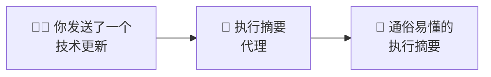

# 模块 0 - 介绍

⏱️ ~10 分钟

> [!WARNING]
> **预览版和限制：** [托管代理](https://learn.microsoft.com/azure/foundry/agents/concepts/hosted-agents) 目前处于<strong>公开预览</strong>阶段——不建议用于生产工作负载。请注意以下事项：
> - <strong>支持的区域有限</strong>——在创建资源前请检查[区域可用性](https://learn.microsoft.com/azure/foundry/agents/concepts/hosted-agents#region-availability)。如果选择不支持的区域，部署将失败。
> - `azure-ai-agentserver-agentframework` 包是预发布版本——API 可能会在不同版本间变化。
> - 扩缩限制：托管代理支持 0–5 个副本（包括缩减为零）。
> - 本研讨会中展示的部分功能可能会随着服务走向 GA（正式发布）而变化。

## 你将构建什么

在本研讨会中，你将构建一个 **“像给高管解释一样”** 的代理——一个托管的 AI 代理，能够将复杂的技术更新重写为通俗易懂的高管摘要。

```mermaid
flowchart LR
    A["🧑‍💻 你发送了一个\n技术更新"] --> B["🤖 执行摘要\n代理"]
    B --> C["📝 通俗易懂的\n执行摘要"]
```

**该代理使用：**
- **Microsoft Agent Framework** —— 代理逻辑和结构
- **Foundry Toolkit for VS Code** —— 用于脚手架、本地测试和部署
- **AI 模型** （例如 `gpt-4.1-mini/gpt-5-mini`）——生成摘要

本实验结束时，你将拥有一个可工作的代理，可通过 Agent Inspector 本地测试，也可选择部署到云端。

---

## 什么是托管代理？

<strong>托管代理</strong> 是指作为 Microsoft Foundry 托管服务运行的 AI 代理。你无需管理自己的基础设施，只需将代理代码打包成容器，Foundry 负责扩展、托管，并通过标准 HTTP 端点进行暴露。

| 概念 | 含义 |
|---------|--------------|
| <strong>代理</strong> | 你的 Python 代码，接收用户消息，调用 AI 模型，返回结构化响应 |
| <strong>托管</strong> | Foundry 运行你的容器——无需虚拟机、无需 Kubernetes、无需管理基础设施 |
| <strong>响应协议</strong> | 一个标准 HTTP API（`POST /responses`），任何客户端均可调用与你的代理交互 |
| **Agent Inspector** | 一个本地测试 UI（内置于 Foundry Toolkit），让你在部署前与代理对话 |

在本研讨会中，你将从零开始构建一个完全托管的代理——当然，如果你愿意，也可以止步于本地测试阶段。

---

## 选择你的路径

> ⚠️ **继续前请选择一条路径。** 你的选择决定了需要安装哪些工具，以及适用哪些模块。如果你后续获得订阅，可以从路径 B 切换到路径 A。

<strong>🅰️ 路径 A - Azure 云（需要 Azure 订阅）</strong>

| | 详情 |
|---|---|
| **适合谁？** | 你拥有有效的 Azure 订阅并能创建 Foundry 资源 |
| <strong>模型</strong> | 通过 Foundry 使用 Azure OpenAI（例如 `gpt-4.1-mini/gpt-5-mini`） |
| <strong>涵盖模块</strong> | 全部模块（00–07） |
| **部署到云端？** | ✅ 是——完全端到端部署 |

<strong>🅱️ 路径 B - 本地 / 免费层（不需要 Azure 订阅）</strong>

| | 详情 |
|---|---|
| **适合谁？** | MVP、学生或无 Azure 访问权限者 |
| <strong>模型</strong> | **Foundry Local**（免费，运行于你的机器） |
| <strong>涵盖模块</strong> | 模块 00–04（跳过部署和云端验证） |
| **部署到云端？** | ❌ 不——仅限通过 Agent Inspector 本地测试 |

---

## 所有路径：必备工具

安装下面的每个工具。安装后，通过运行检查命令验证工具是否正常工作。

| # | 工具 | 版本 | 安装 | 验证（预期输出） |
|---|------|---------|---------|---------------------------|
| 1 | **Visual Studio Code** | 最新版 | [code.visualstudio.com](https://code.visualstudio.com/) | 无错误打开 |
| 2 | **Python** | 3.12 或更高 | [python.org/downloads](https://www.python.org/downloads/) | `python --version` $\rightarrow$ `Python 3.12.x` |
| 3 | **Foundry Toolkit for VS Code** | 最新版 | 扩展 ID：`ms-windows-ai-studio.windows-ai-studio` | 活动栏显示 Foundry 图标 |
| 4 | **VS Code Python 扩展** | 最新版 | 扩展 ID：`ms-python.python` | 在扩展面板安装成功 |

> [!TIP]
> **安装技巧：**
> - **Python PATH（Windows）：** 在 Python 安装程序的第一个界面务必勾选 **“Add Python to PATH”**。否则终端无法识别 `python` 命令。
> - **多个 Python 版本共存：** 如果你同时安装了 Python 3.10 和 3.12，请使用 `python3.12 -m venv .venv` 来保证虚拟环境使用正确版本。
> - **Docker WSL 2（Windows）：** Docker Desktop 安装时，确保选择了 **WSL 2 后端**。使用 Hyper-V 的 Docker 较慢，且可能导致 Foundry 容器构建出错。
> - **Docker 无法启动？** 启动 Docker Desktop 后等待 30–60 秒。执行 `docker info`，如果看到“Cannot connect to the Docker daemon”，说明 Docker 仍在初始化。
> - **VS Code 扩展没加载？** 安装扩展后重载窗口：`Ctrl+Shift+P` → `Developer: Reload Window`。

> **Windows 用户：** Python 安装时务必勾选 **“Add Python to PATH”**。

**下一步：** [01 - 设置 →](01-setup.md)

---

<!-- CO-OP TRANSLATOR DISCLAIMER START -->
**免责声明**：
本文件由 AI 翻译服务 [Co-op Translator](https://github.com/Azure/co-op-translator) 翻译完成。尽管我们力求准确，但请注意，自动翻译可能包含错误或不准确之处。原始语言版文件应视为权威来源。对于重要信息，建议使用专业人工翻译。我们对因使用本翻译而产生的任何误解或误释不承担责任。
<!-- CO-OP TRANSLATOR DISCLAIMER END -->