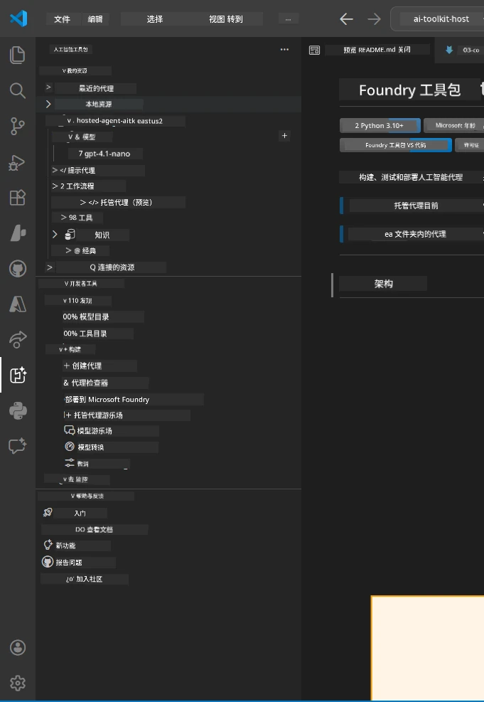
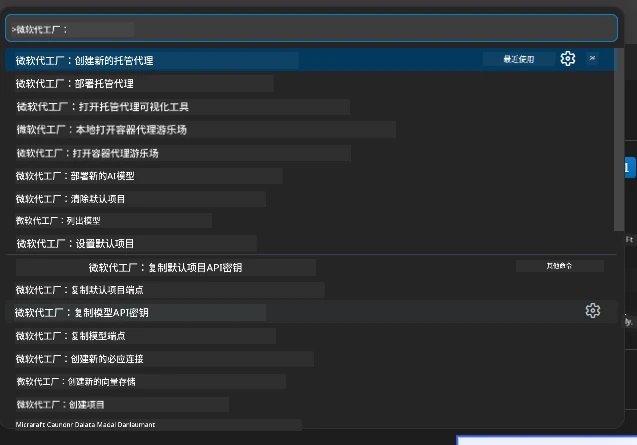

# 模块 1 - 安装 Foundry 工具包和 Foundry 扩展

本模块引导您安装和验证本次研讨会的两个关键 VS Code 扩展。如果您在[模块 0](00-prerequisites.md)中已安装过，请使用本模块确认它们是否正常工作。

---

## 第 1 步：安装 Microsoft Foundry 扩展

**Microsoft Foundry for VS Code** 扩展是创建 Foundry 项目、部署模型、搭建托管代理以及直接从 VS Code 部署的主要工具。

1. 打开 VS Code。
2. 按 `Ctrl+Shift+X` 打开 <strong>扩展</strong> 面板。
3. 在顶部搜索框中输入：**Microsoft Foundry**
4. 找到标题为 **Microsoft Foundry for Visual Studio Code** 的结果。
   - 发布者：**Microsoft**
   - 扩展 ID：`TeamsDevApp.vscode-ai-foundry`
5. 点击 <strong>安装</strong> 按钮。
6. 等待安装完成（您将看到一个小的进度指示器）。
7. 安装完成后，查看 <strong>活动栏</strong>（VS Code 左侧的垂直图标栏）。您应该看到一个新的 **Microsoft Foundry** 图标（看起来像钻石/AI 图标）。
8. 点击 **Microsoft Foundry** 图标以打开其侧边栏视图。您将看到以下部分：
   - <strong>资源</strong>（或项目）
   - <strong>代理</strong>
   - <strong>模型</strong>

> **如果图标未出现：** 尝试重新加载 VS Code（`Ctrl+Shift+P` → `Developer: Reload Window`）。

---

## 第 2 步：安装 Foundry 工具包扩展

**Foundry Toolkit** 扩展提供了 [**Agent Inspector**](https://learn.microsoft.com/azure/foundry/agents/how-to/vs-code-agents-workflow-pro-code) —— 一种用于本地测试和调试代理的可视化界面 —— 以及游乐场、模型管理和评估工具。

1. 在扩展面板（`Ctrl+Shift+X`）中清空搜索框，输入：**Foundry Toolkit**
2. 找到结果中的 **Foundry Toolkit**。
   - 发布者：**Microsoft**
   - 扩展 ID：`ms-windows-ai-studio.windows-ai-studio`
3. 点击 <strong>安装</strong>。
4. 安装后，**Foundry Toolkit** 图标会出现在活动栏（看起来像机器人/闪耀图标）。
5. 点击 **Foundry Toolkit** 图标打开侧边栏视图。您将看到 Foundry Toolkit 欢迎屏幕，包含选项：
   - <strong>模型</strong>
   - <strong>游乐场</strong>
   - <strong>代理</strong>

---

## 第 3 步：验证两个扩展是否正常工作

### 3.1 验证 Microsoft Foundry 扩展

1. 点击活动栏中的 **Microsoft Foundry** 图标。
2. 如果您已登录 Azure（来自模块 0），应该能在 <strong>资源</strong> 下看到您的项目列表。
3. 如果提示登录，请点击 <strong>登录</strong> 并完成认证流程。
4. 确认您可以看到没有错误的侧边栏。

### 3.2 验证 Foundry 工具包扩展

1. 点击活动栏中的 **Foundry Toolkit** 图标。
2. 确认欢迎视图或主面板加载无错误。
3. 目前无需配置任何内容 —— 我们将在[模块 5](05-test-locally.md)中使用 Agent Inspector。

### 3.3 通过命令面板验证

1. 按 `Ctrl+Shift+P` 打开命令面板。
2. 输入 **"Microsoft Foundry"** —— 应该看到如下命令：
   - `Microsoft Foundry: Create a New Hosted Agent`
   - `Microsoft Foundry: Deploy Hosted Agent`
   - `Microsoft Foundry: Open Model Catalog`
3. 按 `Escape` 关闭命令面板。
4. 再次打开命令面板，输入 **"Foundry Toolkit"** —— 应显示如下命令：
   - `Foundry Toolkit: Open Agent Inspector`

> 如果看不到这些命令，说明扩展可能未正确安装。尝试卸载后重新安装。

---

## 这些扩展在本研讨会中的作用

| 扩展 | 功能 | 使用时间 |
|-----------|-------------|-------------------|
| **Microsoft Foundry for VS Code** | 创建 Foundry 项目、部署模型、**搭建[托管代理](https://learn.microsoft.com/azure/foundry/agents/concepts/hosted-agents)**（自动生成 `agent.yaml`、`main.py`、`Dockerfile`、`requirements.txt`），部署到[Foundry Agent 服务](https://learn.microsoft.com/azure/foundry/agents/overview) | 模块 2、3、6、7 |
| **Foundry Toolkit** | 用于本地测试和调试的 Agent Inspector、游乐场界面、模型管理 | 模块 5、7 |

> **Foundry 扩展是本研讨会中最关键的工具。** 它处理端到端生命周期：搭建 → 配置 → 部署 → 验证。Foundry Toolkit 辅助提供本地测试的可视化 Agent Inspector。

---

### 检查点

- [ ] 活动栏中可见 Microsoft Foundry 图标
- [ ] 点击后能打开无错误的侧边栏
- [ ] 活动栏中可见 Foundry Toolkit 图标
- [ ] 点击后能打开无错误的侧边栏
- [ ] `Ctrl+Shift+P` → 输入 "Microsoft Foundry" 显示可用命令
- [ ] `Ctrl+Shift+P` → 输入 "Foundry Toolkit" 显示可用命令

---

**上一节：** [00 - 先决条件](00-prerequisites.md) · **下一节：** [02 - 创建 Foundry 项目 →](02-create-foundry-project.md)

---

<!-- CO-OP TRANSLATOR DISCLAIMER START -->
**免责声明**：  
本文件使用 AI 翻译服务 [Co-op Translator](https://github.com/Azure/co-op-translator) 进行翻译。尽管我们力求准确，但请注意自动翻译可能包含错误或不准确之处。原始语言版本的文件应被视为权威来源。对于重要信息，建议使用专业人工翻译。我们不对因使用本翻译而引起的任何误解或误释承担责任。
<!-- CO-OP TRANSLATOR DISCLAIMER END -->