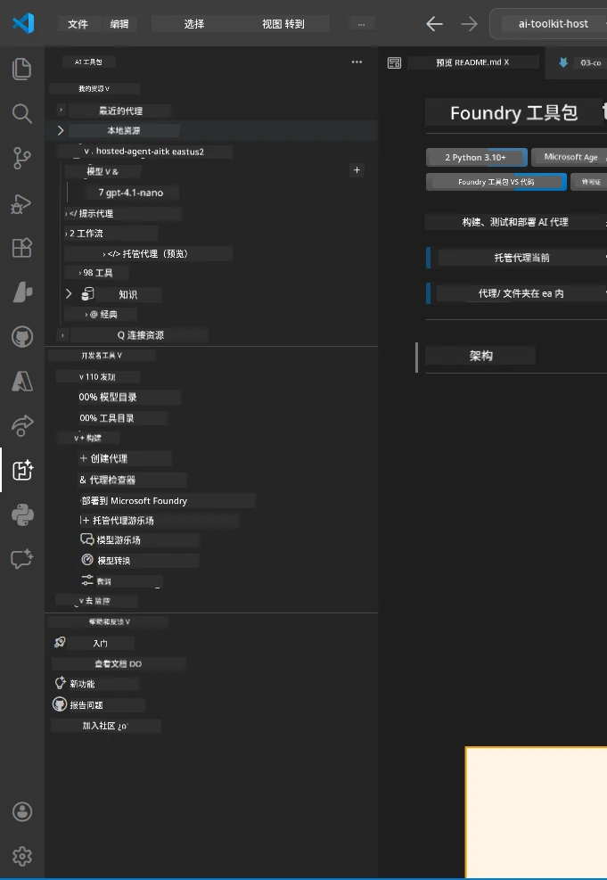
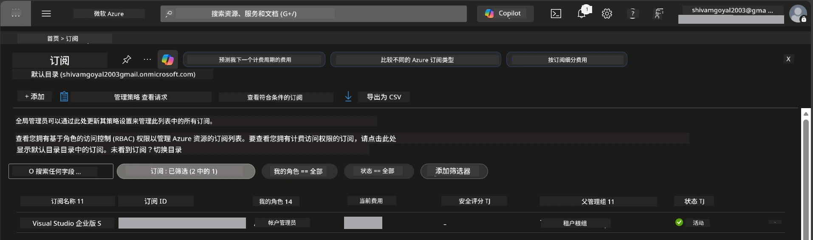
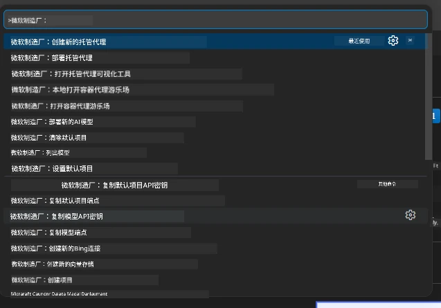
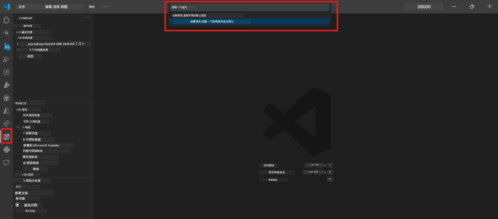
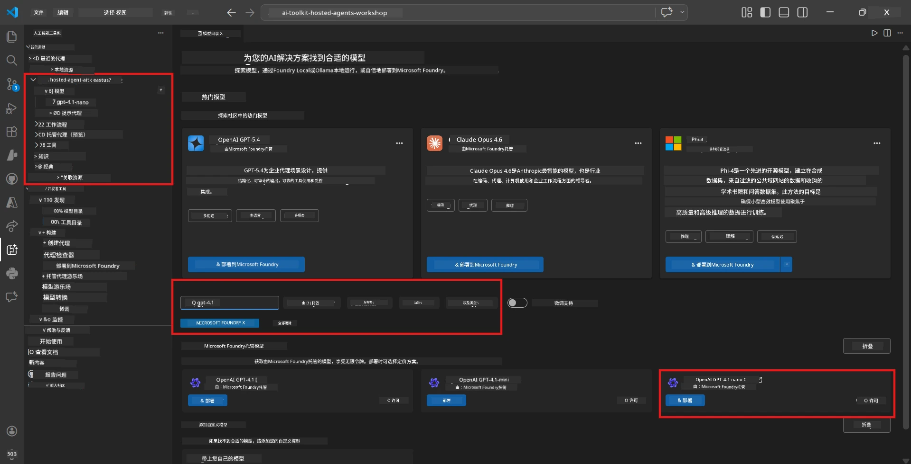
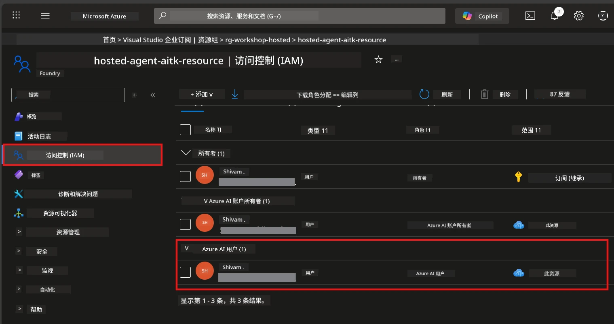

# 设置：扩展、项目与模型

⏱️ ~15 分钟

在本模块中，您将安装并验证 Foundry Toolkit 扩展，创建（或连接到）一个 Foundry 项目，并部署代理将使用的模型。

## 第一步：安装 Foundry Toolkit

**Foundry Toolkit for VS Code** 是本次研讨会的主要扩展。它提供项目创建、模型部署、代理脚手架、本地测试（Agent Inspector）和云部署功能——全部集成在 VS Code 中。

1. 打开 VS Code，然后按 `Ctrl+Shift+X` 打开 <strong>扩展</strong> 面板。
2. 搜索 **Foundry Toolkit**。
3. 安装 **Foundry Toolkit for VS Code**（发布者：Microsoft，ID：`ms-windows-ai-studio.windows-ai-studio`）。
4. 安装完成后，**Foundry Toolkit** 图标会出现在活动栏（左侧边栏）。

> *注意：旧版扩展的活动栏可能显示为“AI TOOLKIT”，功能完全相同。*



## 第二步：根据您的权限设置

> **请选择您的路径：** 展开下方与您设置匹配的部分。您只需完成<strong>其中一条</strong>路径。

<details>
<summary><strong>🅰️ 路径 A - Azure 云（需 Azure 订阅）</strong></summary>

### Azure CLI

1. 从 [learn.microsoft.com/cli/azure/install-azure-cli](https://learn.microsoft.com/cli/azure/install-azure-cli) 安装。
2. 验证：`az --version`（要求 2.80.0 以上）。
3. 登录：`az login`

### 认证选项

[Microsoft Agent Framework](https://learn.microsoft.com/agent-framework/overview/) 使用 [`DefaultAzureCredential`](https://learn.microsoft.com/azure/developer/python/sdk/authentication/credential-chains#defaultazurecredential-overview)，它会依次尝试多种认证方法。请选择适合您环境的方式：

#### 选项 1：VS Code 账户（推荐用于研讨会）
1. 点击 VS Code 左下角的 <strong>账户</strong> 图标（人形轮廓）。
2. 选择 **登录以使用 Microsoft Foundry**（或 **使用 Azure 登录**）。
3. 浏览器打开后，用有权限访问订阅的 Azure 账户登录。
4. 返回 VS Code，左下角应显示您的账户名称。

#### 选项 2：Azure CLI
```bash
az login
az account set --subscription "<your-subscription-id>"
```

#### 选项 3：服务主体（企业/CI）
对于安全限制环境或 CI/CD 管道，将以下环境变量设置到您的 `.env` 文件中：
```env
AZURE_TENANT_ID=<your-tenant-id>
AZURE_CLIENT_ID=<your-client-id>
AZURE_CLIENT_SECRET=<your-client-secret>
```

> **`DefaultAzureCredential` 的工作原理：** 它首先尝试环境变量，再尝试托管身份，然后尝试 VS Code 登录，最后尝试 Azure CLI，使用第一个成功的认证。详见 [凭据链文档](https://learn.microsoft.com/azure/developer/python/sdk/authentication/credential-chains#defaultazurecredential-overview)。

### Azure Developer CLI (azd)

1. 安装：`winget install microsoft.azd`（Windows），或参见[安装文档](https://learn.microsoft.com/azure/developer/azure-developer-cli/install-azd)。
2. 验证：`azd version`
3. 登录：`azd auth login`

### Docker Desktop（可选）

如果您想在本地构建容器，则需要 Docker。Foundry 扩展在部署时会自动处理构建。

1. 从 [docs.docker.com/get-docker](https://docs.docker.com/get-docker/) 安装。
2. 验证：`docker info`

### Azure 订阅与 RBAC

1. 登录 [portal.azure.com](https://portal.azure.com)。
2. 导航到 <strong>订阅</strong>，确认有至少一个是<strong>活动的</strong>。
3. 记下您的 **订阅 ID** —— 您将在模块 01 中使用。



#### RBAC 场景表

[托管代理](https://learn.microsoft.com/azure/foundry/agents/concepts/hosted-agents) 部署需要包含 <strong>数据操作</strong> 权限，而标准 Azure 的 `Owner` 和 `Contributor` 角色不包括此权限。请参考下表确定您需要的角色：

| 场景 | 所需角色 | 分配位置 |
|----------|---------------|----------------------|
| 创建新 Foundry 项目 | Foundry 资源上的 **Azure AI Owner** | Azure 门户中的 Foundry 资源 |
| 部署到现有项目（新资源） | 订阅上的 **Azure AI Owner** + **Contributor** | 订阅 + Foundry 资源 |
| 部署到已完全配置项目 | 账户上的 **Reader** + 项目上的 **Azure AI User** | Azure 门户中的账户 + 项目 |
| 仅本地测试（无部署） | 项目上的 **Azure AI User** | Azure 门户中的项目 |

> **要点：** Azure 的 `Owner` 和 `Contributor` 角色只涵盖<em>管理</em>权限（ARM 操作）。您需要 [**Azure AI User**](https://learn.microsoft.com/azure/foundry/concepts/rbac-foundry#built-in-roles)（或更高权限）来进行诸如 `agents/write` 的<em>数据操作</em>，此权限是创建和部署代理所必需的。

## 连接或创建 Foundry 项目



1. 按 `Ctrl+Shift+P` → 输入 **Foundry Toolkit: Create Project** → 选择它。
2. 从下拉列表中选择您的 **Azure 订阅**。
3. 选择或创建一个 <strong>资源组</strong>（例如 `rg-hosted-agents-workshop`）。
4. 选择支持托管代理的 <strong>区域</strong>：`East US`、`West US 2` 或 `Sweden Central`。详见 [区域可用性](https://learn.microsoft.com/azure/foundry/agents/concepts/hosted-agents#region-availability)。
5. 输入项目名称（例如 `workshop-agents`）。
6. 等待 2-5 分钟进行配置。VS Code 中会出现进度通知。
7. 完成后，您的项目会出现在 **Foundry Toolkit** 侧边栏的 **MY RESOURCES** 下。



## 部署模型与分配 RBAC

您的托管代理需要一个 AI 模型来生成响应。

#### 模型选择矩阵
根据需求，您可以选择不同级别的模型：

| 模型 | 适用场景 | 费用 | 备注 |
|-------|----------|------|-------|
| `gpt-4.1` | 高质量、细腻的响应 | 较高 | 最佳效果，推荐用于最终测试 |
| `gpt-4.1-mini/gpt-5-mini` | 快速迭代，成本较低 | 较低 | 适合研讨会开发和快速测试 |
| `gpt-4.1-nano` | 轻量级任务 | 最低 | 最经济，但响应较简单 |

1. 按 `Ctrl+Shift+P` → 选择 **Foundry Toolkit: Open Model Catalog**（或在侧边栏的 DEVELOPER TOOLS 下点击 **Model Catalog** → 发现）。
2. 在目录中搜索 **gpt-4.1**。
3. 找到 **OpenAI GPT-4.1-mini**（或质量更好的 `gpt-5-mini`），点击 **Deploy**。



4. 在部署配置中：
   - **部署名称：** 保持默认或输入自定义名称。**请记住此名称。**
   - **目标：** 选择 **Deploy to Foundry Toolkit** → 选择您的项目。
5. 点击 **Deploy**，等待 1-3 分钟。

> **推荐：** 研讨会建议使用 `gpt-4.1-mini/gpt-5-mini`，快速、经济且效果良好。

### 记录您的值

部署完成后，请记下以下两项（您将在模块 03 需要它们）：

| 值 | 位置 |
|-------|-----------------|
| <strong>项目端点</strong> | 点击侧边栏中的项目 → 详细视图显示 URL（例如 `https://<account>.services.ai.azure.com/api/projects/<project>`） |
| <strong>模型部署名称</strong> | 展开项目 → **Models** → 您部署的模型名称（例如 `gpt-4.1-mini/gpt-5-mini`） |

### 分配 RBAC 角色

> ⚠️ **这是最常被忽略的步骤。** 如果没有正确的角色，模块 05 中的部署将失败。

#### 我需要哪个角色？
根据您的场景，您需要以下角色组合：

| 场景 | 所需角色 | 分配位置 |
|----------|---------------|----------------------|
| 创建新 Foundry 项目 | Foundry 资源上的 **Azure AI Owner** | Azure 门户中的 Foundry 资源 |
| 部署到现有项目（新资源） | 订阅上的 **Azure AI Owner** + **Contributor** | 订阅 + Foundry 资源 |
| 部署到已完全配置项目 | 账户上的 **Reader** + 项目上的 **Azure AI User** | Azure 门户中的账户 + 项目 |

**要点：** Azure 的 `Owner` 和 `Contributor` 角色仅包含<em>管理</em>权限。您需要 **Azure AI User**（或更高）来执行如 `agents/write` 这类<em>数据操作</em>，以创建和部署代理。

1. 打开 [portal.azure.com](https://portal.azure.com)。
2. 搜索您的 **Foundry 项目** 名称 → 点击类型为 **"Foundry Toolkit project"** 的结果（不是父账号）。
3. 在左侧导航点击 **访问控制 (IAM)**。
4. 点击 **+ 添加** → <strong>添加角色分配</strong>。
5. **角色标签：** 搜索 **Azure AI User**，选择它，点击 <strong>下一步</strong>。
6. **成员标签：** 选择 **用户、组或服务主体** → 点击 **+ 选择成员** → 找到并选中自己 → 点击 <strong>选择</strong>。
7. 点击 <strong>审阅并分配</strong> → 再次点击 <strong>审阅并分配</strong>。
8. **等待 1–2 分钟** 以完成权限传播。

> **为何需要此角色？** Azure 的 `Owner`/`Contributor` 仅授予管理权限。**Azure AI User** 角色授予创建和部署代理所需的 `agents/write` 数据操作权限。详见 [Foundry RBAC 文档](https://learn.microsoft.com/azure/foundry/concepts/rbac-foundry#built-in-roles)。



</details>

<details>
<summary><strong>🅱️ 路径 B - 本地 / 免费套餐（无需 Azure 订阅）</strong></summary>

### Foundry Local

Foundry Local 允许您在自己的机器上运行 AI 模型——无需云账户。您可以通过 Foundry Toolkit 使用模型目录访问 Foundry Local 模型，步骤如下：

1. 进入 Foundry Toolkit 扩展。
2. 在 Foundry Toolkit 导航中，进入 **Developer Tools** > 选择 **Model Catalog**
3. 在新窗口的导航栏中选择 **local**。
4. 向下滚动到 **Phi 4 Mini**，点击 <strong>添加按钮</strong>，弹出提示模型正在下载。
5. 模型下载完成后，即可继续下一步骤。

</details>

### ✅ 检查点


- [ ] `Ctrl+Shift+P` → “Foundry Toolkit” 显示可用命令
- [ ] 安装 Foundry Toolkit 扩展且侧边栏正常加载无错误
- [ ] VS Code 打开并运行正常
- [ ] `python --version` 显示 3.10+
- [ ] VS Code 活动栏可见 Foundry Toolkit 图标
- [ ] **路径 A：** `az login` 成功，订阅为活跃状态
- [ ] **路径 B：** Foundry Local 正在运行（`foundry local status`）
- [ ] **路径 A：** 侧边栏可见 Foundry 项目，模型已部署，已分配 Azure AI User 角色
- [ ] **路径 B：** Foundry Local 运行且有模型
- [ ] 您已记录您的<strong>端点</strong>和<strong>模型部署名称</strong>


**上一篇：** [00 - 先决条件](00-prerequisites.md) · **下一篇：** [02 - 创建托管代理 →](02-create-hosted-agent.md)

---

<!-- CO-OP TRANSLATOR DISCLAIMER START -->
**免责声明**：
本文件由 AI 翻译服务 [Co-op Translator](https://github.com/Azure/co-op-translator) 翻译完成。尽管我们力求准确，但请注意，自动翻译可能包含错误或不准确之处。原始语言版文件应视为权威来源。对于重要信息，建议使用专业人工翻译。我们对因使用本翻译而产生的任何误解或误释不承担责任。
<!-- CO-OP TRANSLATOR DISCLAIMER END -->