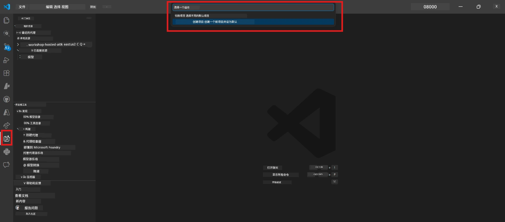
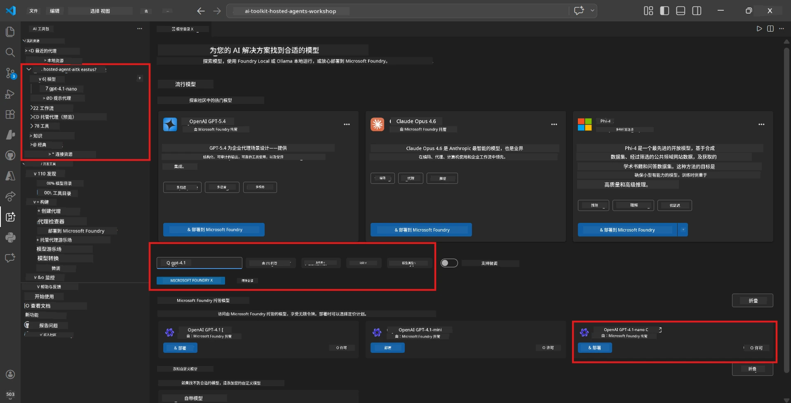
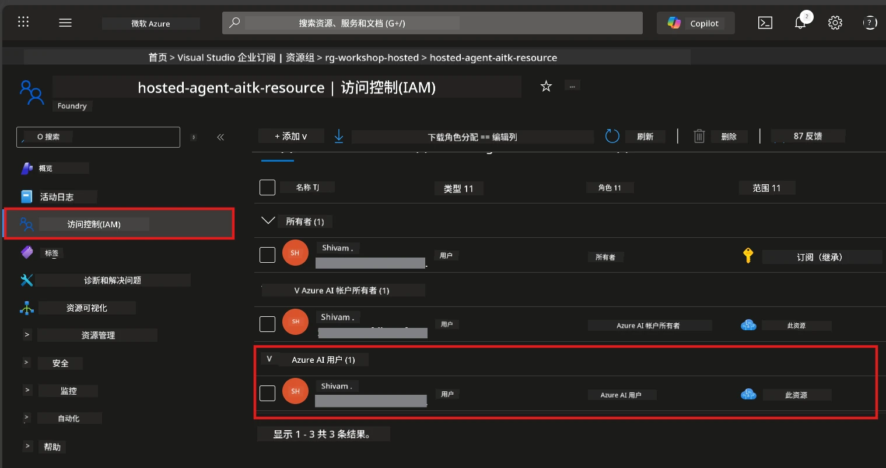

# Module 2 - 创建 Foundry 项目并部署模型

在本模块中，您将创建（或选择）一个 Microsoft Foundry 项目并部署您的代理将使用的模型。所有步骤均详细说明——请按顺序操作。

> 如果您已有一个部署了模型的 Foundry 项目，请跳至[模块 3](03-create-hosted-agent.md)。

---

## 第 1 步：从 VS Code 创建 Foundry 项目

您将使用 Microsoft Foundry 扩展，在不离开 VS Code 的情况下创建项目。

1. 按 `Ctrl+Shift+P` 打开<strong>命令面板</strong>。
2. 输入：**Microsoft Foundry: Create Project** 并选择它。
3. 会出现一个下拉列表——从列表中选择您的 **Azure 订阅**。
4. 系统会提示您选择或创建一个 <strong>资源组</strong>：
   - 要创建新的：输入名称（例如 `rg-hosted-agents-workshop`），然后按回车。
   - 要使用已有的：从下拉菜单中选择它。
5. 选择一个 <strong>区域</strong>。**重要：** 请选择支持托管代理的区域。请查看[区域可用性](https://learn.microsoft.com/azure/foundry/agents/concepts/hosted-agents#region-availability)——常用选项有 `East US`、`West US 2` 或 `Sweden Central`。
6. 输入 Foundry 项目的 <strong>名称</strong>（例如 `workshop-agents`）。
7. 按回车，等待配置完成。

> **配置需要 2-5 分钟。** 您将在 VS Code 右下角看到进度通知。配置完成前请勿关闭 VS Code。

8. 完成后，**Microsoft Foundry** 侧边栏将在 **Resources** 下显示您的新项目。
9. 点击项目名称展开，确认显示 **Models + endpoints** 和 **Agents** 等部分。



### 备选方式：通过 Foundry 门户创建

如果您更喜欢使用浏览器：

1. 打开 [https://ai.azure.com](https://ai.azure.com) 并登录。
2. 在主页点击 **Create project**。
3. 输入项目名称，选择订阅、资源组和区域。
4. 点击 **Create** 并等待配置完成。
5. 创建后，返回 VS Code——刷新（点击刷新图标）后项目应出现在 Foundry 侧边栏。

---

## 第 2 步：部署模型

您的[托管代理](https://learn.microsoft.com/azure/foundry/agents/concepts/hosted-agents)需要 Azure OpenAI 模型来生成响应。您现在将[部署一个模型](https://learn.microsoft.com/azure/ai-foundry/openai/how-to/create-resource#deploy-a-model)。

1. 按 `Ctrl+Shift+P` 打开<strong>命令面板</strong>。
2. 输入：**Microsoft Foundry: Open [Model Catalog](https://learn.microsoft.com/azure/ai-foundry/openai/concepts/models)** 并选择它。
3. VS Code 中打开模型目录视图。浏览或使用搜索栏查找 **gpt-4.1**。
4. 点击 **gpt-4.1** 模型卡（如果想节省成本，可选择 `gpt-4.1-mini`）。
5. 点击 **Deploy**。


6. 在部署配置中：
   - **Deployment name**：保持默认（例如 `gpt-4.1`）或输入自定义名称。<strong>记住此名称</strong>——模块 4 会用到它。
   - **Target**：选择 **Deploy to Microsoft Foundry**，并选择刚创建的项目。
7. 点击 **Deploy**，等待部署完成（1-3 分钟）。

### 选择模型

| 模型 | 适用场景 | 费用 | 说明 |
|-------|----------|------|-------|
| `gpt-4.1` | 高质量、细腻回复 | 高 | 最佳效果，推荐用于最终测试 |
| `gpt-4.1-mini` | 快速迭代，成本较低 | 较低 | 适合研讨会开发和快速测试 |
| `gpt-4.1-nano` | 轻量任务 | 最低 | 成本最低，但回复更简单 |

> **本研讨会推荐：** 使用 `gpt-4.1-mini` 进行开发和测试。其响应快速、成本低且效果良好。

### 验证模型部署

1. 在 **Microsoft Foundry** 侧边栏展开您的项目。
2. 查看 **Models + endpoints**（或类似部分）。
3. 应能看到已部署的模型（例如 `gpt-4.1-mini`），状态为 **Succeeded** 或 **Active**。
4. 点击模型部署查看详情。
5. <strong>记下</strong>以下两个值——模块 4 需要：

   | 设置 | 位置 | 示例值 |
   |---------|-----------------|---------|
   | <strong>项目端点</strong> | 点击 Foundry 侧边栏中的项目名称。端点 URL 显示在详情视图。 | `https://<account>.services.ai.azure.com/api/projects/<project>` |
   | <strong>模型部署名称</strong> | 部署模型旁显示的名称。 | `gpt-4.1-mini` |

---

## 第 3 步：分配所需的 RBAC 角色

这是<strong>最常被忽略的步骤</strong>。没有正确角色，模块 6 中的部署将因权限错误而失败。

### 3.1 给自己分配 Azure AI User 角色

1. 打开浏览器，访问 [https://portal.azure.com](https://portal.azure.com)。
2. 在顶部搜索栏输入您的 <strong>Foundry 项目</strong>名称并在结果中点击它。
   - **重要：** 请确认进入的是<strong>项目</strong>资源（类型为“Microsoft Foundry project”），而非父级账户/中心资源。
3. 在项目的左侧导航栏点击 **访问控制 (IAM)**。
4. 点击顶部的 **+ 添加** 按钮 → 选择 <strong>添加角色分配</strong>。
5. 在 <strong>角色</strong> 页面，搜索并选择 [**Azure AI User**](https://learn.microsoft.com/azure/foundry/concepts/rbac-foundry#built-in-roles)，点击 <strong>下一步</strong>。
6. 在 <strong>成员</strong> 页面：
   - 选择 **用户、组或服务主体**。
   - 点击 **+ 选择成员**。
   - 搜索并选择您的用户名或邮箱，点击 <strong>选择</strong>。
7. 点击 **审阅 + 分配** → 再次点击 **审阅 + 分配** 确认。



### 3.2 （可选）分配 Azure AI Developer 角色

如果您需要在项目内创建额外资源或以编程方式管理部署：

1. 重复上述步骤，但第 5 步选择 **Azure AI Developer**。
2. 此角色应分配在 **Foundry 资源（账户）** 级别，而非仅项目级别。

### 3.3 验证角色分配

1. 在项目的 **访问控制 (IAM)** 页面，点击 <strong>角色分配</strong> 选项卡。
2. 搜索您的名字。
3. 应看到至少有 **Azure AI User** 角色被分配于项目范围内。

> **为何重要：** [`Azure AI User`](https://learn.microsoft.com/azure/foundry/concepts/rbac-foundry#built-in-roles) 角色授予 `Microsoft.CognitiveServices/accounts/AIServices/agents/write` 数据操作权限。缺少此权限，部署时将出现以下错误：
>
> ```
> Error: lacks the required data action 
> Microsoft.CognitiveServices/accounts/AIServices/agents/write 
> to perform POST /api/projects/{projectName}/assistants operation.
> ```
>
> 更多详情见[模块 8 - 故障排除](08-troubleshooting.md)。

---

### 检查点

- [ ] Foundry 项目存在且在 VS Code 的 Microsoft Foundry 侧边栏可见
- [ ] 至少部署了一个模型（例如 `gpt-4.1-mini`），状态为 **Succeeded**
- [ ] 您已记下 <strong>项目端点</strong> URL 和 <strong>模型部署名称</strong>
- [ ] 您在项目级别拥有 **Azure AI User** 角色（在 Azure 门户 → IAM → 角色分配中验证）
- [ ] 项目所在区域支持托管代理，参见[支持区域](https://learn.microsoft.com/azure/foundry/agents/concepts/hosted-agents#region-availability)

---

**前一模块：** [01 - 安装 Foundry 工具包](01-install-foundry-toolkit.md) · **下一模块：** [03 - 创建托管代理 →](03-create-hosted-agent.md)

---

<!-- CO-OP TRANSLATOR DISCLAIMER START -->
**免责声明**：  
本文件使用 AI 翻译服务 [Co-op Translator](https://github.com/Azure/co-op-translator) 进行翻译。虽然我们力求准确，但请注意自动翻译可能包含错误或不准确之处。原始语言版本的文件应被视为权威来源。对于关键信息，建议使用专业人工翻译。对于因使用本翻译而产生的任何误解或误读，我们不承担任何责任。
<!-- CO-OP TRANSLATOR DISCLAIMER END -->