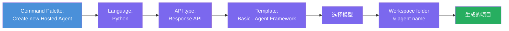
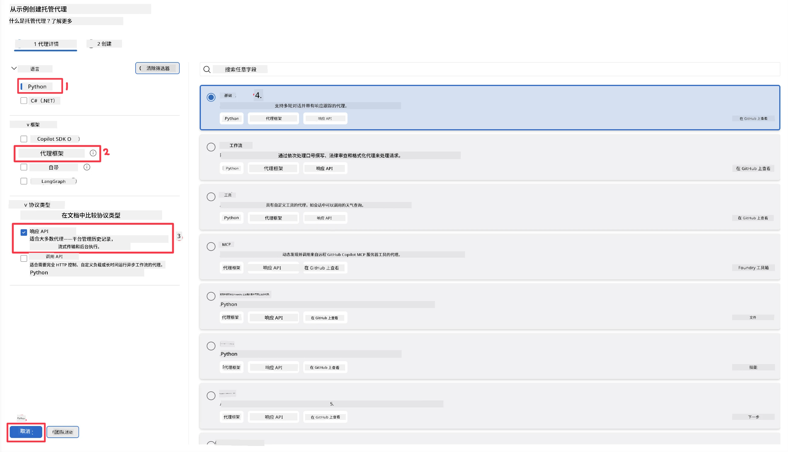
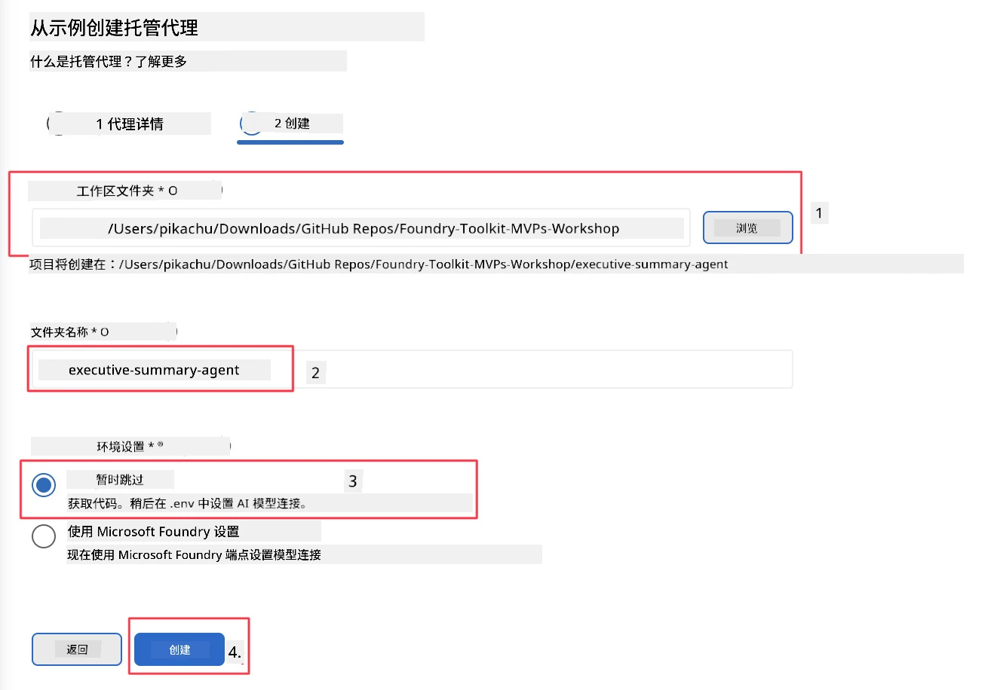

# 模块 2 - 创建新的托管代理

⏱️ ~5 分钟

在本模块中，您将使用 Foundry Toolkit <strong>搭建一个托管代理项目的脚手架</strong>。脚手架会生成完整的项目结构 - 包括 `agent.yaml`、`main.py`、`Dockerfile`、`requirements.txt` 以及 VS Code 调试配置 - 这样您就可以专注于定制代理的行为。

> **关键概念：** 本实验中的 `agent/` 文件夹是 Foundry Toolkit 生成的示例。您无需从头编写这些文件。

### 脚手架向导流程



---

## 第 1 步：打开“创建托管代理”向导

1. 按 `Ctrl+Shift+P` 打开 <strong>命令面板</strong>。
2. 输入：**Foundry Toolkit: Create new Hosted Agent** 然后选择它。

> **替代方案：通过 Foundry 门户创建**
> 如果您更喜欢浏览器，也可以在 [https://ai.azure.com](https://ai.azure.com) 上创建项目。项目配置完成后，返回 VS Code 并使用 **Foundry Toolkit** 侧边栏连接该项目。

> **替代方法：** 点击 Foundry Toolkit 侧边栏中 **Hosted Agents (Preview)** 旁边的 **+** 图标。

## 第 2 步：选择设置



1. 在左侧导航/选项区域选择以下内容：

| 菜单 | 选择 | 备注 |
|--------|-----------|-------|
| <strong>语言</strong> | Python | 也支持 C# |
| <strong>框架</strong> | Agent Framework | 使用 Agent Framework SDK 的简单起点 |
| **API 类型** | Response API | `POST /responses` - 会话式，支持平台管理的历史记录 |
| <strong>模板</strong> | Basic | 使用 Agent Framework SDK 的简单起点 |

2. 选定后，点击 <strong>下一步</strong>



3. 在下一窗口选择以下内容：

| 菜单 | 选择 | 备注 |
|--------|-----------|-------|
| <strong>工作区文件夹</strong> | 选择目标文件夹 | 如 `/workspace/Foundry_Toolkit_for_VSCode_Lab/` 或该仓库中的子文件夹 |
| <strong>代理名称</strong> | 输入名称 | 如 `executive-summary-agent` |
| <strong>环境设置</strong> | 暂时跳过设置 |  |

点击 <strong>创建</strong> 来创建我们的代理。将会创建一个以托管代理名称命名的新文件夹。

## 第 3 步：检查生成的项目

脚手架完成后，确保在资源管理器 (`Ctrl+Shift+E`) 中看到这些文件：

```
📂 my-agent/
├── .env                ← Environment variables (placeholders)
├── .vscode/
│   ├── launch.json     ← Debug config (F5 → run + Agent Inspector)
│   └── tasks.json      ← VS Code task definitions
├── agent.yaml          ← Agent definition (kind: hosted)
├── Dockerfile          ← Container config for deployment
├── main.py             ← Agent entry point (your main code)
└── requirements.txt    ← Python dependencies
```

### 关键文件说明

| 文件 | 作用 |
|------|---------|
| `agent.yaml` | 声明代理类型为 `kind: hosted`，映射环境变量，定义 `/responses` 协议 |
| `main.py` | 创建一个 `FoundryChatClient` → 用指令将其包裹进 `Agent` → 通过 `ResponsesHostServer` 在 8088 端口提供服务 |
| `Dockerfile` | 使用 `python:3.12-slim`，安装依赖项，暴露 8088 端口，运行 `main.py` |
| `requirements.txt` | 包含 `agent-framework-foundry`、`agent-framework-foundry-hosting`、`mcp`、`debugpy` |

> **重要提示：** 请直接在 VS Code 中打开脚手架生成的代理文件夹（即 `agent/` 文件夹本身），以确保 `.vscode/launch.json` 和 `tasks.json` 正确支持 F5 调试。

---

### ✅ 检查点

- [ ] 脚手架项目已创建，包含所有预期文件
- [ ] `agent.yaml` 中显示 `kind: hosted` 和 `protocol: responses`
- [ ] `main.py` 导入了 `Agent`、`FoundryChatClient`、`ResponsesHostServer`
- [ ] 代理文件夹已作为工作区根目录在 VS Code 中打开

---

**上一节：** [01 - 设置](01-setup.md) · **下一节：** [03 - 配置与编码 →](03-configure-and-code.md)

---

<!-- CO-OP TRANSLATOR DISCLAIMER START -->
**免责声明**：
本文件由 AI 翻译服务 [Co-op Translator](https://github.com/Azure/co-op-translator) 翻译完成。尽管我们力求准确，但请注意，自动翻译可能包含错误或不准确之处。原始语言版文件应视为权威来源。对于重要信息，建议使用专业人工翻译。我们对因使用本翻译而产生的任何误解或误释不承担责任。
<!-- CO-OP TRANSLATOR DISCLAIMER END -->