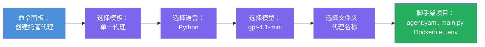

# Module 3 - 创建新的托管代理（由 Foundry 扩展自动脚手架）

在本模块中，您将使用 Microsoft Foundry 扩展来<strong>脚手架一个新的[托管代理](https://learn.microsoft.com/azure/foundry/agents/concepts/hosted-agents)项目</strong>。该扩展会为您生成整个项目结构——包括 `agent.yaml`、`main.py`、`Dockerfile`、`requirements.txt`、一个 `.env` 文件以及 VS Code 调试配置。脚手架完成后，您可以根据代理的指令、工具和配置，自定义这些文件。

> **关键概念：** 本实验中的 `agent/` 文件夹是您运行此脚手架命令时 Foundry 扩展生成的示例。您不需要从零编写这些文件——扩展会创建它们，然后您进行修改。

### 脚手架向导流程


---

## 第 1 步：打开创建托管代理向导

1. 按 `Ctrl+Shift+P` 打开 <strong>命令面板</strong>。
2. 输入：**Microsoft Foundry: Create a New Hosted Agent** 并选择它。
3. 托管代理创建向导打开。

> **替代路径：** 您也可以通过 Microsoft Foundry 侧边栏 → 点击 **Agents** 旁的 **+** 图标，或右键选择 **Create New Hosted Agent** 来访问此向导。

---

## 第 2 步：选择模板

向导会让您选择一个模板。您将看到类似选项：

| 模板 | 描述 | 何时使用 |
|----------|-------------|-------------|
| **单代理（Single Agent）** | 拥有自己的模型、指令和可选工具的单个代理 | 本次工作坊（Lab 01） |
| **多代理工作流（Multi-Agent Workflow）** | 多个代理依次协作 | Lab 02 |

1. 选择 **单代理（Single Agent）**。
2. 点击 <strong>下一步</strong>（或自动继续）。

---

## 第 3 步：选择编程语言

1. 选择 **Python**（推荐用于本次工作坊）。
2. 点击 <strong>下一步</strong>。

> **也支持 C#**，如果您偏好 .NET。脚手架结构类似（使用 `Program.cs` 替代 `main.py`）。

---

## 第 4 步：选择模型

1. 向导显示您在 Foundry 项目中部署的模型（来自模块 2）。
2. 选择您部署的模型，例如 **gpt-4.1-mini**。
3. 点击 <strong>下一步</strong>。

> 如果没有看到任何模型，请先返回[模块 2](02-create-foundry-project.md)部署一个。

---

## 第 5 步：选择文件夹位置和代理名称

1. 弹出文件对话框——选择一个<strong>目标文件夹</strong>创建项目。对于本次工作坊：
   - 如果全新开始：选择任意文件夹（例如 `C:\Projects\my-agent`）
   - 如果在工作坊仓库内操作：在 `workshop/lab01-single-agent/agent/` 下创建一个新子文件夹
2. 输入托管代理的<strong>名称</strong>（例如 `executive-summary-agent` 或 `my-first-agent`）。
3. 点击 <strong>创建</strong> （或按回车）。

---

## 第 6 步：等待脚手架完成

1. VS Code 打开一个<strong>新窗口</strong>，加载脚手架项目。
2. 等几秒项目完全载入。
3. 您应在资源管理器面板（`Ctrl+Shift+E`）看到以下文件：

```
📂 my-first-agent/
├── .env                ← Environment variables (auto-generated with placeholders)
├── .vscode/
│   └── launch.json     ← Debug configuration (F5 to run + Agent Inspector)
├── agent.yaml          ← Agent definition (kind: hosted)
├── Dockerfile          ← Container configuration for deployment
├── main.py             ← Agent entry point (your main code file)
└── requirements.txt    ← Python dependencies
```

> **这与本实验中的 `agent/` 文件夹结构一致。** Foundry 扩展自动生成这些文件——您无需手动创建。

> **工作坊提示：** 在此工作坊仓库中，`.vscode/` 文件夹位于<strong>工作区根目录</strong>（而非每个项目内）。它包含共享的 `launch.json` 和 `tasks.json`，有两个调试配置——**"Lab01 - Single Agent"** 和 **"Lab02 - Multi-Agent"**，分别指向对应实验的 `cwd`。按 F5 时，请从下拉菜单选择与您操作的实验相符的配置。

---

## 第 7 步：了解生成的每个文件

花点时间检查向导创建的每个文件。理解它们很重要，后续模块 4（自定义）会用到。

### 7.1 `agent.yaml` - 代理定义

打开 `agent.yaml`，内容类似：

```yaml
# yaml-language-server: $schema=https://raw.githubusercontent.com/microsoft/AgentSchema/refs/heads/main/schemas/v1.0/ContainerAgent.yaml

kind: hosted
name: my-first-agent
description: >
  A hosted agent deployed to Microsoft Foundry Agent Service.
metadata:
  authors:
    - Microsoft
  tags:
    - Azure AI AgentServer
    - Microsoft Agent Framework
    - Hosted Agent
protocols:
  - protocol: responses
    version: v1
environment_variables:
  - name: AZURE_AI_PROJECT_ENDPOINT
    value: ${PROJECT_ENDPOINT}
  - name: AZURE_AI_MODEL_DEPLOYMENT_NAME
    value: ${MODEL_DEPLOYMENT_NAME}
dockerfile_path: Dockerfile
resources:
  cpu: '0.25'
  memory: 0.5Gi
```

**关键字段：**

| 字段 | 作用 |
|-------|---------|
| `kind: hosted` | 声明这是一个托管代理（基于容器，部署在[Foundry Agent Service](https://learn.microsoft.com/azure/foundry/agents/overview)） |
| `protocols: responses v1` | 代理暴露 OpenAI 兼容的 `/responses` HTTP 端点 |
| `environment_variables` | 部署时将 `.env` 中的值映射到容器环境变量 |
| `dockerfile_path` | 指向用于构建容器镜像的 Dockerfile 路径 |
| `resources` | 容器的 CPU 和内存分配（0.25 CPU，0.5Gi 内存） |

### 7.2 `main.py` - 代理入口点

打开 `main.py`。这是代理逻辑的主 Python 文件。脚手架包含：

```python
from agent_framework.azure import AzureAIAgentClient
from azure.ai.agentserver.agentframework import from_agent_framework
from azure.identity.aio import DefaultAzureCredential
```

**关键导入：**

| 导入 | 作用 |
|--------|--------|
| `AzureAIAgentClient` | 连接到 Foundry 项目，通过 `.as_agent()` 创建代理 |
| [`DefaultAzureCredential`](https://learn.microsoft.com/azure/developer/python/sdk/authentication/credential-chains#defaultazurecredential-overview) | 处理身份验证（Azure CLI、VS Code 登陆、托管身份或服务主体） |
| `from_agent_framework` | 将代理封装为 HTTP 服务器，暴露 `/responses` 端点 |

主流程为：
1. 创建凭据 → 创建客户端 → 调用 `.as_agent()` 获取代理（异步上下文管理器）→ 封装为服务器 → 运行

### 7.3 `Dockerfile` - 容器镜像

```dockerfile
FROM python:3.14-slim

WORKDIR /app

COPY ./ .

RUN pip install --upgrade pip && \
    if [ -f requirements.txt ]; then \
        pip install -r requirements.txt; \
    else \
        echo "No requirements.txt found" >&2; exit 1; \
    fi

EXPOSE 8088

CMD ["python", "main.py"]
```

**关键细节：**
- 使用 `python:3.14-slim` 作为基础镜像。
- 将所有项目文件复制到 `/app`。
- 升级 `pip`，安装 `requirements.txt` 中的依赖，若缺失则快速失败。
- **暴露端口 8088** —— 这是托管代理的必需端口，切勿更改。
- 通过 `python main.py` 启动代理。

### 7.4 `requirements.txt` - 依赖

```
agent-framework-azure-ai==1.0.0rc3
agent-framework-core==1.0.0rc3
azure-ai-agentserver-agentframework==1.0.0b16
azure-ai-agentserver-core==1.0.0b16
debugpy
agent-dev-cli
```

| 包 | 作用 |
|---------|---------|
| `agent-framework-azure-ai` | Microsoft Agent Framework 的 Azure AI 集成 |
| `agent-framework-core` | 构建代理的核心运行时（含 `python-dotenv`） |
| `azure-ai-agentserver-agentframework` | Foundry Agent Service 的托管代理服务器运行时 |
| `azure-ai-agentserver-core` | 代理服务器核心抽象 |
| `debugpy` | Python 调试支持（支持 VS Code F5 调试） |
| `agent-dev-cli` | 用于本地开发测试代理的 CLI（调试/运行配置中使用） |

---

## 理解代理协议

托管代理通过<strong>OpenAI Responses API</strong>协议通信。运行时（本地或云端），代理暴露一个 HTTP 端点：

```
POST http://localhost:8088/responses
Content-Type: application/json

{
  "input": "Your prompt here",
  "stream": false
}
```

Foundry Agent Service 调用此端点发送用户提示并接收代理响应。此协议与 OpenAI API 使用的协议相同，因此您的代理兼容任何支持 OpenAI Responses 格式的客户端。

---

### 检查点

- [ ] 脚手架向导成功完成，且打开了一个<strong>新的 VS Code 窗口</strong>
- [ ] 可以看到所有5个文件：`agent.yaml`、`main.py`、`Dockerfile`、`requirements.txt`、`.env`
- [ ] 存在 `.vscode/launch.json` 文件（支持 F5 调试——在本工作坊中它位于工作区根目录，含实验专用配置）
- [ ] 已阅读并理解各文件及其作用
- [ ] 理解端口 `8088` 是必需的，且 `/responses` 是协议端点

---

**上一步：** [02 - 创建 Foundry 项目](02-create-foundry-project.md) · **下一步：** [04 - 配置与编码 →](04-configure-and-code.md)

---

<!-- CO-OP TRANSLATOR DISCLAIMER START -->
**免责声明**：  
本文件使用AI翻译服务[Co-op Translator](https://github.com/Azure/co-op-translator)进行翻译。尽管我们力求准确，但请注意，自动翻译可能包含错误或不准确之处。原始文档的原文版本应被视为权威来源。对于重要信息，建议使用专业人工翻译。对于因使用本翻译而产生的任何误解或误释，我们不承担任何责任。
<!-- CO-OP TRANSLATOR DISCLAIMER END -->