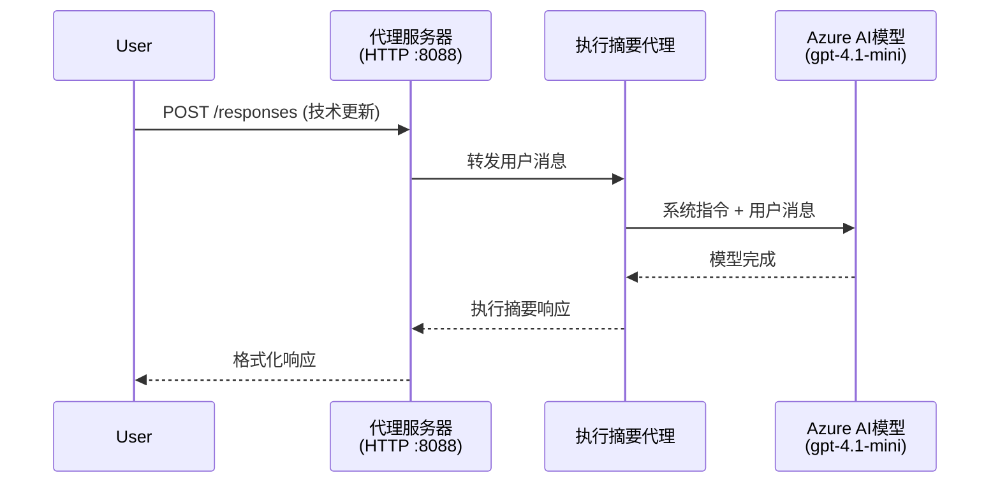
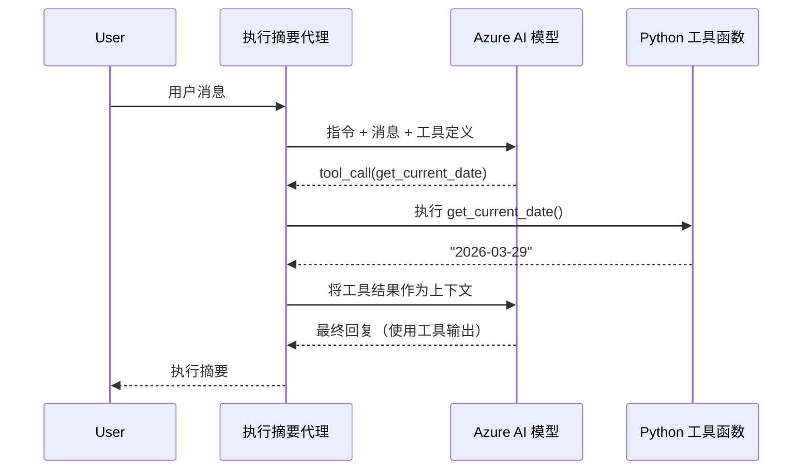

# 模块 4 - 配置指令、环境和安装依赖

在本模块中，您将定制模块 3 中自动生成的代理文件。这里您将把通用的脚手架转变为<strong>您自己的</strong>代理——通过编写指令、设置环境变量，可选地添加工具，以及安装依赖项。

> **提醒：** Foundry 扩展已自动生成您的项目文件。现在您可以修改它们。请参阅 [`agent/`](../../../../../workshop/lab01-single-agent/agent) 文件夹，查看一个定制代理的完整工作示例。

---

## 组件如何协同工作

### 请求生命周期（单代理）


> **带工具：** 如果代理注册了工具，模型可能返回工具调用而非直接响应。框架在本地执行工具，将结果反馈给模型，然后模型生成最终响应。


---

## 第 1 步：配置环境变量

脚手架创建了一个带占位符值的 `.env` 文件。您需要填写模块 2 中的真实值。

1. 在您的脚手架项目中，打开 **`.env`** 文件（在项目根目录下）。
2. 用您实际的 Foundry 项目详情替换占位符值：

   ```env
   PROJECT_ENDPOINT=https://<your-account>.services.ai.azure.com/api/projects/<your-project>
   MODEL_DEPLOYMENT_NAME=gpt-4.1-mini
   ```

3. 保存文件。

### 这些值在哪里找到

| 值 | 查找方法 |
|-------|---------------|
| <strong>项目端点</strong> | 在 VS Code 中打开 **Microsoft Foundry** 侧边栏 → 点击您的项目 → 详细信息视图显示端点 URL。格式类似 `https://<account-name>.services.ai.azure.com/api/projects/<project-name>` |
| <strong>模型部署名称</strong> | 在 Foundry 侧边栏，展开您的项目 → 查看 **Models + endpoints** → 部署模型旁边列出名称（例如 `gpt-4.1-mini`） |

> **安全提示：** 切勿将 `.env` 文件提交到版本控制。默认已包含在 `.gitignore` 中。如果未包含，请添加：
> ```
> .env
> ```

### 环境变量的流向

映射链为：`.env` → `main.py`（通过 `os.getenv` 读取）→ `agent.yaml`（部署时映射到容器环境变量）。

在 `main.py` 中，脚手架这样读取这些值：

```python
PROJECT_ENDPOINT = os.getenv("AZURE_AI_PROJECT_ENDPOINT") or os.getenv("PROJECT_ENDPOINT")
MODEL_DEPLOYMENT_NAME = os.getenv("AZURE_AI_MODEL_DEPLOYMENT_NAME", os.getenv("MODEL_DEPLOYMENT_NAME", "gpt-4.1-mini"))
```

支持 `AZURE_AI_PROJECT_ENDPOINT` 和 `PROJECT_ENDPOINT`（`agent.yaml` 使用 `AZURE_AI_*` 前缀）。

---

## 第 2 步：编写代理指令

这是最重要的定制步骤。指令定义了您的代理的个性、行为、输出格式和安全约束。

1. 打开项目中的 `main.py`。
2. 找到指令字符串（脚手架包含默认/通用的指令）。
3. 替换为详细的结构化指令。

### 好的指令包含内容

| 组成 | 目的 | 示例 |
|-----------|---------|---------|
| <strong>角色</strong> | 代理的身份和职责 | “您是一个执行摘要代理” |
| <strong>受众</strong> | 响应对象 | “没有技术背景的高级领导” |
| <strong>输入定义</strong> | 处理的提示类型 | “技术事件报告、运营更新” |
| <strong>输出格式</strong> | 响应的具体结构 | “执行摘要：- 发生了什么：... - 业务影响：... - 下一步：...” |
| <strong>规则</strong> | 约束和拒绝条件 | “不得添加超出提供信息之外的内容” |
| <strong>安全</strong> | 防止误用和幻觉 | “输入不明确时请求澄清” |
| <strong>示例</strong> | 输入/输出对，指导行为 | 包含 2-3 个不同输入的示例 |

### 示例：执行摘要代理指令

这是工作坊 [`agent/main.py`](../../../../../workshop/lab01-single-agent/agent/main.py) 中使用的指令：

```python
AGENT_INSTRUCTIONS = """You are an "Explain Like I'm an Executive" agent.

Purpose:
Your job is to translate complex technical or operational information into
clear, concise, and outcome-focused summaries that can be easily understood
by non-technical executives.

Audience:
Senior leaders with limited technical background who care about impact,
risk, and what happens next.

What you must do:
- Rephrase the input so it is understandable to a non-technical audience
- Prioritize clarity, brevity, and outcomes over technical accuracy
- Remove technical jargon, logs, metrics, stack traces, and deep root-cause details
- Translate technical causes into simple cause-and-effect statements
- Explicitly call out business impact
- Always include a clear next step or action
- Maintain a neutral, factual, and calm executive tone
- Do NOT add new facts or speculate beyond the input

Standard Output Structure (always use this wording):

Executive Summary:
- What happened: <plain-language description>
- Business impact: <clear, non-technical impact>
- Next step: <clear action or mitigation>

Rules:
- Keep responses under 100 words
- Do NOT add facts beyond the input
- If input is unclear, ask for clarification
"""
```

4. 用您的自定义指令替换 `main.py` 中原有的指令字符串。
5. 保存文件。

---

## 第 3 步：（可选）添加自定义工具

托管代理可以执行<strong>本地 Python 函数</strong>作为[工具](https://learn.microsoft.com/azure/foundry/agents/concepts/tool-catalog)。这是基于代码的托管代理相比仅提示代理的关键优势之一——您的代理可以运行任意服务器端逻辑。

### 3.1 定义工具函数

向 `main.py` 添加工具函数：

```python
from agent_framework import tool

@tool
def get_current_date() -> str:
    """Returns the current date in YYYY-MM-DD format."""
    from datetime import date
    return str(date.today())
```

`@tool` 装饰器将普通 Python 函数转换为代理工具。函数文档字符串成为模型看到的工具描述。

### 3.2 向代理注册工具

通过 `.as_agent()` 上下文管理器创建代理时，在 `tools` 参数传入工具：

```python
async with AzureAIAgentClient(
    project_endpoint=PROJECT_ENDPOINT,
    model_deployment_name=MODEL_DEPLOYMENT_NAME,
    credential=credential,
).as_agent(
    name="my-agent",
    instructions=AGENT_INSTRUCTIONS,
    tools=[get_current_date],
) as agent:
    server = from_agent_framework(agent)
    await server.run_async()
```

### 3.3 工具调用是如何工作的

1. 用户发送提示。
2. 模型判断是否需要工具（基于提示、指令和工具描述）。
3. 如需工具，框架在本地（容器内）调用您的 Python 函数。
4. 工具返回值作为上下文传回模型。
5. 模型生成最终响应。

> <strong>工具在服务器端执行</strong>——它们在您的容器内运行，而不是用户浏览器或模型中。这意味着您可以访问数据库、API、文件系统或任何 Python 库。

---

## 第 4 步：创建并激活虚拟环境

安装依赖前，创建隔离的 Python 环境。

### 4.1 创建虚拟环境

在 VS Code 中打开终端（`` Ctrl+` ``），运行：

```powershell
python -m venv .venv
```

这将在项目目录创建 `.venv` 文件夹。

### 4.2 激活虚拟环境

**PowerShell（Windows）：**

```powershell
.\.venv\Scripts\Activate.ps1
```

**命令提示符（Windows）：**

```cmd
.venv\Scripts\activate.bat
```

**macOS/Linux（Bash）：**

```bash
source .venv/bin/activate
```

终端提示符开头应显示 `(.venv)`，表示虚拟环境已激活。

### 4.3 安装依赖

激活虚拟环境后，安装所需包：

```powershell
pip install -r requirements.txt
```

安装以下内容：

| 包 | 作用 |
|---------|---------|
| `agent-framework-azure-ai==1.0.0rc3` | 用于 [Microsoft Agent Framework](https://learn.microsoft.com/agent-framework/overview/) 的 Azure AI 集成 |
| `agent-framework-core==1.0.0rc3` | 构建代理的核心运行时（包含 `python-dotenv`） |
| `azure-ai-agentserver-agentframework==1.0.0b16` | [Foundry Agent Service](https://learn.microsoft.com/azure/foundry/agents/overview) 的托管代理服务器运行时 |
| `azure-ai-agentserver-core==1.0.0b16` | 核心代理服务器抽象层 |
| `debugpy` | Python 调试器（支持 VS Code 中的 F5 调试） |
| `agent-dev-cli` | 用于测试代理的本地开发 CLI |

### 4.4 验证安装

```powershell
pip list | Select-String "agent-framework|agentserver"
```

预期输出：
```
agent-framework-azure-ai   1.0.0rc3
agent-framework-core       1.0.0rc3
azure-ai-agentserver-agentframework 1.0.0b16
azure-ai-agentserver-core  1.0.0b16
```

---

## 第 5 步：验证身份认证

代理使用 [`DefaultAzureCredential`](https://learn.microsoft.com/azure/developer/python/sdk/authentication/credential-chains#defaultazurecredential-overview)，按此顺序尝试多种认证方式：

1. <strong>环境变量</strong> - `AZURE_CLIENT_ID`、`AZURE_TENANT_ID`、`AZURE_CLIENT_SECRET`（服务主体）
2. **Azure CLI** - 自动使用您的 `az login` 会话
3. **VS Code** - 使用您登录 VS Code 的账户
4. <strong>托管身份</strong> - 在 Azure 中运行（部署时）时使用

### 5.1 本地开发验证

以下任一方式应可用：

**选项 A：Azure CLI（推荐）**

```powershell
az account show --query "{name:name, id:id}" --output table
```

预期显示您的订阅名称和 ID。

**选项 B：VS Code 登录**

1. 查看 VS Code 左下角的 <strong>账户</strong> 图标。
2. 如果显示您的账户名，则已认证。
3. 否则，点击图标 → **登录以使用 Microsoft Foundry**。

**选项 C：服务主体（用于 CI/CD）**

```powershell
$env:AZURE_TENANT_ID = "<your-tenant-id>"
$env:AZURE_CLIENT_ID = "<your-client-id>"
$env:AZURE_CLIENT_SECRET = "<your-client-secret>"
```

### 5.2 常见认证问题

如果登录了多个 Azure 账户，请确保选择了正确的订阅：

```powershell
az account set --subscription "<your-subscription-id>"
```

---

### 检查点

- [ ] `.env` 文件中有有效的 `PROJECT_ENDPOINT` 和 `MODEL_DEPLOYMENT_NAME`（非占位符）
- [ ] 在 `main.py` 中定制了代理指令——定义了角色、受众、输出格式、规则和安全约束
- [ ] （可选）定义并注册了自定义工具
- [ ] 创建并激活了虚拟环境（终端提示符显示 `(.venv)`）
- [ ] `pip install -r requirements.txt` 成功完成，无错误
- [ ] `pip list | Select-String "azure-ai-agentserver"` 显示相关包已安装
- [ ] 认证有效—使用 `az account show` 返回订阅信息或已登录 VS Code

---

**上一节：** [03 - 创建托管代理](03-create-hosted-agent.md) · **下一节：** [05 - 本地测试 →](05-test-locally.md)

---

<!-- CO-OP TRANSLATOR DISCLAIMER START -->
**免责声明**：  
本文件使用AI翻译服务[Co-op Translator](https://github.com/Azure/co-op-translator)进行翻译。尽管我们力求准确，但请注意自动翻译可能存在错误或不准确之处。原始文件的母语版本应被视为权威来源。对于关键信息，建议采用专业人工翻译。我们不对因使用本翻译而产生的任何误解或误释承担责任。
<!-- CO-OP TRANSLATOR DISCLAIMER END -->