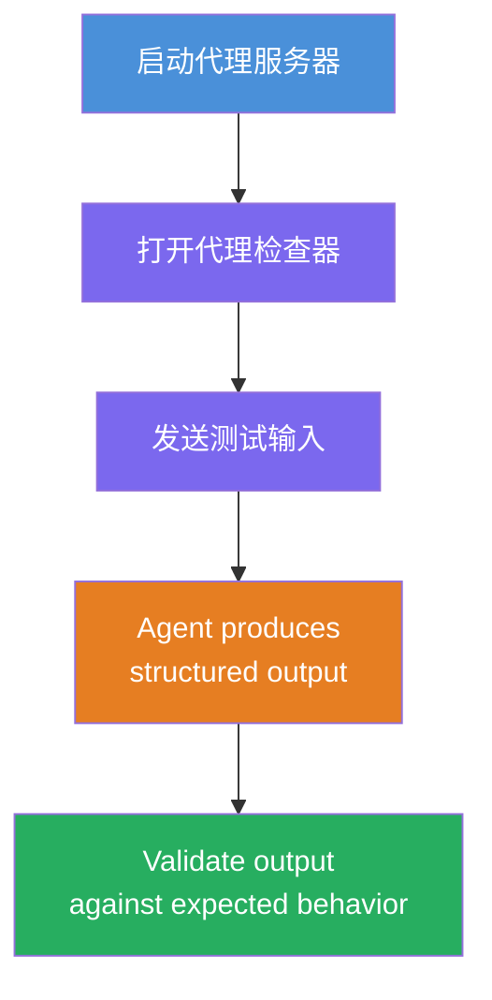
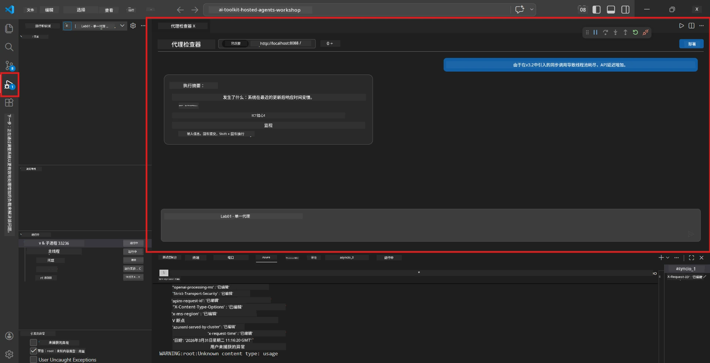
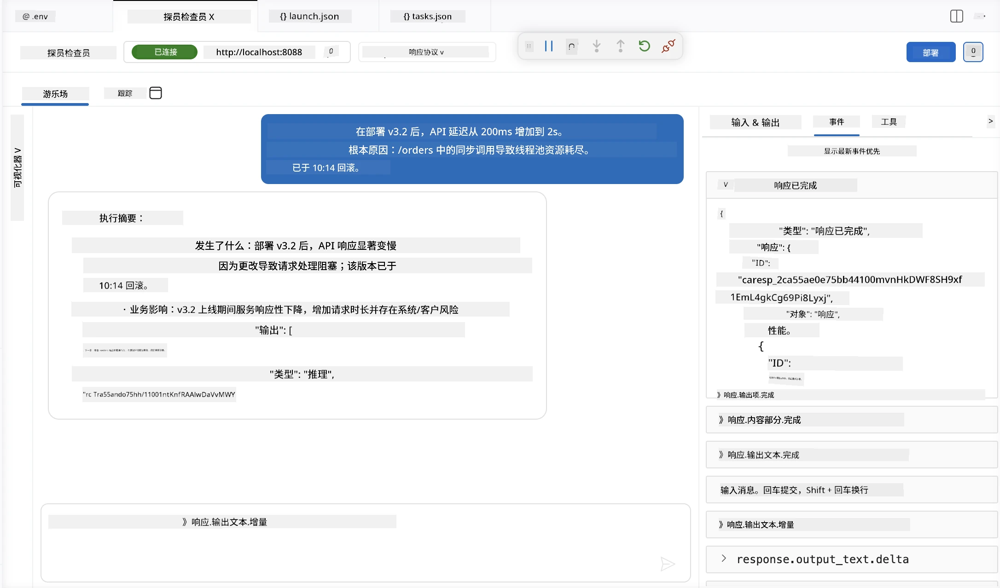

# 模块 4 - 本地测试

⏱️ 约10分钟

在本模块中，你将本地运行代理并使用<strong>顺利流程功能测试</strong>验证其正确性。你可以使用 Agent Inspector（可视化界面）或直接通过 HTTP 调用，确认代理生成结构化且准确的响应。

### 本地测试流程



---

## 选项1：按F5 - 使用 Agent Inspector 调试（推荐）

### 启动调试器

1. 在 VS Code 中直接打开 **executive-summary-agent/** 文件夹（`文件 → 打开文件夹`）。
2. 打开 <strong>运行和调试</strong> 面板（`Ctrl+Shift+D`）。
3. 从下拉菜单中选择 **Debug Local Agent Server**。
4. 按下 **F5**（或点击 ▶ 开始调试）。

> ⚠️ **关键：选择你的 Python 解释器**
> 如果遇到“ModuleNotFoundError”或调试器无法启动，你必须告诉 VS Code 使用你的虚拟环境：
>   1. 按 `Ctrl+Shift+P` → 输入 **Python: Select Interpreter**。
>   2. 选择位于项目 `.venv` 文件夹中的解释器（例如 Windows 上的 `.\.venv\Scripts\python.exe`）。
>   3. 重启调试会话。
> 如果仍有错误，请手动更新你的 `tasks.json` 文件，步骤如下：
>   1. 找到 `.vscode/tasks.json` 文件
>   2. 定位标记为“Run Agent/Workflow HTTP Server”的命令
>   3. 将命令值更新为：`"value": "${workspaceFolder}/.venv/bin/python",`

### 发生了什么

1. HTTP 服务器启动，监听 `http://localhost:8088/responses`。
2. **Agent Inspector** 面板自动打开——一个用于测试的可视化聊天界面。
3. 在 `main.py` 中启用断点。

在终端观察：
```
Starting executive summary hosted agent
Executive agent server running on http://localhost:8088
```

> **如果 Agent Inspector 没有打开：** 按 `Ctrl+Shift+P` → 选择 **Foundry Toolkit: Open Agent Inspector**。



> *截图可能显示的是旧版扩展中的“AI TOOLKIT”品牌。*

---

## 选项2：通过终端测试（备选）

在一个终端启动代理，从另一个终端发送请求：

```bash
# 终端 1：启动代理
cd executive-summary-agent/
source .venv/bin/activate
python main.py
```

```bash
# 终端 2：发送测试（curl）
curl -sS -X POST http://localhost:8088/responses \
  -H "Content-Type: application/json" \
  -d '{"input": "The API latency increased due to thread pool exhaustion caused by sync calls in v3.2.", "stream": false}'
```

---

## 场景测试：顺利流程功能验证

运行以下<strong>全部三个</strong>场景。它们验证你的代理是否为现实输入生成正确且结构化的输出。



### 场景1：IT 事件 - API 延迟激增

**输入：**
```
The API latency increased from 200ms to 2s after deploying v3.2.
Root cause: thread pool starvation from synchronous calls in /orders.
Rolled back at 10:14.
```

**预期行为：**
- ✅ 遵循“执行摘要”结构（发生了什么 / 业务影响 / 下一步）
- ✅ 无技术行话（无“thread pool”，无“/orders”，无“v3.2”）
- ✅ 清楚说明业务影响（例如用户体验到延迟）
- ✅ 包含下一步措施（例如修复部署，持续监控）

---

### 场景2：数据管道 - ETL 失败

**输入：**
```
The nightly ETL job failed because the upstream schema changed. APAC dashboards show missing data.
```

**预期行为：**
- ✅ 用通俗易懂的语言总结数据刷新失败
- ✅ 提及亚太区仪表板的影响
- ✅ 提出补救措施
- ✅ 不提及“ETL”、“schema”或其他技术术语

---

### 场景3：安全 - 凭证泄露

**输入：**
```
Static analysis flagged a hardcoded secret in the repository.
The secret may have been exposed in commit history.
```

**预期行为：**
- ✅ 用适合高管理解的语言描述凭证/安全问题
- ✅ 指出潜在风险（未授权访问）
- ✅ 说明补救措施（凭证更换，审计）
- ✅ 不包含“静态分析”、“提交历史”或“硬编码”等术语

---

## 验证标准

针对每个场景检查：

| # | 标准 | 通过条件 |
|---|----------|---------------|
| 1 | <strong>结构</strong> | 响应采用“执行摘要”格式，包含所有三个要点 |
| 2 | <strong>通俗语言</strong> | 无高管无法理解的技术行话 |
| 3 | <strong>准确性</strong> | 总结反映输入内容，未捏造细节 |
| 4 | <strong>简洁</strong> | 响应不超过100字 |
| 5 | <strong>下一步</strong> | 明确陈述一个行动或缓解措施 |

---

## 调试技巧

| 问题 | 解决方法 |
|-------|-----|
| 代理未启动 | 检查 `.env` 值，确认虚拟环境已激活，运行 `pip install -r requirements.txt` |
| 响应为空或泛泛 | 检查 `main.py` 中的指令，确保指定了输出格式 |
| 响应包含行话 | 加强移除技术术语的指令规则 |
| Agent Inspector 未打开 | `Ctrl+Shift+P` → 选择 **Foundry Toolkit: Open Agent Inspector** |
| 终端显示模型错误 | 确认 `AZURE_AI_MODEL_DEPLOYMENT_NAME` 完全匹配（区分大小写）|

---

### ✅ 检查点

- [ ] 代理在本地启动无错误
- [ ] Agent Inspector 打开并显示聊天界面（如果使用F5）
- [ ] **场景1**（IT事件）- 结构化执行摘要，无行话
- [ ] **场景2**（数据管道）- 相关的业务影响摘要
- [ ] **场景3**（安全告警）- 适当的风险沟通
- [ ] 所有响应遵循定义的输出结构

> <strong>保存你的响应</strong>（复制或截图）— 你将在模块06中与云端结果进行比较。

---

**上一步：** [03 - 配置与编码](03-configure-and-code.md) · **下一步：** [05 - 部署到 Foundry →](05-deploy-to-foundry.md)

---

<!-- CO-OP TRANSLATOR DISCLAIMER START -->
**免责声明**：
本文件由 AI 翻译服务 [Co-op Translator](https://github.com/Azure/co-op-translator) 翻译完成。尽管我们力求准确，但请注意，自动翻译可能包含错误或不准确之处。原始语言版文件应视为权威来源。对于重要信息，建议使用专业人工翻译。我们对因使用本翻译而产生的任何误解或误释不承担责任。
<!-- CO-OP TRANSLATOR DISCLAIMER END -->