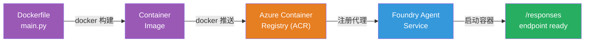
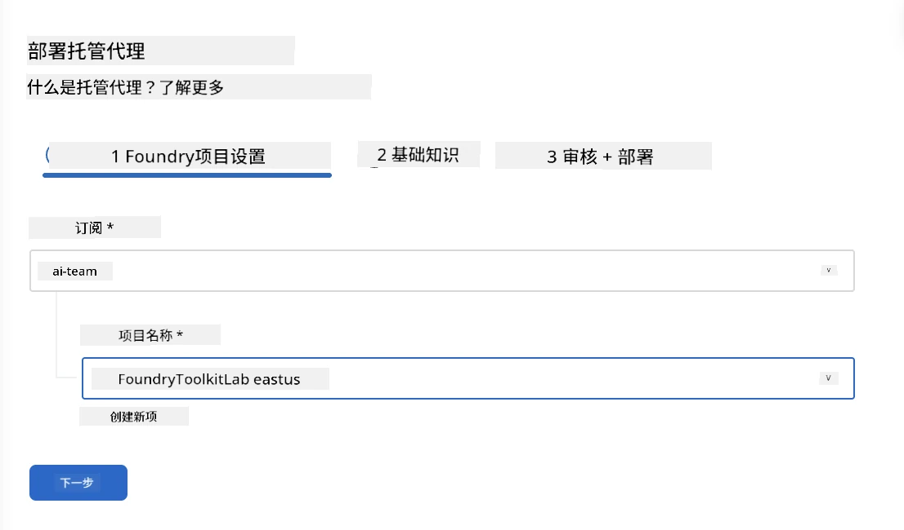
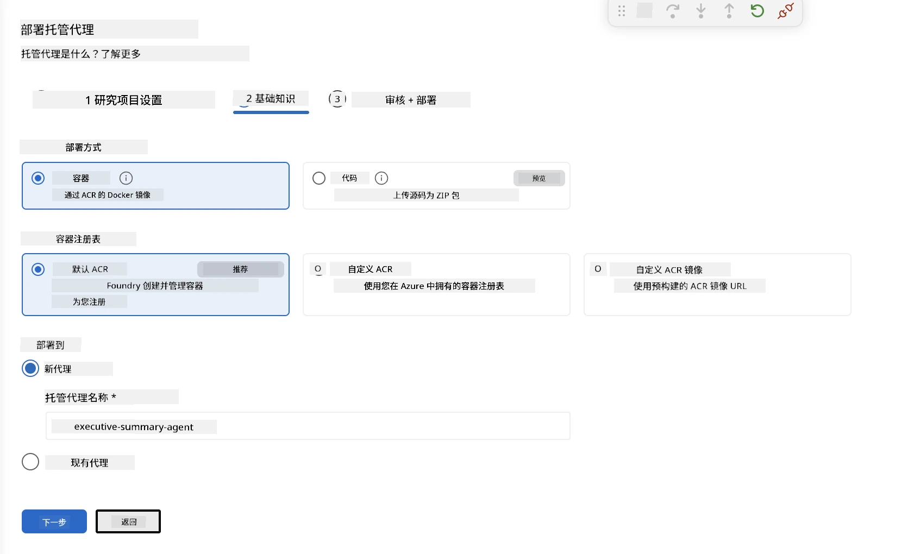
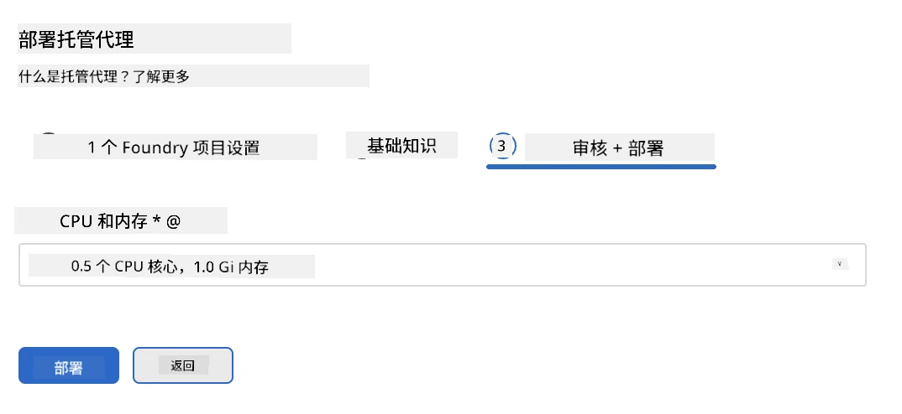
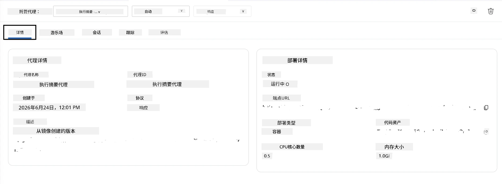

# 模块 5 - 部署到 Foundry Agent 服务

⏱️ ~10 分钟

> ⚠️ **路径 B 用户：** 本模块需要 Foundry 订阅。如果您使用的是 Foundry Local，请跳至[模块 07 - 总结](07-summary.md)。您已成功完成本地开发工作流程！

在本模块中，您将本地测试的代理部署到 Microsoft Foundry，作为<strong>托管代理</strong>。部署过程会构建容器镜像，将其推送到 Azure 容器注册表，并在 Foundry 的托管基础设施中启动代理。

### 部署流程

---

## 前置条件检查

在部署之前，请确认：

- [ ] 代理通过了[模块 04](04-test-locally.md)中的所有 3 个本地测试场景
- [ ] 您在项目级别拥有 **Azure AI 用户** 角色 ([模块 01，分配 RBAC](01-setup.md#deploy-a-model--assign-rbac))
- [ ] 您已经在 VS Code 中登录 Azure（账户图标显示您的用户名）

---

## 步骤 1：开始部署

### 选项 A：通过 Agent Inspector 部署（推荐）

如果 Agent Inspector 已打开（来自测试）：
1. 点击右上角的 <strong>部署</strong> 按钮（云图标 ↑）。

### 选项 B：通过命令面板部署

1. 按 `Ctrl+Shift+P` → **Foundry Toolkit: Deploy Hosted Agent**。

---

## 步骤 2：配置部署

向导会提示您配置：

| 提示 | 选择 |
|--------|-----------|
| <strong>订阅</strong> | 您的 Azure 订阅 |
| <strong>目标项目</strong> | 您的 Foundry 项目（例如，`workshop-agents`） |

点击 <strong>下一步</strong> 配置您的代理。

| 提示 | 选择 |
|--------|-----------|
| <strong>部署方式</strong> | 容器 |
| <strong>容器注册表</strong> | **默认 ACR**（Microsoft Foundry 为您创建并管理） |
| <strong>部署到</strong> | 新代理（名称，`executive-summary-agent`） |

点击 <strong>下一步</strong> 以审核并部署您的代理。

| 提示 | 选择 |
|--------|-----------|
| **CPU 和内存** | **0.25 CPU 核，0.5 Gi 内存**（足够支撑本次研讨会） |

---

## 步骤 3：部署与监控

1. 点击 <strong>部署</strong>。
2. 观察 <strong>输出</strong> 面板（从下拉菜单选择 **Microsoft Foundry**）。
3. 部署流程经过以下阶段：
   - **Docker 构建** - 根据您的 Dockerfile 构建容器
   - **Docker 推送** - 将镜像推送到 ACR（首次部署需 1–3 分钟）
   - <strong>代理注册</strong> - 在 Foundry 中创建托管代理
   - <strong>容器启动</strong> - 以系统管理标识启动

4. 完成后，会出现通知：
   > **my-agent 部署成功。** `查看日志` `运行代理`

5. 点击 <strong>运行代理</strong> 以打开 Agent Playground。

### 部署状态含义

| 状态 | 含义 |
|--------|---------|
| <strong>运行中</strong> | 容器已就绪，代理响应正常 |
| <strong>等待中</strong> | 容器启动中 - 请等待 30–60 秒 |
| <strong>失败</strong> | 请检查日志（见下方故障排除） |

---

## 常见部署错误

| 错误 | 根本原因 | 解决方案 |
|-------|-----------|-----|
| `agents/write` 权限被拒绝 | 缺少项目级别的 **Azure AI 用户** 角色 | [模块 01，分配 RBAC](01-setup.md#deploy-a-model--assign-rbac) |
| Docker 未运行 | 未启动 Docker Desktop | 启动 Docker Desktop → 验证 `docker info` |
| ACR 授权失败 | 托管标识无法拉取镜像 | 见 [模块 08 - 故障排除](08-troubleshooting.md) |

---

### ✅ 检查点

- [ ] 部署完成且无错误
- [ ] 代理显示在 Foundry 侧栏的 **托管代理（预览）** 下
- [ ] 容器状态显示为 <strong>运行中</strong>
- [ ] Agent Playground 标签页打开，显示代理详情及端点 URL

---

**上一步：** [04 - 本地测试](04-test-locally.md) · **下一步：** [06 - 在 Playground 中验证 →](06-verify-in-playground.md)

---

<!-- CO-OP TRANSLATOR DISCLAIMER START -->
**免责声明**：
本文件由 AI 翻译服务 [Co-op Translator](https://github.com/Azure/co-op-translator) 翻译完成。尽管我们力求准确，但请注意，自动翻译可能包含错误或不准确之处。原始语言版文件应视为权威来源。对于重要信息，建议使用专业人工翻译。我们对因使用本翻译而产生的任何误解或误释不承担责任。
<!-- CO-OP TRANSLATOR DISCLAIMER END -->