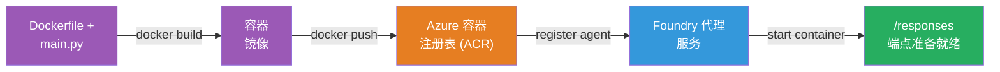
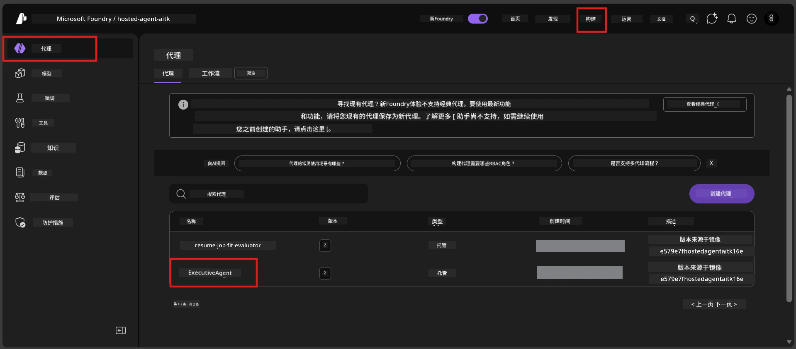

# Module 6 - 部署到 Foundry Agent Service

在本模块中，您将把本地测试过的代理部署到 Microsoft Foundry 作为[<strong>托管代理</strong>](https://learn.microsoft.com/azure/foundry/agents/concepts/hosted-agents)。部署流程会从您的项目构建一个 Docker 容器镜像，推送到 [Azure 容器注册表 (ACR)](https://learn.microsoft.com/azure/container-registry/container-registry-intro)，并在 [Foundry Agent Service](https://learn.microsoft.com/azure/foundry/agents/overview) 中创建一个托管代理版本。

### 部署流水线


---

## 先决条件检查

在部署之前，请确认以下每一项。跳过这些检查是部署失败的最常见原因。

1. **代理通过本地烟雾测试：**
   - 您已完成[模块 5](05-test-locally.md)中的全部4个测试，且代理响应正确。

2. **您具备 [Azure AI 用户](https://learn.microsoft.com/azure/foundry/concepts/rbac-foundry#built-in-roles) 角色：**
   - 该角色在[模块 2，步骤 3](02-create-foundry-project.md)中分配。如果不确定，请现在验证：
   - 登录 Azure 门户 → 您的 Foundry <strong>项目</strong> 资源 → **访问控制 (IAM)** → <strong>角色分配</strong> 标签页 → 搜索您的名字 → 确认列表中有 **Azure AI User**。

3. **您已在 VS Code 中登录 Azure：**
   - 查看 VS Code 左下角的账户图标，应能看到您的账户名称。

4. **（可选）Docker Desktop 已运行：**
   - 只有当 Foundry 扩展提示您执行本地构建时才需要 Docker。大多数情况下，扩展会在部署期间自动处理容器构建。
   - 如果您安装了 Docker，请确认它正在运行：`docker info`

---

## 第 1 步：开始部署

您有两种方式进行部署——两者结果相同。

### 选项 A：通过 Agent Inspector 部署（推荐）

如果您正在调试（F5）代理且 Agent Inspector 已打开：

1. 查看 Agent Inspector 面板的<strong>右上角</strong>。
2. 点击 **Deploy** 按钮（带向上箭头↑的云图标）。
3. 部署向导会打开。

### 选项 B：通过命令面板部署

1. 按 `Ctrl+Shift+P` 打开 <strong>命令面板</strong>。
2. 输入：**Microsoft Foundry: Deploy Hosted Agent** 并选择它。
3. 部署向导会打开。

---

## 第 2 步：配置部署

部署向导会引导您完成配置。请填写各项提示：

### 2.1 选择目标项目

1. 下拉菜单显示您的 Foundry 项目。
2. 选择您在模块 2 创建的项目（例如，`workshop-agents`）。

### 2.2 选择容器代理文件

1. 系统会要求您选择代理入口文件。
2. 选择 **`main.py`**（Python）——这是向导用于识别您代理项目的文件。

### 2.3 配置资源

| 设置       | 推荐值    | 说明                        |
|------------|-----------|-----------------------------|
| **CPU**    | `0.25`    | 默认，足够完成研讨会任务。生产环境可增大 |
| <strong>内存</strong>   | `0.5Gi`   | 默认，足够完成研讨会任务           |

这些与 `agent.yaml` 中的值相匹配。您可接受默认值。

---

## 第 3 步：确认并部署

1. 向导显示部署摘要，包含：
   - 目标项目名称
   - 代理名称（取自 `agent.yaml`）
   - 容器文件和资源
2. 审核摘要后，点击 <strong>确认并部署</strong>（或 **Deploy**）。
3. 在 VS Code 中观察进展。

### 部署过程中发生的事情（详细步骤）

部署是一个多步骤的过程。请观看 VS Code 中的 <strong>输出</strong> 面板（从下拉菜单选择“Microsoft Foundry”）以跟踪：

1. **Docker 构建** - VS Code 根据您的 `Dockerfile` 构建 Docker 容器镜像。您会看到 Docker 分层消息：
   ```
   Step 1/6 : FROM python:<version>-slim
   Step 2/6 : WORKDIR /app
   ...
   Successfully built abc123def456
   ```

2. **Docker 推送** - 镜像被推送到与 Foundry 项目关联的 **Azure 容器注册表 (ACR)**。首次部署可能需要 1-3 分钟（基础镜像大于 100MB）。

3. <strong>代理注册</strong> - Foundry Agent Service 创建一个新的托管代理（或者如果代理已存在则创建新版本）。代理元数据使用自 `agent.yaml`。

4. <strong>容器启动</strong> - 容器在 Foundry 托管基础设施中启动。平台分配一个[系统托管标识](https://learn.microsoft.com/azure/foundry/agents/concepts/agent-identity)，并暴露 `/responses` 端点。

> <strong>首次部署较慢</strong>（因为 Docker 需要推送所有层）。后续部署更快，因为 Docker 会缓存未更改的层。

---

## 第 4 步：验证部署状态

部署命令执行完成后：

1. 点击活动栏的 Foundry 图标，打开 **Microsoft Foundry** 侧边栏。
2. 展开您所在项目下的 **托管代理（预览）** 部分。
3. 您应看到代理名称（例如，`ExecutiveAgent` 或 `agent.yaml` 中的名称）。
4. <strong>点击代理名称</strong> 以展开详情。
5. 您会看到一个或多个 <strong>版本</strong>（例如，`v1`）。
6. 点击版本查看 <strong>容器详情</strong>。
7. 检查 <strong>状态</strong> 字段：

   | 状态       | 含义                          |
   |------------|-------------------------------|
   | **Started** 或 **Running** | 容器正在运行，代理准备就绪        |
   | **Pending** | 容器正在启动（请等待30-60秒）    |
   | **Failed**  | 容器启动失败（查看日志 - 见下面故障排除） |



> **如果“Pending”状态超过2分钟：** 容器可能正在拉取基础镜像。请再等一会儿。如果持续为 Pending，请检查容器日志。

---

## 常见部署错误及解决办法

### 错误 1：权限被拒绝 - `agents/write`

```
Error: lacks the required data action 
Microsoft.CognitiveServices/accounts/AIServices/agents/write 
to perform POST /api/projects/{projectName}/assistants operation.
```

**根本原因：** 您未在<strong>项目</strong>级别拥有 `Azure AI User` 角色。

**逐步修复流程：**

1. 打开 [https://portal.azure.com](https://portal.azure.com)。
2. 在搜索栏输入您的 Foundry <strong>项目</strong> 名称并点击进入。
   - **重要：** 确保您进入的是<strong>项目</strong>资源（类型：“Microsoft Foundry project”），而非其父级账户/集线器资源。
3. 左侧导航点击 **访问控制 (IAM)**。
4. 点击 **+ 添加** → <strong>添加角色分配</strong>。
5. 在 <strong>角色</strong> 标签页，搜索并选择 [**Azure AI User**](https://learn.microsoft.com/azure/foundry/concepts/rbac-foundry#built-in-roles)，点击 <strong>下一步</strong>。
6. 在 <strong>成员</strong> 标签页，选择 **用户、组或服务主体**。
7. 点击 **+ 选择成员**，搜索您的姓名/邮箱，选择自己，点击 <strong>选择</strong>。
8. 点击 **审核 + 分配** → 再次点击 **审核 + 分配**。
9. 等待1-2分钟，角色分配生效。
10. **重试第 1 步的部署**。

> 角色必须在<strong>项目</strong>范围内，而不仅是账户范围内。这是部署失败的首要原因。

### 错误 2：Docker 未运行

```
Error: Docker build failed / Cannot connect to Docker daemon
```

**修复：**
1. 启动 Docker Desktop（从开始菜单或系统托盘找到它）。
2. 等待显示“Docker Desktop 正在运行”（30-60秒）。
3. 在终端执行：`docker info` 验证。
4. **Windows 特有：** 确保在 Docker Desktop 设置 → <strong>常规</strong> 中启用了 WSL 2 后端 → **使用基于 WSL 2 的引擎**。
5. 重新尝试部署。

### 错误 3：ACR 授权 - `AcrPullUnauthorized`

```
Error: AcrPullUnauthorized
```

**根本原因：** Foundry 项目的托管标识没有容器注册表的拉取权限。

**修复：**
1. 在 Azure 门户，访问您的 **[容器注册表](https://learn.microsoft.com/azure/container-registry/container-registry-intro)**（与 Foundry 项目位于相同资源组）。
2. 转到 **访问控制 (IAM)** → <strong>添加</strong> → <strong>添加角色分配</strong>。
3. 选择 **[AcrPull](https://learn.microsoft.com/azure/container-registry/container-registry-roles)** 角色。
4. 在成员中选择 <strong>托管标识</strong> → 找到 Foundry 项目的托管标识。
5. 点击 **审核 + 分配**。

> 该权限通常由 Foundry 扩展自动配置。如果出现此错误，说明自动设置失败。

### 错误 4：容器平台不匹配（Apple Silicon）

如果使用 Apple Silicon Mac（M1/M2/M3）部署，容器必须为 `linux/amd64` 构建：

```bash
docker build --platform linux/amd64 -t myagent:v1 .
```

> Foundry 扩展会自动为大多数用户处理此问题。

---

### 检查点

- [ ] 部署命令在 VS Code 中无错误完成
- [ ] 代理显示在 Foundry 侧边栏的 **托管代理（预览）** 下
- [ ] 您点击代理 → 选择某个版本 → 查看了 <strong>容器详情</strong>
- [ ] 容器状态显示为 **Started** 或 **Running**
- [ ] （若有错误）您识别错误、应用修复，并成功重新部署

---

**上一步：** [05 - 本地测试](05-test-locally.md) · **下一步：** [07 - 在 Playground 验证 →](07-verify-in-playground.md)

---

<!-- CO-OP TRANSLATOR DISCLAIMER START -->
**免责声明**：
本文档通过 AI 翻译服务 [Co-op Translator](https://github.com/Azure/co-op-translator) 进行翻译。尽管我们努力确保准确性，但请注意，自动翻译可能存在错误或不准确之处。以原始语言的文档为权威来源。对于重要信息，建议使用专业人工翻译。对于因使用本翻译而产生的任何误解或误释，我们概不负责。
<!-- CO-OP TRANSLATOR DISCLAIMER END -->