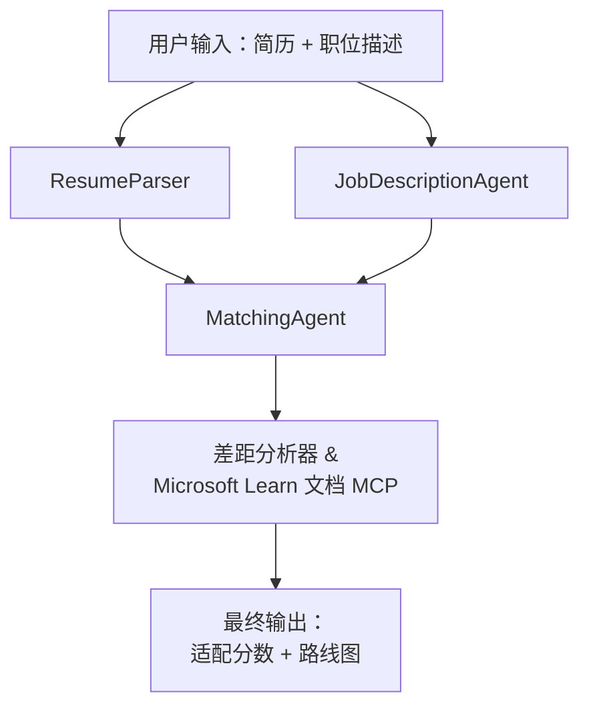

# PersonalCareerCopilot - 简历 → 职位匹配评估器

一个多智能体工作流，用于评估简历与职位描述的匹配程度，然后生成个性化的学习路线图以弥补差距。

---

## 智能体

| 智能体 | 角色 | 工具 |
|-------|------|-------|
| **ResumeParser** | 从简历文本中提取结构化的技能、经验、证书 | - |
| **JobDescriptionAgent** | 从职位描述中提取必需/优先技能、经验、证书 | - |
| **MatchingAgent** | 比较个人资料与要求 → 匹配分数 (0-100) + 匹配/缺失技能 | - |
| **GapAnalyzer** | 使用 Microsoft Learn 资源构建个性化学习路线图 | `search_microsoft_learn_for_plan` (MCP) |

## 工作流


---

## 快速开始

### 1. 设置环境

```powershell
cd workshop\lab02-multi-agent\PersonalCareerCopilot
python -m venv .venv
.\.venv\Scripts\Activate.ps1          # Windows PowerShell
# source .venv/bin/activate            # macOS / Linux
pip install -r requirements.txt
```

### 2. 配置凭据

复制示例 env 文件并填写你的 Foundry 项目信息：

```powershell
cp .env.example .env
```

编辑 `.env`：

```env
PROJECT_ENDPOINT=https://<your-account>.services.ai.azure.com/api/projects/<your-project>
MODEL_DEPLOYMENT_NAME=gpt-4.1-mini
```

| 值 | 位置 |
|-------|-----------------|
| `PROJECT_ENDPOINT` | VS Code 中 Microsoft Foundry 侧边栏 → 右键点击你的项目 → <strong>复制项目端点</strong> |
| `MODEL_DEPLOYMENT_NAME` | Foundry 侧边栏 → 展开项目 → **模型 + 端点** → 部署名称 |

### 3. 本地运行

```powershell
python -m debugpy --listen 127.0.0.1:5679 -m agentdev run main.py --verbose --port 8088
```

或者使用 VS Code 任务：`Ctrl+Shift+P` → **任务: 运行任务** → **运行 Lab02 HTTP 服务器**。

### 4. 使用 Agent Inspector 测试

打开 Agent Inspector：`Ctrl+Shift+P` → **Foundry 工具包: 打开 Agent Inspector**。

粘贴测试提示：

```
Resume:
Jane Doe
Senior Software Engineer with 5 years of experience in Python, Django, and AWS.
Built microservices handling 10K+ requests/second. Led a team of 4 developers.
Certifications: AWS Solutions Architect Associate.
Education: B.S. Computer Science, State University.

Job Description:
Senior Cloud Engineer at Contoso Ltd.
Required: Python, Azure, Kubernetes, Terraform, CI/CD pipelines.
Preferred: Go, monitoring (Prometheus/Grafana), cost optimization.
Experience: 5+ years in cloud infrastructure.
Certifications: Azure Solutions Architect Expert preferred.
```

**预期:** 一个匹配分数（0-100）、匹配/缺失技能，以及带有 Microsoft Learn 链接的个性化学习路线图。

### 5. 部署到 Foundry

`Ctrl+Shift+P` → **Microsoft Foundry: 部署托管智能体** → 选择你的项目 → 确认。

---

## 项目结构

```
PersonalCareerCopilot/
├── .env.example        ← Template for environment variables
├── .env                ← Your credentials (git-ignored)
├── agent.yaml          ← Hosted agent definition (name, resources, env vars)
├── Dockerfile          ← Container image for Foundry deployment
├── main.py             ← 4-agent workflow (instructions, MCP tool, WorkflowBuilder)
└── requirements.txt    ← Python dependencies
```

## 关键文件

### `agent.yaml`

定义 Foundry 智能体服务的托管智能体：
- `kind: hosted` - 作为托管容器运行
- `protocols: [responses v1]` - 暴露 `/responses` HTTP 端点
- `environment_variables` - `PROJECT_ENDPOINT` 和 `MODEL_DEPLOYMENT_NAME` 在部署时注入

### `main.py`

包含：
- <strong>智能体指令</strong> - 四个 `*_INSTRUCTIONS` 常量，每个智能体一个
- **MCP 工具** - `search_microsoft_learn_for_plan()` 通过 Streamable HTTP 调用 `https://learn.microsoft.com/api/mcp`
- <strong>智能体创建</strong> - 使用 `AzureAIAgentClient.as_agent()` 的 `create_agents()` 上下文管理器
- <strong>工作流图</strong> - `create_workflow()` 利用 `WorkflowBuilder` 连接智能体，采用分叉/合流/顺序模式
- <strong>服务器启动</strong> - `from_agent_framework(agent).run_async()` 监听 8088 端口

### `requirements.txt`

| 包 | 版本 | 作用 |
|---------|---------|---------|
| `agent-framework-azure-ai` | `1.0.0rc3` | Microsoft Agent Framework 的 Azure AI 集成 |
| `agent-framework-core` | `1.0.0rc3` | 核心运行时（包含 WorkflowBuilder） |
| `azure-ai-agentserver-agentframework` | `1.0.0b16` | 托管智能体服务器运行时 |
| `azure-ai-agentserver-core` | `1.0.0b16` | 核心智能体服务器抽象 |
| `debugpy` | 最新版 | Python 调试（VS Code 中 F5） |
| `agent-dev-cli` | `--pre` | 本地开发 CLI + Agent Inspector 后端 |

---

## 故障排查

| 问题 | 解决方法 |
|-------|-----|
| `RuntimeError: Missing required environment variable(s)` | 创建 `.env` 并添加 `PROJECT_ENDPOINT` 和 `MODEL_DEPLOYMENT_NAME` |
| `ModuleNotFoundError: No module named 'agent_framework'` | 激活虚拟环境并运行 `pip install -r requirements.txt` |
| 输出中无 Microsoft Learn 链接 | 检查是否能访问 `https://learn.microsoft.com/api/mcp` |
| 仅有一条 gap 卡片（内容被截断） | 确认 `GAP_ANALYZER_INSTRUCTIONS` 包含 `CRITICAL:` 部分 |
| 端口 8088 已被占用 | 停止其他服务器：`netstat -ano \| findstr :8088` |

详见[模块 8 - 故障排查](../docs/08-troubleshooting.md)。

---

**完整教程：** [Lab 02 文档](../docs/README.md) · **返回：** [Lab 02 说明](../README.md) · [研讨会首页](../../../README.md)

---

<!-- CO-OP TRANSLATOR DISCLAIMER START -->
**免责声明**：  
本文件使用 AI 翻译服务 [Co-op Translator](https://github.com/Azure/co-op-translator) 进行翻译。尽管我们努力确保准确性，但请注意自动翻译可能包含错误或不准确之处。请以原始语言的文档为权威来源。对于关键信息，建议使用专业人工翻译。对于因使用本翻译而引起的任何误解或误释，我们不承担任何责任。
<!-- CO-OP TRANSLATOR DISCLAIMER END -->