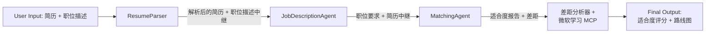

# PersonalCareerCopilot - 简历 → 职位匹配评估器

一个以工作流为先的多代理应用，评估简历与职位描述的匹配度，然后生成个性化的学习路线图以弥补差距。

---

## 代理

| 代理 | 角色 | 工具 |
|-------|------|-------|
| **ResumeParser** | 从简历文本中提取结构化的技能、经验、证书 | - |
| **JobDescriptionAgent** | 从职位描述中提取所需/优选技能、经验、证书 | - |
| **MatchingAgent** | 比较个人资料与要求 → 适配评分（0-100）+ 匹配/缺失技能 | - |
| **GapAnalyzer** | 利用 Microsoft Learn 资源构建个性化学习路线图 | `search_microsoft_learn_for_plan` (MCP) |

## 工作流


```mermaid
flowchart LR
    UserInput["User Input: 简历 + 职位描述"] --> ResumeParser
    ResumeParser -- "解析后的简历 + 职位描述中继" --> JobDescriptionAgent
    JobDescriptionAgent -- "职位要求 + 简历中继" --> MatchingAgent
    MatchingAgent -- "适合度报告 + 差距" --> GapAnalyzerMCP["差距分析器 +\n微软学习 MCP"]
    GapAnalyzerMCP --> FinalOutput["Final Output:\n适合度评分 + 路线图"]
```

---

## 快速开始

### 1. 设置环境

此文件夹是基于工作流的 Lab 02 骨架的参考实现。其 `main.py` 使用现有的提示块以及 `WorkflowBuilder` 将四个代理串联起来。

```powershell
cd workshop\lab02-multi-agent\PersonalCareerCopilot
python -m venv .venv
.\.venv\Scripts\Activate.ps1          # Windows PowerShell
# source .venv/bin/activate            # macOS / Linux
pip install -r requirements.txt
```

### 2. 配置凭据

在此文件夹中创建 `.env` 文件：

```powershell
copy .env .env.bak 2>$null; echo $null > .env
```

编辑 `.env`：

```env
FOUNDRY_PROJECT_ENDPOINT=https://<your-account>.services.ai.azure.com/api/projects/<your-project>
AZURE_AI_MODEL_DEPLOYMENT_NAME=gpt-4.1-mini
```

| 值 | 位置 |
|-------|------------------|
| `FOUNDRY_PROJECT_ENDPOINT` | Foundry Toolkit 侧边栏 → 右键点击你的项目 → <strong>复制项目端点</strong> |
| `AZURE_AI_MODEL_DEPLOYMENT_NAME` | Foundry 侧边栏 → 展开项目 → **模型 + 端点** → 部署名称 |

### 3. 本地运行

```powershell
python -m debugpy --listen 127.0.0.1:5679 main.py --port 8088
```

或使用 VS Code 任务：`Ctrl+Shift+P` → **任务：运行任务** → **运行代理 HTTP 服务器**。

进行 F5 调试时，使用 **调试本地代理 HTTP 服务器**。

### 4. 使用代理检测器测试

打开代理检测器：`Ctrl+Shift+P` → **Foundry Toolkit：打开代理检测器**。

粘贴此测试提示：

```
Resume:
Jane Doe
Senior Software Engineer with 5 years of experience in Python, Django, and AWS.
Built microservices handling 10K+ requests/second. Led a team of 4 developers.
Certifications: AWS Solutions Architect Associate.
Education: B.S. Computer Science, State University.

Job Description:
Senior Cloud Engineer at Contoso Ltd.
Required: Python, Azure, Kubernetes, Terraform, CI/CD pipelines.
Preferred: Go, monitoring (Prometheus/Grafana), cost optimization.
Experience: 5+ years in cloud infrastructure.
Certifications: Azure Solutions Architect Expert preferred.
```

**预期结果：** 一个适配评分（0-100）、匹配/缺失技能列表，以及带有 Microsoft Learn URL 的个性化学习路线图。

### 5. 部署到 Foundry

`Ctrl+Shift+P` → **Foundry Toolkit：部署托管代理** → 选择你的项目 → 确认。

---

## 项目结构

```
PersonalCareerCopilot/
├── .env                ← Your credentials (git-ignored)
├── agent.yaml          ← Hosted agent definition (name, resources, env vars)
├── Dockerfile          ← Container image for Foundry deployment
├── main.py             ← 4-agent workflow (instructions, MCP tool, WorkflowBuilder)
└── requirements.txt    ← Python dependencies
```

## 关键文件

### `agent.yaml`

定义 Foundry 代理服务的托管代理：
- `kind: hosted` - 作为托管容器运行
- `protocols` - 使用 `responses` 协议，版本 `1.0.0`，暴露 `/responses` HTTP 端点
- `environment_variables` - 在此声明 `AZURE_AI_MODEL_DEPLOYMENT_NAME`；`FOUNDRY_PROJECT_ENDPOINT` 在部署时自动注入

### `main.py`

包含：
- <strong>代理指令</strong> - 四个 `*_INSTRUCTIONS` 常量，每个代理一个
- **MCP 工具** - `search_microsoft_learn_for_plan()` 通过 Streamable HTTP 调用 `https://learn.microsoft.com/api/mcp`
- <strong>代理创建</strong> - 四个共享一个 `FoundryChatClient` 的 `Agent()` + `AgentExecutor()` 实例
- <strong>工作流图</strong> - `WorkflowBuilder` 将代理串联为顺序管道：ResumeParser → JD Agent → MatchingAgent → GapAnalyzer
- <strong>服务器启动</strong> - `ResponsesHostServer` 监听 8088 端口

### `requirements.txt`

| 包 | 用途 |
|---------|----------|
| `agent-framework-foundry` | 核心运行时：`Agent`、`AgentExecutor`、`WorkflowBuilder`、`@tool`、`FoundryChatClient` |
| `agent-framework-foundry-hosting` | `ResponsesHostServer` + Foundry 托管集成 |
| `mcp<2,>=1.24.0` | GapAnalyzer 的 MCP 客户端（`streamable_http_client`） |
| `debugpy` | Python 调试（VS Code 中 F5） |

---

## 故障排除

| 问题 | 解决方法 |
|-------|-----|
| `KeyError: 'FOUNDRY_PROJECT_ENDPOINT'` 或 `KeyError: 'AZURE_AI_MODEL_DEPLOYMENT_NAME'` | 创建 `.env` 文件，同时设置 `FOUNDRY_PROJECT_ENDPOINT` 和 `AZURE_AI_MODEL_DEPLOYMENT_NAME` |
| `ModuleNotFoundError: No module named 'agent_framework'` | 激活虚拟环境并运行 `pip install -r requirements.txt` |
| 输出中无 Microsoft Learn URL | 检查访问 `https://learn.microsoft.com/api/mcp` 的网络连接 |
| 只有一张 gap 卡片（被截断） | 确认 `GAP_ANALYZER_INSTRUCTIONS` 包含 `CRITICAL:` 区块 |
| 端口 8088 被占用 | 停止其他服务器：运行 `netstat -ano \| findstr :8088` |

有关详细故障排除，请参阅 [模块 8 - 故障排除](../docs/08-troubleshooting.md)。

---

**完整流程演练：** [Lab 02 文档](../docs/README.md) · **返回：** [Lab 02 README](../README.md) · [研讨会主页](../../../README.md)

---

<!-- CO-OP TRANSLATOR DISCLAIMER START -->
**免责声明**：
本文件由 AI 翻译服务 [Co-op Translator](https://github.com/Azure/co-op-translator) 翻译完成。尽管我们力求准确，但请注意，自动翻译可能包含错误或不准确之处。原始语言版文件应视为权威来源。对于重要信息，建议使用专业人工翻译。我们对因使用本翻译而产生的任何误解或误释不承担责任。
<!-- CO-OP TRANSLATOR DISCLAIMER END -->