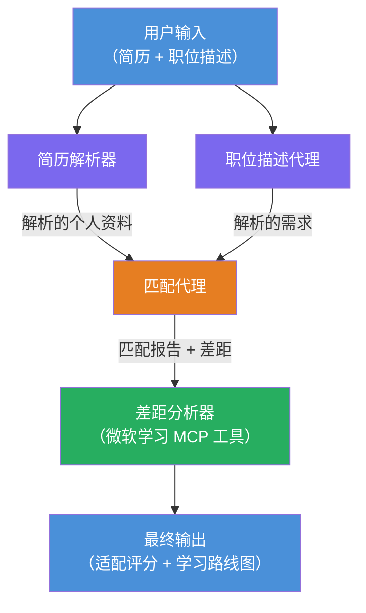

# Lab 02 - 多智能体工作流：简历 → 职位匹配评估器

---

## 你将构建的内容

一个<strong>简历 → 职位匹配评估器</strong>——一个多智能体工作流，四个专门的智能体协同工作，评估候选人的简历与职位描述的匹配度，然后生成个性化的学习路线图以弥补差距。

### 智能体

| 智能体 | 角色 |
|-------|------|
| <strong>简历解析器</strong> | 从简历文本中提取结构化的技能、经验、认证信息 |
| <strong>职位描述智能体</strong> | 从职位描述中提取必需/优选技能、经验、认证信息 |
| <strong>匹配智能体</strong> | 比较个人资料与要求 → 匹配得分（0-100） + 匹配/缺失技能 |
| <strong>差距分析器</strong> | 构建包含资源、时间表和快速成效项目的个性化学习路线图 |

### 演示流程

上传<strong>简历 + 职位描述</strong> → 获取<strong>匹配得分 + 缺失技能</strong> → 接收<strong>个性化学习路线图</strong>。

### 工作流架构

> 紫色 = 并行智能体 | 橙色 = 聚合点 | 绿色 = 具备工具的最终智能体。详见[模块 1 - 理解架构](docs/01-understand-multi-agent.md)和[模块 4 - 编排模式](docs/04-orchestration-patterns.md)的详细图解和数据流。

### 涉及主题

- 使用<strong>WorkflowBuilder</strong>创建多智能体工作流
- 定义智能体角色和编排流程（并行 + 顺序）
- 智能体间通信模式
- 使用智能体检查器进行本地测试
- 部署多智能体工作流至 Foundry Agent Service

---

## 先决条件

请先完成 Lab 01：

- [Lab 01 - 单智能体](../lab01-single-agent/README.md)

---

## 快速开始

查看完整的设置说明、代码讲解和测试命令：

- [实验 2 文档 - 先决条件](docs/00-prerequisites.md)
- [实验 2 文档 - 完整学习路径](docs/README.md)
- [PersonalCareerCopilot 运行指南](PersonalCareerCopilot/README.md)

## 编排模式（智能体替代方案）

实验 2 包含默认的<strong>并行 → 聚合器 → 规划器</strong>流程，文档中还介绍了替代模式以展示更强的智能体行为：

- **扇出/扇入及加权共识**
- **最终路线图前的审查/批评流程**
- <strong>条件路由器</strong>（基于匹配得分和缺失技能选择路径）

详见[docs/04-orchestration-patterns.md](docs/04-orchestration-patterns.md)。

---

**上一篇：** [实验 01 - 单智能体](../lab01-single-agent/README.md) · **返回：** [研讨会主页](../../README.md)

---

<!-- CO-OP TRANSLATOR DISCLAIMER START -->
**免责声明**：  
本文件使用 AI 翻译服务 [Co-op Translator](https://github.com/Azure/co-op-translator) 进行翻译。虽然我们力求准确，但请注意自动翻译可能包含错误或不准确之处。原始母语文件应被视为权威来源。对于重要信息，建议采用专业人工翻译。我们不对因使用此翻译而产生的任何误解或误释承担责任。
<!-- CO-OP TRANSLATOR DISCLAIMER END -->