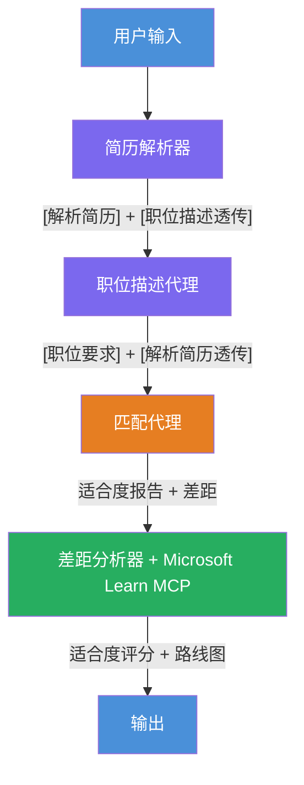

# 实验 02 - 多代理工作流：简历 → 职位匹配评估器

## 概述

在本动手实验中，您将使用 VS Code 中的 Foundry Toolkit 构建一个<strong>以工作流为中心的多代理应用程序</strong>，并将其部署到 Microsoft Foundry Agent Service。

**您将构建的内容：** 一个简历 → 职位匹配评估器，它解析简历和职位描述，评分匹配度，并使用 Microsoft Learn 资源生成个性化学习路线图。

---

## 架构

```mermaid
flowchart TD
    A["用户输入"] --> B["简历解析器"]
    B -->|"[解析简历] + [职位描述透传]"| C["职位描述代理"]
    C -->|"[职位要求] + [解析简历透传]"| D["匹配代理"]
    D -->|适合度报告 + 差距| E["差距分析器 + Microsoft Learn MCP"]
    E -->|适合度评分 + 路线图| F["输出"]

    style A fill:#4A90D9,color:#fff
    style B fill:#7B68EE,color:#fff
    style C fill:#7B68EE,color:#fff
    style D fill:#E67E22,color:#fff
    style E fill:#27AE60,color:#fff
    style F fill:#4A90D9,color:#fff
```

**工作原理：**
1. 用户粘贴简历和职位描述。
2. **ResumeParser** 解析简历，并将职位描述逐字复制到一个 `[职位描述直通]` 部分。
3. **JD Agent** 从直通部分提取结构化需求，然后将 `[解析后的简历]` 继续作为 `[解析后的简历直通]` 转发。
4. **MatchingAgent** 比较 `[解析后的简历直通]` 与 `[职位描述需求]` 并生成匹配评分。
5. **GapAnalyzer** 将差距转化为实用路线图，并通过 MCP 获取真实的 Microsoft Learn 链接。

---

## 先决条件

请先完成实验 01：

- [实验 01 - 单代理](../lab01-single-agent/README.md)

---

## 第 1 部分：按顺序阅读模块

查看完整学习路径：

- [实验 2 文档 - 先决条件](docs/00-prerequisites.md)
- [实验 2 文档 - 完整学习路径](docs/README.md)
- [PersonalCareerCopilot 运行指南](PersonalCareerCopilot/README.md)

---

## 第 2 部分：构建并测试工作流

1. 使用 Foundry Toolkit 向导搭建基于工作流的项目框架。
2. 将 `PersonalCareerCopilot/main.py` 中的提示块和工作流图复制到您的工作区。
3. 使用 Agent Inspector 本地运行并验证所有四个代理及 MCP 工具。
4. 本地测试通过后，将托管代理部署到 Foundry。

---

## 编排模式

实验 02 包含默认的 **扇出 → 扇入 → 顺序** 流程，文档还描述了用于实验的其他编排模式。

- **带加权共识的扇出/扇入**
- **最终路线图前的审核/批评通过**
- <strong>基于匹配评分和缺失技能的条件路由器</strong>

详见 [docs/04-orchestration-patterns.md](docs/04-orchestration-patterns.md)。

---

**上一个：** [实验 01 - 单代理](../lab01-single-agent/README.md) · **返回：** [工作坊首页](../../README.md)

---

<!-- CO-OP TRANSLATOR DISCLAIMER START -->
**免责声明**：
本文件由 AI 翻译服务 [Co-op Translator](https://github.com/Azure/co-op-translator) 翻译完成。尽管我们力求准确，但请注意，自动翻译可能包含错误或不准确之处。原始语言版文件应视为权威来源。对于重要信息，建议使用专业人工翻译。我们对因使用本翻译而产生的任何误解或误释不承担责任。
<!-- CO-OP TRANSLATOR DISCLAIMER END -->