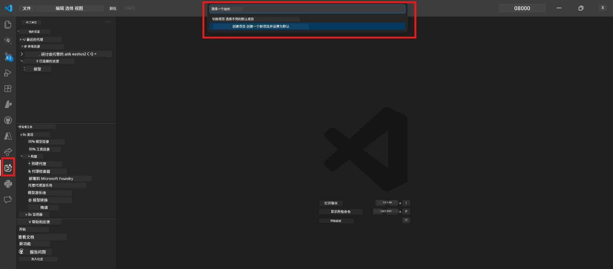

# 模块 0 - 前提条件

在开始实验 02 之前，请确认已完成以下内容。本实验直接建立在实验 01 的基础上，请勿跳过。

---

## 1. 完成实验 01

实验 02 假设你已经：

- [x] 完成了 [实验 01 - 单代理](../../lab01-single-agent/README.md) 的全部 8 个模块
- [x] 成功将单个代理部署到 Foundry Agent Service
- [x] 验证代理在本地 Agent Inspector 和 Foundry Playground 中均可正常工作

如果你还没有完成实验 01，请返回并立即完成：[实验 01 文档](../../lab01-single-agent/docs/00-prerequisites.md)

---

## 2. 验证现有设置

实验 01 中的所有工具仍应已安装且可用。请运行以下快速检查：

### 2.1 Azure CLI

```powershell
az account show --query "{name:name, id:id}" --output table
```

预期结果：显示你的订阅名称和 ID。如果失败，请运行 [`az login`](https://learn.microsoft.com/cli/azure/authenticate-azure-cli-interactively)。

### 2.2 VS Code 扩展

1. 按 `Ctrl+Shift+P` → 输入 **"Microsoft Foundry"** → 确认你能看到命令（例如，`Microsoft Foundry: Create a New Hosted Agent`）。
2. 按 `Ctrl+Shift+P` → 输入 **"Foundry Toolkit"** → 确认你能看到命令（例如，`Foundry Toolkit: Open Agent Inspector`）。

### 2.3 Foundry 项目与模型

1. 点击 VS Code 活动栏中的 **Microsoft Foundry** 图标。
2. 确认你的项目列出（例如，`workshop-agents`）。
3. 展开该项目 → 验证存在已部署模型（例如，`gpt-4.1-mini`），并显示状态为 **Succeeded**。

> **如果你的模型部署已过期：** 某些免费层部署会自动过期。请从 [模型目录](https://learn.microsoft.com/azure/foundry/foundry-models/concepts/models-sold-directly-by-azure) 重新部署（`Ctrl+Shift+P` → **Microsoft Foundry: Open Model Catalog**）。



### 2.4 RBAC 角色

确认你在 Foundry 项目中拥有 **Azure AI User** 角色：

1. 访问 [Azure 门户](https://portal.azure.com) → 你的 Foundry <strong>项目</strong>资源 → **访问控制 (IAM)** → **[角色分配](https://learn.microsoft.com/azure/foundry/concepts/rbac-foundry)** 选项卡。
2. 搜索你的名字 → 确认列出了 **[Azure AI User](https://aka.ms/foundry-ext-project-role)**。

---

## 3. 了解多代理概念（实验 02 新增内容）

实验 02 引入了实验 01 中未涉及的概念。请在继续前阅读：

### 3.1 什么是多代理工作流？

与由一个代理处理所有任务不同，<strong>多代理工作流</strong>将工作分配给多个专业化代理。每个代理拥有：

- 自己的<strong>指令</strong>（系统提示）
- 自己的<strong>角色</strong>（负责的内容）
- 可选的<strong>工具</strong>（它可以调用的函数）

代理之间通过定义数据流的<strong>协调图</strong>进行通信。

### 3.2 WorkflowBuilder

`agent_framework` 中的 [`WorkflowBuilder`](https://learn.microsoft.com/agent-framework/workflows/agents-in-workflows) 类用于将代理连接起来，是 SDK 的组成部分：

```python
from agent_framework import WorkflowBuilder

workflow = (
    WorkflowBuilder(
        name="MyWorkflow",
        start_executor=agent_a,
        output_executors=[agent_d],
    )
    .add_edge(agent_a, agent_b)
    .add_edge(agent_a, agent_c)
    .add_edge(agent_b, agent_d)
    .add_edge(agent_c, agent_d)
    .build()
)
```

- **`start_executor`** - 接受用户输入的第一个代理
- **`output_executors`** - 输出成为最终响应的代理
- **`add_edge(source, target)`** - 定义 `target` 接收 `source` 的输出

### 3.3 MCP（模型上下文协议）工具

实验 02 使用一个 **MCP 工具**，调用 Microsoft Learn API 来获取学习资源。[MCP（模型上下文协议）](https://modelcontextprotocol.io/introduction) 是一种用于将 AI 模型连接到外部数据源和工具的标准化协议。

| 术语 | 定义 |
|------|------|
| **MCP 服务器** | 通过 [MCP 协议](https://learn.microsoft.com/azure/foundry/agents/how-to/tools/model-context-protocol) 暴露工具/资源的服务 |
| **MCP 客户端** | 你的代理代码，连接到 MCP 服务器并调用其工具 |
| **[可流式 HTTP](https://learn.microsoft.com/agent-framework/agents/tools/hosted-mcp-tools)** | 与 MCP 服务器通信所用的传输方式 |

### 3.4 实验 02 与实验 01 的区别

| 方面 | 实验 01（单代理） | 实验 02（多代理） |
|-------|-----------------|------------------|
| 代理数 | 1 | 4（专业角色） |
| 协调方式 | 无 | WorkflowBuilder（并行 + 顺序） |
| 工具 | 可选 `@tool` 函数 | MCP 工具（外部 API 调用） |
| 复杂度 | 简单提示 → 响应 | 简历 + JD → 匹配分数 → 路线图 |
| 上下文流 | 直接 | 代理之间交接 |

---

## 4. 实验 02 的工作坊仓库结构

确保你知道实验 02 文件所在位置：

```
workshop/
└── lab02-multi-agent/
    ├── README.md                       ← Lab overview
    ├── docs/                           ← You are here
    │   ├── README.md                   ← Learning path index
    │   ├── 00-prerequisites.md         ← This file
    │   ├── 01-understand-multi-agent.md
    │   ├── ...
    │   └── 08-troubleshooting.md
    └── PersonalCareerCopilot/          ← The agent project
        ├── agent.yaml                  ← Agent definition
        ├── main.py                     ← 4-agent workflow code
        ├── Dockerfile                  ← Container configuration
        └── requirements.txt            ← Python dependencies
```

---

### 检查点

- [ ] 完成实验 01（全部 8 个模块，代理已部署和验证）
- [ ] `az account show` 正确返回你的订阅
- [ ] 安装并可响应 Microsoft Foundry 和 Foundry Toolkit 扩展
- [ ] Foundry 项目已有部署的模型（例如，`gpt-4.1-mini`）
- [ ] 你在项目中拥有 **Azure AI User** 角色
- [ ] 阅读并理解以上多代理概念，包括 WorkflowBuilder、MCP 与代理协调

---

**下一步：** [01 - 了解多代理架构 →](01-understand-multi-agent.md)

---

<!-- CO-OP TRANSLATOR DISCLAIMER START -->
**免责声明**：  
本文档是使用 AI 翻译服务 [Co-op Translator](https://github.com/Azure/co-op-translator) 进行翻译的。虽然我们努力确保准确性，但请注意自动翻译可能包含错误或不准确之处。应以原文档的原始语言版本作为权威来源。对于关键信息，建议使用专业人工翻译。我们不对因使用本翻译而产生的任何误解或误释承担责任。
<!-- CO-OP TRANSLATOR DISCLAIMER END -->