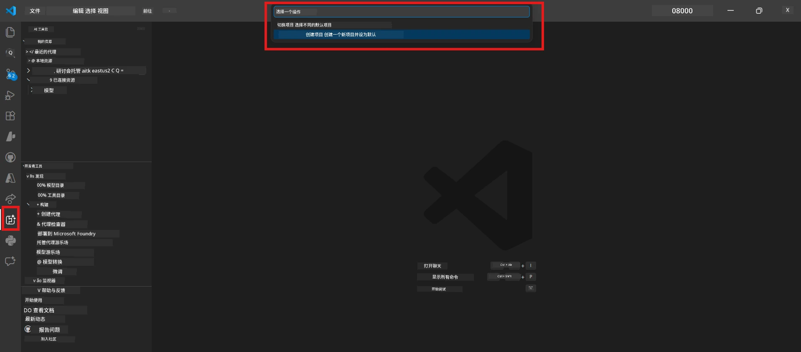

# 模块 0 - 介绍

⏱️ 大约 10 分钟

> [!WARNING]
> **预览与限制：**[托管代理](https://learn.microsoft.com/azure/foundry/agents/concepts/hosted-agents) 当前处于<strong>公开预览</strong>阶段 - 不建议用于生产工作负载。本研讨会展示的部分功能可能会随着服务走向正式发布而发生变化。

## 你将构建的内容

在本实验中，你将扩展实验01中的单代理技能，构建一个<strong>多代理工作流</strong>——简历 → 职位匹配评估器。

你将粘贴一份<strong>简历</strong>和一份<strong>职位描述</strong>。四个专门的代理将依次处理输入，然后返回：
- 一个匹配分数（0–100，并附评分细目）
- 技能和认证差距列表
- 针对每个差距提供真实微软学习链接的个性化学习路线图

**该工作流使用了：**
- **Microsoft Agent Framework** - 用于顺序管道编排的`WorkflowBuilder`
- **Foundry Toolkit for VS Code** - 脚手架、本地测试、部署
- **一个 AI 模型**（例如，`gpt-4.1-mini`）- 被四个代理共用
- **Microsoft Learn MCP 服务器** - 为每个技能差距提供真实学习资源链接

---

## 选择你的路径

> ⚠️ **请继续使用实验01中相同的路径。**

<details open>
<summary><strong>🅰️ 路径 A - Azure 云（需要 Azure 订阅）</strong></summary>

| | 详情 |
|---|---|
| <strong>适合对象</strong> | 你已使用 Azure 订阅完成实验01 |
| <strong>模型</strong> | 通过 Foundry 使用 Azure OpenAI（例如，`gpt-4.1-mini`） |
| <strong>涵盖模块</strong> | 所有模块（00–09） |
| **是否云端部署？** | ✅ 是 - 完整端到端部署 |

</details>

<details open>
<summary><strong>🅱️ 路径 B - Foundry Local（不需要 Azure 订阅）</strong></summary>

| | 详情 |
|---|---|
| <strong>适合对象</strong> | 你已使用 Foundry Local 完成实验01 |
| <strong>模型</strong> | Foundry Local（免费，运行于你的机器上） |
| <strong>涵盖模块</strong> | 模块 00–05（跳过 06–07 - 部署与云端验证） |
| **是否云端部署？** | ❌ 否 - 仅通过 Agent Inspector 进行本地测试 |

</details>

---

## 实验01 检查

实验02 是直接基于实验01构建的。请先完成实验01再开始此实验。

还没做实验01？从这里开始：[实验 01 - 介绍](../../lab01-single-agent/docs/00-prerequisites.md)

<details open>
<summary><strong>🅰️ 路径 A - Azure 云</strong></summary>

```powershell
az account show --query "{name:name, id:id}" --output table
```

如果失败，请运行 `az login`。然后在 VS Code 中验证：

1. `Ctrl+Shift+P` → 输入 **Foundry Toolkit** → 确认命令出现。
2. 点击 **Foundry Toolkit** 图标 → 你的项目和已部署模型显示 <strong>成功</strong>。



> **RBAC:** 你在实验01中分配了<strong>Foundry 用户</strong>。如果需要重新分配，请参见[实验01，模块1](../../lab01-single-agent/docs/01-setup.md#deploy-a-model--assign-rbac)。该角色之前名为<strong>Azure AI 用户</strong> - 权限相同。

</details>

<details open>
<summary><strong>🅱️ 路径 B - Foundry Local</strong></summary>

```powershell
Invoke-WebRequest -Uri "http://localhost:5273/v1/health" -UseBasicParsing | Select-Object StatusCode
```

预期：`StatusCode: 200`。如果不是，请从 Foundry Toolkit 侧边栏重启 Foundry Local。

> 所有推理在你的机器上运行。唯一的出站调用是 MCP 工具访问 `https://learn.microsoft.com/api/mcp`。

</details>

---

## 实验02 新增内容

| | 实验01 | 实验02 |
|--|--------|--------|
| 代理数 | 1 | 4（通过 WorkflowBuilder 链接） |
| 脚手架模板 | 基础 - Agent Framework | 工作流 - Agent Framework |
| 新包 | - | `mcp` |
| 编排方式 | 单个对话代理 | 顺序管道（WorkflowBuilder） |
| 新工具 | - | `search_microsoft_learn_for_plan`（MCP） |

---

**下一步：** [01 - 了解架构 →](01-understand-multi-agent.md)

---

<!-- CO-OP TRANSLATOR DISCLAIMER START -->
**免责声明**：
本文件由 AI 翻译服务 [Co-op Translator](https://github.com/Azure/co-op-translator) 翻译完成。尽管我们力求准确，但请注意，自动翻译可能包含错误或不准确之处。原始语言版文件应视为权威来源。对于重要信息，建议使用专业人工翻译。我们对因使用本翻译而产生的任何误解或误释不承担责任。
<!-- CO-OP TRANSLATOR DISCLAIMER END -->