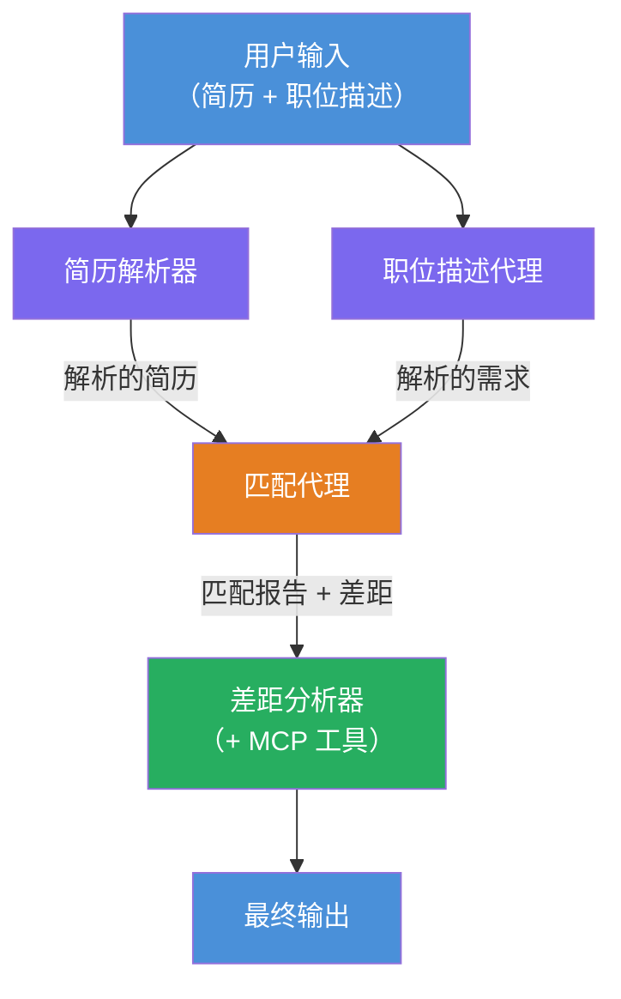
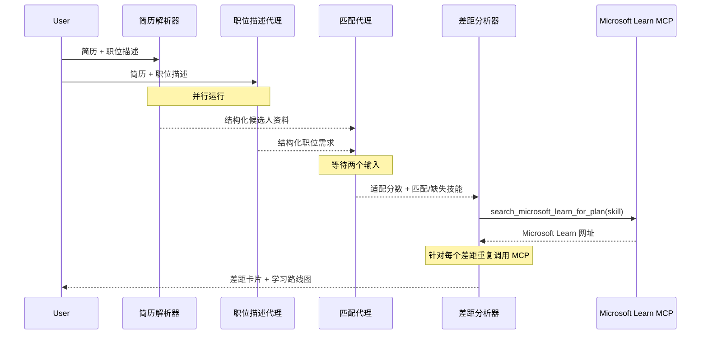
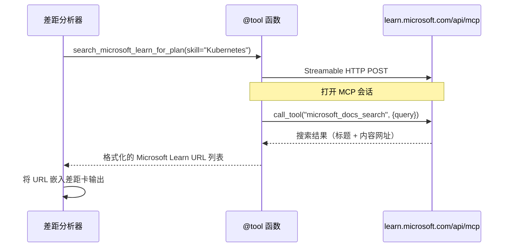

# Module 1 - 了解多代理架构

在本模块中，您将在编写任何代码之前了解简历 → 职位匹配评估器的架构。理解编排图、代理角色和数据流对于调试和扩展[多代理工作流](https://learn.microsoft.com/azure/architecture/ai-ml/idea/multiple-agent-workflow-automation)至关重要。

---

## 解决的问题

将简历与职位描述匹配涉及多个不同的技能：

1. <strong>解析</strong> - 从非结构化文本（简历）提取结构化数据
2. <strong>分析</strong> - 从职位描述中提取要求
3. <strong>比较</strong> - 评分匹配度
4. <strong>规划</strong> - 制定弥补差距的学习路线图

单一代理在一个提示中完成所有四项任务通常会产生：
- 提取不完整（它急于解析以得出评分）
- 评分浅显（没有基于证据的细分）
- 通用路线图（没有针对具体差距量身定制）

通过拆分成<strong>四个专业代理</strong>，每个代理专注于自己的任务，使用专门的指令，在每个阶段生成更高质量的输出。

---

## 四个代理

每个代理都是通过`AzureAIAgentClient.as_agent()`创建的完整[Microsoft Foundry](https://learn.microsoft.com/azure/foundry/agents/concepts/hosted-agents)代理。它们共享同一模型部署，但具有不同的指令和（可选）不同的工具。

| # | 代理名称 | 角色 | 输入 | 输出 |
|---|-----------|------|-------|--------|
| 1 | **ResumeParser** | 从简历文本中提取结构化个人资料 | 用户提供的原始简历文本 | 候选人档案、技术技能、软技能、证书、领域经验、成就 |
| 2 | **JobDescriptionAgent** | 从职位描述中提取结构化需求 | 用户提供的原始职位描述文本（通过ResumeParser转发） | 角色概述、必需技能、优先技能、经验、证书、教育、职责 |
| 3 | **MatchingAgent** | 计算基于证据的匹配评分 | ResumeParser和JobDescriptionAgent的输出 | 匹配评分（0-100及细分）、匹配技能、缺失技能、差距 |
| 4 | **GapAnalyzer** | 构建个性化学习路线图 | MatchingAgent的输出 | 各技能差距卡、学习顺序、时间表、Microsoft Learn资源 |

---

## 编排图

工作流使用<strong>并行扇出</strong>随后是<strong>顺序聚合</strong>：


> **图例：** 紫色 = 并行代理，橙色 = 聚合点，绿色 = 带工具的最终代理

### 数据流动方式


1. <strong>用户发送</strong>包含简历和职位描述的消息。
2. <strong>ResumeParser</strong>接收完整用户输入并提取结构化候选人档案。
3. <strong>JobDescriptionAgent</strong>并行接收用户输入并提取结构化需求。
4. <strong>MatchingAgent</strong>接收来自<strong>ResumeParser和JobDescriptionAgent</strong>的输出（框架等待两者完成后再运行MatchingAgent）。
5. <strong>GapAnalyzer</strong>接收MatchingAgent的输出并调用<strong>Microsoft Learn MCP工具</strong>获取每个差距的真实学习资源。
6. <strong>最终输出</strong>为GapAnalyzer的响应，包含匹配评分、差距卡和完整学习路线图。

### 为什么并行扇出很重要

ResumeParser和JobDescriptionAgent<strong>并行运行</strong>，因为两者互不依赖。这：
- 减少总延迟（两者同时运行而非顺序执行）
- 是一种自然拆分（解析简历与解析职位职责是独立任务）
- 展示了常见的多代理模式：**扇出→聚合→执行**

---

## 代码中的 WorkflowBuilder

以下是上述图如何映射到`main.py`中的[`WorkflowBuilder`](https://learn.microsoft.com/agent-framework/workflows/agents-in-workflows) API调用：

```python
from agent_framework import WorkflowBuilder

workflow = (
    WorkflowBuilder(
        name="ResumeJobFitEvaluator",
        start_executor=resume_parser,       # 第一个接收用户输入的代理
        output_executors=[gap_analyzer],     # 输出最终返回的代理
    )
    .add_edge(resume_parser, jd_agent)      # 简历解析器 → 职位描述代理
    .add_edge(resume_parser, matching_agent) # 简历解析器 → 匹配代理
    .add_edge(jd_agent, matching_agent)      # 职位描述代理 → 匹配代理
    .add_edge(matching_agent, gap_analyzer)  # 匹配代理 → 缺口分析器
    .build()
)
```

**理解边缘：**

| 边缘 | 含义 |
|------|--------------|
| `resume_parser → jd_agent` | JD代理接收ResumeParser的输出 |
| `resume_parser → matching_agent` | MatchingAgent接收ResumeParser的输出 |
| `jd_agent → matching_agent` | MatchingAgent还接收JD代理的输出（等待两个都完成） |
| `matching_agent → gap_analyzer` | GapAnalyzer接收MatchingAgent的输出 |

因为`matching_agent`有<strong>两个输入边缘</strong>（`resume_parser`和`jd_agent`），框架会自动等待两者完成后再运行MatchingAgent。

---

## MCP工具

GapAnalyzer代理有一个工具：`search_microsoft_learn_for_plan`。这是一个<strong>[MCP工具](https://learn.microsoft.com/agent-framework/agents/tools/hosted-mcp-tools)</strong>，调用Microsoft Learn API获取精选学习资源。

### 工作原理

```python
@tool
async def search_microsoft_learn_for_plan(
    skill: str, role: str = "", max_results: int = 5
) -> str:
    """Search Microsoft Learn MCP and return curated official links."""
    # 通过可流式HTTP连接到 https://learn.microsoft.com/api/mcp
    # 在MCP服务器上调用 'microsoft_docs_search' 工具
    # 返回格式化的 Microsoft Learn URL 列表
```

### MCP调用流程


1. GapAnalyzer决定需要某项技能的学习资源（例如“Kubernetes”）
2. 框架调用`search_microsoft_learn_for_plan(skill="Kubernetes")`
3. 该函数打开一个[可流式HTTP](https://learn.microsoft.com/agent-framework/agents/tools/hosted-mcp-tools)连接至`https://learn.microsoft.com/api/mcp`
4. 它在[MCP服务器](https://learn.microsoft.com/azure/foundry/agents/how-to/tools/model-context-protocol)上调用`microsoft_docs_search`工具
5. MCP服务器返回搜索结果（标题 + URL）
6. 函数格式化结果并以字符串形式返回
7. GapAnalyzer在差距卡中使用返回的URL

### 预期的MCP日志

工具运行时，您会看到如下日志条目：

```
GET https://learn.microsoft.com/api/mcp → 405 (Method Not Allowed)
POST https://learn.microsoft.com/api/mcp → 200
DELETE https://learn.microsoft.com/api/mcp → 405 (Method Not Allowed)
```

**这些是正常现象。** MCP客户端初始化时会用GET和DELETE测试连接，收到405响应是预期行为。实际调用工具时使用POST且返回200。只有POST调用失败时才需担心。

---

## 代理创建模式

每个代理都是通过**[`AzureAIAgentClient.as_agent()`](https://learn.microsoft.com/python/api/overview/azure/ai-agents-readme)异步上下文管理器**创建的。这是Foundry SDK创建自动清理代理的模式：

```python
async with (
    get_credential() as credential,
    AzureAIAgentClient(
        project_endpoint=PROJECT_ENDPOINT,
        model_deployment_name=MODEL_DEPLOYMENT_NAME,
        credential=credential,
    ).as_agent(
        name="ResumeParser",
        instructions=RESUME_PARSER_INSTRUCTIONS,
    ) as resume_parser,
    # ... 对每个代理重复 ...
):
    # 这里存在所有4个代理
    workflow = create_workflow(resume_parser, jd_agent, matching_agent, gap_analyzer)
```

**关键要点：**
- 每个代理获得自己独立的`AzureAIAgentClient`实例（SDK要求代理名称限定于客户端作用域）
- 所有代理共享相同的`credential`、`PROJECT_ENDPOINT`和`MODEL_DEPLOYMENT_NAME`
- `async with`块确保服务器关闭时自动清理所有代理
- GapAnalyzer另外接收`tools=[search_microsoft_learn_for_plan]`

---

## 服务器启动

创建代理并构建工作流后，服务器启动：

```python
from azure.ai.agentserver.agentframework import from_agent_framework

agent = create_workflow(resume_parser, jd_agent, matching_agent, gap_analyzer)
await from_agent_framework(agent).run_async()
```

`from_agent_framework()`将工作流封装为HTTP服务器，开放端口8088的`/responses`端点。这与实验01的模式相同，只不过“代理”现在是整个[工作流图](https://learn.microsoft.com/agent-framework/workflows/as-agents)。

---

### 检查点

- [ ] 您理解4代理架构及每个代理的角色
- [ ] 您能追踪数据流：用户 → ResumeParser → （并行）JD代理 + MatchingAgent → GapAnalyzer → 输出
- [ ] 您理解为什么MatchingAgent等待ResumeParser和JD代理（两个输入边缘）
- [ ] 您理解MCP工具：它的功能、调用方式以及GET 405日志的正常性
- [ ] 您理解`AzureAIAgentClient.as_agent()`模式及为何每个代理有自己的客户端实例
- [ ] 您能阅读`WorkflowBuilder`代码并映射到视觉图

---

**上一步：** [00 - 前置条件](00-prerequisites.md) · **下一步：** [02 - 构建多代理项目 →](02-scaffold-multi-agent.md)

---

<!-- CO-OP TRANSLATOR DISCLAIMER START -->
**免责声明**：  
本文档使用 AI 翻译服务 [Co-op Translator](https://github.com/Azure/co-op-translator) 进行了翻译。尽管我们力求准确，但请注意，自动翻译可能包含错误或不准确之处。原始文档的母语版本应视为权威来源。对于重要信息，建议采用专业人工翻译。我们不对因使用本翻译而产生的任何误解或误释承担责任。
<!-- CO-OP TRANSLATOR DISCLAIMER END -->