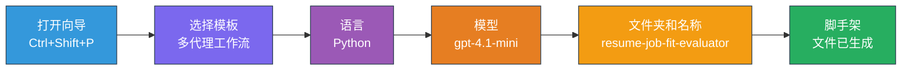
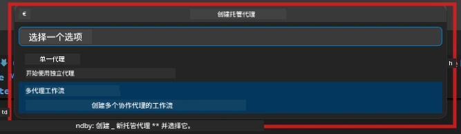

# Module 2 - 搭建多代理项目骨架

在本模块中，您将使用 [Microsoft Foundry 扩展](https://marketplace.visualstudio.com/items?itemName=TeamsDevApp.vscode-ai-foundry)来<strong>搭建一个多代理工作流项目骨架</strong>。该扩展会生成完整的项目结构——`agent.yaml`、`main.py`、`Dockerfile`、`requirements.txt`、`.env` 和调试配置。您将在第 3 和第 4 模块中自定义这些文件。

> **注意：** 本实验中的 `PersonalCareerCopilot/` 文件夹是一个完整且可运行的自定义多代理项目示例。您可以选择搭建一个新的项目（推荐用于学习），也可以直接研究现有代码。

---

## 第 1 步：打开创建托管代理向导


1. 按 `Ctrl+Shift+P` 打开<strong>命令面板</strong>。
2. 输入：“**Microsoft Foundry: Create a New Hosted Agent**”，然后选择它。
3. 托管代理创建向导将打开。

> **替代方式：** 点击活动栏中的<strong>Microsoft Foundry</strong>图标 → 点击<strong>代理</strong>旁的<strong>+</strong>图标 → 点击<strong>创建新托管代理</strong>。

---

## 第 2 步：选择多代理工作流模板

向导要求您选择一个模板：

| 模板 | 描述 | 适用场景 |
|----------|-------------|-------------|
| 单代理 | 一个代理，包含指令和可选工具 | 实验 01 |
| <strong>多代理工作流</strong> | 多个代理通过 WorkflowBuilder 协作 | **本实验（实验 02）** |

1. 选择<strong>多代理工作流</strong>。
2. 点击<strong>下一步</strong>。



---

## 第 3 步：选择编程语言

1. 选择<strong>Python</strong>。
2. 点击<strong>下一步</strong>。

---

## 第 4 步：选择模型

1. 向导会显示您在 Foundry 项目中部署的模型。
2. 选择您在实验 01 中使用的相同模型（例如，**gpt-4.1-mini**）。
3. 点击<strong>下一步</strong>。

> **提示：** [`gpt-4.1-mini`](https://learn.microsoft.com/azure/foundry/foundry-models/concepts/models-sold-directly-by-azure#gpt-41-series) 推荐用于开发——速度快、成本低，且适合多代理工作流。如果需要更高质量的输出，最终生产部署时可切换到 `gpt-4.1`。

---

## 第 5 步：选择文件夹位置和代理名称

1. 打开文件对话框，选择目标文件夹：
   - 如果跟随工作坊仓库操作：导航到 `workshop/lab02-multi-agent/` 并创建一个新子文件夹
   - 如果全新开始：选择任意文件夹
2. 输入托管代理名称（例如，`resume-job-fit-evaluator`）。
3. 点击<strong>创建</strong>。

---

## 第 6 步：等待搭建完成

1. VS Code 会打开一个新窗口（或者当前窗口会更新）以显示搭建好的项目。
2. 您应该能看到如下文件结构：

```
resume-job-fit-evaluator/
├── .env                ← Environment variables (placeholders)
├── .vscode/
│   └── launch.json     ← Debug configuration
├── agent.yaml          ← Agent definition (kind: hosted)
├── Dockerfile          ← Container configuration
├── main.py             ← Multi-agent workflow code (scaffold)
└── requirements.txt    ← Python dependencies
```

> **工作坊说明：** 在工作坊仓库中，`.vscode/` 文件夹位于<strong>工作区根目录</strong>，包含共享的 `launch.json` 和 `tasks.json`。实验 01 和实验 02 的调试配置都包含在内。按 F5 时，从下拉菜单中选择<strong>“Lab02 - Multi-Agent”</strong>。

---

## 第 7 步：了解搭建的文件（多代理特有部分）

多代理搭建与单代理搭建在几个关键方面有所不同：

### 7.1 `agent.yaml` - 代理定义

```yaml
kind: hosted
name: resume-job-fit-evaluator
description: >
  A multi-agent workflow that evaluates resume-to-job fit.
metadata:
  authors:
    - Microsoft
  tags:
    - Multi-Agent Workflow
    - Resume Evaluator
protocols:
  - protocol: responses
    version: v1
environment_variables:
  - name: PROJECT_ENDPOINT
    value: ${PROJECT_ENDPOINT}
  - name: MODEL_DEPLOYMENT_NAME
    value: ${MODEL_DEPLOYMENT_NAME}
```

**与实验 01 的主要区别：** `environment_variables` 部分可能包括 MCP 端点或其他工具配置的额外变量。`name` 和 `description` 反映了多代理场景。

### 7.2 `main.py` - 多代理工作流代码

骨架包括：
- <strong>多个代理指令字符串</strong>（每个代理一个常量）
- **多个 [`AzureAIAgentClient.as_agent()`](https://learn.microsoft.com/python/api/overview/azure/ai-agents-readme) 上下文管理器**（每个代理一个）
- **[`WorkflowBuilder`](https://learn.microsoft.com/agent-framework/workflows/agents-in-workflows)** 用来连接代理
- **`from_agent_framework()`** 用于将工作流作为 HTTP 端点提供

```python
from agent_framework import WorkflowBuilder, tool
from agent_framework.azure import AzureAIAgentClient
from azure.ai.agentserver.agentframework import from_agent_framework
```

相比实验 01，多了额外引入的 [`WorkflowBuilder`](https://learn.microsoft.com/agent-framework/workflows/agents-in-workflows)。

### 7.3 `requirements.txt` - 额外依赖

多代理项目使用与实验 01 相同的基础包，外加任何 MCP 相关的包：

```
agent-framework-azure-ai==1.0.0rc3
agent-framework-core==1.0.0rc3
azure-ai-agentserver-agentframework==1.0.0b16
azure-ai-agentserver-core==1.0.0b16
debugpy
agent-dev-cli --pre
```

> **重要版本说明：** `agent-dev-cli` 包在 `requirements.txt` 中需要带 `--pre` 标记以安装最新预览版本。此项对兼容 `agent-framework-core==1.0.0rc3` 的 Agent Inspector 是必须的。版本详细信息见[第 8 模块 - 故障排除](08-troubleshooting.md)。

| 包 | 版本 | 作用 |
|---------|---------|---------|
| [`agent-framework-azure-ai`](https://learn.microsoft.com/agent-framework/overview/) | `1.0.0rc3` | 用于 [Microsoft Agent Framework](https://github.com/microsoft/agent-framework) 的 Azure AI 集成 |
| [`agent-framework-core`](https://learn.microsoft.com/agent-framework/overview/) | `1.0.0rc3` | 核心运行时（包含 WorkflowBuilder） |
| `azure-ai-agentserver-agentframework` | `1.0.0b16` | 托管代理服务器运行时 |
| `azure-ai-agentserver-core` | `1.0.0b16` | 核心代理服务器抽象 |
| `debugpy` | 最新 | Python 调试（VS Code 中按 F5） |
| `agent-dev-cli` | `--pre` | 本地开发 CLI + Agent Inspector 后端 |

### 7.4 `Dockerfile` - 与实验 01 相同

Dockerfile 与实验 01 完全相同——复制文件、安装 `requirements.txt` 中的依赖、开放 8088 端口并运行 `python main.py`。

```dockerfile
FROM python:3.14-slim
WORKDIR /app
COPY ./ .
RUN pip install --upgrade pip && \
    if [ -f requirements.txt ]; then \
        pip install -r requirements.txt; \
    else \
      echo "No requirements.txt found" >&2; exit 1; \
    fi
EXPOSE 8088
CMD ["python", "main.py"]
```

---

### 检查点

- [ ] 搭建向导已完成 → 新项目结构可见
- [ ] 能看到所有文件：`agent.yaml`、`main.py`、`Dockerfile`、`requirements.txt`、`.env`
- [ ] `main.py` 中包含 `WorkflowBuilder` 导入（确认选择了多代理模板）
- [ ] `requirements.txt` 包含 `agent-framework-core` 和 `agent-framework-azure-ai`
- [ ] 理解多代理骨架与单代理骨架的区别（多代理、WorkflowBuilder、MCP 工具）

---

**上一步：** [01 - 理解多代理架构](01-understand-multi-agent.md) · **下一步：** [03 - 配置代理及环境 →](03-configure-agents.md)

---

<!-- CO-OP TRANSLATOR DISCLAIMER START -->
**免责声明**：  
本文件采用 AI 翻译服务 [Co-op Translator](https://github.com/Azure/co-op-translator) 进行翻译。虽然我们力求准确，但请注意自动翻译可能包含错误或不准确之处。原始文件的母语版本应被视为权威来源。对于重要信息，建议使用专业人工翻译。我们不对因使用此翻译而产生的任何误解或误释承担责任。
<!-- CO-OP TRANSLATOR DISCLAIMER END -->