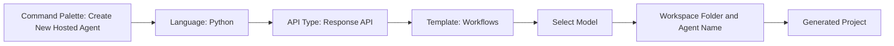

# 模块 2 - 搭建多智能体项目骨架

⏱️ 约5分钟

在本模块中，您将使用 [Foundry Toolkit for VS Code](https://aka.ms/foundrytk) 来 <strong>生成多智能体项目骨架</strong>。向导会生成 `agent.yaml`、`main.py`、`Dockerfile`、`requirements.txt`、`.env` 和 VS Code 调试配置 —— 这样您就可以在模块 3 中专注于连接 4 个智能体的工作流。

> **关键概念：** 该骨架是一个包含一个智能体的可运行存根。您将在模块 3 中用 `WorkflowBuilder` 图替换占位逻辑。您不需要从头编写样板代码。

> **参考实现：** [`PersonalCareerCopilot/`](../../../../../workshop/lab02-multi-agent/PersonalCareerCopilot) 是完整的可运行示例。可在实现过程中用它来对照检查。

### 骨架向导流程


```mermaid
flowchart LR
    A[Command Palette: Create New Hosted Agent] --> B[Language: Python]
    B --> C[API Type: Response API]
    C --> D[Template: Workflows]
    D --> E[Select Model]
    E --> F[Workspace Folder and Agent Name]
    F --> G[Generated Project]
```

---

## 第 1 步：打开“创建托管智能体”向导

1. 按下 `Ctrl+Shift+P` 打开 <strong>命令面板</strong>。
2. 输入：**Foundry Toolkit: Create a New Hosted Agent** 并选择它。
3. 向导将打开 <strong>智能体详细信息</strong> 选项卡。

> **替代方法：** 单击活动栏中的 **Foundry Toolkit** 图标 → 单击 **+** 图标（位于 **Hosted Agents** 旁）→ 选择 **Create New Hosted Agent**。

---

## 第 2 步：选择设置


1. 在左侧导航/选项部分选择以下内容：

| 菜单 | 选择 | 说明 |
|--------|-----------|-------|
| <strong>语言</strong> | Python | 也支持 C# (.NET) |
| <strong>框架</strong> | Agent Framework | 提供 `Agent`、`AgentExecutor`、`WorkflowBuilder` |
| **API 类型** | Response API | `POST /responses` - 平台托管的历史记录，支持流式传输 |
| <strong>模板</strong> | **Workflows** | 将请求按顺序通过多个智能体处理 |

2. 选择完成后，点击 **Next**


3. 在下一个窗口中，选择以下内容：

| 菜单 | 选择 | 说明 |
|--------|-----------|-------|
| <strong>工作区文件夹</strong> | 浏览到目标文件夹 | 例如，本仓库中的 `workshop/lab02-multi-agent/` |
| <strong>智能体名称</strong> | `PersonalCareerCopilot` | 这将成为项目目录名 |
| <strong>模型部署</strong> | 选择您已部署的模型 | 例如，来自实验 01 的 `gpt-4.1-mini` |

4. 点击 **Create** 来生成项目骨架。VS Code 会生成文件并打开文件夹。

> **提示：** [`gpt-4.1-mini`](https://learn.microsoft.com/azure/foundry/foundry-models/concepts/models-sold-directly-by-azure#gpt-41-series) 在多智能体开发中在速度与质量之间取得良好平衡。

---

## 第 3 步：检查生成的项目

生成完成后，在资源管理器中确认您可以看到这些文件 (`Ctrl+Shift+E`)：

```
📂 <your-agent-name>/
├── .azdignore          ← Files excluded from Azure Developer CLI deployments
├── .dockerignore       ← Files excluded from Docker builds
├── .env                ← Environment variables (placeholders - fill in Module 3)
├── .vscode/
│   ├── launch.json     ← Debug config (F5 → run + Agent Inspector)
│   └── tasks.json      ← VS Code task definitions
├── agent.yaml          ← Agent definition (kind: hosted, protocol: responses)
├── Dockerfile          ← Container config for deployment
├── main.py             ← Stub agent entry point (replace with WorkflowBuilder in Module 3)
└── requirements.txt    ← Python dependencies
```

> **重要：** 直接在 VS Code 中打开此已生成的文件夹，以便 `.vscode/launch.json` 和 `tasks.json` 对 F5 调试正确生效。

### 关键文件说明

| 文件 | 用途 |
|------|---------|
| `agent.yaml` | 声明 `kind: hosted`、映射环境变量、定义 `/responses` 协议 |
| `main.py` | 存根：一个 `FoundryChatClient` → `Agent` → `ResponsesHostServer`。您将在模块 3 中用 4 个智能体 + `WorkflowBuilder` 来替换它 |
| `Dockerfile` | `python:3.12-slim`，安装 `requirements.txt`，暴露端口 8088，运行 `python main.py` |
| `requirements.txt` | `agent-framework-foundry`、`agent-framework-foundry-hosting`、`mcp<2,>=1.24.0`、`debugpy` |

> **参考：** 有关完整生成内容，请参见 [`PersonalCareerCopilot/agent.yaml`](../../../../../workshop/lab02-multi-agent/PersonalCareerCopilot/agent.yaml) 和 [`PersonalCareerCopilot/requirements.txt`](../../../../../workshop/lab02-multi-agent/PersonalCareerCopilot/requirements.txt)。

---

### ✅ 检查点

- [ ] 已完成骨架向导 - 新项目文件夹在资源管理器中可见
- [ ] 所有预期文件均存在：`agent.yaml`, `main.py`, `Dockerfile`, `requirements.txt`, `.env`
- [ ] `agent.yaml` 显示 `kind: hosted` 和 `protocol: responses`
- [ ] `main.py` 导入 `Agent`、`FoundryChatClient`、`ResponsesHostServer`
- [ ] 已将生成的文件夹作为 VS Code 工作区根打开
- [ ] 您已理解 `main.py` 是一个存根 - `WorkflowBuilder` 将在模块 3 中添加

---

**上一步：** [01 - 了解多智能体架构](01-understand-multi-agent.md) · **下一步：** [03 - 配置智能体与环境 →](03-configure-agents.md)

---

<!-- CO-OP TRANSLATOR DISCLAIMER START -->
**免责声明**：
本文件由 AI 翻译服务 [Co-op Translator](https://github.com/Azure/co-op-translator) 翻译完成。尽管我们力求准确，但请注意，自动翻译可能包含错误或不准确之处。原始语言版文件应视为权威来源。对于重要信息，建议使用专业人工翻译。我们对因使用本翻译而产生的任何误解或误释不承担责任。
<!-- CO-OP TRANSLATOR DISCLAIMER END -->