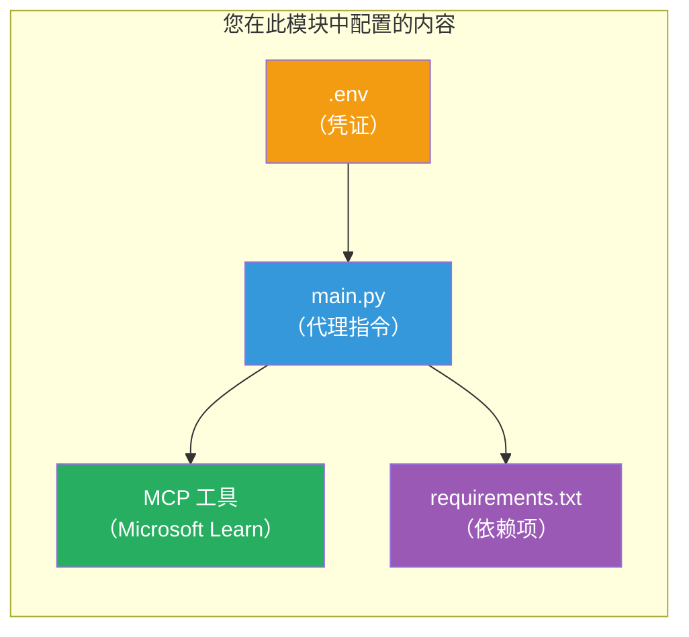

# 模块 3 - 配置代理、MCP 工具和环境

在本模块中，您将自定义脚手架的多代理项目。您将为所有四个代理编写指令，设置 Microsoft Learn 的 MCP 工具，配置环境变量，并安装依赖项。


> **参考：** 完整的工作代码在 [`PersonalCareerCopilot/main.py`](../../../../../workshop/lab02-multi-agent/PersonalCareerCopilot/main.py)。在构建自己的代码时，可以将其作为参考。

---

## 第 1 步：配置环境变量

1. 打开项目根目录下的 **`.env`** 文件。
2. 填写您的 Foundry 项目信息：

   ```env
   PROJECT_ENDPOINT=https://<your-account>.services.ai.azure.com/api/projects/<your-project>
   MODEL_DEPLOYMENT_NAME=gpt-4.1-mini
   ```

3. 保存文件。

### 这些值在哪里找到

| 值 | 如何找到 |
|-------|---------------|
| <strong>项目端点</strong> | Microsoft Foundry 侧边栏 → 点击您的项目 → 详情视图中的端点 URL |
| <strong>模型部署名称</strong> | Foundry 侧边栏 → 展开项目 → **Models + endpoints** → 已部署模型旁的名称 |

> **安全提示：** 切勿将 `.env` 提交到版本控制。如果还没加入，请添加到 `.gitignore`。

### 环境变量映射

多代理的 `main.py` 同时读取标准和工作坊特定的环境变量名称：

```python
PROJECT_ENDPOINT = os.getenv("AZURE_AI_PROJECT_ENDPOINT") or os.getenv("PROJECT_ENDPOINT")
MODEL_DEPLOYMENT_NAME = os.getenv(
    "AZURE_AI_MODEL_DEPLOYMENT_NAME",
    os.getenv("MODEL_DEPLOYMENT_NAME", "gpt-4.1-mini"),
)
MICROSOFT_LEARN_MCP_ENDPOINT = os.getenv(
    "MICROSOFT_LEARN_MCP_ENDPOINT", "https://learn.microsoft.com/api/mcp"
)
```

MCP 端点有合理的默认值 —— 除非想要覆盖，否则不需要在 `.env` 中设置。

---

## 第 2 步：编写代理指令

这是最关键的一步。每个代理都需要精心设计的指令，定义其角色、输出格式和规则。打开 `main.py`，创建（或修改）指令常量。

### 2.1 简历解析代理

```python
RESUME_PARSER_INSTRUCTIONS = """\
You are the Resume Parser.
Extract resume text into a compact, structured profile for downstream matching.

Output exactly these sections:
1) Candidate Profile
2) Technical Skills (grouped categories)
3) Soft Skills
4) Certifications & Awards
5) Domain Experience
6) Notable Achievements

Rules:
- Use only explicit or strongly implied evidence.
- Do not invent skills, titles, or experience.
- Keep concise bullets; no long paragraphs.
- If input is not a resume, return a short warning and request resume text.
"""
```

**为什么要这些部分？** MatchingAgent 需要结构化数据来进行评分。统一的部分使跨代理交接更可靠。

### 2.2 职位描述代理

```python
JOB_DESCRIPTION_INSTRUCTIONS = """\
You are the Job Description Analyst.
Extract a structured requirement profile from a JD.

Output exactly these sections:
1) Role Overview
2) Required Skills
3) Preferred Skills
4) Experience Required
5) Certifications Required
6) Education
7) Domain / Industry
8) Key Responsibilities

Rules:
- Keep required vs preferred clearly separated.
- Only use what the JD states; do not invent hidden requirements.
- Flag vague requirements briefly.
- If input is not a JD, return a short warning and request JD text.
"""
```

**为什么区分必需项和优选项？** MatchingAgent 对两者使用不同权重（必需技能 = 40 分，优选技能 = 10 分）。

### 2.3 匹配代理

```python
MATCHING_AGENT_INSTRUCTIONS = """\
You are the Matching Agent.
Compare parsed resume output vs JD output and produce an evidence-based fit report.

Scoring (100 total):
- Required Skills 40
- Experience 25
- Certifications 15
- Preferred Skills 10
- Domain Alignment 10

Output exactly these sections:
1) Fit Score (with breakdown math)
2) Matched Skills
3) Missing Skills
4) Partially Matched
5) Experience Alignment
6) Certification Gaps
7) Overall Assessment

Rules:
- Be objective and evidence-only.
- Keep partial vs missing separate.
- Keep Missing Skills precise; it feeds roadmap planning.
"""
```

**为什么要明确评分？** 可复现的评分使比较运行结果和调试问题成为可能。100 分制便于终端用户理解。

### 2.4 缺口分析代理

```python
GAP_ANALYZER_INSTRUCTIONS = """\
You are the Gap Analyzer and Roadmap Planner.
Create a practical upskilling plan from the matching report.

Microsoft Learn MCP usage (required):
- For EVERY High and Medium priority gap, call tool `search_microsoft_learn_for_plan`.
- Use returned Learn links in Suggested Resources.
- Prefer Microsoft Learn for free resources.

CRITICAL: You MUST produce a SEPARATE detailed gap card for EVERY skill listed in
the Missing Skills and Certification Gaps sections of the matching report. Do NOT
skip or combine gaps. Do NOT summarize multiple gaps into one card.

Output format:
1) Personalized Learning Roadmap for [Role Title]
2) One DETAILED card per gap (produce ALL cards, not just the first):
   - Skill
   - Priority (High/Medium/Low)
   - Current Level
   - Target Level
   - Suggested Resources (include Learn URL from tool results)
   - Estimated Time
   - Quick Win Project
3) Recommended Learning Order (numbered list)
4) Timeline Summary (week-by-week)
5) Motivational Note

Rules:
- Produce every gap card before writing the summary sections.
- Keep it specific, realistic, and actionable.
- Tailor to candidate's existing stack.
- If fit >= 80, focus on polish/interview readiness.
- If fit < 40, be honest and provide a staged path.
"""
```

**为什么强调“CRITICAL”？** 若无明确指示生成所有缺口卡，模型倾向只生成 1-2 张卡片并总结剩余内容。加上“CRITICAL”区块可防止这种截断。

---

## 第 3 步：定义 MCP 工具

GapAnalyzer 使用一个调用 [Microsoft Learn MCP 服务器](https://learn.microsoft.com/azure/foundry/agents/how-to/tools/model-context-protocol) 的工具。将其添加到 `main.py`：

```python
import json
from agent_framework import tool
from mcp.client.session import ClientSession
from mcp.client.streamable_http import streamable_http_client

@tool
async def search_microsoft_learn_for_plan(
    skill: str, role: str = "", max_results: int = 5
) -> str:
    """Search Microsoft Learn MCP and return curated official links for roadmap planning."""
    query = " ".join(part for part in [skill, role, "learning path module"] if part).strip()
    query = query or "job skills learning path"

    try:
        async with streamable_http_client(MICROSOFT_LEARN_MCP_ENDPOINT) as (
            read_stream, write_stream, _,
        ):
            async with ClientSession(read_stream, write_stream) as session:
                await session.initialize()
                result = await session.call_tool(
                    "microsoft_docs_search", {"query": query}
                )

        if not result.content:
            return (
                "No results returned from Microsoft Learn MCP. "
                "Fallback: https://learn.microsoft.com/training/support/catalog-api"
            )

        payload_text = getattr(result.content[0], "text", "")
        data = json.loads(payload_text) if payload_text else {}
        items = data.get("results", [])[:max(1, min(max_results, 10))]

        if not items:
            return f"No direct Microsoft Learn results found for '{skill}'."

        lines = [f"Microsoft Learn resources for '{skill}':"]
        for i, item in enumerate(items, start=1):
            title = item.get("title") or item.get("url") or "Microsoft Learn Resource"
            url = item.get("url") or item.get("link") or ""
            lines.append(f"{i}. {title} - {url}".rstrip(" -"))
        return "\n".join(lines)
    except Exception as ex:
        return (
            f"Microsoft Learn MCP lookup unavailable. Reason: {ex}. "
            "Fallbacks: https://learn.microsoft.com/api/mcp"
        )
```

### 工具工作原理

| 步骤 | 发生内容 |
|------|-------------|
| 1 | GapAnalyzer 决定需要某项技能的资源（例如“ Kubernetes”） |
| 2 | 框架调用 `search_microsoft_learn_for_plan(skill="Kubernetes")` |
| 3 | 函数打开 [可流式 HTTP](https://learn.microsoft.com/agent-framework/agents/tools/hosted-mcp-tools) 连接到 `https://learn.microsoft.com/api/mcp` |
| 4 | 调用在 [MCP 服务器](https://learn.microsoft.com/azure/foundry/agents/how-to/tools/model-context-protocol) 上的 `microsoft_docs_search` |
| 5 | MCP 服务器返回搜索结果（标题 + URL） |
| 6 | 函数将结果格式化为编号列表 |
| 7 | GapAnalyzer 将 URL 整合进缺口卡片 |

### MCP 依赖项

MCP 客户端库通过 [`agent-framework-core`](https://learn.microsoft.com/agent-framework/overview/) 传递包含。您<strong>不需要</strong>单独将其添加到 `requirements.txt`。如果出现导入错误，请确认：

```powershell
pip list | Select-String "mcp"
```

预期：安装了 `mcp` 包（版本 1.x 或更高）。

---

## 第 4 步：连接代理和工作流

### 4.1 使用上下文管理器创建代理

```python
from contextlib import asynccontextmanager

@asynccontextmanager
async def create_agents():
    async with (
        get_credential() as credential,
        AzureAIAgentClient(
            project_endpoint=PROJECT_ENDPOINT,
            model_deployment_name=MODEL_DEPLOYMENT_NAME,
            credential=credential,
        ).as_agent(
            name="ResumeParser",
            instructions=RESUME_PARSER_INSTRUCTIONS,
        ) as resume_parser,
        AzureAIAgentClient(
            project_endpoint=PROJECT_ENDPOINT,
            model_deployment_name=MODEL_DEPLOYMENT_NAME,
            credential=credential,
        ).as_agent(
            name="JobDescriptionAgent",
            instructions=JOB_DESCRIPTION_INSTRUCTIONS,
        ) as jd_agent,
        AzureAIAgentClient(
            project_endpoint=PROJECT_ENDPOINT,
            model_deployment_name=MODEL_DEPLOYMENT_NAME,
            credential=credential,
        ).as_agent(
            name="MatchingAgent",
            instructions=MATCHING_AGENT_INSTRUCTIONS,
        ) as matching_agent,
        AzureAIAgentClient(
            project_endpoint=PROJECT_ENDPOINT,
            model_deployment_name=MODEL_DEPLOYMENT_NAME,
            credential=credential,
        ).as_agent(
            name="GapAnalyzer",
            instructions=GAP_ANALYZER_INSTRUCTIONS,
            tools=[search_microsoft_learn_for_plan],
        ) as gap_analyzer,
    ):
        yield resume_parser, jd_agent, matching_agent, gap_analyzer
```

**要点：**
- 每个代理有其<strong>自己的</strong> `AzureAIAgentClient` 实例
- 仅 GapAnalyzer 获得 `tools=[search_microsoft_learn_for_plan]`
- `get_credential()` 返回 Azure 中的 [`ManagedIdentityCredential`](https://learn.microsoft.com/python/api/overview/azure/identity-readme#managed-identity-support)，本地返回 [`DefaultAzureCredential`](https://learn.microsoft.com/azure/developer/python/sdk/authentication/credential-chains#defaultazurecredential-overview)

### 4.2 构建工作流图

```python
def create_workflow(resume_parser, jd_agent, matching_agent, gap_analyzer):
    workflow = (
        WorkflowBuilder(
            name="ResumeJobFitEvaluator",
            start_executor=resume_parser,
            output_executors=[gap_analyzer],
        )
        .add_edge(resume_parser, jd_agent)
        .add_edge(resume_parser, matching_agent)
        .add_edge(jd_agent, matching_agent)
        .add_edge(matching_agent, gap_analyzer)
        .build()
    )
    return workflow.as_agent()
```

> 参见 [将工作流视为代理](https://learn.microsoft.com/agent-framework/workflows/as-agents) 以了解 `.as_agent()` 模式。

### 4.3 启动服务器

```python
async def main() -> None:
    validate_configuration()
    async with create_agents() as (resume_parser, jd_agent, matching_agent, gap_analyzer):
        agent = create_workflow(resume_parser, jd_agent, matching_agent, gap_analyzer)
        from azure.ai.agentserver.agentframework import from_agent_framework
        await from_agent_framework(agent).run_async()

if __name__ == "__main__":
    asyncio.run(main())
```

---

## 第 5 步：创建并激活虚拟环境

### 5.1 创建环境

```powershell
cd workshop\lab02-multi-agent\PersonalCareerCopilot
python -m venv .venv
```

### 5.2 激活环境

**PowerShell（Windows）：**
```powershell
.\.venv\Scripts\Activate.ps1
```

**macOS/Linux：**
```bash
source .venv/bin/activate
```

### 5.3 安装依赖

```powershell
pip install -r requirements.txt
```

> **注意：** `requirements.txt` 中的 `agent-dev-cli --pre` 确保安装最新预览版本。这是为了兼容 `agent-framework-core==1.0.0rc3`。

### 5.4 验证安装

```powershell
pip list | Select-String "agent-framework|agentserver|agent-dev"
```

预期输出：
```
agent-dev-cli                  0.0.1b260316
agent-framework-azure-ai       1.0.0rc3
agent-framework-core            1.0.0rc3
azure-ai-agentserver-agentframework 1.0.0b16
azure-ai-agentserver-core      1.0.0b16
```

> **如果 `agent-dev-cli` 显示较旧版本**（例如 `0.0.1b260119`），代理检测器会出现 403/404 错误。请升级：`pip install agent-dev-cli --pre --upgrade`

---

## 第 6 步：验证身份认证

运行实验 01 中的相同步骤：

```powershell
az account show --query "{name:name, id:id}" --output table
```

如果失败，请运行 [`az login`](https://learn.microsoft.com/cli/azure/authenticate-azure-cli-interactively)。

对于多代理工作流，所有四个代理共用同一个凭据。如果一个代理认证成功，其他代理也都有效。

---

### 检查点

- [ ] `.env` 中有有效的 `PROJECT_ENDPOINT` 和 `MODEL_DEPLOYMENT_NAME`
- [ ] `main.py` 中定义了所有 4 个代理的指令常量（ResumeParser、JD Agent、MatchingAgent、GapAnalyzer）
- [ ] `search_microsoft_learn_for_plan` MCP 工具已定义并注册给 GapAnalyzer
- [ ] `create_agents()` 创建了 4 个拥有独立 `AzureAIAgentClient` 实例的代理
- [ ] `create_workflow()` 使用 `WorkflowBuilder` 构建了正确的图形
- [ ] 创建并激活了虚拟环境（可见 `(.venv)`）
- [ ] `pip install -r requirements.txt` 无错误完成
- [ ] `pip list` 显示所有预期包及正确版本（rc3 / b16）
- [ ] `az account show` 返回您的订阅信息

---

**上一步：** [02 - 脚手架多代理项目](02-scaffold-multi-agent.md) · **下一步：** [04 - 编排模式 →](04-orchestration-patterns.md)

---

<!-- CO-OP TRANSLATOR DISCLAIMER START -->
**免责声明**：  
本文件由 AI 翻译服务 [Co-op Translator](https://github.com/Azure/co-op-translator) 翻译。尽管我们力求准确，但请注意自动翻译可能包含错误或不准确之处。原始文件的原文版本应被视为权威来源。对于关键信息，建议使用专业人工翻译。因使用本翻译所引起的任何误解或误释，我们概不负责。
<!-- CO-OP TRANSLATOR DISCLAIMER END -->