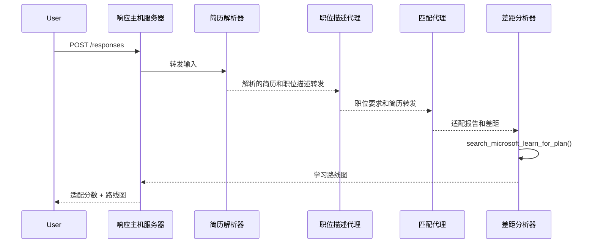

# 模块 3 - 配置指令、环境及安装依赖

⏱️ 约 15 分钟

在本模块中，您将把初始搭建的框架转变为<strong>您的</strong>多代理工作流—通过设置环境变量、编写代理指令、添加 MCP 工具、连接工作流图以及安装依赖。

> **参考:** 完整的工作代码位于 [`PersonalCareerCopilot/main.py`](../../../../../workshop/lab02-multi-agent/PersonalCareerCopilot/main.py)。构建您自己的工作流图和提示块时可以将其作为参考。

---

## 四个代理如何协同工作


```mermaid
sequenceDiagram
    participant User
    participant Server as 响应主机服务器
    participant RP as 简历解析器
    participant JD as 职位描述代理
    participant MA as 匹配代理
    participant GA as 差距分析器

    User->>Server: POST /responses
    Server->>RP: 转发输入
    RP-->>JD: 解析的简历和职位描述转发
    JD-->>MA: 职位要求和简历转发
    MA-->>GA: 适配报告和差距
    GA->>GA: search_microsoft_learn_for_plan()
    GA-->>Server: 学习路线图
    Server-->>User: 适配分数 + 路线图
```

---

## 第 1 步：配置环境变量

1. 打开项目根目录下的 **`.env`** 文件（由脚手架向导创建）。
2. 用从实验 01 获得的实际值替换占位符。

<details open>
<summary><strong>🅰️ 路径 A - Foundry 订阅</strong></summary>

```env
FOUNDRY_PROJECT_ENDPOINT=https://<your-account>.services.ai.azure.com/api/projects/<your-project>
AZURE_AI_MODEL_DEPLOYMENT_NAME=gpt-4.1-mini
```

> **在哪里找到值:** 见 [实验 01，模块 1](../../lab01-single-agent/docs/01-setup.md#deploy-a-model--assign-rbac)。

</details>

<details open>
<summary><strong>🅱️ 路径 B - Foundry 本地</strong></summary>

```env
FOUNDRY_PROJECT_ENDPOINT=http://localhost:5273/v1
AZURE_AI_MODEL_DEPLOYMENT_NAME=phi-4-mini
```

> 所有推理均在您的机器上运行—数据不会离开您的设备。运行 `foundry model list` 以确认具体模型别名。唯一的外发请求是 MCP 工具调用 `https://learn.microsoft.com/api/mcp`。

> **在哪里找到值:** 见 [实验 01，模块 1 - 本地路径](../../lab01-single-agent/docs/01-setup.md#step-2-set-up-based-on-your-access)。

</details>

> **安全性:** 切勿将 `.env` 文件提交到版本控制。它应已经包含在 `.gitignore` 中。

---

## 第 2 步：编写代理指令

指令定义每个代理的角色、输出格式和规则。打开 `main.py`，定义（或替换）四个指令常量—完整字符串位于 [`PersonalCareerCopilot/main.py`](../../../../../workshop/lab02-multi-agent/PersonalCareerCopilot/main.py)。

### 2.1 `RESUME_PARSER_INSTRUCTIONS`
将简历解析成结构化的候选人资料，<strong>且</strong>将职位描述逐字复制到 `[JOB DESCRIPTION PASS-THROUGH]`。输出中必须同时出现这两个标记部分。

> **为什么要传递？** 使用 `context_mode="last_agent"` 时，ResumeParser 是<strong>唯一</strong>能看到原始用户消息的代理。如果它不把职位描述传递下去，后续代理就看不到它。

### 2.2 `JOB_DESCRIPTION_INSTRUCTIONS`
从 ResumeParser 输出读取 `[PARSED RESUME]` 和 `[JOB DESCRIPTION PASS-THROUGH]`。输出 `[JD REQUIREMENTS]`（结构化需求）和 `[PARSED RESUME PASS-THROUGH]`（逐字简历副本供 MatchingAgent 使用）。

### 2.3 `MATCHING_AGENT_INSTRUCTIONS`
读取 `[JD REQUIREMENTS]` 和 `[PARSED RESUME PASS-THROUGH]`。生成带分数（0-100）的匹配报告及详细数学分解、匹配技能、缺失技能和经验匹配情况。

### 2.4 `GAP_ANALYZER_INSTRUCTIONS`
读取匹配报告。针对<strong>每项</strong>缺失技能，调用 `search_microsoft_learn_for_plan` 获取 Microsoft Learn 资源。针对每项技能生成详细的差距卡，以及按周的学习路线图。

---

## 第 3 步：添加 MCP 工具

GapAnalyzer 会调用 [Microsoft Learn MCP 服务器](https://learn.microsoft.com/azure/foundry/agents/how-to/tools/model-context-protocol) 以获取每个技能差距的真实学习资源。完整的 `search_microsoft_learn_for_plan` 函数位于 [`PersonalCareerCopilot/main.py`](../../../../../workshop/lab02-multi-agent/PersonalCareerCopilot/main.py)。

在创建 GapAnalyzer 代理时注册该工具：

```python
gap_analyzer = Agent(
    client=client,
    instructions=GAP_ANALYZER_INSTRUCTIONS,
    name="GapAnalyzer",
    tools=[search_microsoft_learn_for_plan],
)
```

> 参见 [`PersonalCareerCopilot/main.py`](../../../../../workshop/lab02-multi-agent/PersonalCareerCopilot/main.py) 中包含 `FoundryChatClient`、`AgentExecutor` 和所有 `add_edge()` 调用的完整 `WorkflowBuilder` 图。

---

## 第 4 步：创建虚拟环境并安装依赖

> ⚠️ **请勿跳过此步骤。** 如果未安装依赖，F5 调试将会失败。

### 4.1 创建虚拟环境

```powershell
python -m venv .venv
```

### 4.2 激活虚拟环境

| 操作系统 | 命令 |
|----|---------|
| **Windows (PowerShell)** | `.\.venv\Scripts\Activate.ps1` |
| **Windows (CMD)** | `.venv\Scripts\activate.bat` |
| **macOS / Linux** | `source .venv/bin/activate` |

终端提示符中应显示 `(.venv)`。

### 4.3 安装依赖

```powershell
pip install -r requirements.txt
```

### 4.4 验证

```powershell
pip list | Select-String "agent-framework|mcp|debugpy"
```

预期结果：应列出 `agent-framework-foundry`、`agent-framework-foundry-hosting`、`mcp` 和 `debugpy`。

---

## 第 5 步：验证认证

<details open>
<summary><strong>🅰️ 路径 A - Azure 凭据</strong></summary>

```powershell
az account show --query "{name:name, id:id}" --output table
```

如果失败，请运行 [`az login`](https://learn.microsoft.com/cli/azure/authenticate-azure-cli-interactively)。

所有四个代理共享一个 `FoundryChatClient` 和一个 `DefaultAzureCredential`。如果一个能通过认证，所有代理都能。

</details>

<details open>
<summary><strong>🅱️ 路径 B - Foundry 本地</strong></summary>

本地测试不需要认证。

</details>

---

### ✅ 检查点

> 未完成以下条件前<strong>不要</strong>继续到模块 04：**(1)** 提示符显示 `(.venv)` 且 **(2)** `pip install -r requirements.txt` 成功完成。

- [ ] `.env` 文件具有有效的终端和模型部署名称（非占位符）
- [ ] 在 `main.py` 中定义好四个代理指令常量（ResumeParser、JD Agent、MatchingAgent、GapAnalyzer）
- [ ] 定义并在 GapAnalyzer 注册了 `search_microsoft_learn_for_plan` MCP 工具
- [ ] 在 `main()` 中创建了 `FoundryChatClient` + 4 个 `Agent` + 4 个 `AgentExecutor` 对象
- [ ] `WorkflowBuilder` 构建了正确的顺序图，包含所有 3 个 `add_edge()` 调用
- [ ] 虚拟环境已创建并激活（提示符显示 `(.venv)`）
- [ ] 成功运行 `pip install -r requirements.txt` 无错误
- [ ] **路径 A:** `az account show` 命令成功执行 或 VS Code 账户图标显示已登录账户

---

**上一篇:** [02 - 脚手架多代理项目](02-scaffold-multi-agent.md) · **下一篇:** [04 - 编排模式 →](04-orchestration-patterns.md)

---

<!-- CO-OP TRANSLATOR DISCLAIMER START -->
**免责声明**：
本文件由 AI 翻译服务 [Co-op Translator](https://github.com/Azure/co-op-translator) 翻译完成。尽管我们力求准确，但请注意，自动翻译可能包含错误或不准确之处。原始语言版文件应视为权威来源。对于重要信息，建议使用专业人工翻译。我们对因使用本翻译而产生的任何误解或误释不承担责任。
<!-- CO-OP TRANSLATOR DISCLAIMER END -->