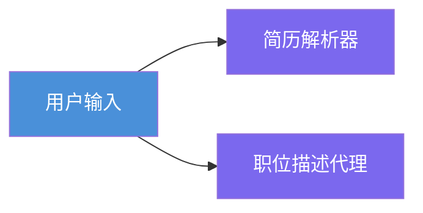
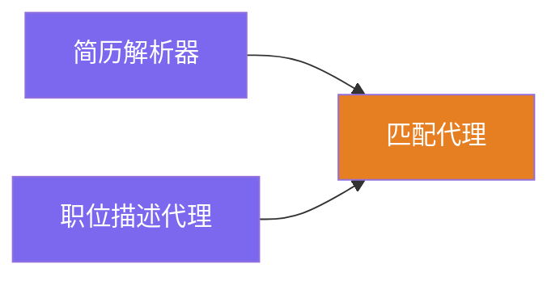
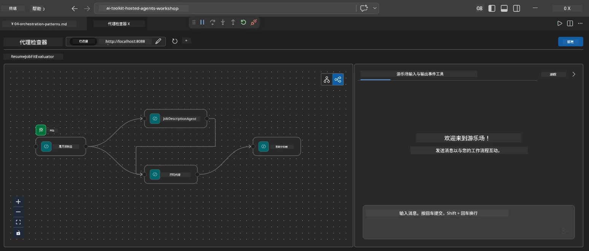
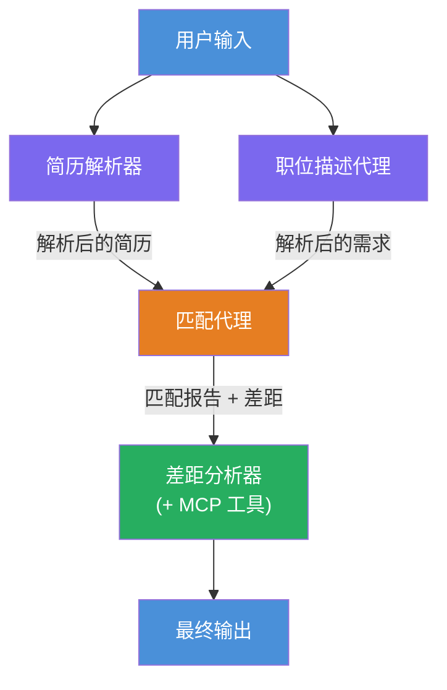
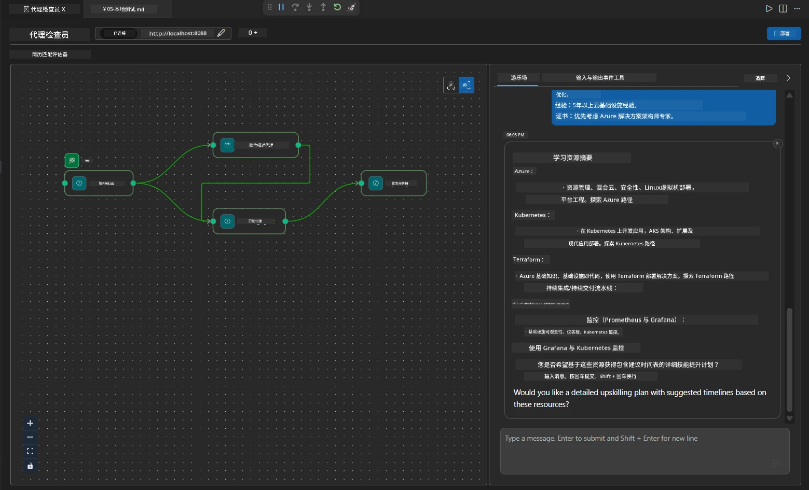

# 模块 4 - 编排模式

在本模块中，您将探索简历职位匹配评估器中使用的编排模式，并学习如何读取、修改和扩展工作流图。理解这些模式对于调试数据流问题和构建您自己的[多代理工作流](https://learn.microsoft.com/agent-framework/workflows/)至关重要。

---

## 模式 1：扇出（并行拆分）

工作流中的第一个模式是<strong>扇出</strong>——单个输入同时发送给多个代理。


在代码中，这是因为 `resume_parser` 是 `start_executor`——它首先接收用户消息。然后，由于 `jd_agent` 和 `matching_agent` 都有来自 `resume_parser` 的边，框架将 `resume_parser` 的输出路由到这两个代理：

```python
.add_edge(resume_parser, jd_agent)         # ResumeParser 输出 → JD 代理
.add_edge(resume_parser, matching_agent)   # ResumeParser 输出 → MatchingAgent
```

**为什么这样有效：** ResumeParser 和 JD Agent 处理相同输入的不同方面。它们并行运行可以减少总延迟，相比于顺序运行。

### 何时使用扇出

| 用例 | 示例 |
|----------|---------|
| 独立子任务 | 解析简历 vs. 解析职位描述 |
| 冗余 / 投票 | 两个代理分析相同数据，第三个选出最佳答案 |
| 多格式输出 | 一个代理生成文本，另一个生成结构化 JSON |

---

## 模式 2：扇入（聚合）

第二个模式是<strong>扇入</strong>——多个代理的输出被收集并发送给一个下游代理。


在代码中：

```python
.add_edge(resume_parser, matching_agent)   # 简历解析器输出 → 匹配代理
.add_edge(jd_agent, matching_agent)        # 招聘职位代理输出 → 匹配代理
```

**关键行为：** 当一个代理有<strong>两个或更多输入边</strong>时，框架会自动等待<strong>所有</strong>上游代理完成后才运行下游代理。MatchingAgent 会在 ResumeParser 和 JD Agent 都完成后才开始。

### MatchingAgent 接收的内容

框架会将所有上游代理的输出连接起来。MatchingAgent 的输入如下：

```
[ResumeParser output]
---
Candidate Profile:
  Name: Jane Doe
  Technical Skills: Python, Azure, Kubernetes, ...
  ...

[JobDescriptionAgent output]
---
Role Overview: Senior Cloud Engineer
Required Skills: Python, Azure, Terraform, ...
...
```

> **注意：** 具体的连接格式取决于框架版本。代理的指令应编写为能同时处理结构化和非结构化的上游输出。



---

## 模式 3：顺序链

第三个模式是<strong>顺序链</strong>——一个代理的输出直接作为下一个代理的输入。


在代码中：

```python
.add_edge(matching_agent, gap_analyzer)    # MatchingAgent 输出 → GapAnalyzer
```

这是最简单的模式。GapAnalyzer 接收 MatchingAgent 的匹配分数、匹配/缺失技能和差距，然后调用[MCP 工具](https://learn.microsoft.com/azure/foundry/agents/how-to/tools/model-context-protocol)为每个差距获取 Microsoft Learn 资源。

---

## 完整图

将这三种模式结合，形成完整的工作流：


### 执行时间轴

```mermaid
gantt
    title 代理执行时间轴
    dateFormat X
    axisFormat %s

    section 并行
    Resume Parser       :rp, 0, 3
    JD Agent            :jd, 0, 2

    section 顺序
    Matching Agent      :ma, 3, 5
    Gap Analyzer        :ga, 5, 9
```


> 总的时钟时间大约是 `max(ResumeParser, JD Agent) + MatchingAgent + GapAnalyzer`。GapAnalyzer 通常最慢，因为它需要对每个差距调用多次 MCP 工具。

---

## 阅读 WorkflowBuilder 代码

这是 `main.py` 中完整的 `create_workflow()` 函数，带注释：

```python
def create_workflow(resume_parser, jd_agent, matching_agent, gap_analyzer):
    workflow = (
        WorkflowBuilder(
            name="ResumeJobFitEvaluator",

            # 第一个接收用户输入的代理
            start_executor=resume_parser,

            # 其输出成为最终响应的代理
            output_executors=[gap_analyzer],
        )
        # 分流：ResumeParser 的输出发送到 JD Agent 和 MatchingAgent
        .add_edge(resume_parser, jd_agent)
        .add_edge(resume_parser, matching_agent)

        # 汇聚：MatchingAgent 等待 ResumeParser 和 JD Agent 的输出
        .add_edge(jd_agent, matching_agent)

        # 顺序：MatchingAgent 的输出输入给 GapAnalyzer
        .add_edge(matching_agent, gap_analyzer)

        .build()
    )
    return workflow.as_agent()
```

### 边缘汇总表

| # | 边缘 | 模式 | 作用 |
|---|------|---------|--------|
| 1 | `resume_parser → jd_agent` | 扇出 | JD Agent 接收 ResumeParser 的输出（加上原始用户输入） |
| 2 | `resume_parser → matching_agent` | 扇出 | MatchingAgent 接收 ResumeParser 的输出 |
| 3 | `jd_agent → matching_agent` | 扇入 | MatchingAgent 还接收 JD Agent 的输出（等待两者） |
| 4 | `matching_agent → gap_analyzer` | 顺序 | GapAnalyzer 接收匹配报告 + 差距列表 |

---

## 修改图

### 添加新代理

添加第五个代理（例如，一个基于差距分析生成面试问题的<strong>InterviewPrepAgent</strong>）：

```python
# 1. 定义指令
INTERVIEW_PREP_INSTRUCTIONS = """\
You are the Interview Prep Agent.
Given a gap analysis and fit report, generate 10 targeted interview questions
the candidate should prepare for.
"""

# 2. 创建代理（在 async with 块内）
AzureAIAgentClient(
    project_endpoint=PROJECT_ENDPOINT,
    model_deployment_name=MODEL_DEPLOYMENT_NAME,
    credential=credential,
).as_agent(
    name="InterviewPrepAgent",
    instructions=INTERVIEW_PREP_INSTRUCTIONS,
) as interview_prep,

# 3. 在 create_workflow() 中添加边
.add_edge(matching_agent, interview_prep)   # 接收拟合报告
.add_edge(gap_analyzer, interview_prep)     # 也接收差距卡片

# 4. 更新 output_executors
output_executors=[interview_prep],  # 现在是最终代理
```

### 更改执行顺序

要让 JD Agent 在 ResumeParser <strong>之后运行</strong>（顺序执行而非并行）：

```python
# 删除：.add_edge(resume_parser, jd_agent) ← 已存在，保留它
# 通过不让 jd_agent 直接接收用户输入来消除隐式并行
# start_executor 首先发送给 resume_parser，jd_agent 仅通过边接收
# resume_parser 的输出。这使它们变为顺序执行。
```

> **重要：** `start_executor` 是唯一接收原始用户输入的代理。其他代理都接收其上游边的输出。如果您希望某个代理也能接收原始用户输入，它必须有一条来自 `start_executor` 的边。

---

## 常见图错误

| 错误 | 症状 | 解决方法 |
|---------|---------|-----|
| 缺少到 `output_executors` 的边 | 代理运行但输出为空 | 确保从 `start_executor` 到每个 `output_executors` 代理都有路径 |
| 循环依赖 | 无限循环或超时 | 检查是否有代理反馈给其上游代理 |
| `output_executors` 中代理无输入边 | 输出为空 | 添加至少一个 `add_edge(source, that_agent)` |
| 多个 `output_executors` 无扇入 | 输出仅包含一个代理的响应 | 使用单一输出代理进行聚合，或接受多个输出 |
| 缺少 `start_executor` | 构建时出现 `ValueError` | 在 `WorkflowBuilder()` 中始终指定 `start_executor` |

---

## 调试图表

### 使用 Agent Inspector

1. 本地启动代理（按 F5 或在终端启动——参见[模块 5](05-test-locally.md)）。
2. 打开 Agent Inspector（`Ctrl+Shift+P` → **Foundry Toolkit: Open Agent Inspector**）。
3. 发送测试消息。
4. 在 Inspector 的响应面板中，查看<strong>流式输出</strong>——它按顺序显示每个代理的贡献。



### 使用日志

向 `main.py` 添加日志用于追踪数据流：

```python
import logging
logger = logging.getLogger("resume-job-fit")

# 在 create_workflow() 中，构建之后：
logger.info("Workflow graph built with edges: RP→JD, RP→MA, JD→MA, MA→GA")
```

服务器日志显示代理执行顺序和 MCP 工具调用：

```
INFO:resume-job-fit:Starting Resume -> Job Fit Evaluator HTTP server...
INFO:resume-job-fit:Server running on http://localhost:8088
INFO:agent_framework:Executing agent: ResumeParser
INFO:agent_framework:Executing agent: JobDescriptionAgent
INFO:agent_framework:Waiting for upstream agents: ResumeParser, JobDescriptionAgent
INFO:agent_framework:Executing agent: MatchingAgent
INFO:agent_framework:Executing agent: GapAnalyzer
INFO:agent_framework:Tool call: search_microsoft_learn_for_plan(skill="Kubernetes")
POST https://learn.microsoft.com/api/mcp → 200
INFO:agent_framework:Tool call: search_microsoft_learn_for_plan(skill="Terraform")
POST https://learn.microsoft.com/api/mcp → 200
```

---

### 检查点

- [ ] 您能够识别工作流中的三种编排模式：扇出、扇入和顺序链
- [ ] 您理解具有多个输入边的代理会等待所有上游代理完成
- [ ] 您可以阅读 `WorkflowBuilder` 代码，并将每个 `add_edge()` 调用映射到可视化图中
- [ ] 您理解执行时间轴：并行代理先运行，然后是聚合，最后是顺序执行
- [ ] 您知道如何向图中添加新代理（定义指令、创建代理、添加边、更新输出）
- [ ] 您能够识别常见图错误及其症状

---

**上一节：** [03 - 配置代理和环境](03-configure-agents.md) · **下一节：** [05 - 本地测试 →](05-test-locally.md)

---

<!-- CO-OP TRANSLATOR DISCLAIMER START -->
**免责声明**：
本文件由 AI 翻译服务 [Co-op Translator](https://github.com/Azure/co-op-translator) 翻译而成。虽然我们力求准确，但请注意自动翻译可能包含错误或不准确之处。原始文档的母语版本应被视为权威来源。对于重要信息，建议使用专业人工翻译。我们不对因使用本翻译产生的任何误解或误释承担责任。
<!-- CO-OP TRANSLATOR DISCLAIMER END -->