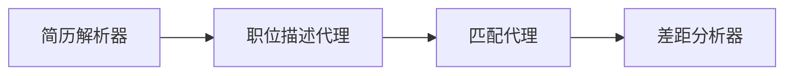
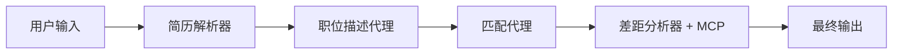

# 模块 4 - 编排模式

⏱️ ~10 分钟

在本模块中，您将探索简历匹配评估器中使用的编排模式，学习如何阅读、修改和扩展工作流图。理解这些模式对于调试数据流问题和构建您自己的[多代理工作流](https://learn.microsoft.com/agent-framework/workflows/)至关重要。

---

## 模式 1：顺序链

工作流中的基础模式是<strong>顺序链</strong>——每个代理的输出直接传递给下一个。


```mermaid
flowchart LR
    RP[简历解析器] --> JD[职位描述代理]
    JD --> MA[匹配代理]
    MA --> GA[差距分析器]
```

代码中，每个 `add_edge()` 调用创建链中的一步：

```python
.add_edge(resume_executor, jd_executor)       # 简历解析器输出 → 职位描述代理
.add_edge(jd_executor, matching_executor)     # 职位描述代理输出 → 匹配代理
.add_edge(matching_executor, gap_executor)    # 匹配代理输出 → 差距分析器
```

> **为什么是顺序，而不是分叉/合并？** `WorkflowBuilder` 对入边使用<strong>或语义（OR-semantics）</strong>：下游执行者只要有<strong>任一</strong>前驱完成就会触发。如果 `matching_executor` 有两条入边（来自 `resume_executor` 和 `jd_executor`），它会被触发两次——一次是 ResumeParser 完成时，一次是 JD Agent 完成时——这会导致 GapAnalyzer 也运行两次，输出出现两次。顺序管道完全避免了这个问题。

## 模式 2：内容中继

因为 `context_mode="last_agent"` 意味着每个执行者只能看到它的<strong>直接前驱输出</strong>，顺序链中的代理必须显式传递下游代理所需的数据。

在此工作流中：
- **ResumeParser** 将 JD 原文复制到 `[JOB DESCRIPTION PASS-THROUGH]`（以便 JD Agent 可以找到它）。
- **JD Agent** 将 `[PARSED RESUME]` 原文复制到 `[PARSED RESUME PASS-THROUGH]`（以便 MatchingAgent 可以比较两个资料）。

```
ResumeParser output
└─ [PARSED RESUME]               ← extracted by JD Agent
└─ [JOB DESCRIPTION PASS-THROUGH] ← extracted by JD Agent

JD Agent output
└─ [JD REQUIREMENTS]             ← extracted by MatchingAgent
└─ [PARSED RESUME PASS-THROUGH]  ← extracted by MatchingAgent
```

每个中继部分必须<strong>逐字复制</strong>——总结或改写会破坏依赖它的下游代理。

---

## 完整图

结合顺序链和内容中继模式，产生完整的工作流：


```mermaid
flowchart LR
    U[用户输入] --> RP[简历解析器]
    RP --> JD[职位描述代理]
    JD --> MA[匹配代理]
    MA --> GA[差距分析器 + MCP]
    GA --> O[最终输出]
```

当代理在本地运行时，Agent Inspector 显示相同的图结构。参见[模块 5 - 本地测试](05-test-locally.md)中的截图。

---

## 阅读 WorkflowBuilder 代码

完整的 `create_workflow()` 函数在 [`PersonalCareerCopilot/main.py`](../../../../../workshop/lab02-multi-agent/PersonalCareerCopilot/main.py) 中。三个 `add_edge()` 调用构建了顺序管道：

| # | 边 | 作用 |
|---|----|------|
| 1 | `resume_executor → jd_executor` | JD Agent 收到 `[PARSED RESUME]` + `[JOB DESCRIPTION PASS-THROUGH]` |
| 2 | `jd_executor → matching_executor` | MatchingAgent 收到 `[JD REQUIREMENTS]` + `[PARSED RESUME PASS-THROUGH]` |
| 3 | `matching_executor → gap_executor` | GapAnalyzer 收到匹配报告 + 差距列表 |

---

## 修改图

### 添加新代理

要添加第五个代理（例如 GapAnalyzer 之后的<strong>面试准备代理</strong>）：

1. 定义 `INTERVIEW_PREP_INSTRUCTIONS` 常量。
2. 创建 `Agent` + `AgentExecutor` 对象（与现有四个的模式相同）。
3. 在 `WorkflowBuilder` 中添加 `.add_edge(gap_executor, interview_exec)`。
4. 更新 `output_executors=[interview_exec]`。

> **重要：** `start_executor` 是唯一直接接收原始用户输入的代理。其他代理接收来自其上游边的输出。

---

## 常见图错误

| 错误 | 症状 | 解决方法 |
|-------|-------|---------|
| 缺少到 `output_executors` 的边 | 代理运行但输出为空 | 确保从 `start_executor` 到每个 `output_executors` 中代理有路径 |
| 循环依赖 | 无限循环或超时 | 检查是否有代理反馈给上游代理 |
| `output_executors` 中的代理没有入边 | 输出为空 | 添加至少一条 `add_edge(source, that_agent)` |
| 多个 `output_executors` 没有汇聚 | 输出只有一个代理的响应 | 使用一个聚合的输出代理，或接受多个输出 |
| 缺少 `start_executor` | 构建时抛出 `ValueError` | 始终在 `WorkflowBuilder()` 中指定 `start_executor` |

---

## 调试图

### 使用 Agent Inspector

1. 使用 F5 本地启动代理。
2. 打开 Agent Inspector（`Ctrl+Shift+P` → **Foundry Toolkit: Open Agent Inspector**）。
3. 发送测试消息。
4. 在 Inspector 的响应面板中，查看<strong>流式输出</strong>——它显示每个代理依次贡献的内容。


### 使用日志记录

向 `main.py` 添加日志以追踪数据流：

```python
import logging
logger = logging.getLogger("resume-job-fit")

# 在 main() 中，构建工作流后：
logger.info("Workflow graph built with edges: RP→JD, JD→MA, MA→GA")
```

服务器日志显示代理执行顺序和 MCP 工具调用：

```
INFO:agent_framework:Executing agent: ResumeParser
INFO:agent_framework:Executing agent: JobDescriptionAgent
INFO:agent_framework:Executing agent: MatchingAgent
INFO:agent_framework:Executing agent: GapAnalyzer
INFO:agent_framework:Tool call: search_microsoft_learn_for_plan(skill="Kubernetes")
POST https://learn.microsoft.com/api/mcp → 200
INFO:agent_framework:Tool call: search_microsoft_learn_for_plan(skill="Terraform")
POST https://learn.microsoft.com/api/mcp → 200
```

---

### 检查点

- [ ] 您可以识别工作流中的两种编排模式：顺序链和内容中继
- [ ] 您理解为什么 `context_mode="last_agent"` 需要代理之间显式传递数据
- [ ] 您可以阅读 `WorkflowBuilder` 代码并将每个 `add_edge()` 调用映射到可视图
- [ ] 您知道如何在管道末尾添加新代理
- [ ] 您可以识别常见图错误及其症状

---

**上一步：** [03 - 配置代理和环境](03-configure-agents.md) · **下一步：** [05 - 本地测试 →](05-test-locally.md)

---

<!-- CO-OP TRANSLATOR DISCLAIMER START -->
**免责声明**：
本文件由 AI 翻译服务 [Co-op Translator](https://github.com/Azure/co-op-translator) 翻译完成。尽管我们力求准确，但请注意，自动翻译可能包含错误或不准确之处。原始语言版文件应视为权威来源。对于重要信息，建议使用专业人工翻译。我们对因使用本翻译而产生的任何误解或误释不承担责任。
<!-- CO-OP TRANSLATOR DISCLAIMER END -->